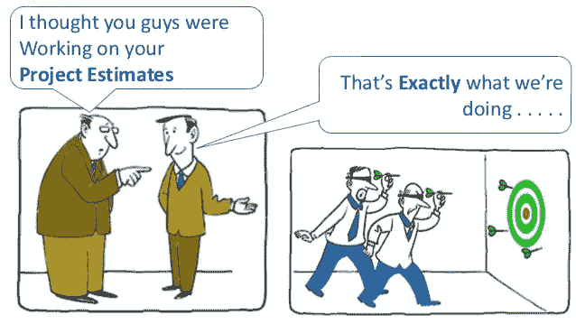
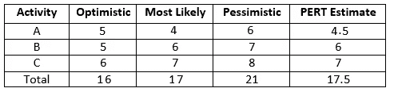
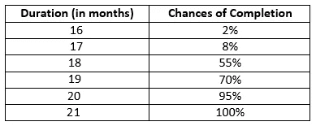
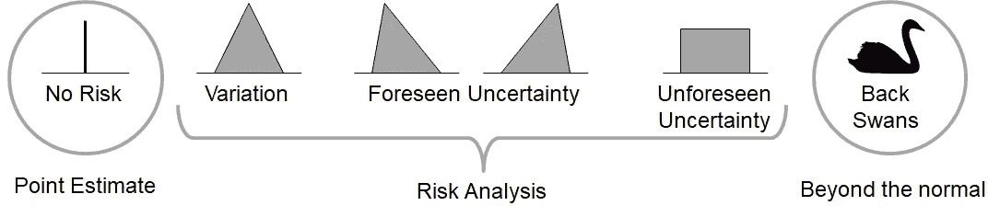
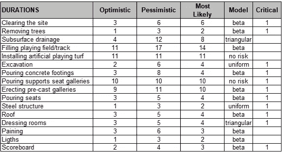

# 利用蒙特卡罗模拟管理项目不确定性

> 原文：<https://towardsdatascience.com/managing-project-uncertainty-using-monte-carlo-simulation-68bb720bb9be?source=collection_archive---------11----------------------->

在 [Unsplash](https://unsplash.com?utm_source=medium&utm_medium=referral) 上由 [Helloquence](https://unsplash.com/@helloquence?utm_source=medium&utm_medium=referral) 拍摄的照片

几乎每个项目经理都经历过错过项目最后期限的情况。错过项目期限的一个常见原因是对成本或任务持续时间的估计。大多数经理认为估算(成本或任务持续时间)是确定性的，因此没有认识到估算是概率性的。他们使用单点估计，并有一个错误的概念，即未来可以准确预测。预测项目结果的更好方法是使用蒙特卡罗模拟来进行项目风险的定量分析。

# 蒙特卡洛模拟是什么？

照片由[本杰明·兰伯特](https://unsplash.com/@benlambertphoto?utm_source=medium&utm_medium=referral)在 [Unsplash](https://unsplash.com?utm_source=medium&utm_medium=referral) 拍摄

蒙特卡洛模拟是约翰·冯·诺依曼和斯坦尼斯劳·乌拉姆为曼哈顿计划开发的一种数学技术。它以蒙特卡洛赌场命名，斯坦尼斯劳·乌兰的叔叔经常在那里赌博。

它告诉你两件事:

*   所有可能或将要发生的事件。
*   每种可能结果的概率。

# 举例说明其工作原理

如果我们想要找到得到 21 点的概率，我们可以简单地计算在这种情况下可能的手牌数量，然后除以牌的可能组合的总数来得到概率(如果你好奇的话，大约是 1/21)。但是现在想象一下，我们的样本空间很难计算，例如，我们的一副牌有数千张，而不是只有 52 张，或者更好的是，我们甚至不知道有多少张牌。还有一种方法可以求出这个概率。

照片由[杰克·汉密尔顿](https://unsplash.com/@jacc?utm_source=medium&utm_medium=referral)在 [Unsplash](https://unsplash.com?utm_source=medium&utm_medium=referral) 上拍摄

我们可以玩一百个游戏，一边玩一边记录结果。我们可能得到 20 次、40 次甚至 50 次 21 点，并使用这些值中的任何一个来分配概率。这似乎是一个很糟糕的方法来评估我们在赌场的赔率，但希望，我们只是玩得开心。如果我们再来一次，玩一千次，一万次，几百万次，大数定律说:

> *“随着同分布、随机生成变量的数量增加，它们的样本* [*均值*](https://www.britannica.com/science/mean) *(平均值)接近它们的理论均值。”*

除了是统计学最重要的定律之一，这也是蒙特卡罗模拟的基础，允许我们通过统计试验的方法建立随机模型。

# 项目规划中的蒙特卡罗模拟

假设您有三项活动，估计如下(以月为单位):

从上表可以推断，根据 PERT 的估计，这三项活动将在 17.5 个月内完成。不过，最好的情况下，16 个月就能完成，最坏的情况下，21 个月就能完成。

现在，如果我们对这些任务运行蒙特卡罗模拟五百次，它将显示如下结果:

从上表可以看出，有一个:

*   2%的机会在 16 个月内完成项目
*   8%的机会在 17 个月内完成项目
*   55%的机会在 18 个月内完成项目
*   70%的机会在 19 个月内完成项目
*   95%的机会在 20 个月内完成项目
*   100%的机会在 21 个月内完成项目

如您所见，这种方法为您提供了更深入的数据分析，有助于您做出更明智的决策。

# 蒙特卡罗模拟中的建模不确定性

Mario Vanhoucke 博士在他的书《数据驱动的项目经理》中，提出了以下案例来对任何项目的活动进行统计建模:

*   **如果活动没有风险**，我们可以相信来自专家判断的单点评估。您可以用最可能的估计值来模拟活动。
*   **如果活动具有低风险**——估计相当精确，除了由于随机因素导致的意外变化——您可以使用不对称*[β](https://en.wikipedia.org/wiki/Beta_distribution)或[三角形](https://en.wikipedia.org/wiki/Triangular_distribution)。*
*   ***如果活动具有已知的风险**——差异的原因是众所周知的，并且项目管理团队知道如果原因发生，活动将会提前或推迟——那么您可以使用*不对称* [beta](https://en.wikipedia.org/wiki/Beta_distribution) 或[三角形](https://en.wikipedia.org/wiki/Triangular_distribution)。*
*   ***如果活动具有未知风险**——项目经理不具备产生可靠评估的适当知识——您可以设置一系列可能的值，并将活动建模为[均匀分布](https://en.wikipedia.org/wiki/Uniform_distribution_(continuous))。*
*   ***如果活动是一个** [**黑天鹅**](https://en.wikipedia.org/wiki/Black_swan_theory)——超出预期的情况，概率很低，影响很大——你可以把它们当做假设来管理。关于蒙特卡罗的分析，你可以把它们建模为无风险活动。*

*这本书使用了一个网球场馆建设项目的案例研究。请参见下表中的活动持续时间估计值。*

**

*为了考虑风险，活动用三个点建模:乐观、悲观和最有可能。为了选择统计分布的类型，我们必须考虑活动的定性风险分析:*

*   *对称三角形或贝塔，如果活动概率低*
*   *不对称三角形或贝塔，如果活动具有中等概率*
*   *如果活动具有高概率，则是一致的*

# *蒙特卡罗模拟工具*

*Oracle 的 Crystal Ball、PALISADE 的@ Risk、Sim Tools 是在 Excel 电子表格和模型中执行蒙特卡洛模拟的几种流行工具。这些工具模拟了数千个不同的“假设”案例，将每个计算的输入和结果保存为单独的场景。输出揭示了可能结果的范围及其发生的概率。*

*Microsoft Excel 提供统计函数来执行蒙特卡罗模拟。*

*[https://support . office . com/en-us/article/introduction-to-Monte-Carlo-simulation-in-excel-64c 0 ba 99-752 a-4fa 8-bbd 3-4450 D8 db 16 f 1](https://support.office.com/en-us/article/introduction-to-monte-carlo-simulation-in-excel-64c0ba99-752a-4fa8-bbd3-4450d8db16f1)*

# *结论*

*蒙特卡洛模拟是一种数据驱动的方法，用于量化风险、了解项目风险、预测结果。在您的项目中使用蒙特卡罗分析的好处是:*

*   *它提供了对您满足项目里程碑和最后期限的可能性的早期识别。*
*   *它创建了一个更现实的预算和时间表。*
*   *预测进度和成本超支的可能性。*
*   *量化风险以更好地评估影响。*
*   *它为决策提供客观数据。*