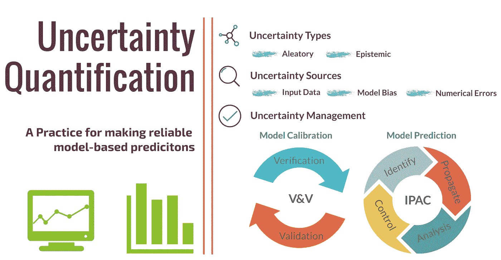

# 不确定性量化解释

> 原文：<https://towardsdatascience.com/managing-uncertainty-in-computational-science-and-engineering-5e532085512b?source=collection_archive---------28----------------------->

## 进行基于模型的可靠预测的实践

(图片由作者提供)

通过赋予工程师再现详细自然过程的能力，计算机模拟正在改变工业工程实践的设计、分析和制造。尽管取得了巨大的成功，但有一个问题一直困扰着分析师和决策者:

*这些模拟到底有多好？*

**不确定性量化**，它融合了概率、统计、计算数学和学科科学，为回答这个问题提供了一个有希望的框架，并在最近几年获得了巨大的发展势头。在本文中，我们将讨论不确定性量化的以下方面:

*   动机:不确定性来自哪里，为什么它们很重要？
*   解决方案:V&V 和 IPAC 管理框架
*   挑战是:在实践中实施起来有多难？机器学习能有什么帮助？

所以让我们开始吧！

## 目录

[1。计算机模拟中的不确定性](#84bc)
∘ [输入数据](#9a18)
∘ [模型形式](#92e7)
∘ [数值](#a4fb)
[2。不确定性量化框架](#b4c0)
∘ [2.1 验证&验证框架](#7ce5)
∘ [2.2 IPAC 框架](#e6ed)
∘ [2.3 IPAC 在实践中:新冠肺炎疫情建模](#595c)
∘ [2.4 不确定性量化是一个迭代的过程](#3420)
[3 .应用不确定性量化的挑战](#9ccd)
[4。未来的不确定性量化](#7559)
[5。重点外带](#c03b)
[延伸阅读](#e343)
[关于作者](#0eae)

# 1.计算机模拟中的不确定性

从预测海平面上升到设计下一代火箭发动机，计算模型在描述这些复杂自然过程的行为方面发挥了至关重要的作用，并产生了指导决策的宝贵见解。在许多情况下，计算模型表现为一组数学方程(例如，偏微分方程)。然而，在相当长的时间里，这些方程只能模拟少数简单的学术问题，因此在帮助人们定量理解现实方面价值有限。从 20 世纪中期开始，由于数值算法和强大的计算机的快速发展，这种情况得到了显著改善。

以航空工业为例，现在工程师们普遍采用计算流体动力学(CFD)模拟器来优化飞机形状，采用计算结构动力学(CSD)模拟器来确定飞机机翼在湍流中的强度，以及采用计算气动声学(CAA)模拟器来预测喷气噪声水平。这种模拟驱动的产品开发的最终结果是什么？快速的产品原型，减少昂贵的物理实验，并缩短上市时间。

尽管花哨的后处理模拟结果在视觉上很吸引人，但它们不足以说服持怀疑态度的决策者:

*   如果一个结构模拟告诉我这座桥可以挡风，我应该批准建筑计划吗？
*   如果空气动力学模拟告诉我，发动机在雨天仍能产生足够的推力，我应该批准在洲际飞行的飞机上安装这个发动机吗？
*   如果天气模拟告诉我，飓风只会对 A 地区产生影响，我是否也应该疏散 B 地区的邻居？

显然，当生命受到威胁时，决策者会期望计算机模拟准确可靠，而不仅仅是一堆彩色的情节和动画。

事实上，决策者完全有权利怀疑模拟，仅仅是因为在计算机模拟中有许多不确定性的来源。三个主要问题如下:

## 输入数据

*   几何形状不确定性:由制造公差、进行模拟时简化的几何形状等引起；
*   模型参数不确定性:例如，当模拟心血管系统时，我们需要血管的弹性参数。显然，这些参数在不同的患者之间是不同的；
*   边界条件不确定性:例如，由于风和海浪的随机性质，施加在海上石油平台上的外部作用力具有高度不确定性，从而使其结构稳定性的预测变得复杂。
*   初始条件不确定性:例如，需要初始天气状态来预测飓风的轨迹。然而，由于有限的观测(卫星、气象气球等)和有限的测量精度，只能部分地推断正在形成的飓风的初始状态。

## 模型形式

也被称为*模型偏差*或*差异*，因为计算机试图模拟的数学模型，在一天结束时，只是对真正的底层物理的近似。有时，这种近似仅仅是因为我们缺乏知识，其他时候是因为我们有限的计算预算(例如，我们只能进行 2D 模拟，而不是真实世界的 3D 模拟)。

## 数字

这种不确定性来源与用于模拟数学模型的代码的准确性直接相关。离散化误差、迭代误差、舍入误差以及编码错误都会导致数值不确定性。

在这些不确定性中，有些是**偶然**不确定性，这是由于固有的变化或随机性而产生的。其中一些是认知上的不确定性，这是由于缺乏知识而产生的。换句话说，如果获得了足够的知识(通过实验、更高保真的求解器等)。)那么就可以减少不确定性。不管它们的类型如何，它们共有的一个共同特征是它们都可以使模拟结果偏离真实的底层物理过程。因此，难怪

> "计算结果没有人相信，除了写代码的人."

# 2.不确定性量化框架

由于我们无法避免不确定性，我们需要量化它们，当我们

*   校准我们的计算模型
*   使用校准模型进行预测。

验证和确认(V&V)框架适用于第一种情况，而**I**identify-**P**ropa cate-**A**analysis-**C**control(IPAC)四步管理程序适用于第二种情况。

## 2.1 验证和确认框架

V&V 框架旨在评估计算模型的可信度和质量。它包含两个部分:

**验证:**我们解方程*对吗*？

验证量化了使用代码求解数学模型时产生的与数值误差相关的不确定性。这在很大程度上是计算机科学和数学的练习，通常涉及模拟代码与相应的精确解析解的比较。

**验证:**我们正在解*正确的*方程吗？

验证解决了模型的不确定性。这在很大程度上是一个物理和工程的练习，它通常涉及模拟结果与实验测量的比较。

## 2.2 IPAC 框架

在了解了我们的计算模型的可信度之后，下一步将是使用我们的模型进行预测。为了有效管理这一过程中的不确定性，识别-传播-分析-控制框架通常被证明是有效的。

**识别**

该步骤旨在描述输入数据不确定性的各种来源:

*   对于随机不确定性，采用联合概率密度函数来描述不确定性参数的分布；
*   对于认知不确定性，概率箱、证据理论或模糊理论都是反映知识缺乏的有效方法。

贝叶斯统计在这里发挥了很大的作用。由于概率代表了贝叶斯范式中的信任程度，贝叶斯分析可以很容易地处理随机和认知的不确定性。

**生生不息**

这一步也被称为*正向不确定性传播*。它通过运行模拟将所有输入数据的不确定性以及 V & V 程序中量化的不确定性传播到感兴趣的输出。我们的兴趣可能是评估输出的变化，或者输出超过特定阈值的概率。后一种方法在风险管理中被广泛采用，在风险管理中，确定不期望的系统性能(例如，结构故障、系统不稳定等)的风险。)是首要目标。

蒙特卡罗方法提供了一种传播不确定性的直接方法。通过简单地向模拟代码提供不确定参数的不同实现，我们可以获得模拟结果的集合，从中我们可以构建直方图并提取相关的统计指标。

通常采用普通蒙特卡罗方法的方差减少变体。这包括*拉丁超立方体抽样*、*拟蒙特卡罗*抽样、*重要性抽样*、*子集抽样*等。此外，像*多项式混沌展开*这样的谱方法提供了一个优雅的公式来获得输出统计指标，这比传统的蒙特卡罗方法要快得多。

**分析**

在估计了由所有不确定性来源造成的总“损害”之后，后续任务将是确定最“有罪”的来源，即了解哪些不确定性来源对模拟结果的方差贡献最大，或者哪些不确定性来源驱使模拟结果超出阈值。这种不确定性来源的重要性排序也被称为**全局敏感性分析**。

全局敏感性分析将模拟输出的总方差分配给不同的不确定性来源及其相互作用。这种敏感性分析的结果通常以所谓的 *Sobol 指数的形式进行总结。*具有较大 *Sobol 指数*值的参数对模拟输出的变化贡献较大，而具有较小 *Sobol 指数*值的参数基本不起作用。

**控制**

最后，我们采取措施减轻各种不确定输入源的不利影响，并旨在获得可靠的输出预测。遵循上一步，我们可以将精力集中在降低最“有罪”的不确定性来源的不确定性水平上:

*   如果是认知型的，我们可以在第一步进行更多的实验或者观察更多的样本来提炼我们的知识；
*   如果它是随机型的，我们可以优化被模拟的系统的可调属性，使得系统的输出对噪声随机不确定性的响应变得更少(或更鲁棒)。这种做法也被称为不确定性下的*优化*。

## 2.3 实践中的 IPAC:新冠肺炎·疫情造型

为了使上述概念更加具体，让我们考虑 IPAC 如何帮助量化与新冠肺炎·疫情建模相关的不确定性。

流行病建模使用数学模型来模拟传染病的传播。有许多模型，从基本的 SIR 模型到更复杂的随机模拟模型，就像帝国理工学院的研究人员在他们改变了英国冠状病毒策略的开创性工作中使用的模型。

准确模拟一场流行病的过程不是一件容易的事情，建模不确定性的各种来源是罪魁祸首。首先，**像传播率这样的模型参数**还不完全清楚，因为新型冠状病毒是一种相当新的病毒，需要更多的研究来了解它的传播模式。此外，需要**初始条件、**如传染物的初始值来启动模拟。不幸的是，由于疫情爆发之初记录不全，这些数值非常不确定。

为了保证模拟的可靠性，我们可以遵循上面提到的 IPAC 框架:首先，我们从有关感染个体数量、死亡人数等官方数据中估计那些模型参数和初始条件。为此，可以使用贝叶斯统计(特别是马尔可夫链蒙特卡罗)来推导它们的联合概率分布。这是“识别”步骤，这里的结果是我们现在能够描述关于那些模型参数和初始条件的不确定性。

其次，我们执行前向不确定性传播。我们多次运行我们的流行病模型，每次都使用不同的模型参数和初始条件样本，这些样本来自先前导出的概率分布。基于模拟结果的集合，我们现在能够量化与我们感兴趣的输出相关联的不确定性，例如再生数 R(一个个体可以感染的人数)、流行病的持续时间、感染和死亡的总人数等。

接下来，我们可以执行全局灵敏度分析，以了解哪些不确定输入是最有问题的输入，即驱动大多数输出变化，以及哪些不确定输入的影响很小，我们可以基本上将它们视为常数。

最后，是时候采取行动了。基于我们从上一步中获得的知识，我们将知道应该进一步收集哪些现场数据以及多长时间收集一次，以便更好地估计最“有问题”的参数。这将使我们能够获得更准确和可靠的流行病学预测。

当然，我们不会就此止步。不确定性量化流行病模型可以作为评估各种非药物干预(例如，社会距离、关闭学校等)的有效性的有价值的工具。)，从而为降低再生产数量 R 的可靠政策提供信息，并最终帮助我们赢得这场战斗。

## 2.4 不确定性量化是一个迭代过程

在我们进入下一节之前，值得一提的是，在实践中，不确定性量化经常以迭代的方式实现。以下是一些例子:

*   在“分析”步骤中进行的快速筛选分析(例如莫里斯筛选)可以告知从业者哪些来源是无影响的，因此无需在“传播”步骤中考虑它们(维度减少！).
*   在“控制”步骤中，我们已经计算了将输出变化降低到可接受的水平需要减少多少输入源的不确定性。这些信息在“识别”步骤中非常有价值，因为它告诉我们需要分配多少资源来更好地表征输入不确定性来源。
*   最后，通过迭代执行正向不确定性传播(“传播”步骤)和贝叶斯更新(“识别”步骤)与真实世界的观察，建立了一个全新的分析，称为**数据同化**。数据同化在天气预报中被大量使用，并充当隐藏的英雄，做出类似“明天下雨的概率是 30%”的声明。“有可能。

# 3.应用不确定性量化的挑战

最大的挑战是所需的高计算成本。这在很大程度上归因于需要用不确定输入的不同实现来重复运行模拟(蒙特卡罗家族方法的遗产)。

在工业实践中，单次模拟运行通常已经相当昂贵，更不用说多次运行了。举几个数字，对于现在在超级计算机上运行的大规模高分辨率模拟，计算时间通常从几天到几周，有时甚至几个月。同时，适当的蒙特卡罗分析需要至少几千次模拟运行来实现统计收敛。结论很明显，这不是出路。

为了解决这个问题，在所谓的 [***代理建模***](/an-introduction-to-surrogate-modeling-part-i-fundamentals-84697ce4d241) 方法论上已经花费了大量的精力。这就是机器学习进入这个领域的方式。*高斯过程*、*支持向量回归、*和*神经网络*是三个比较流行的例子。这里的目标是*学习*计算机模拟的输入和输出之间的关系，并将这种关系嵌入到评估起来很便宜的代理模型中。

之后，蒙特卡罗可以直接应用于这个运行成本低廉的代理模型，从而潜在地节省了大量的计算预算。

照片由[亚采克·迪拉格](https://unsplash.com/@dylu?utm_source=medium&utm_medium=referral)在 [Unsplash](https://unsplash.com?utm_source=medium&utm_medium=referral) 上拍摄

这里有一个例子。高斯过程已经被用于预测现代航空发动机燃烧系统中出现的不稳定现象。各种不确定性来源(例如，制造误差、随机操作条件等。)存在，且非常需要不确定性量化来提供可靠的不稳定性预测。通过训练高斯过程模型来近似昂贵的航空发动机燃烧室模拟器，蒙特卡罗模拟可以以超过 100 倍的计算速度执行，从而显著提高不确定性管理过程的效率。

虽然看起来很有前途，但代理建模无法避免成为维度诅咒的受害者。当不确定参数的数量增加时，拟合精确替代模型的计算成本呈指数增长。在这种情况下，在训练代理模型之前执行模型降阶变得势在必行。

结果是*、特征选择*和*模型降阶*技术，例如主成分分析、各种正则化回归技术等。，近年来越来越受欢迎。

# 4.不确定性量化的未来

近年来，有几个趋势变得很明显:

首先，3D 打印和物联网等新兴概念正在改变制造业，具有量化不确定性的计算机模拟确保了其实际部署的可靠性。因此，越来越多的努力花费在研究基本算法以及现实的实现上。

其次，UQ 专家和领域专家的合作越来越密切。领域知识提供了关于输入-输出关系的有价值的见解，从而弥补了 UQ 分析中用于替代模型构建的训练数据的缺乏。此外，领域知识告知输入的敏感性，从而实现计算资源的更好分配。

最后，机器学习和不确定性量化之间的联系将进一步加强。证据是越来越多的不确定性量化会议开始设立专门的小型研讨会和研讨会，邀请人们贡献展示机器学习工具的潜力。通过机器学习技术的增强，我们可以期待在计算机模拟中对不确定性进行更经济、更准确和更稳健的量化。

# 5.关键要点

不确定性量化对于在广泛的工程领域提供可靠的基于模拟的预测至关重要。通过这篇文章，我们已经谈到:

*   模拟不确定性的来源(输入数据、模型形式、数值计算)及其类型(任意的和认知的)；
*   管理模拟不确定性的 V & V 框架和“识别-传播-分析-控制”框架；
*   机器学习技术为实现更经济、更准确、更稳健的不确定性量化提供了有前途的方法。

在本文中，我们仅从鸟瞰的角度讨论了不确定性管理。实际上，许多技术细节使得管理不确定性成为可能。我们将在下面的文章中讨论它们。

# 延伸阅读:

[1] Ralph C. Smith，*不确定性量化:理论、实现和应用*，SIAM 计算科学&工程，2014。
【2】Ryan g . MCC larren，*不确定性量化与预测计算科学*，施普林格，2018。

# 关于作者

> 我是一名博士研究员，研究航空航天应用的不确定性量化和可靠性分析。统计学和数据科学是我日常工作的核心。我喜欢分享我在迷人的统计世界中学到的东西。查看我以前的帖子以了解更多信息，并在 [*中*](https://shuaiguo.medium.com/) *和*[*Linkedin*](https://www.linkedin.com/in/shuaiguo16/)*上与我联系。*