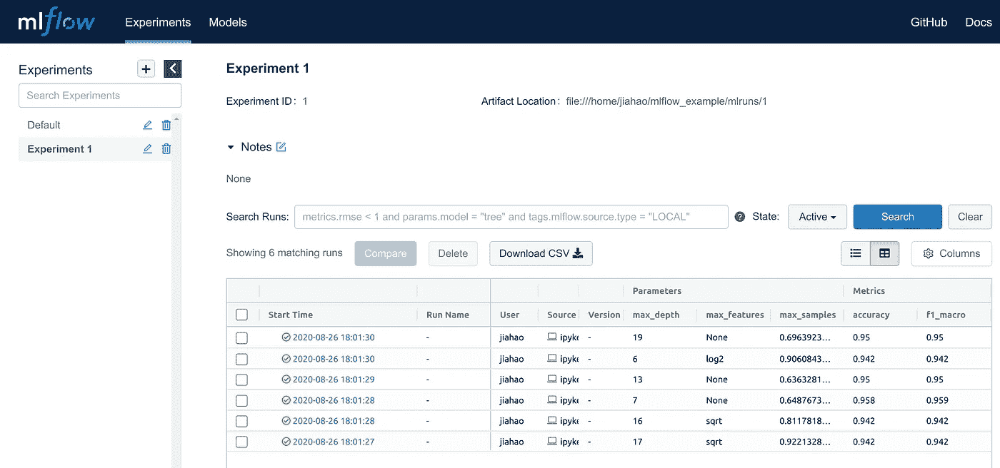
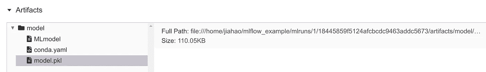
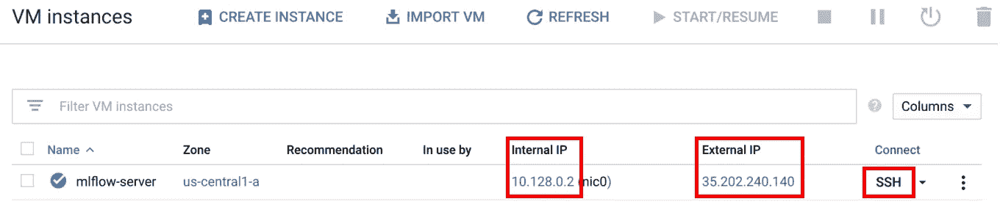
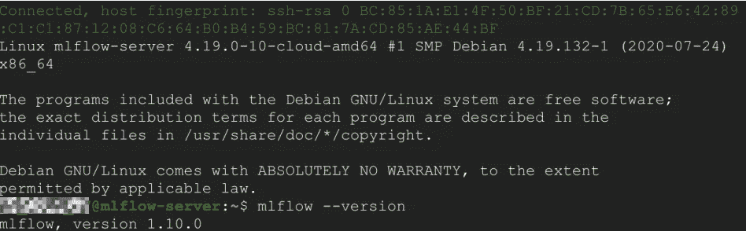
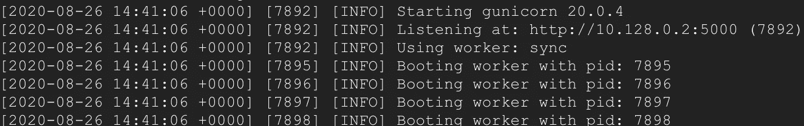

# 使用 MLflow 管理您的机器学习实验

> 原文：<https://towardsdatascience.com/managing-your-machine-learning-experiments-with-mlflow-1cd6ee21996e?source=collection_archive---------11----------------------->

## 告别繁琐的实验跟踪和杂乱的模型监控


照片由[斯科特·格雷厄姆](https://unsplash.com/@sctgrhm?utm_source=medium&utm_medium=referral)在 [Unsplash](https://unsplash.com?utm_source=medium&utm_medium=referral) 上拍摄

我仍然记得我和我的队友在从事机器学习(ML)项目时的那段痛苦时光。

单调而又刻意地，我们手动地将无数实验的结果转移到 Google Sheet 上，并将保存的模型组织到文件夹中。当然，我们确实试图尽可能地自动化这个过程，但是管理我们的 ML 实验仍然是一件混乱的事情。

如果上述情况听起来像是你正在经历的事情，希望这篇文章能够帮助你摆脱困境，减轻你的痛苦。

作为管理 ML 实验的最佳开源解决方案之一(见其他工具[此处](https://www.reddit.com/r/MachineLearning/comments/bx0apm/d_how_do_you_manage_your_machine_learning/)), ML flow 将极大地改善您的福祉(作为数据科学家、机器学习专家等)。)并让您和您的团队保持理智，同时跟踪您的模型💪。

# MLflow 如何帮助我？

只需将几行代码集成到您的脚本中，您就可以将您的模型参数和指标自动记录到一个有组织的仪表板中，如下所示。



单击表中的每一行将会显示更多的细节，包括为该次运行保存的模型的路径(一次运行基本上就是一次模型训练)。



如前所述，重要的是，只需在脚本中添加几行代码，所有这些都可以自动化。

在下面的示例代码片段中，我们在与 MLflow 相关的所有代码行上方放置了注释。

一般来说，在我们的示例中有三个主要部分:

1.**设置实验**:在使用`mlflow.start_run()`开始运行之前，我们在这里设置一个实验名称(`mlflow.set_experiment()`)和路径(`mlflow.set_tracking_uri()`)来记录我们的运行。

2.**训练模型**:这里没什么特别的，就是正常的模型训练。

3.**日志**:日志参数(`mlflow.log_params()`)、度量(`mlflow.log_metric()`)和模型(`mlflow.sklearn.log_model()`)。

运行代码后，您可以在终端中执行`mlflow ui`,将会有一个链接指向您的 MLflow 仪表板。

简单利落对吧？😎

然而，到目前为止，我们向您展示的是本地环境。如果我们想和其他队友合作呢？这就是远程服务器发挥作用的地方，本文的下一节将向您展示这样做的步骤。

# 在谷歌云上部署 MLflow 的步骤

我们首先列出要采取的一般步骤，然后用截图详细说明每个步骤(随意点击每个步骤进行导航)。拥有一个 Google Cloud 帐户是遵循这些步骤的唯一先决条件。请注意，谷歌云为新注册用户提供免费试用，所以你可以免费试用。

1.  [设置虚拟机为 MLflow 服务](#92b8)
2.  [创建云存储桶来存储我们的模型](#fe86)
3.  [启动 MLflow 服务器](#889a)
4.  [使用 Nginx 通过反向代理添加用户认证](#73fb)
5.  [修改代码以允许访问 MLflow 服务器](#0407)

# 1.设置虚拟机(VM)

我们的第一步是通过谷歌云控制台设置一个计算引擎虚拟机实例。

a)登录您的谷歌云控制台后，启用[计算引擎 API](https://console.cloud.google.com/apis/library/compute.googleapis.com?q=compute)


b)启动谷歌云壳

您应该会在控制台页面的右上角看到一个类似于下面红框中按钮的按钮。点击它，会弹出一个终端。我们将使用这个终端来启动我们的虚拟机。


点击红框中的按钮，启动谷歌云外壳

c)创建一个计算引擎虚拟机实例

在 Google Cloud Shell 中键入以下内容，创建一个名为 *mlflow-server* 的 VM 实例。

```
gcloud compute instances create mlflow-server \
--machine-type n1-standard-1 \
--zone us-central1-a \
--tags mlflow-server \
--metadata startup-script='#! /bin/bash
sudo apt update
sudo apt-get -y install tmux
echo Installing python3-pip
sudo apt install -y python3-pip
export PATH="$HOME/.local/bin:$PATH"
echo Installing mlflow and google_cloud_storage
pip3 install mlflow google-cloud-storage'
```

上面代码中参数的简要描述:

*   *machine-type* 为我们的虚拟机指定 CPU 和 RAM 的数量。您可以从该[列表](https://cloud.google.com/compute/docs/machine-types#machine_type_comparison)中选择其他类型。
*   *区域*是指您的集群所在的数据中心区域。你可以选择[离你的用户不太远的地方](https://cloud.google.com/compute/docs/regions-zones/#available)。
*   *标签*允许我们在以后添加网络防火墙规则时识别实例。
*   *元数据启动脚本*提供了一个 bash 脚本，它将在我们的实例启动时执行，安装所需的各种包。

d)创建防火墙规则

这是为了允许在端口 5000 上访问我们的 MLflow 服务器。

```
gcloud compute firewall-rules create mlflow-server \
--direction=INGRESS --priority=999 --network=default \
--action=ALLOW --rules=tcp:5000 --source-ranges=[0.0.0.0/0](http://0.0.0.0/0) \
--target-tags=mlflow-server
```

# 2.创建云存储桶

在 Google Cloud Shell 中运行下面的代码，用您选择的唯一名称替换 *< BUCKET_NAME >* 。这个桶将是我们以后存放模型的地方。

```
gsutil mb gs://<BUCKET_NAME>
```

# 3.启动 MLflow 服务器

我们现在将 SSH 到我们的 *mlflow-server* 实例中。

转到[计算引擎页面](https://console.cloud.google.com/compute/)并为您的实例单击 SSH 按钮。您的 VM 实例的终端应该会弹出。



当终端准备就绪时，记下显示在计算引擎页面上的 *mlflow-server* 实例的内部和外部 IP。我们以后会需要它们。

在启动我们的 MLflow 服务器之前，让我们做一个快速检查，以确保所有东西都已安装。由于我们的启动脚本需要几分钟的时间来完成执行，如果您太快地使用 SSH，这些包可能还没有全部安装好。要检查是否安装了 MLflow，请在终端中键入:

```
mlflow --version
```

如果已经安装了 MLflow，您应该可以看到它的版本。如果没有，不要担心，要么再等一会儿，要么执行我们的 bash 脚本中步骤 1c 下的命令来手动安装包。



如果已经安装了 MLflow，我们现在可以通过执行以下命令使用 tmux 打开一个新窗口:

```
tmux
```

通过运行下面的代码启动我们的 MLflow 服务器，将 *< BUCKET_NAME >* 和 *< INTERNAL_IP >* 分别替换为步骤 2 中的 BUCKET 名称和前面提到的您的内部 IP 地址。

```
mlflow server \
--backend-store-uri sqlite:///mlflow.db \
--default-artifact-root gs://<BUCKET_NAME> \
--host <INTERNAL_IP>
```

如果您看到类似以下截图的内容，恭喜您的 MLflow 服务器已经启动并运行😄。您现在可以在浏览器中访问`<External_IP>:5000`来查看您的 MLflow 仪表盘。



# 4.添加用户验证

如果您不介意让拥有您外部 IP 地址的任何人查看您的 MLflow 仪表板，那么您可以跳过这一步。但我猜你不是一个暴露狂，对吗？还是你？😱

要添加用户认证，首先让我们通过按下`Ctrl+c`暂时停止我们的 MLflow 服务器。然后在用`Ctrl+b` `d`拆窗户之前，说出终结者的那句名言“我会回来的”。

a)安装 Nginx 和 Apache 实用程序

在我们终端的主窗口中，执行:

```
sudo apt-get install nginx apache2-utils
```

Nginx 将设置我们的 web 服务器，而 Apache 工具将为我们提供对`htpasswd`命令的访问，我们将使用该命令创建密码文件。

b)添加密码文件

运行以下程序，将 *<用户名>* 替换为酷名。

```
sudo htpasswd -c /etc/nginx/.htpasswd <USERNAME>
```

然后设置你的无人能破译的密码。

如果您需要一个聚会，只需省去`-c`参数来添加额外的用户:

```
sudo htpasswd /etc/nginx/.htpasswd <ANOTHER_USER>
```

c)启用密码和反向代理

我们需要配置 Nginx，让我们的密码文件生效，并设置 MLflow 服务器的反向代理。我们通过修改`default`服务器块文件来做到这一点:

```
sudo nano /etc/nginx/sites-enabled/default
```

通过将*位置*下的内容替换为三个粗体行来修改文件:

```
server {
  location / {
    **proxy_pass** [**http://localhost:5000**](http://localhost:5000/)**;
    auth_basic "Restricted Content";
    auth_basic_user_file /etc/nginx/.htpasswd;**
  }
}
```

按`Ctrl+x` `y` `Enter`保存修改并退出编辑器。

重新启动 Nginx 以使更改生效:

```
sudo service nginx restart
```

使用`tmux`创建新会话或重新连接到我们之前的 tmux 会话:

```
tmux attach-session -t 0
```

再次启动我们的 MLflow 服务器，但这一次，我们的主机被设置为 *localhost* :

```
mlflow server \
--backend-store-uri sqlite:///mlflow.db \
--default-artifact-root gs://<BUCKET_NAME> \
--host localhost
```

d)启用 HTTP 流量

最后，我们按照这个[链接](https://cloud.google.com/vpc/docs/special-configurations#developer-console-external-http)中的步骤，为我们的实例启用 HTTP 流量，以允许访问我们的 Nginx web 服务器。实际上，当您在计算引擎页面上单击我们的 *mlflow-server* 实例时，您可以在防火墙部分下编辑并选择*允许 HTTP 流量*和*允许 HTTPS 流量*。

现在，如果您访问您的外部 IP(省去 *:5000* ，只访问外部 IP)，您应该被提示输入凭证。键入您之前设置的用户名和密码，然后“打开芝麻”，您的 MLflow 仪表盘又回到了您的眼前。

# 5.修改代码以访问服务器

为了让我们的脚本登录到服务器，我们需要通过提供一些凭证作为环境变量来修改我们的代码。

a)创建并下载服务帐户 json

按照此处的步骤[创建新的服务账户密钥。](https://cloud.google.com/iam/docs/creating-managing-service-account-keys#creating_service_account_keys)

b) Pip 在本地安装谷歌云存储

*google-cloud-storage* 包需要安装在客户端和服务器上，以便访问 google 云存储。我们已经通过启动脚本在服务器上安装了这个包，所以您只需要在本地安装它。

c)将凭证设置为环境变量

在您的代码中，添加以下内容以使您的脚本能够访问服务器，并相应地替换它们:

*   <google_application_credentials>:下载服务账号密钥的路径</google_application_credentials>
*   <mlflow_tracking_username>:用户名</mlflow_tracking_username>
*   <mlflow_tracking_password>:密码</mlflow_tracking_password>

```
import os# Set path to service account json file
os.environ['GOOGLE_APPLICATION_CREDENTIALS'] = <GOOGLE_APPLICATION_CREDENTIALS># Set username and password if authentication was added
os.environ['MLFLOW_TRACKING_USERNAME'] = <MLFLOW_TRACKING_USERNAME>
os.environ['MLFLOW_TRACKING_PASSWORD'] = <MLFLOW_TRACKING_PASSWORD>
```

d)将外部 IP 设置为 MLflow 跟踪 URI

在前面的示例代码中，`mlflow.set_tracking_uri()`被设置为本地文件夹路径。现在将其设置为< EXTERNAL_IP > :80，例如:[http://35.225.50.9:80](http://35.225.50.9:80)。

```
mlflow.set_tracking_uri(<EXTERNAL_IP>:80)
```

现在，您可以轻松地与您的队友协作，并将您的模型登录到服务器。👏 👏 👏

为了测试方便，我们的完整示例代码可以在[这里](https://gist.github.com/jiahao87/e7d9ede444a41161879d7b4845f0a6c0)找到。

通过上面的指南，我们希望您现在能够在本地和 Google Cloud 上部署 MLflow 来管理您的 ML 实验。此外，在您进行实验之后，MLflow 在您将模型部署到生产环境中之后，仍然可以用来监控您的模型。

感谢阅读，我希望这篇文章是有用的:)也请随时评论您可能有的任何问题或建议。

# 参考

[](https://www.mlflow.org/docs/latest/quickstart.html) [## 快速入门

### 您可以通过运行以下命令来安装 MLflow:注意 MLflow 在 MacOS 上工作。如果您在使用默认系统 Python 时遇到问题…

www.mlflow.org](https://www.mlflow.org/docs/latest/quickstart.html) [](https://karimlahrichi.com/2020/03/13/add-authentication-to-mlflow/) [## 向 MLflow 添加身份验证

### 这是 MLflow 的第三次安装，我们将在 MLflow 跟踪服务器前添加一个 nginx 反向代理…

karimlahrichi.com](https://karimlahrichi.com/2020/03/13/add-authentication-to-mlflow/)