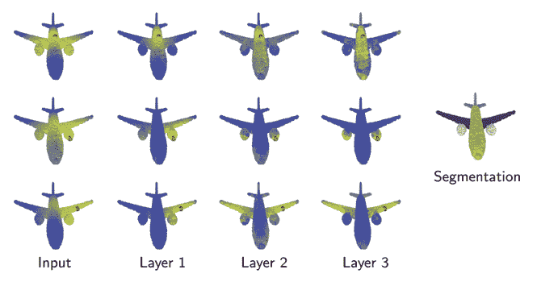
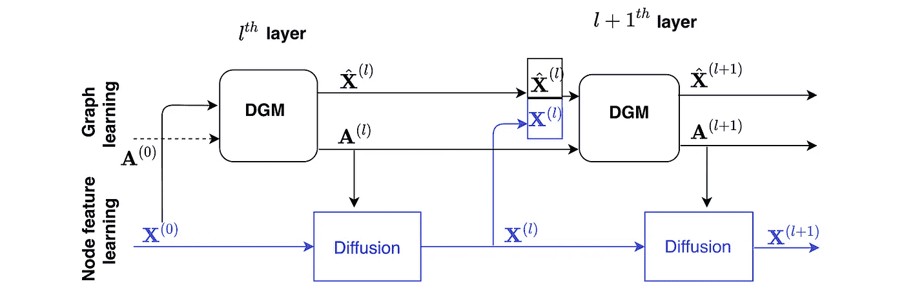
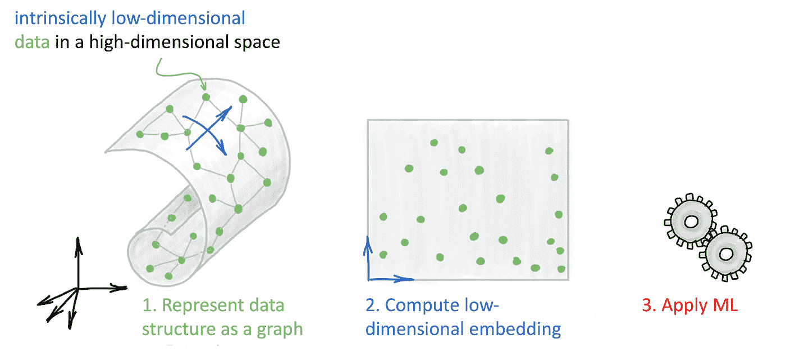
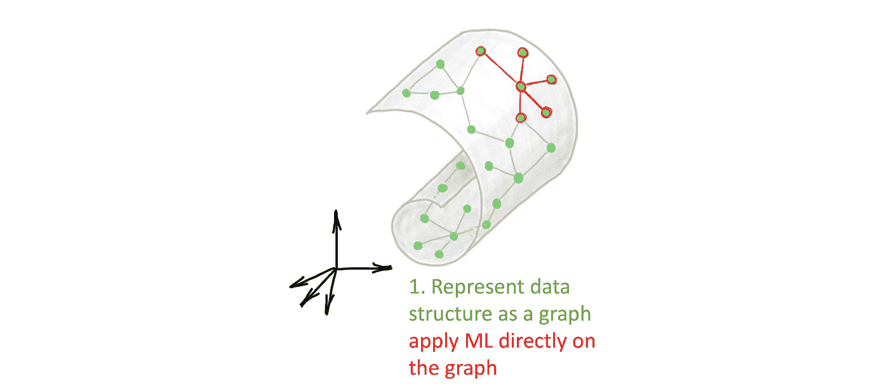
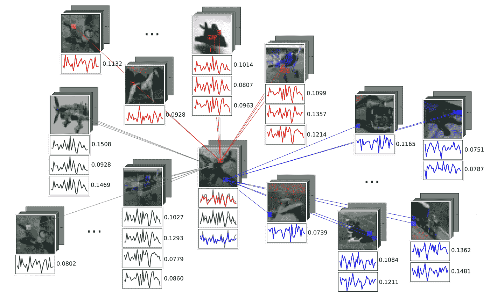

# 潜在图形神经网络:流形学习 2.0？

> 原文：<https://towardsdatascience.com/manifold-learning-2-99a25eeb677d?source=collection_archive---------3----------------------->

## 基于潜在图的深度学习

## 图形神经网络对以图形形式出现的数据利用关系归纳偏差。然而，在许多情况下，我们没有现成的图表。这种情况下图形深度学习还能应用吗？在这篇文章中，我将潜在图学习的最新作品与流形学习的旧技术进行了比较。

在过去的几年里，人们对开发图结构数据的 ML 方法兴趣高涨。这种数据自然会出现在许多应用中，例如社会科学(例如 Twitter 或脸书上的用户图)、化学(分子可以建模为由键连接的原子的图)或生物学(不同生物分子之间的相互作用通常建模为称为相互作用组的图)。图形神经网络(GNNs)，我在我的[以前的帖子](https://towardsdatascience.com/graph-deep-learning/home)中已经广泛介绍过，是一种特别流行的在这种图形上学习的方法，通过局部操作，共享参数在相邻节点之间交换信息。

然而，在某些情况下，我们没有*给*一个图形作为输入来工作的奢侈。这是许多生物学问题的典型情况，其中诸如蛋白质-蛋白质相互作用的图在最好的情况下只是部分已知，因为发现相互作用的实验是昂贵和嘈杂的。因此，我们感兴趣的是*从数据中推断出*图形，并对其应用 GNN[1]——我称这种设置为“潜在图形学习”[2]。潜在图可能是特定于应用的，并针对下游任务进行了优化。此外，有时这样的图表甚至可能比任务本身更重要，因为它可以传达关于数据的重要见解，并提供解释结果的方法。

潜在图学习的一种思维方式是具有空边集的图。在这种设置中，输入是作为某个高维特征空间中的点云提供的。与 PointNet [3]等在集合上进行深度学习的方法不同，这些方法将一些共享的可学习的逐点函数应用于每个点，我们还寻求跨点传递信息。这是通过在由点要素本身构建的图上传递消息来完成的。

第一个这种架构，动态图形 CNN (DGCNN) [4]，是由麻省理工学院的王月开发的，我很高兴在该机构休假期间与他合作。受处理 3D 点云分析的计算机图形中的问题的启发，该想法是使用图形作为点云下面的局部平滑流形结构的粗略表示。岳的一个重要观察是，该图不需要在整个神经网络中保持不变，事实上它可以而且应该动态更新——这就是该方法的名称。我们论文中的下图说明了为什么这在计算机图形问题中是有用的:

*动态图 CNN 动态构建一个用于特征扩散的*k*-最近邻图。该图是任务相关的，并且在每一层之后更新。该图(取自[4])描绘了与红点的距离(黄色代表更近的点)，表明在分段任务中，更深层次的图形捕捉的是语义关系，而不是几何关系，如成对的机翼、发动机等。*

DGCNNs 的局限性之一是使用相同的空间来构建图形和图形上的要素。在最近与来自 TUM 的 Anees Kazi 和我的博士后 Luca Cosmo 的合作中，我们提出了一种新的架构，称为可微分图模块(DGM) [5]，通过解耦图和特征构造来扩展 DGCNN，如下图所示:

*可微分图形模块(DGM)提供了一种从输入数据构建图形和在图形上扩散的特征的机制。图来自[5]。*

当应用于医学领域的问题时，DGM 展示了令人印象深刻的结果，例如根据脑成像数据进行疾病预测。在这些任务中，为我们提供了多个患者的电子健康记录，包括人口统计特征(如年龄、性别等)和脑成像特征，并试图预测患者是否患有神经系统疾病。先前的工作显示了 GNNs 在这类任务中的应用，在根据人口统计学特征手工构建的“患者图”上使用扩散[6]。DGM 提供了学习图形的优势，这可能传达了对特定诊断任务中某些特征如何相互依赖的洞察。作为奖励，DGM 还在点云分类游戏中击败了 DGCNN，尽管只是略微领先。

GCNN 和 DGM 在概念上与一个叫做*流形学习*或 [*非线性降维*](https://en.wikipedia.org/wiki/Nonlinear_dimensionality_reduction) 的算法家族有相似之处，这些算法在 21 世纪初我还是学生的时候在机器学习领域非常流行，现在仍被用于数据可视化。流形学习方法的基本假设是数据具有内在的低维结构。尽管数据可以在数百甚至数千维的空间中表示，但它只有几个自由度，如下例所示:

*虽然该数据集中的手部图像是高维的(64x64 像素导致 4096 维)，但它们本质上是低维的，并且可以用两个自由度来解释:手腕旋转和手指伸展。流形学习算法能够捕获数据集的这种低维内在结构，并将其表示在欧几里德空间中。图来自 Isomap 论文【9】*[*补充材料*](http://web.mit.edu/cocosci/isomap/datasets.html) *。*

流形学习的目的是捕捉这些自由度(通过重建底层“流形”，因此得名[7])，并将数据的维度降低到其固有维度。与*线性*降维(如 [PCA](https://en.wikipedia.org/wiki/Principal_component_analysis) )的重要区别在于，由于数据的非欧几里德结构，可能无法通过线性投影恢复流形[8]:

*线性降维(左)vs 流形学习。“瑞士滚面”(* [*由约书亚·特南鲍姆*](http://papers.nips.cc/paper/1332-mapping-a-manifold-of-perceptual-observations.pdf) *创造，此处显示其 1D 化身)是多种学习论文中常见的例子。*

各种学习算法在处理“流形”恢复的方式上有所不同，但却有一个共同的蓝图。首先，他们创建数据的表示，这通常是通过构建一个捕获其局部结构的*k*-最近邻图来完成的。其次，他们计算数据的低维表示(嵌入),试图保留原始数据的结构。这是大多数多种学习方法不同的地方。例如，Isomap [9]试图保持图的测地线距离，局部线性嵌入[10]找到相邻点的局部表示，拉普拉斯特征映射[11]使用图的拉普拉斯算子的特征函数作为低维嵌入。这种新的表示将原始的非欧几里德结构“展平”到更容易处理的欧几里德空间中。第三，一旦计算出表示，就对其应用机器学习算法(通常是聚类)。

*多种多样学习方法的蓝图:首先，将数据表示为图形。其次，计算该图的低维嵌入。第三，对这个低维表示应用 ML 算法。*

O 挑战之一是图的构建与 ML 算法相分离，有时需要精细的参数调整(例如邻居的数量或邻居半径),以便找出如何构建图来使下游任务工作良好。也许流形学习算法的一个更严重的缺点是，数据很少以其原始形式表现为低维。例如，在处理图像时，必须使用各种手工制作的特征提取技术作为预处理步骤。

图形深度学习通过用单个图形神经网络取代上面概述的三阶段过程，为这一过程提供了一种现代方式。例如，在动态图形 CNN 或 DGM 中，图形的构建和学习是同一架构的一部分:

*潜在图形学习可被视为流形学习问题的现代设置，其中图形被学习为针对一些下游任务优化的端到端 GNN 流水线的一部分。*

这种方法的吸引力在于可以将单个数据点的处理和它们在同一管道中所处的空间结合起来。在图像的例子中，可以使用传统的 CNN 从每个图像中提取视觉特征，并使用 GNN 来模拟它们之间的关系。我的博士生 Jan Svoboda 的工作中使用了这种方法:他为 CNN 提出了一个基于图形的正则化层(称为 PeerNet)，允许在多个图像之间交换信息[12]。PeerNets 在聚合来自多个位置的信息的方式上与非本地均值滤波器[13]相似，主要区别在于聚合发生在多个图像上，而不是单个图像上。我们表明，这种规范化极大地降低了标准 CNN 极易受到的对抗性扰动的影响[14]。

*PeerNets 是标准 CNN 中基于图形的正则化层，它聚集了来自多个图像的相似像素，以降低对敌对干扰的敏感性。图来自[12]。*

T 这里有许多潜在图形学习的其他有趣应用。一种是少量学习，基于图形的技术可以帮助从几个例子中进行归纳。少量学习在计算机视觉中变得越来越重要，因为数据标记的成本很高[5]。另一个领域是生物学，人们经常通过实验观察生物分子(如蛋白质)的表达水平，并试图重建它们的相互作用和信号网络[15]。第三个问题是物理系统的分析，其中一个图可以描述多个对象之间的相互作用[16]。特别是，处理复杂粒子相互作用的高能物理学家最近对基于图形的方法表现出浓厚的兴趣[17]。最后但并非最不重要的是 NLP 中的问题，其中图形神经网络可以被视为变压器架构的[推广。许多提到的问题也提出了在图结构上结合先验的问题，这在很大程度上仍然是开放的:例如，人们可能希望迫使图遵守某些构造规则或与一些统计模型兼容[18]。](/transformers-are-graph-neural-networks-bca9f75412aa)

我相信潜在图形学习虽然不是全新的，但它为老问题提供了一个新的视角。这肯定是一个有趣的图形 ML 问题的设置，为 GNN 研究人员提供了一个新的游乐场。

[1]一类略有不同但相关的方法试图将作为输入提供的图与用于图神经网络中消息传递的计算图分离，参见例如 J. Halcrow 等人 [Grale:设计用于图学习的网络](https://arxiv.org/pdf/2007.12002.pdf) (2020)。arXiv:2007.12002 年。人们可能希望这样做有多种原因，其中之一是打破与某些图中邻域大小的[指数增长](/do-we-need-deep-graph-neural-networks-be62d3ec5c59)相关的瓶颈，如 U. Alon 和 E. Yahav，[关于图神经网络的瓶颈及其实际意义](https://arxiv.org/pdf/2006.05205.pdf) (2020)。arXiv:2006.05205。

[2]在董晓文的博士论文《信号处理》中考虑了一些数据背后的图形重建问题，我于 2014 年 5 月参加了其辩护委员会，就在我儿子出生前几天。X. Dong 等人的《从数据中学习图形:信号表示透视》(2019)，IEEE Signal Processing Magazine 36(3):44–63 很好地总结了这方面的工作。从网络游戏的角度来看，这些方法的一个更近的化身是 Y. Leng 等人的工作[在网络上学习二次游戏](https://arxiv.org/pdf/1811.08790.pdf) (2020)。继续。ICML，今年早些时候我是他在麻省理工学院博士委员会的成员。

[3] C. Qi 等 [PointNet:用于 3D 分类和分割的点集上的深度学习](https://arxiv.org/pdf/1612.00593) (2017)，Proc .CVPR。PointNet 是一种用于对集合进行深度学习的架构，其中共享函数被应用于每个点的表示，并且可以被认为是 GNN 应用于具有空边集的图的平凡情况。

[4] Y. Wang 等[点云上学习的动态图 CNN](https://arxiv.org/pdf/1801.07829.pdf)(2019)。ACM Trans 图形 38(5):146。这篇论文在计算机图形社区中非常流行，并且经常被用作点云方法的基线。具有讽刺意味的是，它在 2018 年被 SIGGRAPH 拒绝，并在收集了 600 多次引用后，仅在两年后的同一场会议上发表。

[5] A. Kazi 等，[图卷积网络的可微图模(DGM)](https://arxiv.org/pdf/2002.04999.pdf)(2020)arXiv:2002.04999。我们展示了多种应用，包括医学成像、3D 点云分析和少量镜头学习。参见我们的论文 L. Cosmo 等人[用于自动诊断的潜在患者网络学习](https://arxiv.org/pdf/2003.13620.pdf) (2020)。继续。专注于这种方法的医学应用。Anees 是我 2019 年在帝国理工学院小组的访问博士生。

[6]据我所知，GNNs 用于脑部疾病预测的第一次使用是由 S. Parisot 等人[使用图卷积网络的疾病预测:应用于自闭症谱系障碍和阿尔茨海默病](https://arxiv.org/pdf/1806.01738.pdf) (2017)。继续。米凯。这种方法的主要缺点是根据人口统计特征手工构建图表。

[7]从形式上讲，它不是微分几何意义上的“流形”,因为例如局部维数可以在不同的点上变化。然而，这是一个方便的比喻。

[8]更正确的说法是“非欧几里得”而不是“非线性”。

[9] J. B. Tenenbaum 等人，[非线性维数约减的全局几何框架](http://web.mit.edu/cocosci/Papers/sci_reprint.pdf) (2000)，科学 290:2319–2323。介绍了 Isomap 算法，该算法通过尝试保留数据流形上的测地线距离来嵌入数据流形，使用 *k* -NN 图进行近似。图上的测地线距离是连接任何一对点的最短路径的长度，通过 [Dijkstra 算法](https://en.wikipedia.org/wiki/Dijkstra%27s_algorithm)计算。赋予这样的距离度量，数据集被认为是一个(非欧几里德)度量空间。在度量几何中，低维空间中成对欧几里得距离等于图测地线距离的点的配置称为*等距嵌入*。通常，等距嵌入是不存在的，人们不得不求助于某种意义上最能保持距离的近似。计算这种近似值的一种方法是借助于[多维标度](https://en.wikipedia.org/wiki/Multidimensional_scaling) (MDS)算法。

[10] S. T. Roweis 和 L. K. Saul，[通过局部线性嵌入进行非线性降维](https://cs.nyu.edu/~roweis/lle/papers/lleintro.pdf) (2000)。科学 290:2323–2326。

[11] M，Belkin 和 P. Niyogi，[拉普拉斯特征映射和用于嵌入和聚类的谱技术](https://papers.nips.cc/paper/1961-laplacian-eigenmaps-and-spectral-techniques-for-embedding-and-clustering.pdf) (2001)。继续。乳头。

[12] J. Svoboda 等人 [PeerNets:利用同伴智慧对抗对抗性攻击](https://arxiv.org/pdf/1806.00088.pdf) (2019)，Proc .ICLR 使用聚集来自多个图像的信息的 GNN 模块来降低 CNN 对输入的对抗性扰动的敏感性。

[13]非局部均值是由 A. Buades 等人提出的一种非线性图像滤波技术，[一种用于图像去噪的非局部算法](http://stanford.edu/class/ee367/reading/A%20non-local%20algorithm%20for%20image%20denoising.pdf) (2005)，Proc .CVPR。它可以被视为深度学习中使用的现代注意力机制的先驱。非局部均值本身是边缘保持扩散方法的变体，例如我的博士导师 Ron Kimmel 在 R. Kimmel 等人的论文中提出的 Beltrami 流。计算机视觉中的尺度空间理论，或 C. Tomasi 和 R. Manduchi 的双边滤波器，[灰度和彩色图像的双边滤波](http://www.cse.ucsc.edu/~manduchi/Papers/ICCV98.pdf) (1998)。继续。ICCV。

[14]对抗性扰动是一种精心构建的输入噪声，它显著降低了 CNN 的性能，例如在图像分类中。这种现象在 C. Szegedy 等人的[神经网络的有趣特性](https://arxiv.org/pdf/1312.6199) (2014)，Proc。，并产生了多个后续工作，这些工作显示了像改变单个像素一样极端的奇异对抗性攻击(J. Su 等人[一个像素攻击用于愚弄深度神经网络](https://arxiv.org/pdf/1710.08864) (2017)，arXiv:1710.08864)或数据独立的“通用”扰动(S. M. Moosavi-Dezfooli 等人，[通用对抗性扰动](https://arxiv.org/abs/1610.08401) (2017)，Proc .CVPR)。

[15] Y. Yu 等， [DAG-GNN:用图神经网络进行 DAG 结构学习](https://arxiv.org/pdf/1904.10098.pdf) (2019)。继续。ICML。

[16] T. Kipf 等人，[交互系统的神经关系推理](https://arxiv.org/pdf/1802.04687.pdf) (2019)。继续。ICML。通过使用变分自动编码器来恢复“解释”系统物理的图形，其中潜在向量表示底层交互图形，解码器是图形神经网络。

[17]GNNs 在高能物理中的应用是一个有趣的话题，值得另文讨论。我和我的博士生费德里科·蒙蒂一起与[冰立方](https://en.wikipedia.org/wiki/IceCube_Neutrino_Observatory)合作开发了可能是第一个基于 GNN 的粒子物理方法。我们的论文 N. Choma，F. Monti 等人，【IceCube 信号分类的图形神经网络 (2018)，Proc .ICMLA，我们使用 MoNet 架构进行天体物理中微子分类，获得了最佳论文奖。在最近的一项工作中，S. R. Qasim 等人，[使用距离加权图网络学习不规则粒子检测器几何图形的表示](https://link.springer.com/article/10.1140/epjc/s10052-019-7113-9) (2019)，欧洲物理杂志 C 79，使用了类似于 DGM 的 DGCNN 的变体，称为 GravNet，用于粒子重建。

[18]一类稍微相关的方法是生成图模型，参见例如 Y. Li 等人的[学习图的深度生成模型](https://arxiv.org/pdf/1803.03324.pdf) (2018)。arXiv:1803.03324。其中一个应用是生成符合严格构造规则的化合物的分子图。

[19]在过去的几年中，出现了更多关于潜在图学习论文的作品——如果我省略了一些，这是因为我的目标不是详尽无遗，而是展示一个原则。我将参考 L. Franceschi 等人的另一项工作[为图形神经网络学习离散结构](http://proceedings.mlr.press/v97/franceschi19a/franceschi19a.pdf) (2019)。继续。ICML，其中也提到了与 Isomap 和流形学习技术的关系。

感谢 Ben Chamberlain、Dong Xiaowen、Fabrizio、Anees Kazi 和校对了这篇文章，并感谢 Gal Mishne 指出了瑞士面包卷的起源。对图形 ML 和几何深度学习感兴趣？查看我的 [*博客*](https://towardsdatascience.com/graph-deep-learning/home) *关于走向数据科学，* [*订阅我的*](https://michael-bronstein.medium.com/subscribe) *帖子，获取* [*中等会员*](https://michael-bronstein.medium.com/membership) *，或者关注我的* [*推特*](https://twitter.com/mmbronstein) *。*