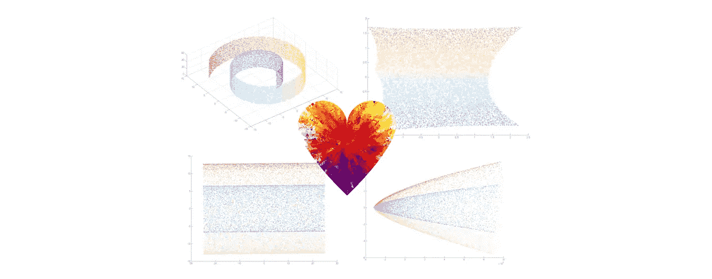
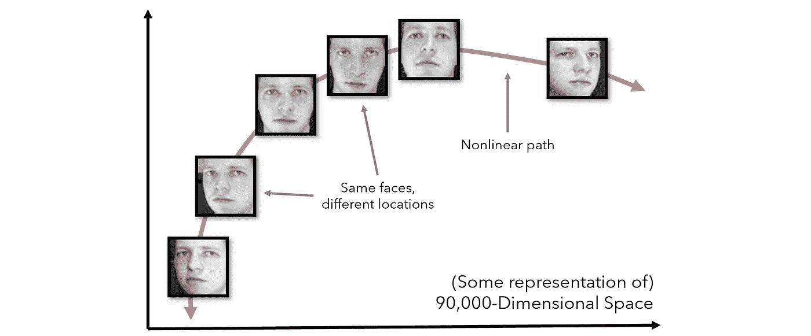
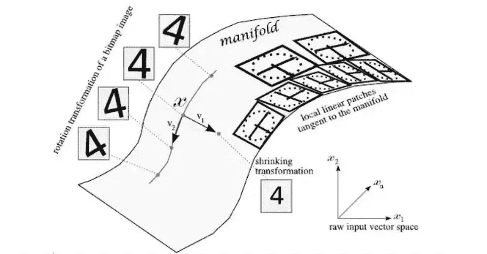
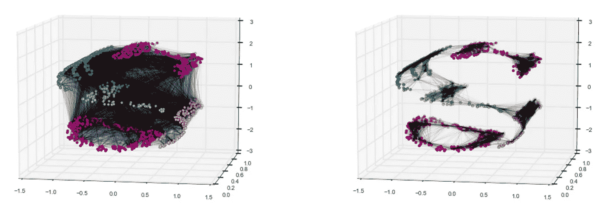
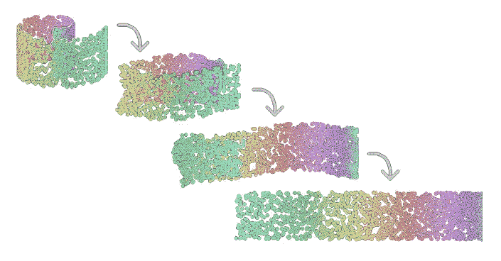
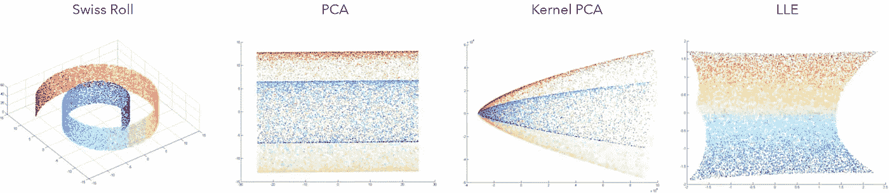
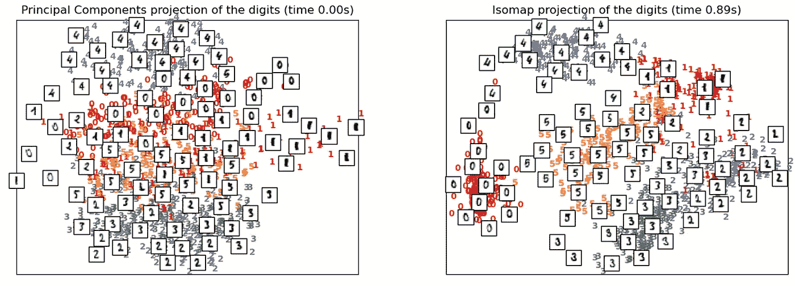
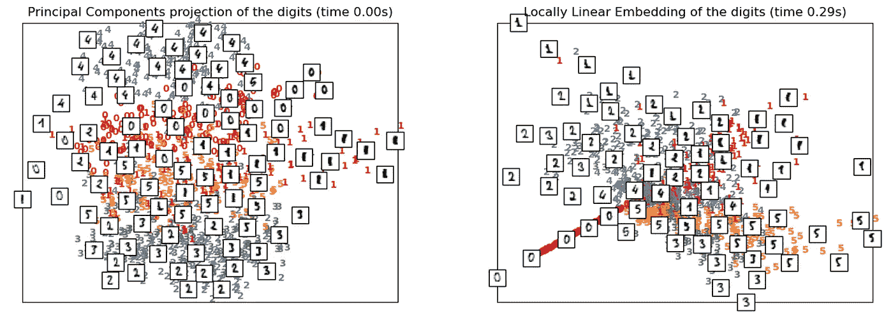
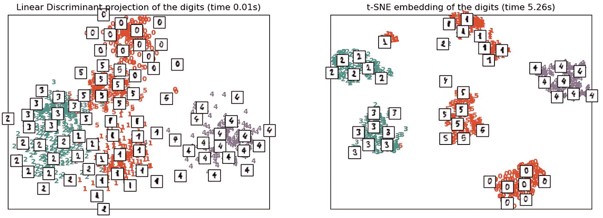

# 流形学习[t-SNE，LLE，Isomap，+]变得简单

> 原文：<https://towardsdatascience.com/manifold-learning-t-sne-lle-isomap-made-easy-42cfd61f5183?source=collection_archive---------4----------------------->

资料来源:Pixabay，Jennifer Chu。图片免费分享。

## 降维的核心

主成分分析是一种强大的方法，但它经常失败，因为它假设数据可以线性建模。主成分分析将新特征表示为现有特征的线性组合，方法是将每个特征乘以一个系数。为了解决 PCA 的局限性，通过应用具有不同特定结构的数据，已经产生了各种技术。然而，流形学习试图找到一种可以推广到所有数据结构的方法。

不同的数据结构指的是数据中不同的属性。例如，它可能是线性可分的，也可能非常稀疏。数据中的关系可以是相切的、平行的、包络的或正交的。PCA 在数据结构的一个非常具体的子集上工作得很好，因为它在线性的假设上操作。

为了把事情放在上下文中，考虑 300×300 像素的头像。在完美的条件下，每个图像都将完美地居中，但在现实中，还有许多额外的自由度需要考虑，如照明或脸部的倾斜。如果我们将头像视为 90，000 维空间中的一个点，改变各种效果，如倾斜头部或朝不同方向看，可以在空间中非线性地移动它，即使它是同一类的同一对象。

由作者创建。

这种数据经常出现在现实世界的数据集中。除了这种影响之外，当出现偏斜分布、极值和多个虚拟(一位热编码)变量时，PCA 也很慌乱(参见[非线性 PCA 以获得此](/beyond-ordinary-pca-nonlinear-principal-component-analysis-54a93915a702)的解决方案)。需要一种通用的降维方法。

多元学习指的就是这个任务。流形学习中有许多方法可能以前已经见过，例如 t-SNE 和局部线性嵌入(LLE)。有许多文章和论文深入研究了这些算法的技术和数学细节，但这一篇将集中在一般的直觉和实现上。

请注意，虽然有一些受监督的维度减少的变体(例如[线性/二次判别分析](https://medium.com/analytics-vidhya/linear-discriminant-analysis-explained-in-under-4-minutes-e558e962c877?source=your_stories_page---------------------------))，但流形学习通常指的是无监督的减少，其中类不呈现给算法(但可能存在)。

PCA 试图创建几个线性超平面来表示维度，很像作为数据估计的多重回归构造，而流形学习试图学习流形，流形是多维空间内的平滑曲面。如下图所示，这些通常是由图像上的细微变换形成的，否则会欺骗 PCA。

资料来源:阿伦·詹森。图片免费分享。

然后，可以提取与流形相切的“局部线性面片”。这些小块通常足够丰富，可以准确地表示流形。因为这些流形不是由任何一个数学函数来模拟的，而是由几个小的线性块来模拟的，所以这些线性邻域可以模拟任何流形。尽管这可能不是某些算法处理流形建模的明确方式，但基本思想是非常相似的。

以下是流形学习算法的基本假设或方面:

*   数据中存在非线性关系，可以通过流形进行建模——跨越多个维度的表面，平滑，不太“波动”(太复杂)。流形是连续的。
*   维护数据的多维形状并不重要。除了用特定的方向“展平”或“投影”数据(如 PCA)来保持数据的总体形状，还可以执行更复杂的操作，如展开一个盘绕的条带或翻转一个球体。
*   对流形建模的最佳方法是将曲面视为由几个邻域组成。如果每个数据点设法不与所有其他点保持距离，而仅与接近它的点保持距离，则几何关系可以在数据中保持。

这个想法可以通过查看解开这个盘绕数据集的不同方法来很好地理解。左边是一个更像 PCA 的方法来保持数据的形状，其中每个点都是相互连接的。然而，右边是一种方法，其中只评估数据点邻域之间的距离。

来源:杰克·范德普拉斯。图片免费分享。

这种对邻域之外的点的相对忽视导致了有趣的结果。例如，考虑这个瑞士卷数据集，它在三维空间中被卷绕，在二维空间中被简化为一条带状。在某些情况下，这种效果并不理想。然而，如果这条曲线是图像中相机倾斜或音频质量外部影响的结果，流形学习通过微妙地解开这些复杂的非线性关系给我们带来了巨大的帮助。

来源:数据科学大侠。图片免费分享。

在 Swiss Roll 数据集上，主成分分析甚至像核主成分分析这样的专门变体都无法捕捉值的梯度。另一方面，局部线性嵌入(LLE)，一种流形学习算法，能够。

资料来源:詹妮弗·朱。免费分享图片

让我们更详细地了解三种流行的流形学习算法:IsoMap、局部线性嵌入和 t-SNE。

流形学习中最早的探索之一是 Isomap 算法，是等距映射的缩写。Isomap 寻求一种维持点之间“测地线距离”的低维表示。测地线距离是曲面距离的概括。因此，Isomap 不是用毕达哥拉斯定理导出的距离公式来测量纯欧几里得距离，而是沿着发现的流形来优化距离。

来源:sklearn。图片免费分享。

在 MNIST 数据集上训练时，Isomap 的性能优于 PCA，显示了不同类型数字的正确分割。某些数字组之间的接近和距离揭示了数据的结构。例如，距离很近的“5”和“3”(在左下方)看起来确实很相似。

下面是 Isomap 在 Python 中的实现。由于 MNIST 是一个非常大的数据集，您可能只想使用`.fit_transform(X[:100])`在前 100 个训练示例上训练 Isomap。

局部线性嵌入使用各种切线线性补片(如上图所示)来模拟流形。它可以被认为是对这些邻域中的每一个局部地执行 PCA，产生线性超平面，然后全局地比较结果以找到最佳的非线性嵌入。LLE 的目标是以扭曲的方式“展开”或“解开”数据的结构，因此 LLE 往往会在中心具有较高的密度，并延伸射线。

来源:sklearn。图片免费分享。

注意，LLE 在 MNIST 数据集上的表现相对较差。这很可能是因为 MNIST 数据集由多个流形组成，而 LLE 是为处理更简单的数据集而设计的(如瑞士卷)。在这种情况下，它的性能与 PCA 相当，甚至更差。这有道理；它的“将一个函数表示为几个小的线性函数”策略可能不适用于大型复杂的数据集结构。

LLE 的实现如下，假设数据集(`X`)已经被加载。

t-SNE 是高维可视化最流行的选择之一，代表 t-分布式随机邻居嵌入。该算法将原始空间中的关系转换成 [t 分布](https://en.wikipedia.org/wiki/Student%27s_t-distribution)，或者具有小样本量和相对未知的标准偏差的正态分布。这使得 SNE 霸王龙对局部结构非常敏感，这是流形学习中的一个常见主题。它被认为是首选的可视化方法，因为它具有许多优点:

*   它能够揭示多种尺度下的数据结构。
*   它揭示了存在于多个流形和簇中的数据
*   更倾向于将点聚集在中心。

等映射和 LLE 最适合用来展开一个单一、连续的低维流形。另一方面，t-SNE 专注于数据的局部结构，并试图“提取”聚类的局部组，而不是试图“展开”或“展开”它。这使得 t-SNE 在用多个流形理清高维数据方面占据上风。它使用梯度下降进行训练，并试图最小化分布之间的[熵](/understanding-entropy-the-golden-measurement-of-machine-learning-4ea97c663dc3)。从这个意义上说，它几乎就像一个简化的、无监督的神经网络。

t-SNE 是非常强大的，因为这种“集群”与“展开”的流形学习方法。对于像 MNIST 这样的高维多流形数据集，旋转和移动会导致非线性关系，t-SNE 的表现*甚至优于被贴上标签的 LDA* 。

来源:sklearn。图片免费分享。

然而，SNE 霸王龙也有一些缺点:

*   t-SNE 的计算开销非常大(比较上图中的运行时)。在百万样本数据集上可能需要几个小时，而 PCA 可以在几秒或几分钟内完成。
*   该算法依赖于随机性(随机)来挑选种子以构建嵌入，如果种子碰巧放置不当，则会增加其运行时间并降低性能。
*   全局结构没有被显式地保留(即更强调聚类而不是展示全局结构)。然而，在 sklearn 的实现中，这个问题可以通过用 PCA 初始化点来解决，PCA 是专门为保持全局结构而构建的。

t-SNE 也可以在 sklearn 中实现:

SNE 霸王龙的作者劳伦斯·范·德·马腾说，当 SNE 霸王龙产量很低时，要考虑以下几点:

> *作为一个健全的检查，试着对你的数据运行主成分分析，把它减少到二维。如果这也给出了不好的结果，那么可能首先你的数据中没有非常好的结构。如果 PCA 工作正常，但 t-SNE 不行，我相当肯定你做错了什么。*

他为什么这么说？作为击中要害的额外提醒，流形学习不是 PCA 的另一种变体，而是一种推广。在主成分分析中表现良好的东西几乎肯定在 t-SNE 或其他流形学习技术中表现良好，因为它们是一般化的。

就像一个苹果也是一个水果一样(一个概括)，如果某个事物不能产生与它的概括相似的结果，通常是有问题的。另一方面，如果两种方法都失败了，数据可能天生就很难建模。

# 要点

*   PCA 不能模拟非线性关系，因为它是线性的。
*   非线性关系经常出现在数据集中，因为光照或倾斜等外力可以在欧氏空间中非线性地移动同一类的数据点。
*   流形学习试图推广 PCA 以对所有种类的数据集结构执行维数减少，其主要思想是流形或弯曲的连续表面应该通过保持和优先考虑局部而不是全局距离来建模。
*   Isomap 试图保持测地线距离，或者不是在欧几里得空间而是在流形的曲面上测量的距离。
*   局部线性嵌入可以被认为是将流形表示为几个线性面片，在这些面片上执行 PCA。
*   t-SNE 更多地采用“提取”方法，而不是“展开”方法，但仍然像其他流形学习算法一样，通过使用概率和 t 分布来优先保留局部距离。

# 附加技术读物

*   [Isomap](http://web.mit.edu/cocosci/Papers/sci_reprint.pdf)
*   [局部线性嵌入](https://cs.nyu.edu/~roweis/lle/papers/lleintro.pdf)
*   [t-SNE](https://www.jmlr.org/papers/volume9/vandermaaten08a/vandermaaten08a.pdf)

感谢阅读！