# 机器学习中激活的权威指南

> 原文：<https://towardsdatascience.com/manual-of-activations-in-deep-learning-30658167ffcb?source=collection_archive---------41----------------------->

## 列出你需要的所有激活功能

作者图片

对于任何机器学习模型，最关键的决定之一是选择使用哪种激活。让我们来看看你想知道的所有激活功能。这个列表的顺序正在被越来越多地使用。

# 索引

如果你想直接进入其中，这里有一个快速列表。

1.  恒等函数和二元步长
2.  乙状结肠的
3.  Softmax
4.  双曲正切值
5.  SoftPlus
6.  指数线性单位(ELU)及其缩放版本，SELU
7.  整流线性单位(ReLU)及其变体。

有这么多要讲的，我们现在就开始吧。

# 恒等函数和二元步长

***恒等函数*** 实际上是将输入作为输出返回的函数。因此，

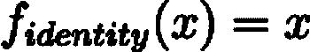

这个函数最近很少被使用，而且你是否想要使用它也是非常值得怀疑的。

恒等函数的图形简单如下。

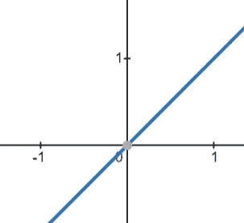

作者图片

***二进制步骤*** 函数如果数字为正数则返回 1，否则返回 0。这是一个很少使用的功能。因此，

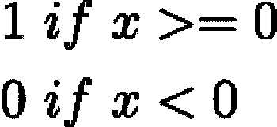

图表如下图所示，

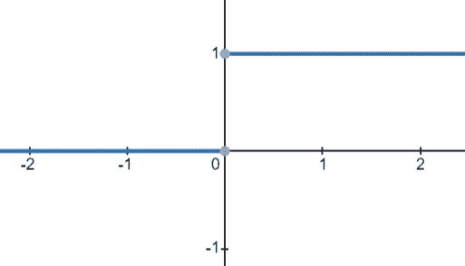

作者图片

# Sigmoid 函数

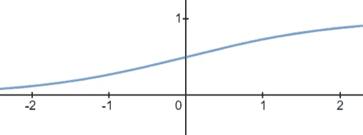

作者图片

这个函数以前是所有机器学习中使用最多的。该函数将一个数字映射到 1 和 0 之间，图形如下图所示。

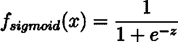

***sigmoid 函数现在仅限于逻辑回归和神经网络的二进制分类问题的输出节点(输出 0 或 1)，尽管早期它也用于隐藏单元。***

# Softmax 函数

softmax 函数将一和概率应用于向量的各个分量。数学上，

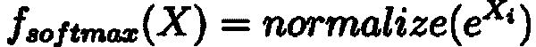

因此，它也被称为标准化指数运算。

单独地，应用下面的指数图。

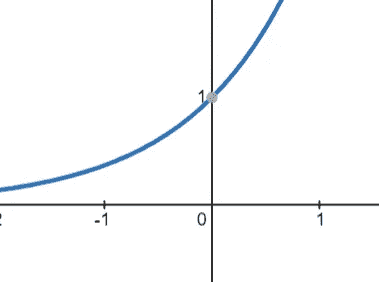

作者图片

***应用于多类分类问题的神经网络输出节点。***

# 双曲正切

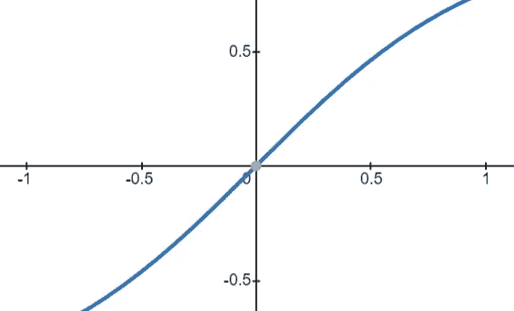

作者图片

双曲正切函数是 sigmoid 的后继者，因为它在神经网络的隐藏层中始终给出更好的性能。您可能会观察到，双曲正切图与 sigmoid 非常相似，只是它稳定在-1 和 1，并以 0 为中心。

数学上它是双曲正弦和余弦的比值，

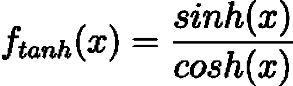

***如今，双曲正切函数也很少用于隐藏层，尽管一些特定的模型也使用双曲正切函数。range -1 和 1 的输出需求的一些问题在输出节点使用 tanh。***

# SoftPlus 功能

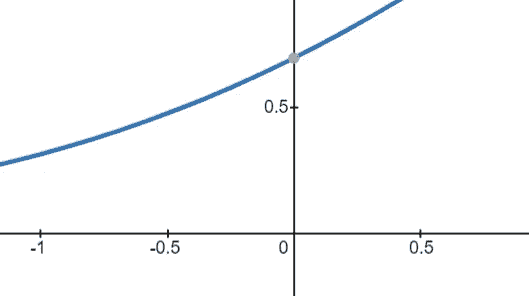

作者图片

SoftPlus 函数是 ReLU 的更软或更平滑的版本，您将在后面看到。
数学上，

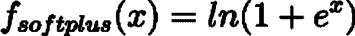

***当 ReLU 给出零梯度时，SoftPlus 允许平滑梯度。因此，在这种情况下，您可以使用 SoftPlus 而不是 ReLU。应当注意，SoftPlus 函数在计算上要昂贵得多。***

# 指数线性单位

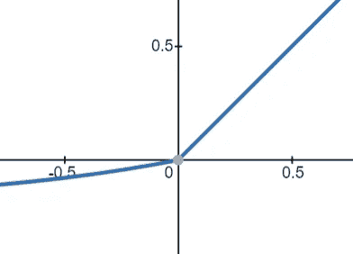

作者图片

ELU 或指数线性单位是一个新的和高精度的在隐藏层中被广泛使用的激活函数。它是一个*参数化*函数，即它有一个参数(技术上是一个超参数或可调参数)称为α，符号为α。如果是正数，ELU 返回数字本身，并给出 alpha 乘以*输入的幂减 1。*

数学上，

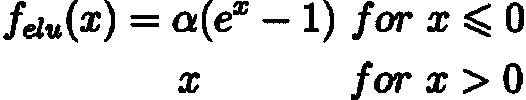

*其中α通常是一个介于 0.1 和 0.3 之间的数字*

***ELU 比 ReLU 有潜力获得更好的精度。然而，它的计算量更大。***

# 标度指数线性单位

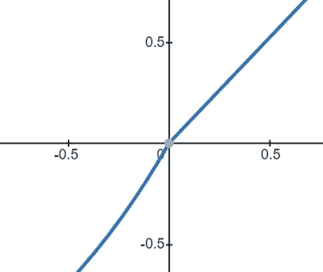

作者图片

SELU 或按比例缩放的指数线性单位是对 ELU 的修改，可更好地帮助提高精度和归一化。增加一个额外的超参数λ，符号为λ。SELU 被给定为，

*值为α = 1.67326，λ = 1.0507*

***SELU 比 ELU 工作得更好，但是由于另一个增加的乘法，它在计算上更加昂贵。***

# 整流线性单元

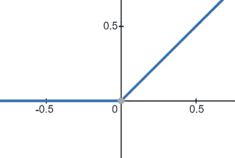

作者图片

现今最常用的激活函数之一是整流线性单元或 ReLU 函数。让它如此吸引人的是它的简单性和有效性。该函数通过使负值为零来消除负值。它保留实际输入的值。

数学上，

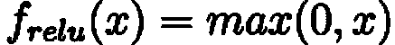

*尽管 ReLU 的性能不如 eLU、SELU 或其变体，但它的计算效率很高，因此是最常用的激活函数。*

# 泄漏 ReLU

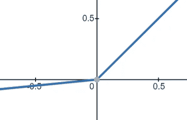

作者图片

ReLU 激活功能具有使负梯度归零的不期望的属性*，这导致了被称为死亡 ReLU* 的问题。为了解决这个问题，泄漏 ReLU 或 LReLU 通过将负值乘以值 0.01 来减小负值。

数学上，

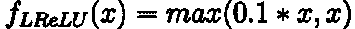

***虽然泄漏 ReLU 通常能找到更好的最优解，但它的计算开销更大，因此需要更多的时间。因此，它较少用于以速度为更重要标准且计算资源较少的任务。***

# 参数化 ReLU

PReLU 或参数化 ReLU 将泄漏 ReLU 中的系数 x 变成一个参数，而不是一个固定的数字，可以通过反向传播来学习。这个用符号 *α* 写成*α*。当配制时，

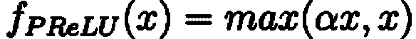

PReLU 通常会找到比 ReLU 或 Leaky ReLU 更好的最优解，但会花费更多的历元和时间。因为它有一个额外的参数α，所以计算量很大。

# s 形 ReLU

SReLU 或 S 形 ReLU 可以学习*凹凸函数。*具体来说，它由三个分段线性函数组成，由四个可学习的参数表示。

> SReLU 是一个复杂的函数，因此它可以学习复杂性。

SReLU 被表述为

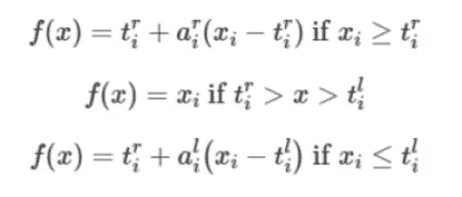

SReLU 是这个激活列表中计算开销最大的函数。这也是名单上最好的激活准确度之一。当计算资源高时，可以使用 SReLU。

# 正弦关系

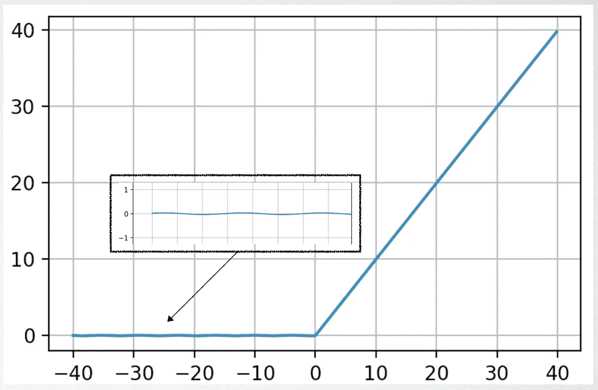

[中等文章](https://medium.com/@wilder.rodrigues/sinerelu-an-alternative-to-the-relu-activation-function-e46a6199997d)

Sine ReLU 可能是列表中最新的函数。这是怀尔德·罗德里格斯发明的。要了解这个功能，可以看[中文](https://medium.com/@wilder.rodrigues/sinerelu-an-alternative-to-the-relu-activation-function-e46a6199997d)。效果很好，值得一试。其公式为

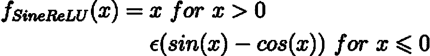

提到的ε可以携带 0.0025 的基值，尽管他对密集层使用 0.25。

在我看来，SineReLU 在某些数据集上可以得到比以前所有函数更好的结果。这是你可以尝试的另一个功能。此外，它在计算上比 Leaky-ReLU 和 ReLU 更昂贵，尽管它可以胜过它们。

# 结论

选择太多了！选择哪一个最终取决于您，并且它的有效性也会随着您的应用程序而变化，所以请测试它们！随着经验的积累，你可能会对使用什么功能有一些直觉

我真的希望这对你有所帮助。如果你有任何建议，请在评论中给出反馈。

*注:所有 LateX 方程式图片均由作者提供*