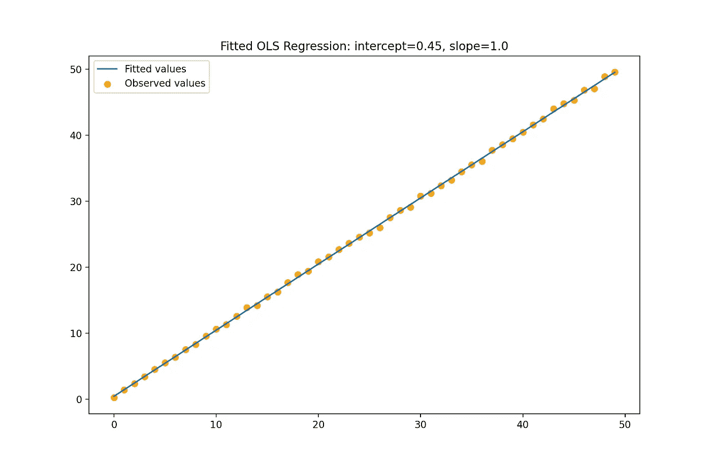

# 使用 Python 手动计算 OLS 回归的系数

> 原文：<https://towardsdatascience.com/manually-computing-coefficients-for-an-ols-regression-using-python-50d8e413de?source=collection_archive---------34----------------------->

## 这是一个关于如何在不使用任何统计软件包的情况下计算 OLS 回归系数的简单演练(带有代码示例)。

我写这篇教程有两个原因。前阵子，我在想*背后到底藏着什么。飞腾()*和*。像 [scikit-learn](https://scikit-learn.org/stable/user_guide.html) 、 [statsmodels](https://www.statsmodels.org/stable/user-guide.html) 和无数其他库这样的流行统计软件包的 predict()* 方法。在谷歌上花了相当多的时间后，我没有找到足够简单的教程，不得不自己钻研最近的统计学书籍。第二，虽然我使用 Medium 已经有一段时间了，但这是我第一次在这里写文章，我想看看它会是什么样子😀。

我将首先简要解释回归的逻辑——如果您熟悉基本概念，可以跳过这一部分。了解普通最小二乘(OLS)回归背后的理论和基本代数有助于解释结果以及理解模型的局限性。

## 什么是 OLS 回归？

回归是一种研究因变量和(一个或多个)自变量之间关系的方法。在一个简单的双轴图表上，单变量 OLS 回归将基本上试图通过我们观察到的数据点绘制一条“最佳拟合线”;多元回归更难想象。但是，不管预测变量的数量是多少，OLS 回归都试图找到方程的系数(通常由字母 *β* 表示):

> *让我们快速定义我们将使用的符号:*
> 
> Y —因变量
> X —自变量
> *β* — OLS 系数
> *ϵ —* 误差项
> k —观测值数量
> n —预测值数量

误差项 *ϵ* 代表我们(通常)无法完美拟合数据的事实，在我们的模型估计和数据的真实值之间会有“误差”。最小二乘回归的目标是最小化这些平方误差(因此得名):

这些系数是如何计算的？

OLS 回归的美妙之处在于，通过以矩阵形式重写上述方程并求一阶导数，可以在数值上获得最佳系数:

一阶条件给出:

正如我们所见，OLS 系数本身是 *X* 和*y*的线性组合

## Python 实现

现在，说到文章的重点。为了与常用的包保持一致，我们将编写两个方法:*。合体()*和*。预测()。我们的数据操作将使用 *numpy* 包进行。如果您从另一个文件导入数据，例如在*中。csv* 格式，你可以使用 *pandas* 库来这样做。*

让我们导入模块:

*如果您决定可视化预测，matplotlib 导入将会派上用场

接下来，我们将为我们的模型创建一个类，并创建一个将 OLS 回归拟合到给定的 *x* 和 *y* 变量的方法——这些变量必须作为 numpy 数组传入。根据先前执行的向量形式推导来获得系数( *np.linalg.inv()* 是用于矩阵求逆的 numpy 函数，并且@符号表示向量乘法):

我们的*。fit()* 方法将计算出的系数存储在*selfβas*属性中，以允许其他方法稍后访问它们。注意，我们增加了一个可选参数*截距*；如果我们决定用截距来拟合我们的模型，该方法将向独立变量的数组中添加一个向量 1。

我们现在创建*。*预测()(方法:

*注意额外的缩进，因为这个方法是模型类的一部分

我们(非常)简单的方法利用向量乘法来获得“预测”值— *y_hat* 。

作为一个额外的(可选的)接触，我们可以添加一个方法来可视化地输出预测(*注意*:在当前的形式中，它只对带有截距的单变量回归有效):

最后，让我们执行我们使用样本数据创建的方法(如果您不想生成图形，请删除第 7 行中对 *plot_predictions()* 的调用，代之以在我们的。*预测()*方法):

如果您遵循了所有的步骤，您应该已经成功地计算出了系数，并且生成了类似于下面的内容:

如果你想玩玩代码，完整版可以从 GitHub 库[这里](https://github.com/rshemet/OLS_coeffs_walkthrough)获得。

不用说，这是一个非常基本的练习，尽管如此，它有效地说明了 OLS 贝塔来自哪里，以及它们的(数学)意义是什么。弄清楚这一点对我的进一步研究有很大帮助。最后，我前面提到的统计软件包，除了计算的系数之外，通常还会计算各种其他指标——统计显著性、置信区间、R 平方等等。这些都可以用数字来计算，但是一旦你理解了基本概念，我建议你依赖(经过良好测试的)库。