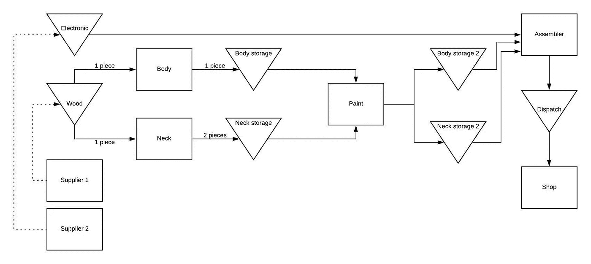
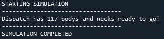
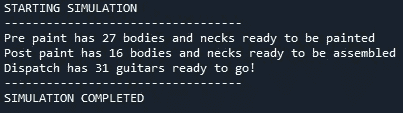
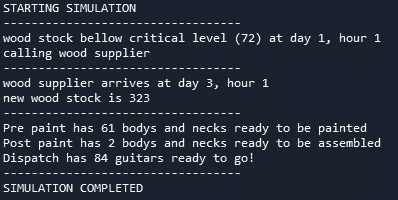
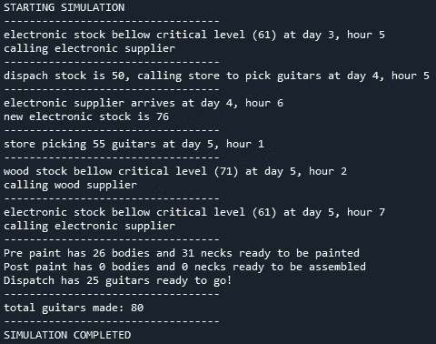

# 使用 SimPy 进行制造模拟

> 原文：<https://towardsdatascience.com/manufacturing-simulation-using-simpy-5b432ba05d98?source=collection_archive---------6----------------------->

## 离散事件模拟

## 使用 SimPy 和 Python 创建吉他工厂模拟

你好。在本教程中，我们将使用 SimPy 建立一个吉他工厂！尽管这只是一个玩具示例，我们还是会介绍一些非常酷的东西，您可以用它们来进行自己的模拟。我们将把代码扔在这里，但是如果你想看最终版本，它在我的 [GitHub](https://github.com/juanhorgan/guitar_factory) 上。

# 1.简单

首先， *SimPy* 是什么？在文档中，他们将其定义为:“SimPy 是基于标准 Python 的基于流程的离散事件仿真框架”。你可以在这里看到完整的文档[，这是我强烈推荐的。在那里你不仅可以找到你能做的事情，还可以找到很多简单但非常有用的教程。如果您没有安装 SimPy，一个简单的 pip 就可以完成:](https://simpy.readthedocs.io/en/latest/)

```
pip install simpy
```

# 2.吉他工厂

我们将从零开始建立一个吉他工厂，从非常简单的东西开始到一个更复杂的系统。在这个例子中，我们正在制作一种类型的吉他。*琴身*和*琴颈*是分开制造的，但是由相同类型的木材制成。然后它们被传递到绘画区。之后，将琴身、琴颈和电子元件组合在一起，就制成了吉他。

让我们来看看:



让我解释一下流程图:

1.  有两个主要容器。木材和电子。这些容器中有大量的木材/电子元件将在生产过程中使用。
2.  body make 从容器中取出一块木头，将其改造成一个身体，并将其存放在*身体仓库*中。同样的事情发生在脖子制造者身上，但是从一块木头上，他会得到两个脖子。颈部存放在*颈部存放处*。
3.  油漆工挑选琴颈和琴身，上漆，存放在*琴身存放处 2* 和*琴颈存放处 2* 。
4.  装配工挑选琴身、琴颈和一片电子元件，组装吉他，存放在*发货*集装箱中。
5.  大量吉他制作完成后，商店会派人来取货。
6.  当木材或电子产品的原材料低于某一水平时，就会给供应商*打电话。在 *T* 天后，供应商到达工厂，将原材料重新装满容器。*

# 3.密码

**第 1 部分:简单模型**

让我们从最简单的形式开始我们的模型:

我们开始简单地导入。之后，我们将创建类 Guitar_Factory 并添加前两个容器。请注意，我们将容器的容量设置为上面显示的变量。当然，派遣开始时是空的。如果我们用完了木材，这个过程不会停止，但也不会创造出更多的吉他。如果调度已满，也会发生同样的事情。注意 *env* 参数。这只是发生这一切的简单环境。我们将在后面的代码中对此进行定义。

现在我们将添加*身体制造商*和*颈部制造商*:

我们开始创造我们的第一个两个雇员。该函数有两个参数:SimPy 环境和 guitar_factory 类(注意，guitar_factory 不同于我们在前面的要点中定义的 Guitar_Factory 类)。那里发生的事情非常简单:

*   在模拟运行时，制作者将拿走*一块*木头(*yield guitar _ factory . wood . get(1)*)。
*   它将在的一段时间内保持那个木块(这就是 env.timeout 函数所做的)。这模拟了将一块木头转化为吉他琴身/琴颈所需的时间。
*   在那个时间单元(在我们的例子中是 1)过去之后，制造者将*把那个片段*放入一个名为 *dispatch* 的容器中。请注意，琴身制作者将从*一块*木头制作*一把*吉他琴身。取而代之的是，琴颈制造者将从一块木头*上制作出两个*琴颈。因此，您可以灵活地选择您想要的原材料数量，并交付您想要的其他产品，只需更改数量即可。

最后:

我们的模拟将运行 *40 小时*(每个工作日 8 小时* 5 个工作日)，这是在*中定义的，直到= total_time* 参数传递给 *env.run* 函数。 *body_maker_process* 和 *neck_maker_process* 将创建我们的“员工”。最后，我们添加了一个打印，这样我们就可以知道我们做了多少身体和脖子。注意，我们用*guitar _ factory . dispatch . level*得到那个结果。这相当于说“返回调度容器中的物品数量”:



如果你想要第 1 部分的完整代码，这里的[就是](https://github.com/juanhorgan/guitar_factory/blob/master/part%201/part_1.py)。

## 第 2 部分:添加一些东西

现在，我们将添加油漆和组装到我们的模型。为此，我们将增加:

*   预油漆和后油漆容器，以及油漆工。
*   电子集装箱和装配工。

这里没什么新鲜的。我们增加了*电子*、*预喷漆*和*后喷漆*容器，并设置它们的容量。

正如我们对身体和颈部制作者所做的那样，我们创建了*画师*和*装配工*。注意，喷漆需要 4 个小时，但它同时工作超过 10 件，而组装使用 2 个后期喷漆件(1 个琴身和 1 个琴颈)加上 1 个电子件，工作一个小时后交付一把吉他。

然后，我们添加一些打印，环境过程创建和运行模拟！再次，第 2 部分的完整代码是[这里](https://github.com/juanhorgan/guitar_factory/blob/master/part%202/part_2.py)。



## 第 3 部分:库存警报、供应商呼叫和正态分布

现在我们要添加一些非常酷的东西。系好安全带！

到目前为止，我们已经为员工的活动设定了固定的时间。比如我们说过*装配工*做一把吉他需要 1 个小时。按照这个参数，总是需要一个小时，一分钟也不能多，一分钟也不能少。我们都知道那不是真的。活动需要不同的时间，即使它们随着时间重复。这里我们假设时间的分布是正态的，但是你可以使用任何你想要的分布。还要注意，我们正在定义每种类型的员工数量。我们将通过导入随机库并定义进行更改所需的参数来开始这一部分:

让我们解释一下:

*   num_body 设置我们将要使用的主体制造商的数量(在本例中是 2)
*   这是人体制造者用一块木头制作一个人体所需要的平均时间。
*   std_body 是标准误差。

现在我们将对创建我们的*雇员*的函数进行更改:

很容易注意到，现在， *body_time* 不会总是为 1。事实上，它将是一个随机数字，取自正态分布，平均值为 1，标准误差为 0.1。还要注意 *assembling_time* :我们取随机 1 和 1 之间的最大值。换句话说，我们在说组装一把吉他不会少于一个小时。

我们必须改变员工的创建过程，创建一个新功能，允许我们为每种类型创建多个员工:

当然，对于 *neck_maker_gen* 、 *paint_maker_gen* 和 *assembler_maker_gen* 来说，这将是相同的代码。使用循环中的*，我们将创建 2 个 body makers(记住我们定义了变量 *num_body* = 2)。因此，我们将有 2 名制衣师、1 名制颈师、1 名油漆工和 4 名装配工。*

现在我们将创建*库存警报*和*供应商调用*。它是这样工作的:

*   我们的报警器将持续监控集装箱的库存量。
*   如果当前水平低于我们将定义的临界水平，它将呼叫供应商。
*   一段 *T* 时间后，供应商将抵达我们的工厂，用 *N* 数量的原材料重新装满我们的集装箱。

首先，我们需要定义我们的*临界水平*:

正如我们所见，*木材供应商*需要 2 个工作日才能到达。然后，我定义的临界水平取决于制造琴身或琴颈的平均时间、琴身制造商和琴颈制造商的数量、供应商到达的 2 个工作日，以及 1 个保证金日。我们不希望*库存过多。股票是放在那里的钱，这是不好的。但我们也不想缺货，因为如果缺货发生，我们将继续为无法工作的人支付工资。临界水平是两者之间权衡，你需要自己定义。每个企业都不一样。*

让我们添加警报:

我们对 *__init__* 函数做了一些修改，增加了 *wood_control* 和 *electronic_control* 进程。在我们查看*木材 _ 库存 _ 控制*之前，请注意*电子 _ 库存 _ 控制*功能不存在。该功能与 *wood_stock_control* 非常相似，因此您可以尝试自己创建它。如果你不能或者不想，完整的代码会在这部分的最后。

*   因此，第一个 *yield env.timeout(0)* 意味着一旦模拟开始，这个流程将开始执行。例如，我们可以将该值(0)更改为 8。这样，该过程将在 8 个时间单位后开始。
*   正如我们前面解释的，while True 意味着该流程将在模拟运行的所有时间内执行。
*   然后，它将检查库存水平是否等于或小于前面定义的临界水平。如果股票 es 高于该水平，它将关闭 1 个时间单位(见 *else* 语句)。
*   的库存水平等于或低于临界水平，将执行打印，通知在某一天和某一小时的水平是 N，并且已经进行了供应商呼叫。
*   2 天(16 小时)后，供应商到达，将重新装满 300 个木箱。这就是*yield self . wood . put(300)*的意思。
*   最后，打印新的库存水平，警报将关闭 1 天( *yield env.timeout(8)* )。

我们进行了 5 天的模拟:



第 3 部分的完整代码可以在[这里](https://github.com/juanhorgan/guitar_factory/blob/master/part%203/part_3.py)找到。

## 第四部分。调度呼叫和容器

老实说，到目前为止，我们一直在以某种方式作弊。在身体和脖子被制作出来后，它们被存放在同一个容器里，我们把它们当作一样东西。现在我们将为每一部分实现 separe 容器，这样我们就可以正确地处理它们:

我们已经知道如何制作容器。请注意这里的两件事:吉他制造变量和 T2 调度控制变量。当然，我们需要修改*制体*和*制颈*工序:

现在，我们将车身存放在 *body_pre_paint* 容器中。同样的事情也发生在*制颈器*上。画家也需要修改:

我们现在要建立一个控制过程，就像我们在电子或木材上所做的那样。这个过程将跟踪准备发货的吉他的库存水平，并打电话给商店，让他们现在可以来取货。出于跟踪的目的，我们创建了一个名为 *guitars_made* 的全局变量，这样我们就可以存储商店取走的吉他数量:

我们在这里做的第一件事是用语句 *global* 调用全局变量 guitars_made。如果发货库存水平等于或高于 50 把吉他，我们就给商店打电话。4 个小时后，他们来挑选吉他，他们*拿走所有可用的吉他*，而不仅仅是我们打电话时已经准备好的 50 把。因此，当他们拿走吉他时，我们用语句*guitars_made+= self . dispatch . level*对我们的 guitars _ made 变量求和。然后，控制过程持续 8 小时。汇编程序也需要修改，你可以自己尝试，或者从完整代码中获取。

最后，添加一些照片并运行模拟:



我们完了。当然，第 4 部分的完整代码在开头的链接中。非常感谢你阅读我的文章，希望你能喜欢，并能从中得到一些有用的东西。

下次见！