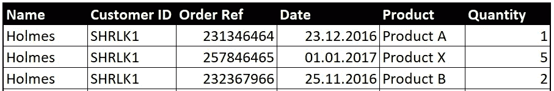

# 熊猫的多种旋转方式

> 原文：<https://towardsdatascience.com/many-ways-of-pivoting-with-pandas-a763d9653a0?source=collection_archive---------41----------------------->

## Pythoneers 爱好者的数据探索技巧


Tekton 在 [Unsplash](https://unsplash.com/photos/kzlxOJwD6i8) 拍摄的照片

Pandas 提供了无数的数据探索工具，这些工具使用起来很直观，值得一试。本文探索了这样一个工具，*旋转*。在许多情况下，数据是以线性表格/非透视/堆叠形式的原始状态获取的，如下所示:


使用透视更容易理解的表格数据示例

这是一种非常方便的数据处理形式，尤其是在处理 Tableau、Power BI、Qlik 等可视化工具时。大多数解释或支点，如“每个客户/日期/产品的订单”都内置于这些工具中。

这种桌子的旋转形式使得用工具可视化或用熊猫进一步处理变得乏味。但是，在某些情况下，可能需要以表格形式查看原始数据，而交叉表或透视是人眼最喜欢、最直观的显示形式。这也是从数据源提取数据的首选格式，因为它将数据压缩到更少的行中，并避免重复输入。下面是用 excel *(Gesamtergebnis 的意思是总计，原谅我的德语)*透视的上述数据的例子:


显示订购产品数量的透视

在这篇文章中，我将比较熊猫的各种旋转方式。Pandas 提供了以下函数来透视数据: *crosstab、pivot、pivot_table 和 groupby* 。对于本例，您只需要以下库:

```
import pandas as pd
```

## 交叉表透视

交叉表是熊猫最直观、最简单的旋转方式。它会自动计算相应行的列值的出现次数。您可以使用聚合函数(aggfunc)指定一个不同的聚合来填充这个透视。

现在，我想看看每位客户订购的每种产品的总数量(按其客户 ID):

```
orders_db = pd.read_excel(‘path/to/orders/orders_database.xlsx’)crosstab_pivot = pd.crosstab(orders_db.CustomerID,  
                 orders_db.Product,values=orders_db.Quantity,
                 aggfunc=’sum’,
                 margins=True,margins_name=’Total_Qtty’).fillna(0)
```

交叉表的工作方式很直观。因为我们希望在数据透视表结果中看到“数量”的总和，所以我们将该列作为“总和”传递给值和聚合函数。kwargs 'margin '和' margin_name '指定我们是否希望输出包含类似于 excel 的总计列。


这里是交叉表透视表的输出

在交叉表中，如果不指定 values 参数，它将返回列值出现的频率:

```
crosstab_pivot = pd.crosstab(orders_db.CustomerID,    
                 orders_db.Product,
                 margins=True,margins_name=’Total_Qtty’).fillna(0)
```


每个客户的产品出现频率

如果要将多列/多行分组到透视，只需将列作为列表传递，如下所示:

```
crosstab_pivot = pd.crosstab(                      
                 [orders_db.CustomerID,      
                 orders_db.Date,orders_db.Address], 
                 [orders_db.Product],
                 values = orders_db.Quantity,      
                 aggfunc=’sum’,margins=True,margins_name=’Total 
                 Qtty.’).fillna(0)pd.set_option('max_columns',100)print(crosstab_pivot)
```


多个分组列的交叉表结果

使用名为“normalize”的关键字参数，您可以选择将所有值表示为总数的百分比。包括 normalize = " index "/" columns "/" all "以将您的值规范化为总计。以下是跨列标准化的输出:


跨列标准化的输出量

## 带枢轴旋转

pandas 提供了一个非常基本的 pivot 函数，只有在索引-列组合是惟一的情况下才能使用。它不会对值列进行任何聚合，也不会像 crosstab 那样简单地返回一个计数。举个和上面一样的例子:


订单数据库摘录:PRSDNT +产品 A 的多个数量值

客户 ID *PRSDNT* 用不同的订单号两次订购了相同的*产品 A* 。因为 pivot 函数不执行聚合，所以它不知道在该列中为“值”填充什么。

```
pivot_db =  orders_db.pivot(index = ‘Customer ID’,
            columns = ‘Product’,values=’Quantity’)
```


这将适用于索引+列的唯一组合，如下例所示:



此条目对于 SHRLK1，产品组合具有唯一值

```
pivot_db = orders_db[orders_db.Name==’Holmes’].pivot(index = 
           ‘Customer ID’,columns = ‘Product’,values=’Quantity’)
```


解决办法

当我们有这样不明确的条目时，这是现实应用程序中的大多数情况，我们使用更灵活的 pivot_table 函数，它允许聚合。

## 使用数据透视表旋转 _table

数据透视表功能类似于交叉表

```
pd.pivot_table(orders_db, values=’Quantity’, 
               index=[‘Customer ID’,’Address’], 
               columns=’Product’,
               aggfunc=[‘sum’,len,’mean’],
               margins=True,fill_value=0)
```

您还可以传递多个聚合函数，为每个聚合函数返回一组列。这里已经传递了[sum，len，mean]，len 表示条目的计数。您还可以通过传递一个类似于索引列表的列表，将这种方法扩展到多个值。


使用 pandas crosstab 还是 pivot_table 是一个选择问题。请注意，您不需要将数据放在交叉表的数据框中。你也可以交叉表数组，序列等。

## 与分组一起旋转

Groupby 是一个非常方便的熊猫功能，你应该经常使用。让我们看看我们的*是如何通过*进行分组的。我们希望获得客户订购的每种产品的总数量:

方法 1:

```
orders_db.groupby(['Customer ID','Address','Product'])  
                 ['Quantity'].sum()
```


方法二:

```
groupedby_db = orders_db.groupby([‘CustomerID’,’Address’,’Product’]).agg({‘Quantity’:’sum’})
```

在这种方法中，您可以指定如何聚合每一列。(例如，如果您有另一个名为“weight”的列，您需要它的平均值，您可以将其指定为:

```
orders_db.groupby([‘CustomerID’,’Address’,’Product’]).agg({‘Quantity’:’sum’, ‘weight’:’mean’})
```

您也可以使用 groupby 的便捷过滤功能将过滤器应用到您的组中。假设您只想查看订购了至少 4 件或更多产品的客户及其地址:

```
big_orders = orders_db.groupby([‘CustomerID’,
             ’Product’]).filter(lambda x: 
             x[‘Quantity’].sum()>3)
```

该筛选器采用一个 lambda 函数参数，该参数指定特定列聚合应该满足的函数。


这是关于熊猫的基本旋转。回头见，更多熊猫黑客！