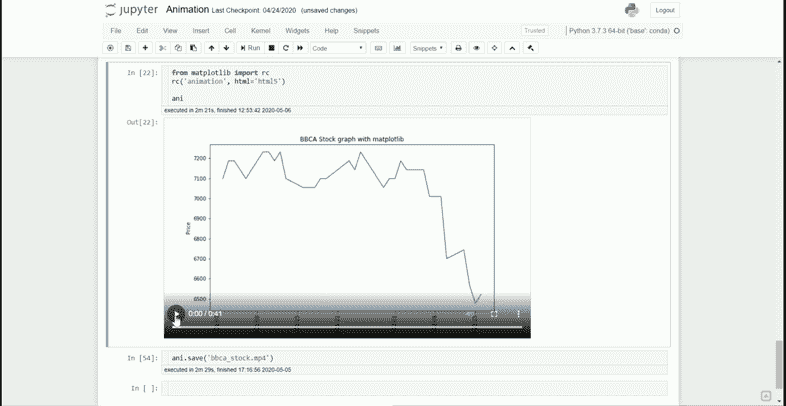

# 通过动画可视化数据的多种方式

> 原文：<https://towardsdatascience.com/many-ways-to-visualize-your-data-via-animation-f55173933fd3?source=collection_archive---------24----------------------->

## 通过动画增强您的数据科学演示


人们都说**一图胜千言**，意思是**一部动画胜过千言万语**。为什么？因为动画是一系列的画面，对吧？。作为人类，我们总是更关注视觉的存在，以解释我们的数据中正在发生的现象，但有时静态图片不能完全解释。这就是动画对发生的事情有意义的地方。

我们并不总是需要动画来帮助我们理解我们的数据，但是像时间序列数据这样的数据有时最好以动画的形式呈现。股票价格、每天的通话次数、一段时间内的注册百分比等等都是时间序列数据的一个例子。这些数据可以用动画来显示。


matplotlib 的股票价格动画示例

在本文中，我想介绍如何使用 Python 编程语言和各种库创建一个简单的动画来简化这个过程。这包括 **Matplotlib** 、**赛璐珞**和 **Plotly** 。

# **Matplotlib 动画**

[**Matplotlib**](http://matplotlib.org/) 是一个可视化的“祖父”库，基于 MATLAB 编程语言。许多可视化库的开发都是基于这个模块，我很确定几乎每个开始可视化研究的人都会从这个模块开始。

在 matplotlib 模块中，有一个 [**API**](https://matplotlib.org/api/animation_api.html) 专门用于通过提供必要的基类来创建动画。有两个类，分别是`FuncAnimation`和`ArtistAnimation`。在这里，我将介绍由`FuncAnimation`班制作的动画，因为它是最简单的一个。

我将通过上面的股票价格动画的例子来展示这个类是如何工作的。为了准备，我们需要以下小饰品:

*   要在您的系统上将动画保存为 mp4 或 gif，需要安装**[**FFmpeg**](https://www.ffmpeg.org/)或[**ImageMagick**](https://sourceforge.net/projects/imagemagick/files/)**。****
*   ****我通过使用[**Yahoo _ historical**](https://github.com/AndrewRPorter/yahoo-historical)**模块获取股票价格数据。使用 pip 或 conda 安装模块。******

******现在让我们尝试创建我们的动画。首先，我们需要获得我们的股票价格数据。******

```
****import pandas as pd
from yahoo_historical import Fetcher#Acquire our stock price data. Here I choose to take BBCA.JK stock price (BCA Indonesia Bank) from 1 January 2012 until now with 1 day interval. The data would be automatically imported as Pandas DataFrame objectBBCA = Fetcher('BBCA.JK', [2012,1,1], interval = '1d').getHistorical()BBCA.head()****
```

************

******BBCA。JK 股票价格数据******

******为了确保我们的数据不包含任何 NaN 值，我们可以做一个快速检查。******

```
****BBCA.isna().any()****
```

************

******没有 NaN 值，有了这个数据，我们可以对数据进行预处理。因为我们想要创建一个时间序列动画，我们需要首先将数据转换成 Datetime 对象。******

```
****BBCA['Date'] = pd.to_datetime(BBCA['Date'])****
```

******我想把 BBCA 的高价拍成动画。JK 加班所以现在让我们从使用 matplotlib 的`FuncAnimation`类创建的动画开始。******

```
****#importing libraries
import matplotlib.pyplot as plt
import matplotlib.animation as animation#Set the figure for the animation framework
fig = plt.figure(figsize = (10,6))#creating a subplot 
ax1 = fig.add_subplot(1,1,1)#Preparing empty list as we want to animate the graph one data at a time rather than all at once
date = []
adjclose = []#Using FuncAnimation we need to create an animation function which return and/or done a repetitive actiondef animate(i):
    #Append the empty list with the data located at the index i
    date.append(BBCA['Date'].loc[i])
    adjclose.append(BBCA['Adj Close'].loc[i]) #Clear the subplot each time the animate is called
    ax1.clear()

    ax1.plot(date, adjclose)
    ax1.tick_params(axis = 'x', labelrotation = 90)

    ax1.set_xlabel('Date')
    ax1.set_ylabel('Price')
    ax1.set_title('BBCA Stock graph with matplotlib') ani = animation.FuncAnimation(fig = fig, func = animate, frames = len(BBCA), interval = 20) 
plt.show()****
```

******在这里，我将更详细地解释 FuncAnimation 的参数。这里的重要参数是:******

*   ********图**参数作为动画的框架******
*   ******func** 为每一帧调用的动画函数的参数****
*   ******帧**参数是传入 **func** 参数和动画每一帧的数据源。如果提供了 int，它将等同于函数 range(int)。****
*   ******间隔**参数控制每帧之间的间隔，单位为毫秒****

****要将动画保存为 mp4 或 gif，只需运行以下代码。****

```
**#You could decide wheteher it is gif or mp4 by change the extension nameani.save('bbca_stock.gif', writer='imagemagick')**
```

****或者，如果您使用 Jupyter 笔记本，并希望直接在笔记本中查看动画，您可以运行以下代码。****

```
**from matplotlib import rc
rc('animation', html='html5')ani**
```

********

****这就是如何使用 matplotlib 模块创建简单的动画。在下一节中，我将介绍简化动画创建过程的其他模块。****

# ******赛璐珞******

****[**赛璐珞**](https://github.com/jwkvam/celluloid) 是一个简化 matplotlib 中创建动画过程的模块。我们只使用 matplotlib 中的图形，并从那里创建一个`Camera`类来将每个图形的快照作为一帧。动画是从帧系列创建的。****

********

****使用赛璐珞的股票价格动画示例****

****我们将尝试使用赛璐珞创建一个简单的股票价格动画，就像上面的例子一样。为了准备，我们需要先安装赛璐珞。****

```
**pip install celluloid**
```

****用赛璐珞制作动画依赖于人物的重复。想象一下，我们拍了一张连拍照片，然后从这张照片中，我们快速翻转它来创建一个动画。下面是它在代码块中的写法。****

```
**#Importing Camera class from Celluloid module
from celluloid import Camera#Set the BBCA date as index to simplify the plotting procrss 
test = BBCA.set_index('Date')#Create the figure for animation creation
fig = plt.figure(figsize = (10,6))#Create camera object by inputting the figure object
camera = Camera(fig)#Looping the plotting process and taking a snapshot for each frame. I set the loop to take 50 data each time to had a faster interval.for i in range(49,len(BBCA),50):
    test['Adj Close'][0:i].plot(color = 'blue')
    plt.xlabel('Date')
    plt.ylabel('Price')
    plt.title('BBCA Stock graph with Celluloid')
    #Snap the figure in each loop process
    camera.snap()

#Create the animation    
animation = camera.animate()animation.save('bbca_stock_celluloid.gif', writer='imagemagick')**
```

# ******阴谋地******

****[**Plotly**](https://plotly.com/) 是一个可视化模块，号称是 ML 和数据科学模型的领先前端。从静态图形、交互式可视化到分析仪表板；Plotly 提供了所有这些。动画也包含在 Plotly 模块中，只有几行代码。****

****首先，我们需要安装 plotly 模块。****

```
**pip install plotly**
```

****在 plotly 模块中有丰富的函数，但是在我们的例子中，现在我们将使用 plotly express 来创建一个快速绘图。我们还将使用 plotly 模块中可用的人口数据。****

```
**import plotly.express as px
df = px.data.gapminder()
df.head()**
```

********

****我们的数据会像这样。我们收集了一些国家，每一次都有 5 年时间间隔，各列显示了他们的国家状况。让我们尝试使用 plotly 从这些数据中创建一个快速动画。****

```
**#Creating animation using plotly express
fig = px.scatter(df, x="gdpPercap", y="lifeExp", animation_frame="year", animation_group="country",
           size="pop", color="continent", hover_name="country",
           log_x=True, size_max=55, range_x=[100,100000], range_y=[25,90])
fig.show()**
```

****上述代码中需要记住的一些参数是:****

*   ******animation_frame** 控制动画进度。我们首先按照从早到晚的顺序对这个值进行排序(如果您愿意，也可以反过来)。****
*   ******animation_group** 用于提供跨动画帧的对象恒定性:具有匹配“animation_group”的行将被视为在每个帧中描述相同的对象。****

****这是我的 Jupyter 笔记本上的动画的结果。****

********

****plotly 的一个缺点是我们不能将动画导出到我们的系统中(我们可以导出静态图片，但不能导出动画)。所以，我们只有在使用 Jupyter 笔记本或者将它集成到我们的 Plotly 仪表盘时才会使用动画流程。正如我们所看到的，代码产生了一个交互式的情节，我们可以在其中播放动画(如果我们愿意，我们也可以在我们的情节中悬停)。****

****几乎所有由 plotly express 创建的图都提供了创建动画的能力，因此它不仅限于散点图。如果你想知道所有的情节，请参考[文档](https://plotly.com/python/)。****

# ******结论******

****在这里，我向你展示了一个简单的方法，通过动画和几个模块来展示你的数据；这包括 **Matplotlib** 、**赛璐珞**和 **Plotly** 。只需几行代码和逻辑，我们就可以用一个漂亮的动画来增强我们的演示。****

# ****如果您喜欢我的内容，并希望获得更多关于数据或数据科学家日常生活的深入知识，请考虑在此订阅我的[简讯。](https://cornellius.substack.com/welcome)****

> ****如果您没有订阅为中等会员，请考虑通过[我的推荐](https://cornelliusyudhawijaya.medium.com/membership)订阅。****