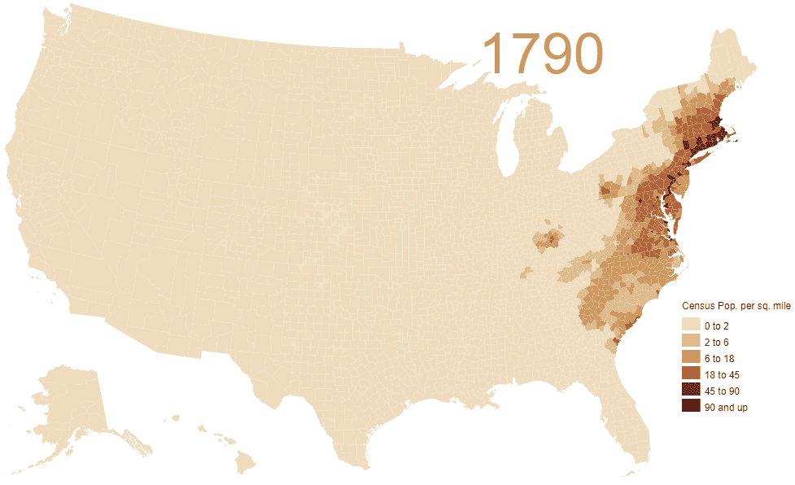
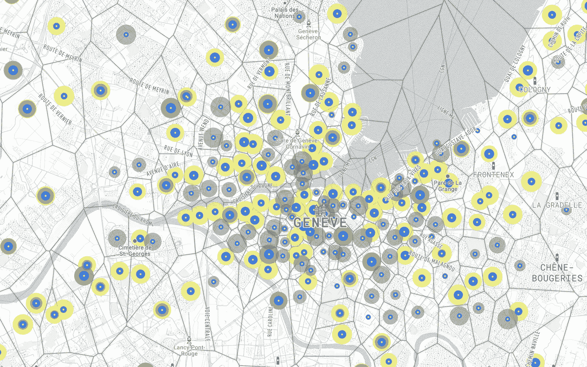
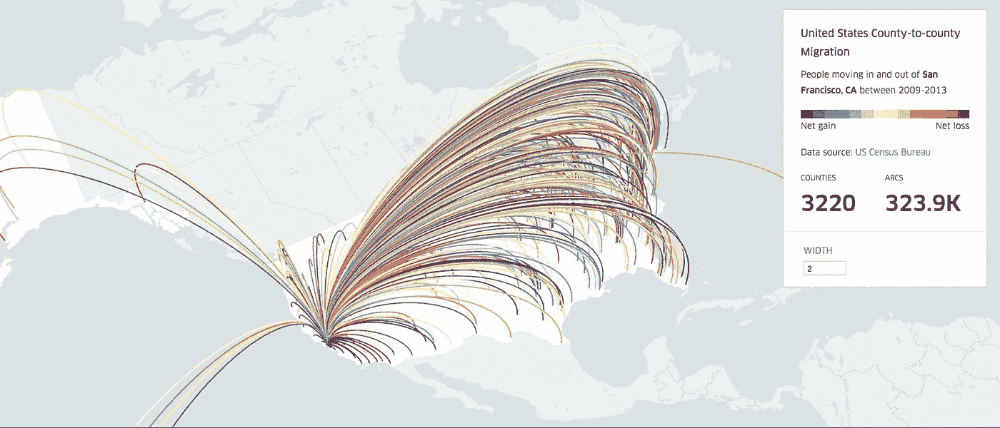
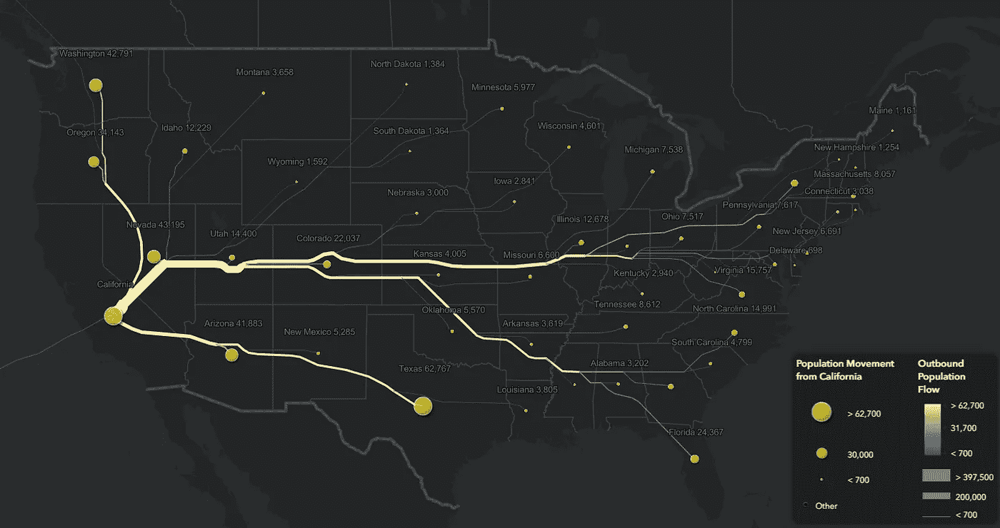
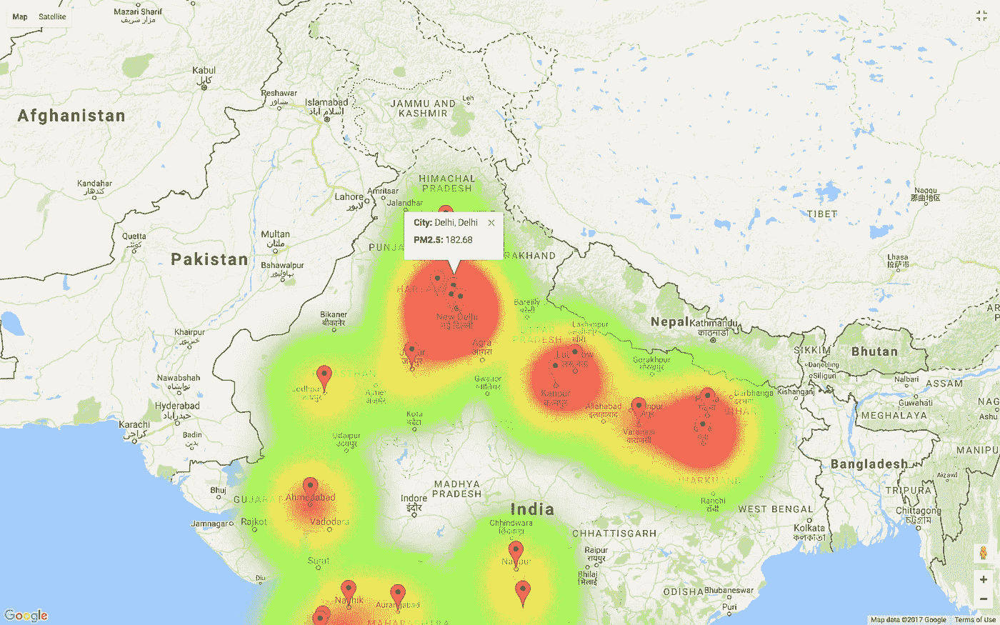
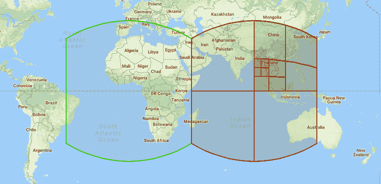

# 地图图层:类型和用例

> 原文：<https://towardsdatascience.com/map-layer-types-and-use-cases-d22a2a788b0e?source=collection_archive---------30----------------------->

## 深入探究地图图层的类型及其追踪地面资源和活动的用例

[来源](https://www.visualcapitalist.com/visualizing-200-years-of-u-s-population-density/)

# 外卖食品

在本文中，我们将深入探讨不同类型的地图图层，以及您应该根据使用情况选择哪一种图层。因此，如果你不清楚什么时候应该使用热点图，什么时候应该使用基于网格的图层，请继续阅读！

# 介绍

图层是用于在地图上显示地理数据集的机制。它们包含多组点、线或面(面)要素，并定义地理数据集在地图上的符号化方式。

通俗地说，图层是指地图上某个东西的可视化。例如，点图层可用于查找旧金山所有优步行程的起点，或者弧图层可用于显示英国航空公司一天内的所有行程。

地图图层是对地图进行分析的基本单位。它不仅使数据表达更加清晰和直观，而且使地理数据的叠加成为可能。可视化和查看每个区域的数据分布，可以更容易地挖掘更深入和具体的信息，并做出更好的决策。

# 为什么我们需要地图图层？

## 1.向您的地图添加上下文

图层使地图更具上下文相关性，并帮助您关注特定方面，如资产、道路和兴趣点。地图图层使您更容易处理地图中的一组特定对象。例如，使用地图图层，您可以针对您的案例仅定位和评估一个区域中的少数几个点或建筑物。

## 2.帮助您更快地发现变化

地图是对地面上正在发生的事情的再现。通过地图图层，您可以看到各种测量和指标如何随着时间的推移而变化。例如，保险公司的商业地产团队可以使用它来跟踪正在修改其地产的家庭/地产所有者，或者在不同的情况下，地理科学家使用它来研究土地覆盖的变化。

# 地图图层的类型

我们已经根据地图层呈现的特征的数量对其进行了分类:

# 要点

点图层根据给定事件或对象的位置坐标(经度和纬度)为其绘制点。点图层专门用于显示地理信息分布广泛的数据&帮助您在地图上精确、快速地定位点事件。

[来源](https://blog.mapbox.com/minimo-data-visualization-map-f4ef21687d29)

点图层的一些属性如下:

*   **颜色**:点图层的颜色可以描述数值
*   **填充**:填充通常表示活动的强度
*   **半径**:半径表示一个事件或物体在地图中覆盖的区域
*   **图标:**图标用形状区分点。

**何时使用:** 点地图对于有时间戳的事件很有用，比如某个特定地区的网站流量。点是地图上精确定位位置或感兴趣点的好选择。例如，分析纽约所有优步游乐设施的起点。点地图可用于检测和跟踪道路事故等事件。

# 弧

弧层在两点之间绘制一条弧。弧线对于可视化两点之间的距离以及比较地图上两个位置之间的距离非常有用。弧线不显示两点之间的路径，而只显示两点之间的距离。

Arcs 地图通常用于可视化始发地-目的地流量数据。弧线通常表示起点和终点之间流动相互作用的方向和强度。

[来源](https://eng.uber.com/visualizing-data-sets-deck-gl-framework/)

arc 图层的属性如下:

*   **颜色**:弧线层的颜色可以描绘一个特定的事件(起点，终点)
*   **不透明度/笔画宽度**:这两个可以用来显示流动相互作用的强度。

**何时使用:**
由于弧线层涉及到两点，并画出一条描绘两点间直线距离的弧线，所以在我们需要演示一个物体从 A 点到 b 点的往返运动的情况下，这是很有用的。

例如，arc 图层可用于描绘从特定公交车站到城市中不同地点的所有公交线路。此外，食品配送公司可以使用它们来跟踪特定餐馆的配送数量。此类地图图层可用于分析的其他一些示例包括人口迁移和航空路线。

# 线

线基本上是弧层的 2D 版本。两者都用线来表示地图上两点之间的距离，但如果是线，线会平放在地图上。地图的属性包括:

*   **颜色:**彩色内嵌地图代表观察或分析下的特定事件或物体。
*   **划水:**这是指水流的强度。

[来源](https://www.esri.com/arcgis-blog/products/arcgis-online/mapping/visualizing-population-migration-by-where-people-filed-their-taxes/)

**何时使用:** 线路适用于涉及路线分配的情况，因此对于将货物从 A 点运输到 b 点的企业也很有用。物流或供应链公司就是一个很好的例子。此外，线图可以显示特定道路的交通强度，因此也可用于移动性分析。

# 热图

热图是表示地理范围内每个点的权重的一种方式。它可用于显示地理区域内任何现象的分布或密度变化。

[来源](https://medium.com/@bhanuagarwal/gasp-the-hunt-for-the-dirtiest-air-in-india-7a82ac93680d)

热图的一个缺点是，它们只是在地图上给你一个直观的数据表示，因此没有量化区域。因此，很难确定哪些领域不存在这种现象。通俗地说，热图为您提供了地图中场景的抽象可视化。颜色表示特定点上事件强度的百分比。

**何时使用:** 如前所述，热图可用于可视化一种现象(疫情/干旱)的发生强度，在这种情况下，已建立的边界和边界并不太重要。

例如，假设我们代表某个特定地方的空气污染水平。较深的颜色代表有害颗粒的浓度较高，因此表明那里的空气污染更严重。它还可以用来显示特定区域的植被分布或地形的陡度。

在此阅读更多关于热图以及我们为什么不喜欢使用热图进行地理空间分析的信息。

 [## 让基于位置的实验成为我们 DNA 的一部分

### “我们在亚马逊的成功取决于我们每年、每月、每周、每天进行多少次实验。”——杰夫…

blog.locale.ai](https://blog.locale.ai/making-location-based-experimentation-a-part-of-our-dna/) 

# 多边形

多边形图层用于表示湖泊、城市甚至森林的边界。多边形地图为地图带来了精细的粒度，因此对于区域或城市分析非常有帮助。通常，多边形地图对于查看特定的邻域或区域非常有用。在多边形贴图中，每个区域都根据预先安排的键进行着色，每个着色或键代表一个值范围。

[来源](https://ourcodeworld.com/articles/read/830/how-to-highlight-an-area-city-state-or-country-in-google-maps-with-javascript)

**何时使用** :
多边形地图最适合用来显示某些特征在不同区域的分布情况。用于映射特定地区的纳税人数量或显示特定城市的销售额。它还可以用来描述特定地区的就业/失业水平。

# 六宾

六边形将点(或经度)聚合成六边形。因此，颜色或高度显示了事件的数量或特定六邻体蛋白的强度。在现场，我们是六边形的忠实粉丝。等等，为什么是六边形？这篇博客解释了原因:

 [## 空间建模花絮:Hexbins vs Geohashes？

### 如果你是一个像优步一样的两度市场，你会迎合数百万通过你的司机请求搭车的用户…

blog.locale.ai](https://blog.locale.ai/spatial-modelling-tidbits-honeycomb-or-fishnets/) 

一种六边形图层实际上是 H3，它使用六边形层次空间索引来可视化空间数据。由优步开源，H3 使用六边形，因为六边形减少了量化误差，当物体穿过一个地理区域时出现。点击阅读更多关于优步如何使用 H3 图层分析乘车和定价的信息[。](https://eng.uber.com/h3/)

六边形贴图的属性是:

*   **颜色:**在这种情况下，颜色就像显示数值的点颜色。
*   **高度:**这也显示了数值(也就是说，高度越大，数值越大)。然而，它们甚至可以用来显示另一个指标。

**何时使用** :
六边形也可用于显示 2D 空间的分布。例如，具有特定关键字或标签的用户的推文可以沿着 X 轴代表纬度和 Y 轴代表经度的两个轴被映射到特定区域。

当必须以精细的粒度进行分析时，也使用六边形。例如，特定区域的投票率或测量特定区域的人口密度。优步还根据邻近地区司机和乘客的供需情况，使用 H3 来决定特定区域的高峰定价。

# 地理哈希

Geohash 基本上是一种分层数据结构，它将 2D 空间点(纬度和经度)转换为数字和字母的短字符串。他们把地球分成 4 行 8 列 32 个单元的网格。geohash 的美妙之处在于它的构造方式。简而言之，geohash 是一种格网空间索引，通过每增加一位，世界被递归地划分为越来越小的格网

S2 图层实际上是一种表示三维球体上地理空间数据的 geohash。由谷歌开发的 S2 图层使得使用单一坐标系统建立一个没有水流或奇点的低失真的全球地理数据库成为可能。

S2 图层对于空间索引和作为像元集合的近似区域非常有用。它在显示建筑物结构或人口密度的地方非常有用。有趣的是，S2 基本上是一种动态形式的点地图，其中事件的值/强度随时间而变化。S2 层利用了一个非常聪明的构造，称为[希尔伯特曲线](https://s2geometry.io/devguide/s2cell_hierarchy.html)，它基本上是一条占据空间的曲线，覆盖了该空间内的所有区域。使 S2 与众不同的一个原因是，它能够将任意区域近似为离散的 S2 单元的集合。正是这个特性使得构建大型分布式空间索引变得非常容易。

[来源](https://s2geometry.io/devguide/s2cell_hierarchy.html)

**何时使用:** S2 地图图层的一个很好的用例是追踪一段时间内商品房的增加或追踪房地产建设项目。它还可以用于查找在禁止区域建造的或高度超过允许限制的非法建筑

# **流程图**

流图基本上是随时间变化的弧图/层。它们用于可视化起点/终点流量数据。起点和终点可以是点或曲面。线/弧的宽度或颜色表示起点和终点之间的流向值。每个空间点要么是起点，要么是终点。

**何时使用:** 流图是绘制和可视化交通流量、人口迁移以及物流公司车队管理的好选择。

[来源](https://geoawesomeness.com/flow-mapping-finally-available-arcgis-online/lineanimation/)

## 类似阅读:

 [## 分析供需缺口如何优化你的单位经济学！

### 今天，每个人都使用谷歌地图导航到任何地方。同样，为什么不是每个公司都应该有自己的地图…

blog.locale.ai](https://blog.locale.ai/how-analyzing-supply-demand-gaps-can-optimize-your-unit-economics/)  [## 使用地理空间数据了解微观移动模式

### 我的用户如何在这个城市移动？他们去哪里了？这个城市的“流”是什么样子的？这是如何改变的…

blog.locale.ai](https://blog.locale.ai/understanding-micro-mobility-patterns-using-geospatial-data/) 

*在现场，我们正在构建一个“***”运营分析平台，使用位置数据为按需公司的供应和运营团队服务。如果你想进一步钻研，可以查看我们的* [*网站*](http://locale.ai/) *out 或者在*[*LinkedIn*](https://www.linkedin.com/in/aditi-sinha-6b774ba9/)*或者*[*Twitter*](https://twitter.com/aditi1002)*上与 Aditi 取得联系。**