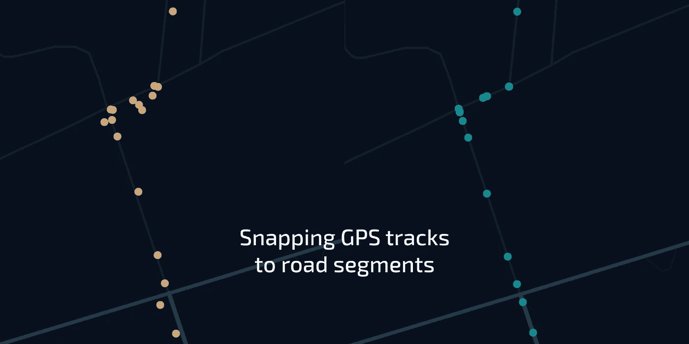
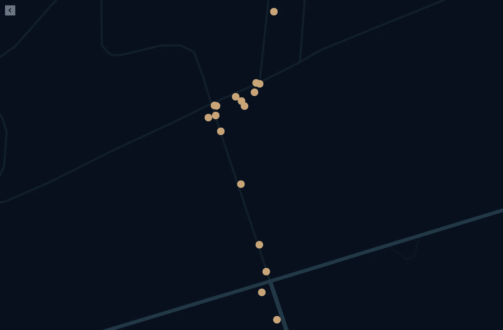
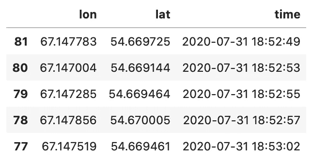
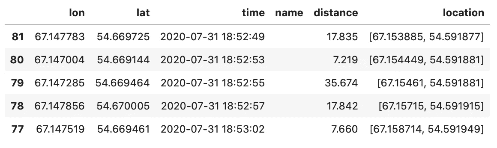
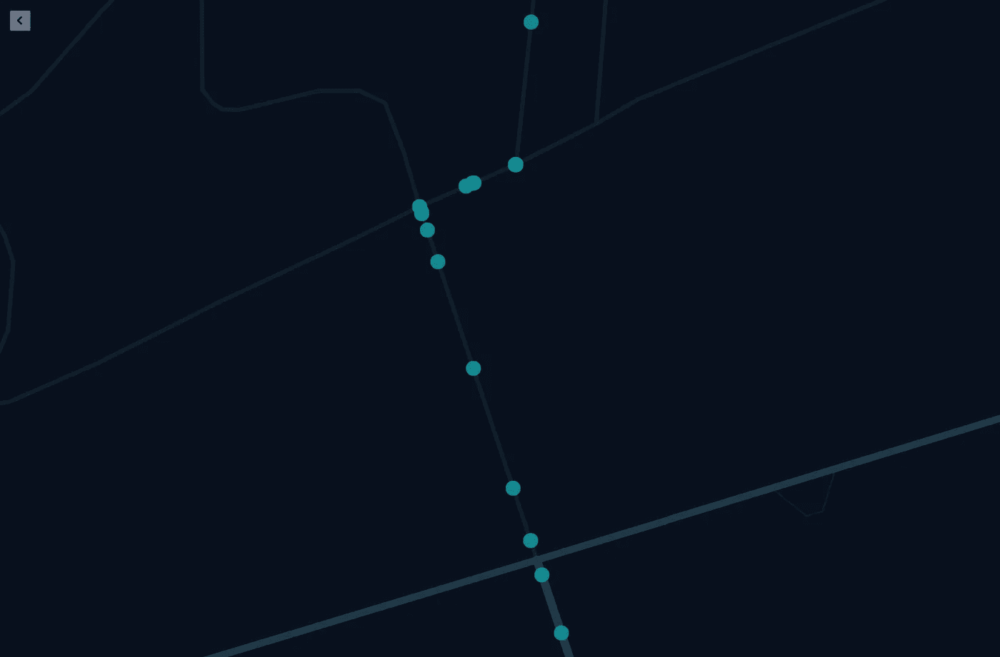
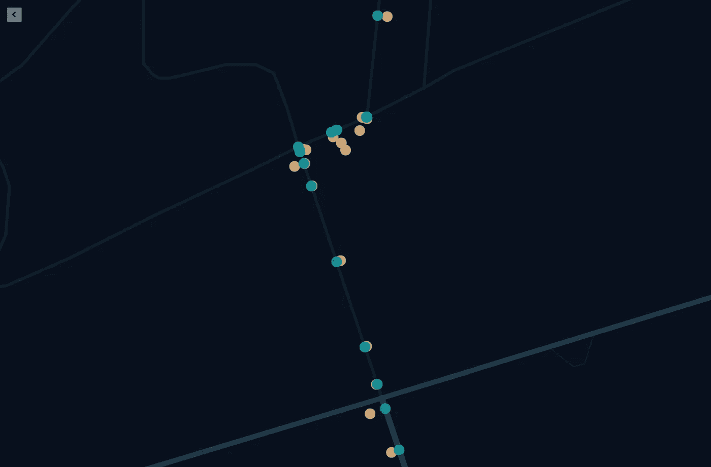

# 使用 Valhalla 的 Meili 进行地图匹配

> 原文：<https://towardsdatascience.com/map-matching-done-right-using-valhallas-meili-f635ebd17053?source=collection_archive---------7----------------------->

## 处理 GPS 误差的生产就绪解决方案

作者图片

GPS 不够精确的问题并不新鲜,“捕捉到道路”功能主要是将 GPS 轨迹与道路进行匹配。大多数有这个问题的项目都是通过[谷歌地图道路应用编程接口](https://developers.google.com/maps/documentation/roads/snap)或者 [OSRM 匹配服务应用编程接口](http://project-osrm.org/docs/v5.22.0/api/?language=cURL#match-service)来解决这个问题。但我要向你展示我走过的路，我没有后悔任何事。

# 问题

我的主要问题是计算汽车每天和每月行驶的距离。同样重要的是，我试图构建一个可以每天都这样做的生产解决方案，而不仅仅是研究部分。

因为我在 GeoJSON 中已经有了多个预处理的 GPS 轨迹，所以我创建了一个 Python 脚本，它使用`geopy.distance.geodesic`函数计算距离，并在整个行程的地理点上循环。据我粗略估计，这种方法有时会有超过 30%的错误率，这实际上是非常可怕的。我来解释一下原因。

如下图所示，有时 GPS 追踪并不精确。显然，司机使用的是这里的道路，但我们从 GPS 上获得的地理点位于道路附近，而不是道路上。

作者图片

# 解决办法

首先，我想自己解决这个问题。我认为这可以通过一些数学计算来完成，但谢天谢地，我很快就明白了这个问题更多的是在进行数学计算之前从哪里获得道路的坐标，并发现 OSRM /谷歌地图 API 可以为我完成整个过程。

谷歌地图 API 并没有让我感到惊讶，因为它只能在他们的 Snap to Roads 方法中获得最多 100 个地理点，这对于汽车的 GPS 跟踪来说是非常低的。另一方面，OSRM API 看起来不错，直到我偶然发现瓦尔哈拉。

# 瓦尔哈拉殿堂

正如他们的 [GitHub 知识库](https://github.com/valhalla/valhalla)中完美指出的，Valhalla 是一个开源路由引擎和附带的库，用于 OpenStreetMap 数据。Valhalla 还包括时间+距离矩阵计算、等时线、高程采样、地图匹配和旅游优化(旅行推销员)等工具。

以下是我能想到的使用瓦尔哈拉的好处:

1.  并行化。您可以在不同的服务器上使用不同的地图安装。例如，您有法国和德国的用户，您可以在服务器 1 中设置法国地图，在服务器 2 中设置德国地图，并根据您的业务逻辑向它们中的任何一个发送代理请求。此外，你可以建立一个大的星球地图或几个大陆地图，无论哪个最适合你——瓦尔哈拉已经准备好了。
2.  定制。您可以管理自己的配置，使用许多可选参数请求信息，这些参数实际上可以引导您找到更好的解决方案。
3.  性能。Valhalla 是用 C++写的。说真的。还需要我多解释吗？它快得惊人。
4.  本地化。我主要对路线步骤的英语、俄语和印地语本地化感兴趣，并惊讶地在瓦尔哈拉看到所有这些。
5.  易于安装。Valhalla 可以安装在各种平台上:Ubuntu、Debian、苹果 macOS 和微软 Windows。
6.  开放性。贡献是允许的，也是受欢迎的。麻省理工许可下的开源。

# 魅力

梅里是瓦尔哈拉内部的主要模块之一。它的功能是执行地图匹配(捕捉道路功能)，这正是我需要解决我的问题。

为了简要说明其工作原理，Meili 首先在给定位置的给定半径内找到最近的候选路段，然后在隐马尔可夫模型(HMM)的上下文中使用维特比算法检测最高概率地图匹配(维特比路径)。

我不打算用这些算法的细节以及如何在您的机器上设置 Valhalla 和运行服务器的信息来填充这篇文章。在 [GitHub](https://github.com/valhalla/valhalla) 上有很完美的解释，建议你为此去一趟。

而是让我们实际一点，用 Python，熊猫和 Valhalla 的 Meili 来修复我们的 GPS 痕迹。

# 数据

为了简化这个例子，我将使用包含这些列的 Pandas 数据帧(df_trip ):

1.  经度
2.  纬度
3.  时间(日期时间)

我的示例由 82 行组成，代表实际 GPS 轨迹的地理点:

作者图片

# 向 Meili 发送请求

让我们准备一个请求的正文:

现在让我们添加头并对本地服务器执行一个实际的请求:

这里有一个服务器日志，上面有瓦尔哈拉的正确回应:

如果瓦尔哈拉没有回复 200，主要是因为:

1.  GPS 追踪实际上并不在公路附近。
2.  GPS 跟踪是在我们没有为其构建磁贴的国家进行的(回到 Valhalla 的 [GitHub](https://github.com/valhalla/valhalla#running) ，用正确国家的 pbf 文件重新做 README 的“运行”部分)。
3.  GPS 轨迹有缺陷(例如，多条轨迹合并为一条，时间和坐标相差很大)。

# 处理响应

我用这个代码来处理来自 Meili 的响应。它并不漂亮，但很有效:

下面是这段代码的结果:

作者图片

结果增加了 3 个新列:

1.  *name* —它包含我们的司机当时使用的街道名称。很酷，如果你问我。
2.  *距离*——Valhalla 也计算了地球点之间的距离，这完美地解决了我在本文中为自己设定的首要目标。
3.  *位置*——这一列包含了我们从梅里(抓拍到马路上)得到的坐标。

要保存无法捕捉到任何道路的地理点(例如，停车场上的一些运动)，您可以使用此代码来解析我们之前从 Meili 获得的“位置”列:

# 结果

因此，我们有一个非常整洁的 GPS 跟踪，捕捉到实际的道路，如下所示:

作者图片

让我们结合两种 GPS 轨迹(优化的和非优化的)来看看区别:

作者图片

# 最后的话

我选择 Valhalla 而不是 OSRM API 的主要原因是，Valhalla 是一个生产就绪的解决方案，还有许多其他好处。

出于快速研究的目的，您可以使用 OSRM API 而不是 Valhalla，因为您可以在没有预先设置环境的情况下完成这项工作。

我想对所有 Valhalla 的贡献者说一声非常感谢。尤其是《魅力》的创作者，https://github.com/ptpt([)和凯文·克莱泽(](https://github.com/ptpt)[https://github.com/kevinkreiser](https://github.com/kevinkreiser))。你们太棒了。

希望这篇文章对你有所帮助。欢迎在 LinkedIn[上联系我或者在下面留言。](https://www.linkedin.com/in/szotov/)

你也可以探索[完整的 Jupyter 笔记本](https://github.com/zotttttttt/gps-trace-optimization/blob/main/GPS-trace-optimization-via-Valhalla.ipynb)，通过一些小的添加来解决这个问题。