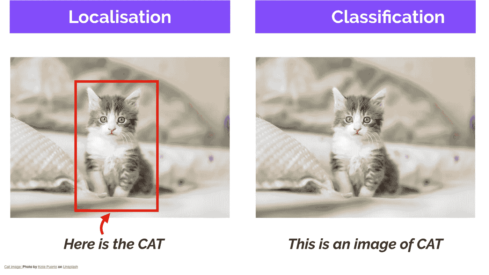
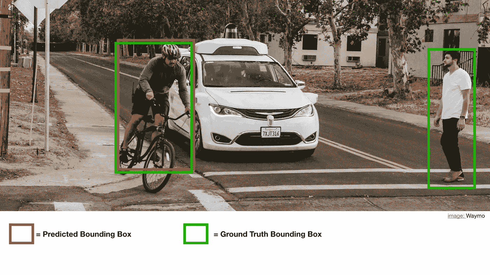
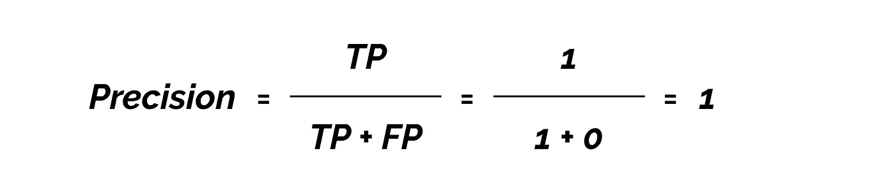
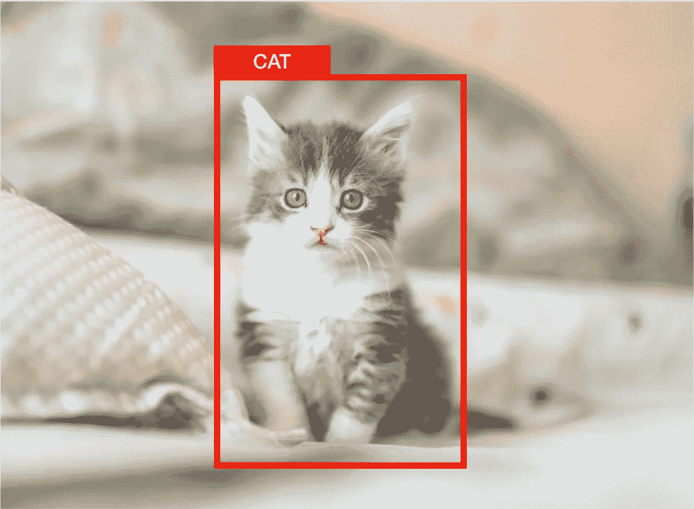
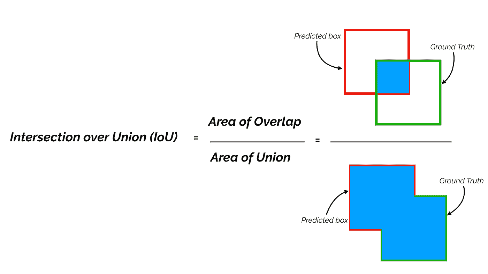
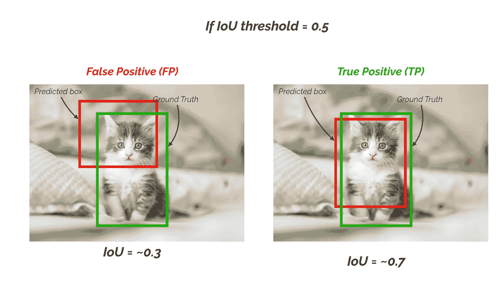
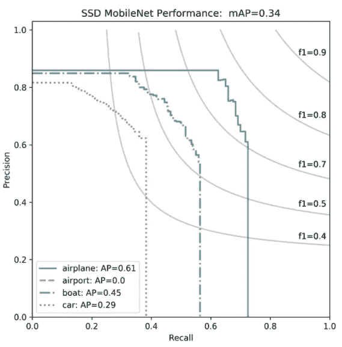
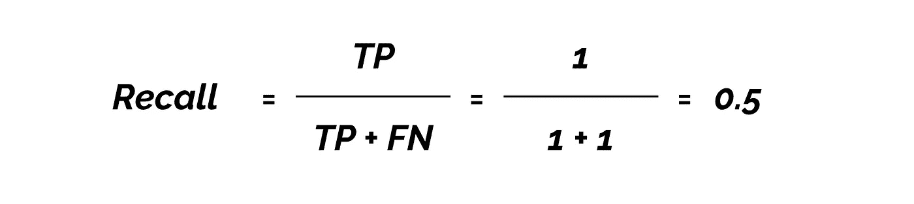
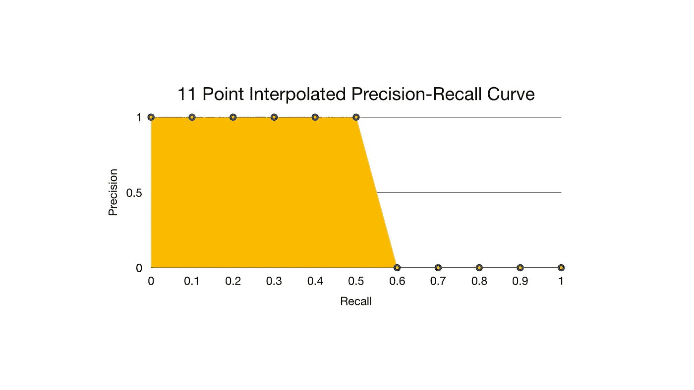

# mAP(平均精度)可能会让你困惑！

> 原文：<https://towardsdatascience.com/map-mean-average-precision-might-confuse-you-5956f1bfa9e2?source=collection_archive---------0----------------------->

## 剧透警告:地图不是精度的平均值。

问号(Jules Bss 在 [Unsplash](https://unsplash.com/?utm_source=unsplash&utm_medium=referral&utm_content=creditCopyText) 上拍摄的照片)

如果把 mAP(平均精度)理解为精度的平均值，这是可以理解的。然而，你不能远离事实！

让我解释一下。

在计算机视觉中，mAP 是用于对象检测(即，定位和分类)的流行评估度量。本地化决定了一个实例的位置(如边界框坐标)，分类告诉你它是什么(如狗或猫)。

图像分类和定位

许多对象检测算法，如更快的 R-CNN、MobileNet SSD 和 YOLO，使用 mAP 来评估他们的模型，以发布他们的研究。

你可能会问，如果这是一个如此受欢迎的指标，为什么它仍然令人困惑？

很公平！

mAP 代表平均精度(看标题你可能已经猜到了)。

> 你可能认为这是精度的平均值。

如果您还不知道:

**精确度**衡量你的预测有多准确。即你的预测正确的百分比。

它衡量你的模型做出的预测有多少是正确的。

*TP =真阳性(预测为阳性且正确)*

*FP =假阳性(预测为阳性，但不正确)*

如果是这种情况，让我们为下图计算贴图:

高级驾驶员辅助系统(ADAS)的物体检测示例

从图像中，我们得到:

*真阳性(TP) = 1*

*假阳性(FP)* = 0

因为我们只有一个值，所以平均精度是 1。

查看地图得分，您可能最终会在应用程序中使用该模型。那将是一场灾难。

这就是问题所在！不要让这个术语误导你。

> mAP 不是通过取精度值的平均值来计算的。

对象检测系统根据边界框和类别标签进行预测。

物体检测示例检测到一只猫(原始猫照片由 [Kote Puerto](https://unsplash.com/@kotecinho?utm_source=unsplash&utm_medium=referral&utm_content=creditCopyText) 在 [Unsplash](https://unsplash.com/?utm_source=unsplash&utm_medium=referral&utm_content=creditCopyText) 上拍摄)

对于每个边界框，我们测量预测边界框和地面真实边界框之间的重叠。这通过 IoU(并集上的交集)来衡量。

对于对象检测任务，我们使用给定 IoU 阈值的 IoU 值来计算精度和召回率。

例如，如果 IoU 阈值为 0.5，预测的 IoU 值为 0.7，则我们将该预测归类为真正(TF)。另一方面，如果 IoU 为 0.3，我们将其归类为假阳性(FP)。

这也意味着，对于一个预测，通过改变 IoU 阈值，我们可能会得到不同的二进制真或假阳性。

另一个需要理解的重要术语是回忆。

**回忆**衡量你发现所有积极因素的程度。例如，我们可以在我们的前 K 个预测中找到 80%的可能正例。

*TP =真阳性(预测为阳性且正确)*

*FN =假阴性(未能预测到那里的物体)*

> 平均精度(AP)的一般定义是找到上述精度-召回曲线下的面积。
> 
> mAP (mean average precision)是 AP 的平均值。

在某些情况下，会为每个类别计算 AP 并进行平均以获得地图。但在其他情况下，它们的意思是一样的。比如对于 COCO 挑战评测，AP 和 mAP 没有区别。

> AP 是所有类别的平均值。传统上，这被称为“平均平均精度”(mAP)。我们不区分 AP 和 mAP(AR 和 mAR 也是一样),并假设这种差异在上下文中很明显。[可可评价](http://cocodataset.org/#detection-eval)

根据存在的不同检测挑战，通过对所有类别和/或总 IoU 阈值取平均 AP 来计算平均精度或 mAP 分数。

*在 PASCAL VOC2007 challenge 中，一个对象类的 AP 是针对 0.5 的 IoU 阈值计算的。所以贴图是所有对象类的平均值。*

*对于 COCO 2017 挑战赛，该地图是所有对象类别和 10 个 IoU 阈值的平均值。*

4 个对象类别的 SSD 模型的精度-召回曲线，其中 IoU 阈值为 0.5。[范·埃滕(2019 年 1 月)](https://www.groundai.com/project/satellite-imagery-multiscale-rapid-detection-with-windowed-networks/1)

因此，对于上面的 ADAS 图像，让我们使用实际公式来计算地图:

这里我们假设置信度得分阈值为 0.5，IoU 阈值也为 0.5。

因此，我们计算 IoU 阈值为 0.5 时的 AP。

为简单起见，我们将计算 11 点插值 AP 的平均值。在最新的研究中，更先进的技术已被引入计算 AP。

*真阳性(TP) = 1*

*假阳性(FP)* = 0

假阴性(FN) = 1

我们绘制了 11 点插值的精确召回曲线。

我们现在通过 PR 曲线下的面积来计算 AP。这是通过将召回平均分为 11 个部分来实现的:{0，0.1，0.2，…，0.9，1}。

**所以图像的 mAP@0.5 是 0.545，而不是 1。**

希望这能澄清你对地图的误解。

*原载于*【www.xailient.com/blogs】

*想训练和评估一个计算机视觉模型？[点击这里](https://console.xailient.com/)。*

*找一个**预先训练好的人脸检测模型**。[点击此处](https://console.xailient.com/)下载。*

*[查看这篇文章](https://www.xailient.com/post/obstacle-to-robust-object-detection)了解更多关于创建一个健壮的对象检测模型的细节。*

****参考文献:****

*范·埃滕，A. (2019，1 月)。利用窗口网络的卫星图像多尺度快速探测。在 *2019 年 IEEE 计算机视觉应用冬季会议(WACV)* (第 735–743 页)。IEEE。*

* [## COCO——上下文中的常见对象

### 编辑描述

cocodataset.org](http://cocodataset.org/#detection-eval) 

[http://host.robots.ox.ac.uk/pascal/VOC/](http://host.robots.ox.ac.uk/pascal/VOC/)

 [## 了解用于对象检测的地图评估度量

### 如果你评估过物体探测的模型，或者读过这方面的论文，你可能会遇到平均…

medium.com](https://medium.com/@timothycarlen/understanding-the-map-evaluation-metric-for-object-detection-a07fe6962cf3)  [## 分解平均精度(mAP)

### 在这种情况下，AP 所做的是惩罚那些不能用 TPs 引导集合来排序 G '的模型。它提供了一个…

towardsdatascience.com](/breaking-down-mean-average-precision-map-ae462f623a52#1a59) 

***作者***

萨拜娜·波克尔*