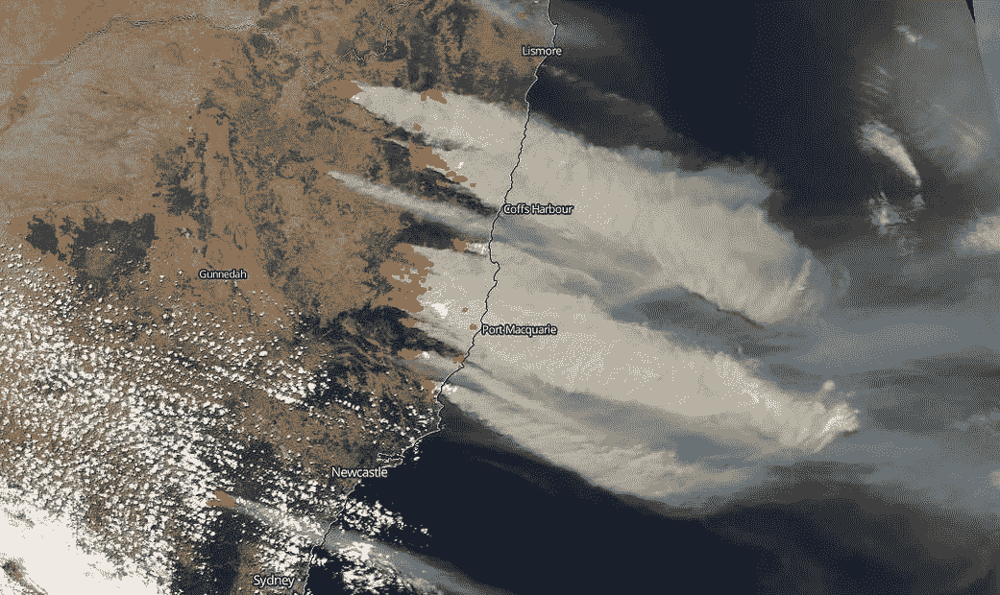
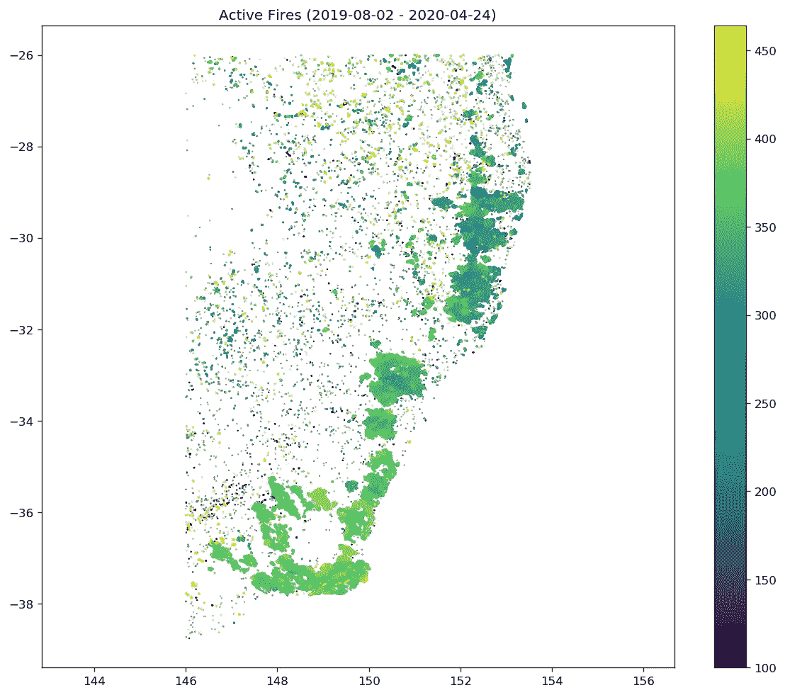
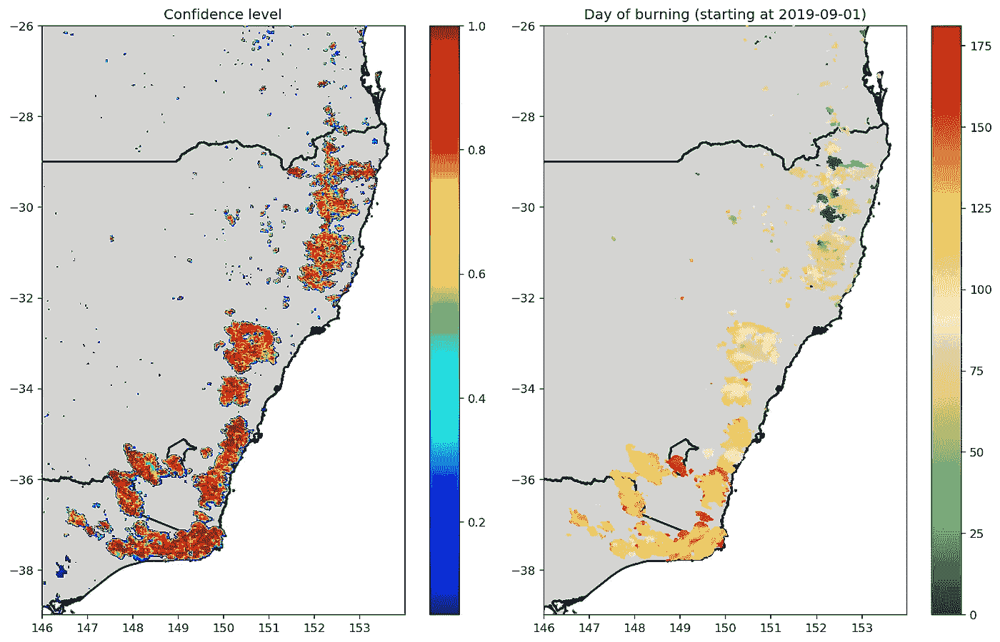
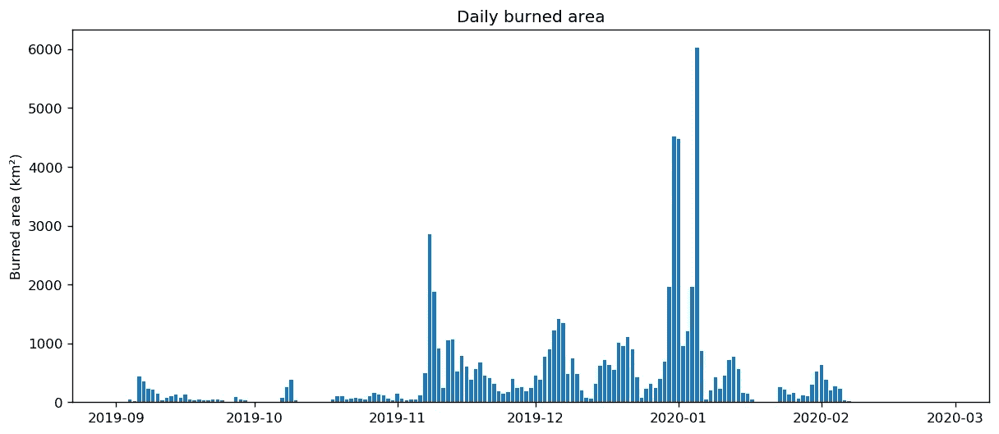

# 绘制 2019-20 澳大利亚森林火灾

> 原文：<https://towardsdatascience.com/mapping-2019-20-australian-bushfires-4e6d9a0eed63?source=collection_archive---------34----------------------->

## 一个案例研究，展示了如何通过 5 个简单的步骤使用深度学习从卫星图像中监控火灾的日常进展



澳大利亚东海岸的丛林大火。图片来自 [NASA](https://www.nasa.gov/image-feature/goddard/2019/bushfires-on-east-coast-of-australia-out-of-control) 。

2019-20 澳大利亚森林大火的极端程度在 2020 年初成为世界各地的头条新闻。[在气候变暖的情况下，像这样的极端事件预计会变得更加频繁。监控火灾的程度对于评估损失非常重要，对于从](https://doi.org/10.1029/2018GL080959)[森林管理](https://doi.org/10.1111/j.1365-2699.2011.02595.x)到[火灾碳排放和空气污染](https://doi.org/10.1016/j.atmosenv.2008.09.047)的广泛应用也是如此。分辨率高达每像素约 500 米的日常卫星图像有助于监测燃烧区域。然而，这并不是一项简单的任务，因为图像中经常出现云和烟雾。作为一个基于图像的问题，监测烧伤区域的日常进展是计算机视觉领域的一项非常适合的任务。

在这个故事中，我展示了如何使用 [BA-Net 模型](https://medium.com/@mnpinto/mapping-burned-areas-from-space-with-artificial-intelligence-3657bdb97a9d)(我是该模型的作者之一)来绘制澳大利亚的火灾地图，以及如何使用[Github 资源库](https://github.com/mnpinto/banet)中提供的开源代码和预先训练的模型作为名为 **banet** 的 Python 包，在地球上的几乎任何地方做同样的事情。

如果您只对结果感兴趣，在 5 个步骤之后，您可以直接跳到“**可视化结果**”部分。

## 第一步。定义研究区域

[**banet . geo**](https://github.com/mnpinto/banet/blob/master/banet/geo.py)**中的 **Region** 类应该如下使用，其中 **bbox** 参数接收一个带有区域左、下、右、上边界的列表。 **pixel_size** 应保持为 0.01(约 1 公里)，以接近这里将使用的卫星数据的分辨率。**

```
r **=** Region(name**=**'Australia', bbox**=**[146, **-**39, 154, **-**26], pixel_size**=**0.01)
r**.**export('data/regions/R_Australia.json')
```

## ****步骤二。下载 VIIRS 现行火灾数据****

****

**研究区域内活跃火灾的散点图。作者创造的形象。**

**VIIRS Active Fires 是一种产品，提供对卫星通过期间活跃的火的辐射功率的近实时估计。这些[极地轨道卫星](https://en.wikipedia.org/wiki/Polar_orbit)一天两次观察地球上的大部分地点。数据可以从[页面](https://firms.modaps.eosdis.nasa.gov/download/)下载；在“创建新请求”之后；选择区域；选择“VI IRS S-NPP”；选择研究周期(或至少 15 天)前一个月开始和后一个月结束的时间范围。至于文件格式，应该是选择 CSV。提交请求后，应该会很快得到处理。然后可以下载数据并保存为“热点{name}”。csv”，使用步骤 1 中定义的“名称”。**

**绘制所有活动火灾事件的结果如上图所示，其中颜色代表从 2019 年 1 月 1 日开始计数的燃烧日。**

## ****第三步。**下载 VIIRS 图像数据**

**下面的 bash 代码利用 banet 命令行实用程序从 [Nasa 地球数据](https://ladsweb.modaps.eosdis.nasa.gov/)下载数据。**

```
#!/bin/bash -l 
region**=**"Australia"
tstart**=**"2019-08-01 00:00:00"
tend**=**"2020-02-17 23:59:59"
path_save**=**"/data/Australia/rawdata"
regions_path**=**"/data/regions"

banet_viirs750_download $region "$tstart" "$tend" $path_save $regions_path
```

**需要将 **region** 变量设置为步骤 1 中定义的名称，并将 **regions_path** 设置为保存 JSON 文件的相应目录。**

## **第四步。数据预处理**

**对于这一步，banet 包中提供了另一个实用函数。该程序包括读取步骤 3 中下载的原始数据(HDF 格式)，并保存每天的 mat 文件，包括:**

*   **红色、近红外(NIR)和中红外(MIR)反射率；**
*   **网格化活跃火灾数据。**

```
#!/bin/bash -l
region**=**"Australia"
viirs_path**=**"/data/Australia/rawdata"
save_path**=**"/data/Australia/dataset"
fires_path**=**"/data/ActiveFires"
regions_path**=**"/data/regions"

banet_create_dataset $region $viirs_path $fires_path $save_path $regions_path
```

**注意 **fires_path** 应该设置为保存步骤 2 中获得的 CSV 文件的目录。**

## **第五步。使用 BA-Net 生成烧毁区域地图**

**同样，banet 包提供了一个实用的命令行函数来处理这个步骤。该过程包括加载 64 天的序列，并将大图像裁剪成 128×128 的图像块，将每个图像块输入到模型中，然后合并这些图像块以获得整个图像的结果。**

```
#!/bin/bash -l
region**=**"Australia"
tstart**=**"2019-08-01 00:00:00"
tend**=**"2020-02-17 23:59:59"
input_path**=**"/data/Australia/dataset"
output_path**=**"/data/Australia/output"
regions_path**=**"/data/regions"

banet_predict_times $region "$tstart" "$tend" $input_path $output_path $regions_path
```

**注意**输入路径**应该对应于步骤 4 的**保存路径**——数据集存储的目录。**

# **可视化结果**

**完成上述 5 个步骤后，结果将保存在**输出路径**中。下图显示了模型给出的置信水平(左)和燃烧日(右)。此后，仅考虑置信水平至少为 0.5 的像素。**

****

**从 BA-Net 模型获得的置信水平图(左)和燃烧天数图(右)。作者创造的形象。**

**请注意，燃烧日期的进展通常是平稳的，与其他现有产品形成对比，如本故事或 BA-Net 学术论文中所讨论的。燃烧日期的改进使得每日燃烧面积的表示更加准确，如下图所示。**

****

**所有研究区域的每日燃烧面积。作者创造的形象。**

**请注意 2019 年底和 2020 年初烧毁面积的极值——这是澳大利亚火灾成为全球头条新闻的时期。**

**柱状图代表的总过火面积为 **6 688 147 ha** 。相比之下，维基百科中提到的新南威尔士州、维多利亚州和澳大利亚首都直辖区的总面积为 6 956 688 公顷。这些数字不能直接比较，因为这里我们包括了南昆士兰的小火灾，并且只考虑了维多利亚州的一部分。然而，这是一场势均力敌的比赛。**

**在这个尺度上，可能会高估燃烧区域，因为燃烧区域内通常有较小的未燃烧区域。为了更好地识别这些区域，需要更高分辨率的图像，如 Sentinel-2 (10 米像素大小)。然而，这些图像每 5 天才有一次，无法绘制火灾的每日进展情况。**

## **前进的道路**

**最近几年，遥感数据的深度学习应用开始蓬勃发展。我相信这种趋势在可预见的未来将会继续。我预计在接下来的几年里，火烧区测绘将会是一个有重大进展的课题。从几颗卫星上不断检索的时空数据量之大使得这个问题具有挑战性。由 GPU 和 TPUs 驱动的深度学习为大量有待探索的新可能性开辟了道路。**

# **关于我**

**[](/my-3-year-journey-from-zero-python-to-deep-learning-competition-master-6605c188eec7) [## 我的 3 年历程:从零 Python 到深度学习竞赛高手

### 自从 2017 年开始学习 Python 以来，我一直遵循的道路是成为一名独自参加 Kaggle 比赛的大师…

towardsdatascience.com](/my-3-year-journey-from-zero-python-to-deep-learning-competition-master-6605c188eec7) 

*感谢阅读！祝您愉快！***