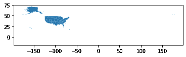

# 用 Python 绘制鳄梨价格图

> 原文：<https://towardsdatascience.com/mapping-avocado-prices-in-python-with-geopandas-geopy-and-matplotlib-c7e0ef08bc26?source=collection_archive---------33----------------------->

## 使用 GeoPandas、GeoPy 和 Matplotlib 制作美丽的 choropleth 地图。


来自 **Pexels** 的**彼得·德·温克**的照片

我喜欢鳄梨。它们美味又健康，我喜欢吃。我知道这使我成为一个千年的基本陈词滥调，但是心想要心想要的！当我在 [Kaggle](https://www.kaggle.com/) 上看到 [Justin Kiggins](https://www.kaggle.com/neuromusic) 发布的[鳄梨价格数据集](https://www.kaggle.com/neuromusic/avocado-prices)时，我立刻想看看它，玩玩它。这包含由 [Hass Avocado Board](https://hassavocadoboard.com/) 编辑的关于 2015 年至 2018 年间美国鳄梨销售的信息。

这个数据集中包含了很多有用的信息，我可以选择一些不同的东西来探索(也许以后我还会这样做)。我在 twitter 上看到了一些很酷的 choropleth 地图，想尝试一下。我发现每个价格观察都与一个特定的地区相关联，于是我决定试试能否以某种方式将这些信息从文本形式转换成地图形式。


剧透:我可以！

在这篇文章中，我将带你一步一步地了解我是如何做到的，你可以在这里找到我的包含代码[的完整 Jupyter 笔记本](https://github.com/thecraigd/Avocado-Prices)。这是我第一次尝试使用 Python 制作这种地图，所以我欢迎所有关于我如何使这个过程更容易的反馈和想法！

# 导入和简化数据

让我们开始吧！我做的第一件事是导入我的库和数据本身。使用 pd.read_csv()直接从 csv 文件创建熊猫数据帧。

```
import pandas as pd
import geopandas as gpd
import matplotlib.pyplot as pltdata = pd.read_csv('avocado.csv', index_col = 'Date')
```

这给了我们一个很好的数据框架。


但是现在对我们来说这些信息太多了。我想制作一个包括价格和地区数据的地图(也许以后会对数量和年份做些什么)，所以让我们去掉很多列。

```
columns_to_drop = ['Unnamed: 0', '4046', '4225', '4770', 'Total Bags', 'Small Bags', 'Large Bags', 'XLarge Bags', 'type']avo_df = data.drop(columns_to_drop, axis=1)
```


显示(avo_df.head())

不错！那更精简。做一些探索性的数据分析让我对我正在查看的数据集有了一个概念，数据集中一个鳄梨的最高价格是 3.25 美元(！)—最便宜的是 0.44 美元——便宜了 7 倍多。那是某种变异！在我们的数据集中，一个鳄梨的中值价格是 1.37 美元，平均值是 1.41 美元，标准差是 0.40 美元。这给出了数据中价格分布的概念。

视觉上做一些 EDA 总是有帮助的。这里有一个 AveragePrice 柱的直方图，让我们对总体分布有一个更清晰的感觉。


不一定要很漂亮，别担心。

为了制作我想要制作的地图(显示每个地区鳄梨价格的 choropleth，以清楚地显示价格的地区差异)，我想要将每个地区许多不同的价格测量值合并为一个值。探索同比或销量的差异可能会很有趣(谁买的鳄梨最多？)，但要回答我给自己定的问题，我想把这些都压下去。

这里有几个选择，但我认为最清楚和最诚实的方法是取所有平均价格数据的简单平均值，按地区分组。我们如何做到这一点？

首先，我们需要识别所有的区域。

```
regions = avo_df.region.unique()
```

这为我们提供了数据集中包含的所有区域的列表:

```
['Albany' 'Atlanta' 'BaltimoreWashington' 'Boise' 'Boston'
 'BuffaloRochester' 'California' 'Charlotte' 'Chicago' 'CincinnatiDayton' 'Columbus' 'DallasFtWorth' 'Denver' 'Detroit' 'GrandRapids' 'GreatLakes' 'HarrisburgScranton' 'HartfordSpringfield' 'Houston' 'Indianapolis' 'Jacksonville' 'LasVegas' 'LosAngeles' 'Louisville' 'MiamiFtLauderdale' 'Midsouth' 'Nashville' 'NewOrleansMobile' 'NewYork' 'Northeast' 'NorthernNewEngland' 'Orlando' 'Philadelphia' 'PhoenixTucson' 'Pittsburgh' 'Plains' 'Portland' 'RaleighGreensboro' 'RichmondNorfolk' 'Roanoke' 'Sacramento' 'SanDiego' 'SanFrancisco' 'Seattle' 'SouthCarolina' 'SouthCentral' 'Southeast' 'Spokane' 'StLouis' 'Syracuse' 'Tampa' 'TotalUS' 'West' 'WestTexNewMexico']
```

现在我们想用这个列表对我们的数据框架进行分组，得出每个地区的平均价格值

```
group_by_region = avo_df.groupby(by=['region'])
avo_df_avg = group_by_region.mean()
avo_df_avg = avo_df_avg.drop(['year'], axis=1)
```

这应该能行。

# 使用 GeoPy 进行地理编码

现在我们每个地区都有一个价格值，但是每个地区都存储为文本，例如' Albany '，' SanDiego '，' Roanoke '等。Matplotlib 很聪明，但还不足以聪明到仅仅根据文本在地图上绘制这些内容。我们需要找到一种方法从这些地名中获取地理数据(具体来说，是坐标)。

嗯，我们不是第一个想这么做的人！我们可以使用 [GeoPy](https://geopy.readthedocs.io/en/stable/) 的地理编码特性来实现这一点。在玩了一段时间后，我用了 Bing 地图(它可以免费获得一个 API 密钥，我可以让它工作！)，但是还有其他可用的地理编码服务[，所以可以随意尝试。](https://geopy.readthedocs.io/en/stable/#module-geopy.geocoders)

```
from geopy.geocoders import Bing
from geopy.extra.rate_limiter import RateLimitergeolocator = Bing(api_key='[GetYourOwnAPIKeyYouScallywag](https://docs.microsoft.com/en-us/bingmaps/getting-started/bing-maps-dev-center-help/getting-a-bing-maps-key)', timeout=30)
geocode = RateLimiter(geolocator.geocode, min_delay_seconds=2)regions_dict = {i : geolocator.geocode(i) for i in regions}
```

我发现使用 RateLimiter 有助于避免过多的请求使 API 过载，但是它会显著增加请求运行的时间，并且对您来说可能是不必要的，所以请记住这一点。

这将返回一个充满信息的字典，我们只需要其中的坐标。我们可以使用以下步骤将其转换为准备好加入现有数据框架的数据框架:

```
regions_df = pd.DataFrame(regions_dict)
regions_df_melted = regions_df.iloc[1:2,:].melt()
regions_df_melted.columns = ['region', 'co-ordinates']
```

这是产生的数据帧的头部。


现在，我们的数据集中有了每个地区的坐标，我们希望将其加入到现有的数据框架中，这样我们就有了一个包含每个地区的平均价格和坐标的数据框架。令人高兴的是，pandas 使用其合并功能使这变得非常容易。谢谢，熊猫们！

```
df = pd.merge(avo_df_avg, regions_df_melted, left_on='region', right_on='region')
```

我们的下一步是将所有这些整合在一起，创建一个 GeoPandas 地理数据框架，其中包含每个地区的平均价格，以及我们在地图上绘制每个地区所需的地理信息。要做到这一点，我们首先需要创建一个纬度列和一个经度列(GeoPandas 非常合理地希望获得这些信息来创建它的“geometry”列，这是它存储地理数据的方式)。

```
df[['latitude', 'longitude']] = pd.DataFrame(df['co-ordinates'].tolist(), index=df.index)avo_gdf = gpd.GeoDataFrame(
    df, geometry=gpd.points_from_xy(df.longitude, df.latitude))
```

太好了！现在我们有了一个包含所有数据的地理数据框架。让我们快速看一下它是什么样子的！

```
avo_gdf.plot()
```


嗯，这个我还不确定。

好吧——我承认这看起来还不太鼓舞人心，但我向你保证，我们会成功的！如果你眯着眼睛看，你会发现大部分数据看起来确实像是在美国。我们在右下角有一个异常值，稍后会解释和处理。

但是现在，从现在开始！

# 使用 Shapely 显示地图，作为显示我们感兴趣的数据的基础

正如我们在上面看到的，仅仅得到我们的地理数据框架并不能立即产生我们梦想中的美丽的 choropleth。我们需要给 Python(和 Matplotlib)关于我们想要如何呈现这些信息的指令。毕竟，我们是数据分析师，我们正在决定如何呈现我们的数据，并且有大量的方法可供我们选择。这种灵活性意味着我们还有一些工作要做！

因此，我们希望将鳄梨价格的地理数据框架叠加到美国大陆的地图上。我们如何做到这一点？有一个非常有用的 Python 库叫做 shapely，可以在这里帮到我们。mattymecks 有一个关于所有这些东西的超级有用的帖子[在这里](/spatial-data-geopandas-and-pokémon-part-i-8525c801ed18)——如果你想弄明白这一点，我强烈建议读一读整篇帖子。

形状文件将形状存储为多边形，它只是一系列相互连接的坐标。因此，一个三角形将被保存为由它们的坐标标识的 3 个点，一个正方形由 4 个点标识，而更复杂的形状由数千个或更多的点标识。

无论如何，对于我们的目的，你只需要知道形状文件存在，并能提供我们正在寻找的地图。但是去哪里找最好的呢？当然，最好的方法是用疯狂的谷歌搜索，但是我也许可以帮你省点劲，给你指出美国人口普查局提供的[老虎/线条轮廓。如果那些家伙不知道美国各州、领土和领地的形状，那么我不知道谁会知道！](https://www.census.gov/geographies/mapping-files/time-series/geo/tiger-line-file.html)

下载这些文件，解压并保存在你的活动文件夹中。然后从 Shapely 导入点和多边形，你就可以开始摇滚了！

```
from shapely.geometry import Point, Polygonusa = gpd.read_file('tl_2017_us_state.shp')
```

好吧，我们来看看那个坏男孩。

```
usa.plot()
```



好吧——不完美，但我们正在努力。

我们可以在这里看到我们所需要的基础。为什么这张地图有这么多空白？我以为美国只是在西半球？好吧，这里不涉及太多的地缘政治细节，我们只说有一些属于美利坚合众国的领土在我们首先想到的其他地理位置。

让我们仔细看看这里的形状数据。

```
print(usa.shape)
print(usa.NAME)----(56, 15)0                                    West Virginia
1                                          Florida
2                                         Illinois
3                                        Minnesota
4                                         Maryland
5                                     Rhode Island
6                                            Idaho
7                                    New Hampshire
8                                   North Carolina
9                                          Vermont
10                                     Connecticut
11                                        Delaware
12                                      New Mexico
13                                      California
14                                      New Jersey
15                                       Wisconsin
16                                          Oregon
17                                        Nebraska
18                                    Pennsylvania
19                                      Washington
20                                       Louisiana
21                                         Georgia
22                                         Alabama
23                                            Utah
24                                            Ohio
25                                           Texas
26                                        Colorado
27                                  South Carolina
28                                        Oklahoma
29                                       Tennessee
30                                         Wyoming
31                                          Hawaii
32                                    North Dakota
33                                        Kentucky
34                    United States Virgin Islands
35    Commonwealth of the Northern Mariana Islands
36                                            Guam
37                                           Maine
38                                        New York
39                                          Nevada
40                                          Alaska
41                                  American Samoa
42                                        Michigan
43                                        Arkansas
44                                     Mississippi
45                                        Missouri
46                                         Montana
47                                          Kansas
48                                         Indiana
49                                     Puerto Rico
50                                    South Dakota
51                                   Massachusetts
52                                        Virginia
53                            District of Columbia
54                                            Iowa
55                                         Arizona
Name: NAME, dtype: object
```

我们已经确认我们的鳄梨价格数据仅限于美国大陆(除了一个奇怪的异常值，我保证我们会发现)，所以我们可以去掉一些其他条目。

```
to_drop = ['Commonwealth of the Northern Mariana Islands', 'United States Virgin Islands', 'Hawaii', 'Alaska', 'Guam', 'Puerto Rico', 'American Samoa']for index, row in usa.iterrows():
    if row['NAME'] in to_drop :
        usa.drop(index, inplace=True)usa.plot()
```


这还差不多！

现在，我们已经准备好了美国的形状文件来形成我们地图的基础，并且我们已经有了地理位置上的价格数据，可以开始了。但是，有一些奇怪的事情正在发生，特别是我们地图上的那个异常值。现在是时候对此进行调查，并对我们的数据进行一些合理性检查了。

# 清理我们的数据—最后一步

如果我们显示整个数据框(这里太大了，无法显示，但如果您在家继续，我鼓励您这样做)，我们可以看到，我们的一些坐标是南向的(例如，25 号入口——中南部)，一些是可疑的圆形(例如，29 号入口——东北)，还有一些偏离很远(例如，52 号入口——西部——这是我们在地图上的异常值！).这里发生的事情是，我们来自 [Hass Avocado Board](https://www.kaggle.com/neuromusic/avocado-prices) (通过 [Justin Kiggens](https://www.kaggle.com/neuromusic/avocado-prices) )的原始 CSV 文件包含一些主要地区(如中南部、东北部和西部)的一些元地区汇总数据。

当我们使用我们的地理定位器(在我们的例子中是 Bing 地图，但是这个问题会发生在我们使用的任何一个服务上)时，这个服务尽力提供一个精确的位置。在某些情况下(如中南大学)它不能，所以我们最终与南。在其他地方(如东北)，它发现了一些非常普遍的东西，并随之而来。在另外一些地方(比如 West ),它能够定位到具有该名称的某个地方，但不是我们要寻找的地方(在这种情况下，它返回赞比亚 Western 的坐标)。这就是为什么在可能的情况下通过用不同的方式绘制数据并调查看起来可疑的事情来检查数据是很重要的。

就我们的目的而言，我们不需要这个元区域数据，所以我们可以一起删除它。

```
to_drop = ['Midsouth', 'Northeast', 'Plains', 'SouthCentral', 'Southeast', 'TotalUS', 'West']for index, row in avo_gdf.iterrows():
    if row['region'] in to_drop :
        df.drop(index, inplace=True)
```

# 通过 Matplotlib 将所有这些整合在一起

既然我们已经改进了 df，我们的数据框架，我们已经将 shapefile 保存为 usa，让我们使用相同的 CRS — [坐标参考系统](https://en.wikipedia.org/wiki/Spatial_reference_system)将它们放在一起。这将确保我们的地理数据框架使用相同的参考系统，因此只要我们每个地区的坐标是准确的，它们就会准确地显示在美国地图上。这里我使用了 [epsg:4326](https://epsg.io/4326) ，因为 Shapefile 已经在使用它了。

```
crs = {'init': 'epsg:4326'}
avo_gdf = gpd.GeoDataFrame(df, crs=crs)
usa_gdf = gpd.GeoDataFrame(usa, crs=crs)
```

就是这个！我们准备好出发了！

借助来自 [Matplotlib](https://matplotlib.org/contents.html) 的一些漂亮的特性，我们可以让它变得非常漂亮。

```
from mpl_toolkits.axes_grid1 import make_axes_locatable 
# This is a function to allow us to make the legend prettyfig, ax = plt.subplots(figsize = (20,16)) 
plt.title('Avocado Prices by region in the United States', fontsize=26, fontfamily='serif') #this part makes the legend the same size as our map, for prettiness
divider = make_axes_locatable(ax)
cax = divider.append_axes("right", size="5%", pad=0.1) usa.boundary.plot(ax=ax, color='DarkSlateBlue') 
# using the boundary method here to get the outlines of the states, an aesthetic decisionavo_gdf.plot(cmap='Greens', column='AveragePrice', legend=True, ax=ax, s=2000, alpha=0.7, cax=cax) # this saves a copy of the viz as a jpg so we can easily share it with our friends on twitter!
plt.savefig('Avocado Prices.jpg', format='jpg')
```


瞧啊。

现在我们已经实现了美丽的 choropleth，直到现在只存在于我们的梦想！恭喜我们！看起来我们想避开美国东北部和旧金山，而是去俄亥俄州或德克萨斯州过廉价鳄梨的生活。

我希望这有助于您了解我们如何使用 GeoPandas、GeoPy 和 Matplotlib 中的一些强大工具来获取文本和数字形式的数据，使用 API 来查找坐标，然后创建一个吸引人且清晰的可视化效果，向人们展示我们想要突出显示的信息。

非常感谢您抽出时间陪我踏上这段旅程。我随时欢迎您的反馈——请通过 Twitter @ craigdoedata 与我联系，并告诉我如何才能更有效地完成这项工作！我仍然在学习，我也想知道你的秘密，所以请与我分享。

同样，整个 Jupyter 笔记本和相关文件都在我的 [Github 页面](https://github.com/thecraigd/Avocado-Prices)上，我鼓励你使用它们。

下次见！


更像这样？访问[craigdoedata . de](https://www.craigdoesdata.de/)