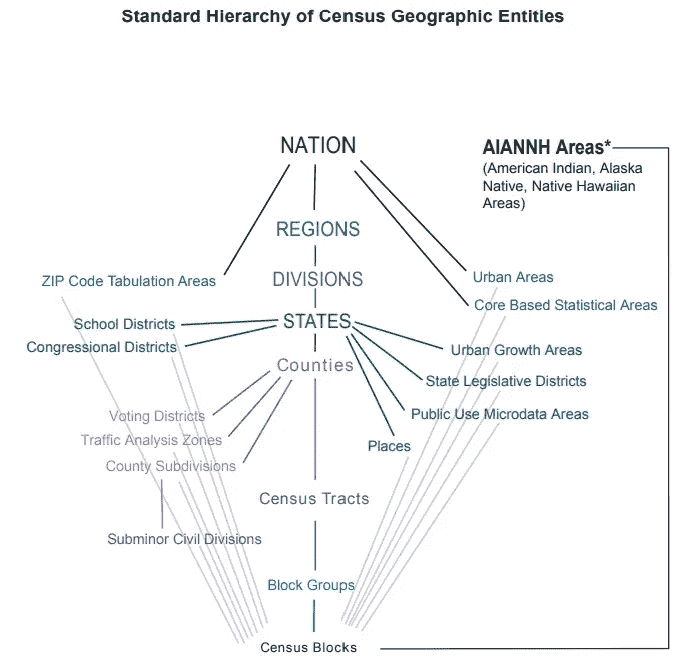
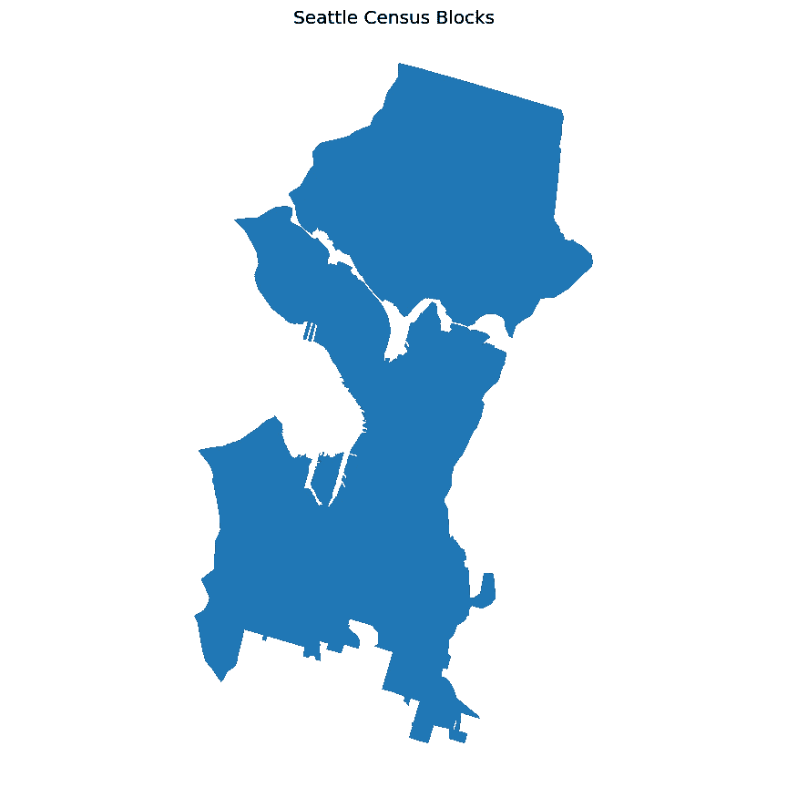
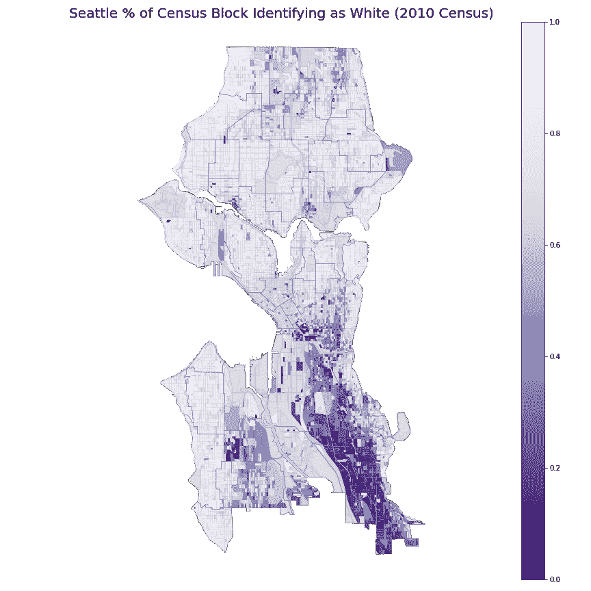
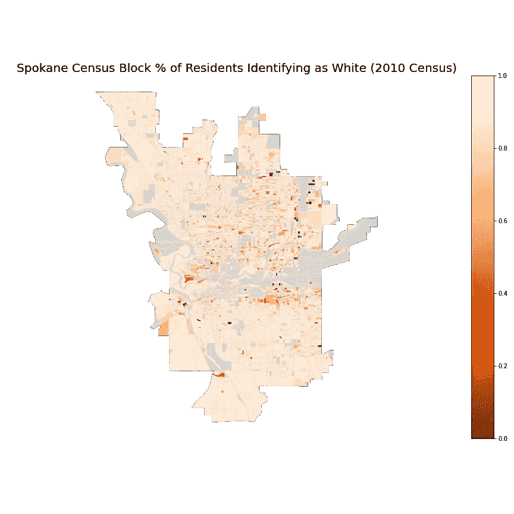
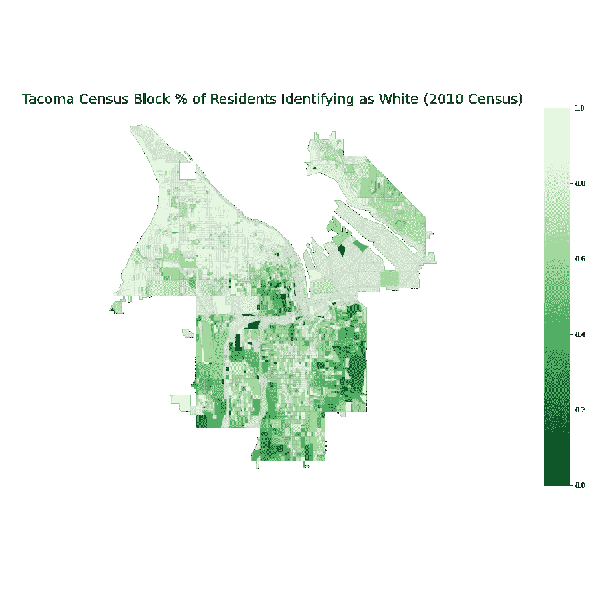
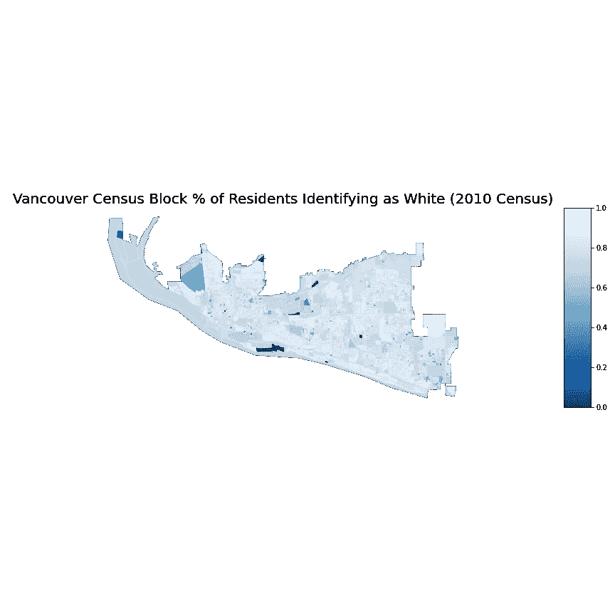
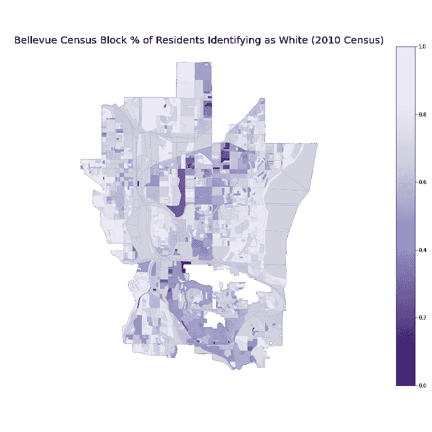

# 测绘普查数据

> 原文：<https://towardsdatascience.com/mapping-census-data-fbab6722def0?source=collection_archive---------12----------------------->

## 如何在 Python 中访问和映射人口数据


瑞安·威尔森在 [Unsplash](https://unsplash.com?utm_source=medium&utm_medium=referral) 上拍摄的照片

根据 2010 年的人口普查，今天我来看看西雅图的种族构成。为此，我将使用综合公共使用微数据系列 **(** IPUMS)国家历史地理信息系统(NHGIS)。你也可以使用[data.census.gov](http://data.census.gov)，我发现它要慢得多(这么多风车！)比 IPUMS 国家地理信息系统。

注意:滚动到底部查看术语表。

# 获取人口普查数据

为了绘制人口普查数据，我们既要寻找感兴趣级别的 GIS shapefiles，也要寻找匹配级别的信息表。

来自 IPUMS:

> “IPUMS 提供跨越时间和空间的世界各地的人口普查和调查数据。IPUMS 集成和文档使研究变化、进行比较研究、合并不同数据类型的信息以及分析家庭和社区环境中的个人变得容易。免费提供的数据和服务。”

点击查看所有数据库[。或者 GIS 和人口普查数据库](https://ipums.org/)[这里](https://www.nhgis.org/)。要使用这个系统，你需要选择你的数据集，注册一个账户，然后等待系统发邮件告诉你你的数据集准备好了(大约。等我 15 分钟)。

## 挑选数据集

点击(当前)绿色方框，根据地理区域、年份、主题、数据集进行过滤。

在弹出的地理区域中，您需要了解人口普查如何进行地理测量。对于目前没有被分类为“美洲印第安人、阿拉斯加土著人、夏威夷土著人地区”的地区，您可以从上到下阅读标准的层次结构，将国家划分为地区，每个地区划分为部门，每个部门划分为州，等等。或者，您可以自下而上地阅读标准层次结构:人口普查区块分为区块组，区块组分为人口普查区域，人口普查区域分为县，等等。



[https://www2.census.gov/geo/pdfs/reference/geodiagram.pdf?#](https://www2.census.gov/geo/pdfs/reference/geodiagram.pdf?#)

需要注意的一点是，人口普查区域、区块组和人口普查区块不遵循垂直中心(州、县)之外的任何划分。在人口普查中，城市是“地方”,其边界不一定在人口普查区块、区块组或区域的创建中得到考虑。您也可以在这些交替的级别/类别上收集数据，但是在尝试将这些数据“汇总”到更大的分组中或“深入”到更小的范围时，您需要小心。

设置过滤器后，单击“选择数据”下的选项卡，从“源表”移动到“时间序列表”或“GIS 文件”你会把范围缩小到你所在的州、县等。下一步。

选择您感兴趣的数据后，从屏幕右上角的“数据推车”中单击继续。

## 选择数据选项

根据您的数据集和地理级别，您可以在此页面上按州缩小数据范围。如果您使用的是县一级的数据，则不能选择州一级的过滤。

您已经准备好“继续”检查您的数据推车。

## 注册一个账户


Avel Chuklanov 在 [Unsplash](https://unsplash.com?utm_source=medium&utm_medium=referral) 上拍摄的照片

这里很标准，虽然有很多必填字段。

如果您不是以专业身份使用数据，您可以使用“个人/非专业用途”作为机构或雇主的名称，或者如果更合适的话，使用“自雇人士/顾问”。

最需要注意的是使用条款:

*   "重新分发:未经许可，你不能重新分发数据."
*   "引用:适当引用 NHGIS 数据. "

## 等待你的数据邮件

它将从[nhgis@umn.edu](mailto:nhgis@umn.edu)和链接跟随，在那里你可以下载，修改，或重新提交你的数据请求。

## 来源:census.gov

尽管 data.census.gov[的数据表功能看起来还很困难(在撰写本文时)，但我发现 shapefile(又名制图边界文件)页面更加用户友好。有点奇怪的是:](http://data.census.gov)[这里的](https://www.census.gov/geographies/mapping-files/time-series/geo/carto-boundary-file.html)是 1990 年至 2018 年的页面，还有一个单独的 [2019 年页面](https://www.census.gov/geographies/mapping-files/time-series/geo/cartographic-boundary.html)。新发布的 2019 年数据方便地包括一系列规模选项。

当您使用下拉菜单进行选择时，它会自动开始下载。也许不是最直观的，但至少它们是拉上的。所以任何误点击都不会有太大的影响。

# 理解数据

来自 IPUMS 的每个表格文件都带有一个“代码本”文本文件，包含数据摘要、数据字典、引用和使用提醒。您可以从人口普查局了解更多有关具体数据、分类和感兴趣的问题。

请注意，这些 shapefiles 是一般化的，带来了优点和缺点(由[人口普查局](https://www.census.gov/programs-surveys/geography/technical-documentation/naming-convention/cartographic-boundary-file.html)提供):优点—小比例下的外观、磁盘空间、显示时间。缺点:不完善的面积和周长表示，不准确的地址地理编码，一些被排除的区域，并不总是跨年度对齐。

我需要对人口普查局的地理项目大声喊出来。它们是大量直观且有用的资源。

# 绘制数据图表

## 在 pandas 和 geopandas 中加载数据

对于一些文件，我用`pd.read_csv()`没有问题，但在一个文件上，我用了`**UnicodeDecodeError**`。我不确定是否是文件的问题(也许是 excel 的问题？)或一个字符，但我发现将编码设置为 latin1 对我有用:

```
counties = pd.read_csv('counties.csv', encoding='latin-1')
```

GeoPandas 过去安装起来很棘手，但似乎最新版本已经解决了很多问题(全部？)的这些问题。尽管如此，使用一个新的或者以`geopandas`为中心的环境对你来说还是有意义的。你可以在这里找到他们的安装建议。今天我将使用`geopandas`进行绘图，所以我也将在我的新环境中安装`matplotlib`和`descartes`。我还没有尝试过 PyGEOS 的实验性使用(在我写这篇文章的时候),但是它看起来很棒，尤其是如果你想要速度的话。

## 缩小到目标城市

我下载的数据集包含了华盛顿州所有的人口普查区块。全部 196 万。

起初，我计划使用 GeoPandas / Shapely intersects 函数以及地点地图中的西雅图地理信息。但是，当我看到 places 地理数据集包含地名时，我决定使用数字的地点代码数据进行过滤。

或者，您可以在 census.gov 搜索[年份] FIPS 代码，下载相应的文件(在我的例子中是“州、县、小民事部门和 FIPS 地方法人代码”)，然后快速搜索您的位置。

这两种策略都需要额外下载。

## 关于地图投影的一句话



西雅图人口普查区块地图顺时针旋转约 15 度

我注意到人口普查区块形状文件被设置为人口普查放置形状的不同投影。您可以选择重新定向地图，以匹配人口普查地点形状、您正在使用的其他数据(例如，来自城市的数据)，或者不匹配。在这种情况下，我将重新定位到我更习惯的视图。

你可以检查一个文件的方向/ crs，使用`*geo_object*.crs`或者使用方便的警告信息，如果你使用匀称的几何比较(即包含、触及等。)

设置投影:`seattle_blocks_map.to_crs(“EPSG:4269”)`

## 基于要素对地图进行着色



对于基本的 choropleth，在绘图调用中添加一个列参数。你可以在 GeoPandas 上阅读更多关于 choropleths 的内容。或者查看我的代码来创建带有图例的地图，并使用灰色背景来填充任何空白:

```
# to make nice looking legends
from mpl_toolkits.axes_grid1 import make_axes_locatable# create the plot for sizing
fig, ax = plt.subplots(figsize=(20,20))# lay down a background map for areas with no people
seattle_blocks_map.plot(ax=ax, color='grey', alpha=.5)# set the legend specifications
divider = make_axes_locatable(ax)
cax = divider.append_axes("right", size="5%", pad=0.05)# add the map with the choropleth
seattle_blocks_map.plot(ax=ax, 
                        column='white_rate', 
                        cmap='Purples_r',
                        legend=True, 
                        cax=cax,
                        missing_kwds={"color": "lightgrey"},
                       )
```

我很高兴能更深入地挖掘这些数据，看看 2020 年的数字出来时发生了多大的变化！

# 通用、可重复使用的解决方案

在为西雅图绘制地图后，我对其他城市感到好奇，并决定制定一个更通用的解决方案。为此，我创建了一个函数来获取数据文件路径，并执行与上面相同的操作，这使我可以毫不费力地为华盛顿接下来的四个最大的城市绘制类似的地图。在另一轮数据下载后，我将不得不报告其他州的城市。



你可以在这里找到 jupyter 笔记本。编码快乐！


由[威廉·蒙特](https://unsplash.com/@hugsdealer?utm_source=medium&utm_medium=referral)在 [Unsplash](https://unsplash.com?utm_source=medium&utm_medium=referral) 上拍摄的照片

# 词汇表:

*   **地点**:在普查数据中，地点指城市/城镇/等。
*   **crs** :坐标参考系统。你的(球形)几何形状在二维平面上的投影。
*   **shapefile** :一组包含几何图形和地理数据集中其他信息的文件。在这篇[帖子](/puppies-python-analyzing-geospatial-data-93dd9dc3137)中了解更多信息。

# 引用:

*   明尼苏达大学 IPUMS·nhg is，[www.nhgis.org](http://www.nhgis.org)
*   地图边界文件描述。美国人口调查局。[https://www . census . gov/programs-surveys/geography/technical-documentation/naming-conventi on/cartographic-boundary-file . html](https://www.census.gov/programs-surveys/geography/technical-documentation/naming-convention/cartographic-boundary-file.html)