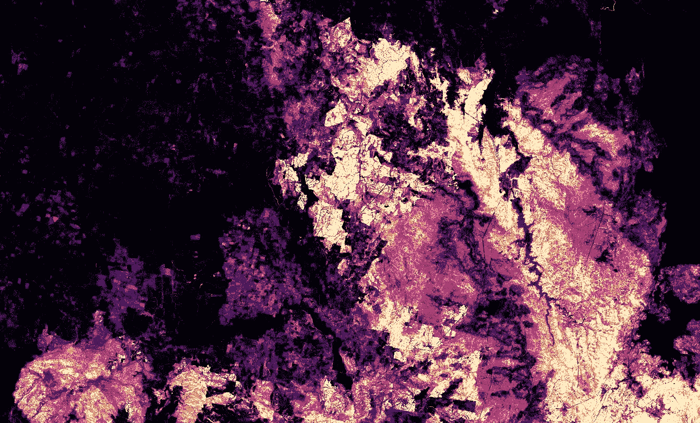

# 使用开放数据立方体绘制 2019–2020 澳大利亚森林火灾图

> 原文：<https://towardsdatascience.com/mapping-the-2019-2020-australian-bushfires-with-the-open-data-cube-ec680060bf15?source=collection_archive---------52----------------------->

## [理解大数据](https://towardsdatascience.com/tagged/making-sense-of-big-data)

## 在开放数据立方体 python 环境中使用分析就绪 Sentinel-2 数据评估火灾范围和火灾严重程度。

差分标准化燃烧比。包含由澳大利亚数字地球处理的修改的哥白尼数据(2020)。哥白尼数据(2020)。

2019 年至 2020 年，澳大利亚遭受了有史以来最具破坏性的火灾。在发生的不幸事件中，1020 万公顷土地被烧毁，3100 所房屋被毁，30 亿头动物死亡，33 人丧生[1]。然而，火灾的社会经济和生态影响远远超出了直接损失。对火灾事件进行定量和定性的评估和分析是为政策制定者和决策者提供灾后恢复信息的关键。

开放数据立方体倡议是专门为释放遥感图像的全部潜力而设计的开源项目的一个极好的例子。数据立方体吸收并索引 Landsat-8 和 Sentinel-2 图像等图像源，并通过应用高级大气、双向反射和地形校正优化这两种数据源的使用，使数据可以立即进行分析[2]。

在本故事中，我将向您介绍如何使用国家计算基础设施上的数据立方体的数字地球澳大利亚实例来创建一个脚本，该脚本查询多光谱影像的深层时态堆栈，以对 110 公里×130 公里的区域场景进行火灾前和火灾后评估。使用火灾事件前两个月和后三个月的图像，不到十分钟就可以得出火灾范围和严重程度的结果。

以下示例是使用国家计算基础设施的虚拟桌面界面(VDI)完成的，这是一个基于虚拟化 Linux 的环境，其中托管了数字地球澳大利亚的数据立方体和索引影像产品。在 VDI (32 GB 内存、4 个内核、2 GB 存储)上的 Jupyter 笔记本电脑中，结果在 28 分钟内产生。在 NCI 的 Gadi 超级计算机上编译并运行 python 脚本，10 分钟内就产生了结果(64GB RAM，16 个内核，10 GB 存储)。更多关于访问 NCI 的信息可以在这里找到[。](https://docs.dea.ga.gov.au/about/intro.html)

对于那些对测试这段代码感兴趣的人，我建议先在沙盒环境中尝试一下，在创建帐户后，任何人都可以免费访问它。沙盒可以在这里找到[。](https://app.sandbox.dea.ga.gov.au/hub/login)

## 步骤 1 —加载必要的模块并连接到 datacube。

## 步骤 2-建立时空查询参数。

## 步骤 3-对感兴趣的区域进行空间分块。

## 第 4 步-计算差值标准化燃烧比。

## 步骤 5-镶嵌空间块并导出结果。

直接的结果可以在上图中看到。该过程的准确性被评估为火灾严重性结果的 60-64%(分为未燃烧、低、中、高和极端的严重性类别)和火灾范围的 88-92%(分为未燃烧和燃烧的类别)。火灾严重程度的准确性较低是由于低、中和高严重程度等级之间的等级可分性较差——这是归一化燃烧比技术的一个已知问题[3]。其他误差来源包括由于时间窗口或火灾前后场景造成的季节性变化，这是通过计算像素分布随时间偏斜的像素中值来解决的。植被的非同质再生长也导致了一些错误分类。例如，草比中型和大型植被结构恢复得更快。这突出了理解你试图分析的生物物理现象的重要性。

归一化燃烧比是计算火灾范围和严重程度的一种简单而有效的计算方法。传统上受到多时相分析的长时间预处理步骤的阻碍，开放数据立方体计划打开了对分析就绪数据集的访问，允许更多的时间和计算资源专注于核心问题。该项目的开源协作性质，加上免费提供的图像来源和开放地理空间联盟标准，是未来惊人的遥感发现和解决世界上一些最大的环境监测挑战的有力秘诀。

请查看我的 github 资源库，获取与这个项目相关的源代码和笔记本—[https://github.com/yobimania/dea-notebooks](https://github.com/yobimania/dea-notebooks)。

## 参考资料:

[1]:瓦尔多拉基斯等人。艾尔(2020)。*从澳大利亚森林大火中吸取的教训:气候变化、空气污染和公共健康*。JAMA 内科，180，635。

[2]:澳大利亚地球科学(2020)。*地表反射 NBART 1(哨兵-2 MSI)。澳大利亚联邦*。[https://CMI . ga . gov . au/data-products/DEA/190/surface-reflectance-nbart-1-sentinel-2-MSI # basics](https://cmi.ga.gov.au/data-products/dea/190/surface-reflectance-nbart-1-sentinel-2-msi#basics)

[3]:吉布森，R 等。艾尔(2020)。*使用 sentinel 2 和 random forest 绘制澳大利亚东南部火灾严重程度的遥感方法。*环境遥感 240，111702。