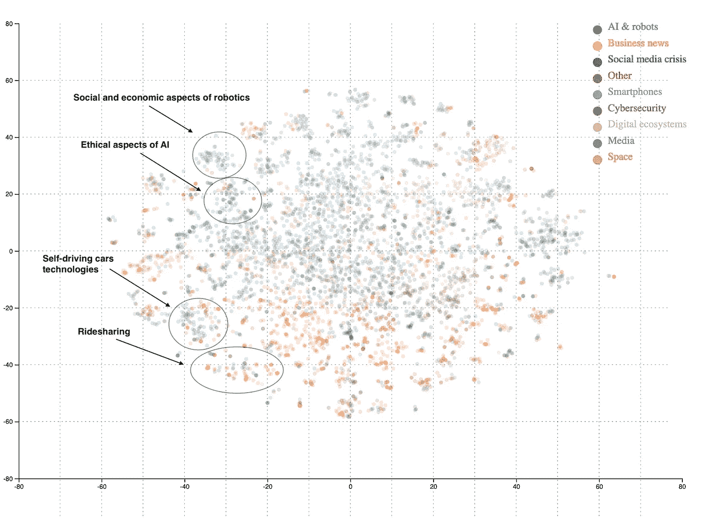
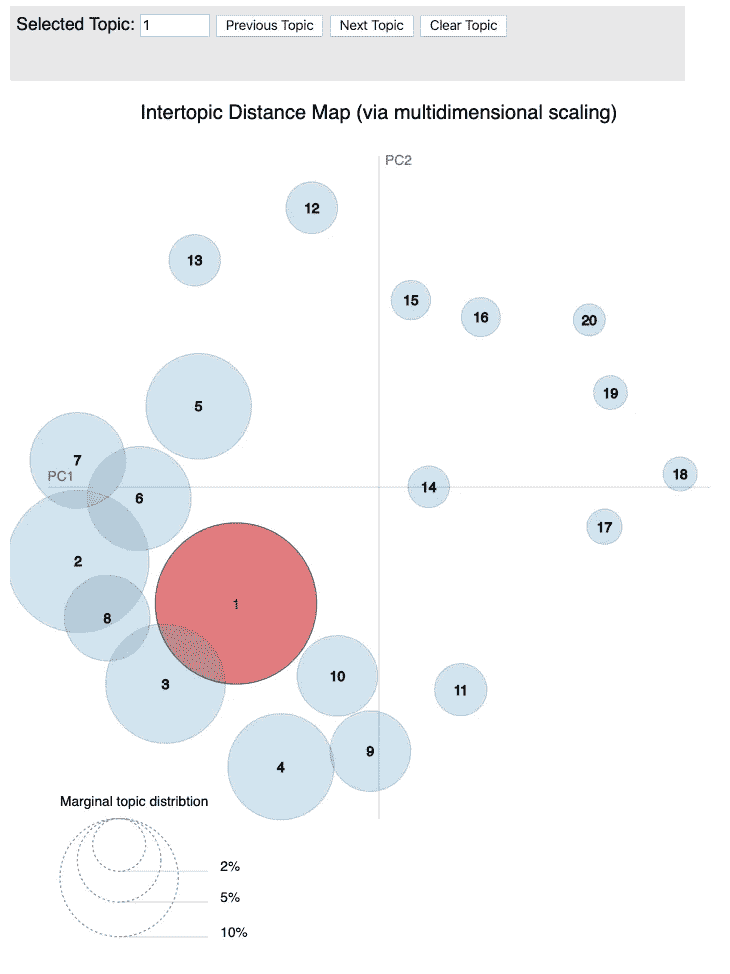
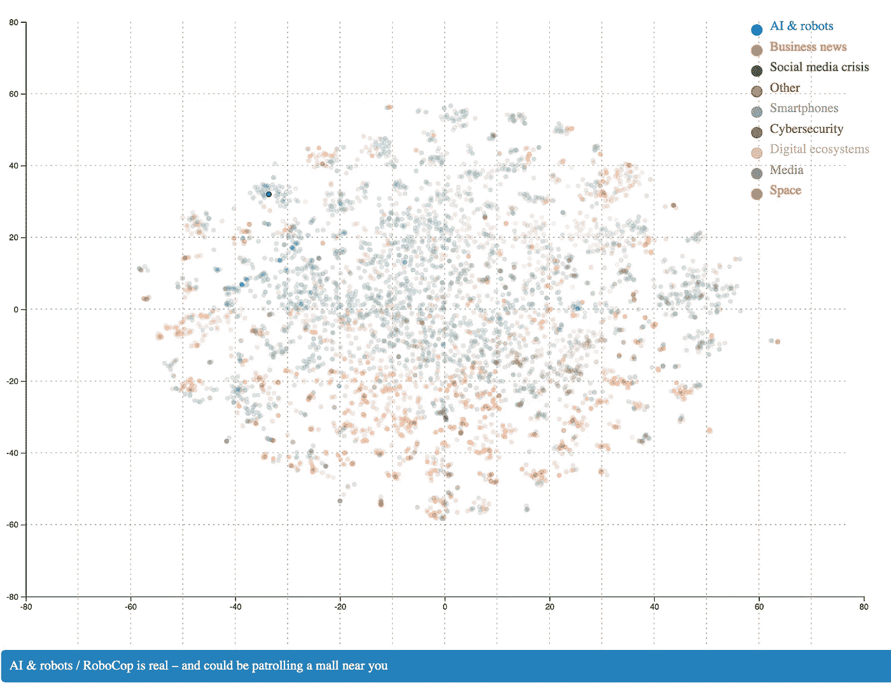

# 用 t-SNE 描绘科技世界

> 原文：<https://towardsdatascience.com/mapping-the-tech-world-with-t-sne-7be8e1703137?source=collection_archive---------35----------------------->

## 我们用 t-SNE 降维算法分析了 20 万篇科技新闻文章

*克里斯托夫·乔迪、祖卡斯·纳瓦罗、米查什·帕利斯基、马切伊·维拉莫夫斯基(德拉布·UW，华沙大学)*

基于 LDA、t-SNE 和 PCA 的文章聚类。图片作者:德拉布·UW

> *作为*[*NGI*](https://research.ngi.eu)*项目的一部分，* [*德拉布·UW*](http://www.delab.uw.edu.pl/pl/)*正在支持欧盟委员会的* [*下一代互联网*](https://www.ngi.eu) *倡议，以识别与互联网相关的新兴技术和社会问题。我们的团队一直在尝试各种自然语言处理方法，以发现不同类型的在线媒体中的趋势和隐藏模式。你可以在这里* *找到我们的工具和演示* [*。*](https://fwd.delabapps.eu)

这篇文章是我们展示最新科技新闻分析结果的迷你系列的一部分。我们有两个主要目标:

1.  发现讨论新兴技术和社会问题的新闻中最重要的话题(参见我们之前的[帖子](/mapping-the-tech-world-with-topic-modelling-bfc3c40af507)！),
2.  来映射这些主题之间的关系。

我们的文本挖掘练习基于一个科技新闻数据集，该数据集由 2016 年 1 月至 2019 年 5 月期间收集的 20 多万篇科技媒体文章组成。关于数据集的更多信息可以在我们的 [Zenodo 知识库](https://zenodo.org/communities/ngi_forward/)中获得。

在这一部分中，我们将展示如何使用降维技术 t-SNE 和流行主题建模算法(LDA)来映射面向科技的新闻文章。我们表明，这些方法一起应用可以加强和补充对方。

我们首先简要介绍一下 t-SNE 算法。然后，我们提出了我们的映射练习的结果。

# t-SNE

t-SNE 由 [van der Maaten 和 Hinton](http://www.jmlr.org/papers/volume9/vandermaaten08a/vandermaaten08a.pdf) (2008)引入，并在多次尝试后找到一种保持局部结构的降维算法。与早期的算法相比，它设法获得了牵引力，据谷歌学术称，它已经被引用了近 1 万篇文章。

SNE，t-SNE 的基本算法，最小化全维和低维嵌入的概率分布之间的差异。目标是保持一个点选择另一个点作为其邻居的条件概率。该分布是高斯分布，并且给定点的标准偏差(其对于所有点不是恒定的)是基于困惑来选择的，困惑可以被理解为所考虑的最近邻居的数量。梯度下降找到局部最小值。

该算法存在拥挤问题——在三维空间中，可以找到 4 个彼此等距的点(四面体的角)，而在二维空间中，可能只存在 3 个这样的点(三角形)。在从 3 维到 2 维的变换中保持这种相似性在数学上是不可能的，但是将低维分布切换到具有较重尾部的分布可以缓解拥挤问题。

不承诺维护数据的全局结构。然而，生物学的最新发展——其中 t-SNE 被广泛用于转录组学——描述了全球结构可视化方面的改进。该程序( [Kobak，Berens](https://www.biorxiv.org/content/10.1101/453449v1) 2018)使用 PCA 作为可视化的起点，并采用“困惑退火”——来自高困惑 t-SNE 的输出被用作较低困惑 t-SNE 的初始化。他们的可视化在某些方面与我们的数据不同——PCA 在转录组学中提供了相当好的结果，但在文本挖掘中作为独立的工具是无用的。

我们的结果表明，使用主成分分析作为 t-SNE 初始化有各种优势。我们将使用这种方法的组合在二维空间中对文章进行聚类:覆盖相似主题的文章将通过算法彼此靠近放置。

# 映射所有文章

我们能够从[主题建模分析](/mapping-the-tech-world-with-topic-modelling-bfc3c40af507)中观察到最流行的主题。然而，基于主题词的分析很难揭示进一步的细节。为了检查哪些文章讨论了各种主题，我们转向使用 t-SNE 进行文档聚类。

互动观想见:【https://mpalinski.github.io/ngi-fwd-deliv/】T4

该地图以二维方式呈现文章:相邻的文章以相似的词汇为特征，并且可能覆盖相同的主题。此外，我们还用颜色标记主题建模分析的结果:它标记了文档的主导主题。为了更好的可视性，地图为 8 个最常见的主题提供了不同的颜色，而其余的主题被合并到一个类别(“其他”)。地图还允许查看图表下方的文章标题。

互动可视化见:[https://bit.ly/2r0ERx8](https://bit.ly/2r0ERx8)

地图显示，LDA 和 t-SNE 对我们的文档进行了类似的分组:t-SNE 将颜色相同的文章放在一起。我们可以识别大群的绿色、蓝色、紫色等。文章。这支持了文本挖掘策略的健壮性。

此外，该图证明了我们的方法提供不同粒度水平的文章聚类的能力。基于对聚类的分析，我们能够在由 LDA 确定的大范围主题内识别更具体的区域。例如，LDA 返回了一大类主要涉及社交媒体危机问题的文章。t-SNE 帮助我们进一步将这些文章分为更小的集群:专注于特定的社交媒体平台(例如，Twitter 上的文章可以在(50，-10)，脸书上的文章可以在(50，10)，或川普总统使用社交媒体的文章(0，-30))。

t-SNE 的另一个优势由苹果-联邦调查局加密辩论(35，10)上的集群展示。基于 LDA 话题术语，我们将整个绿色话题命名为*社交媒体危机*，而这组文章还包括其他技术政策领域。SNE 霸王龙帮助我们认识到这些更微妙的细节。

同样值得注意的是，t-SNE 是如何将来自不同 LDA 主题、具有共同特征的文章组合在一起的。一个这样的例子是 Google 上的集群(20，10 ),其中包括关于 Youtube 问题的故事、商业新闻或关于 Google 智能手机软件开发的文章。

云彼此的接近似乎也是有意义和有信息的，因为它可以通过人工智能和机器人集群的例子来观察。在图的左上部分(-35，30)，你可以找到一组关于机器人的文章。云的左边部分由讨论机器人技术的变革潜力(例如工作自动化)的文章组成，而右边部分涉及硬件问题(例如电池)。整个机器人集群靠近另一个与有意识人工智能和真正的自主人工智能相关的蓝色集群，位于东南方向(-30，20)。可以找到更多关于人工智能伦理方面的文章。正如我们所见，空间距离类似于这里的“主题距离”。

在其余集群中也可以观察到类似的规律:商业新闻、智能手机、网络安全、跨平台开发、流媒体和太空探索。

例如，在网络安全文章的情况下，关于分散式网络安全的群组(0，-55)和处理数据泄露的群组(15，-15)之间有明确的划分。后一个在逻辑上位于关于在线隐私问题的文章簇的旁边(10，-15)。

在智能手机子类别中，我们可以观察到与各种 VR 技术相关的文章(0，55)与智能手机相机技术的文章(0，40)接近。关于连续几代 iPhone 的新功能和销售的文章聚集在(35，20)，就在与 iOS 相关的群集的右侧。

# C 结论

我们证明了将 LDA 主题建模与 t-SNE 聚类相结合的有效性。主题建模在探索广泛的主题(例如，社交媒体危机、人工智能或商业新闻)以及对文章进行分组以供进一步分析时非常有用。然而，它对于更细微、更精细的分析的有用性是有限的。这就是 t-SNE 算法派上用场的地方。我们的结果表明，这种研究方法组合非常适合绘制科技新闻景观。特别是，我们的映射实践证明了我们的方法提供不同粒度水平的文章聚类的能力。

我们的[完整报道](https://fwd.delabapps.eu/topic_modelling.html#Results-qualitative-analysis)还深入探讨了技术讨论中反复出现的总括性话题(即:人工智能&机器人、政策、媒体、商业和网络安全)。