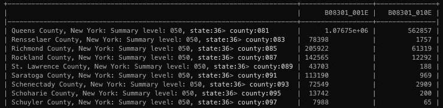
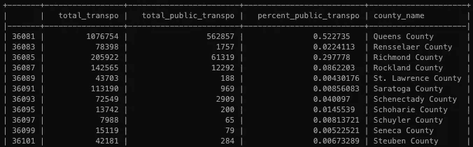
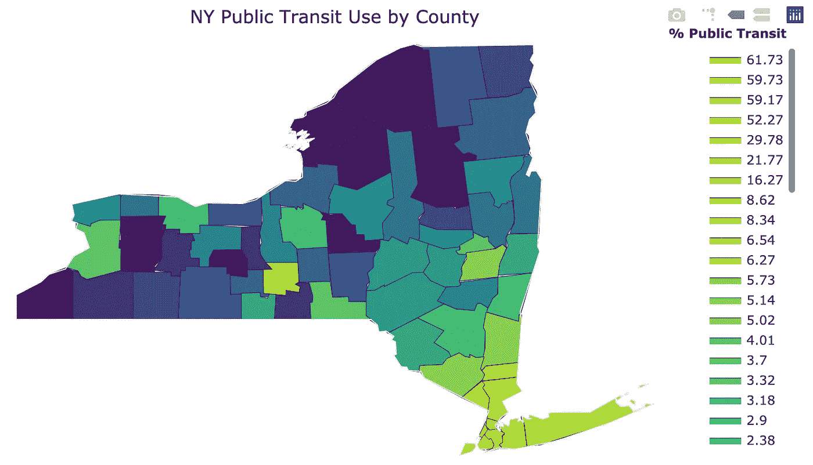

# 用 Python 绘制美国人口普查数据

> 原文：<https://towardsdatascience.com/mapping-us-census-data-with-python-607df3de4b9c?source=collection_archive---------24----------------------->

## 公共数据

## 制作纽约州公共交通使用的地图

如果你曾经想要创建你最喜欢的人口普查统计数据的快速地理可视化，那么你来对地方了！首先，你需要得到你感兴趣的人口普查数据。对于这个例子，我们将使用纽约州的交通数据。

## 数据下载

现在您需要导入所需的包。如果你是第一次接触 *censusdata* 软件包，请花点时间熟悉一下使用[优秀文档](https://jtleider.github.io/censusdata/)或这个[关于这个主题的介绍性博客](/accessing-census-data-with-python-3e2f2b56e20d)

```
import pandas as pd
import censusdata
from tabulate import tabulate
```

现在我们需要下载我们感兴趣的数据。

```
df = censusdata.download('acs5', 
           2015,
           censusdata.censusgeo([('state', '36'), ('county', '*')]),
           ['B08301_001E', 'B08301_010E'])
```

该方法参数的快速分解:

*   **‘ACS 5’**指的是 5 年美国社区调查，并指定我们下载的数据库。
*   **2015 年**是我们获取数据的年份
*   **census data . census geo([(' state '，' 36 ')，(' county '，' * '))**定义我们感兴趣的地理位置。“36”值是纽约州的 FIPS(联邦信息处理标准)代码，而“*”表示我们需要每个县。要查找您所在州或县的 FIPS 代码，请参考维基百科页面[。](https://en.wikipedia.org/wiki/Federal_Information_Processing_Standard_state_code)
*   **['B08301_001E '，' B08301_010E']** 这是我们感兴趣的具体两个表的列表。注意，这些是预先使用 *censusdata 的搜索功能定位的。*

## 数据帧准备

现在，让我们看看数据框中有什么。

```
print(tabulate(df, headers='keys', tablefmt='psql'))
```



好的，我们确实在这个表中得到了我们想要的原始信息，但是现在解释起来有点麻烦。例如，这里的 Id 值是 *censusgeo 对象。Y* ikes！

首先，我们将更改那些表 id 的现有列名，以反映它们的内容。

```
column_names = ['total_transpo', 'total_public_transpo']
df.columns = column_names
```

接下来，我们将设计一个新列，它只是公共交通的比率。

```
df['percent_public_transpo'] = df.apply(
   lambda row: row['total_public_transpo']/row['total_transpo'], 
   axis = 1)
```

现在我们将在提取县名时重新定义索引。

```
new_indices = []
county_names = []for index in df.index.tolist():
        new_index = index.geo[0][1] + index.geo[1][1]
        new_indices.append(new_index)
        county_name = index.name.split(',')[0]
        county_names.append(county_name)df.index = new_indices
df['county_name'] = county_names
```

好吧，让我们再看看。



好多了！现在在地图上

## 绘图

为了进行映射，我们将使用一个名为[*figure _ factory*](https://plotly.com/python/county-choropleth/)*的特性，它将为我们做很多工作*。*所以第一件事就是导入包。*

```
*import plotly.figure_factory as ff*
```

*现在创建地图只需要几行代码。*

```
*fig = ff.create_choropleth(fips=df.index, 
                           scope=['New York'],
                           values=df.percent_public_transpo, 
                           title='NY Public Transit Use by County', 
                           legend_title='% Public Transit')
fig.layout.template = None
fig.show()*
```

**

*对于几行代码来说看起来相当不错！但是不要被愚弄了，我们通过以一种与 *figure_factory* 兼容的方式构建我们的数据框架，努力为我们的成功做好准备。例如，它以*州代码* + *县代码的形式接收 FIPS 数据。*因此，通过重命名我们的索引来遵循这种形式，我们可以简单地将直接的索引值传递到方法中*

*最后，这张地图中的数据以我们预期的方式分布，一个巨大的热点以纽约市为中心，越往外越淡。*

*这就是它的全部，现在获取映射！*