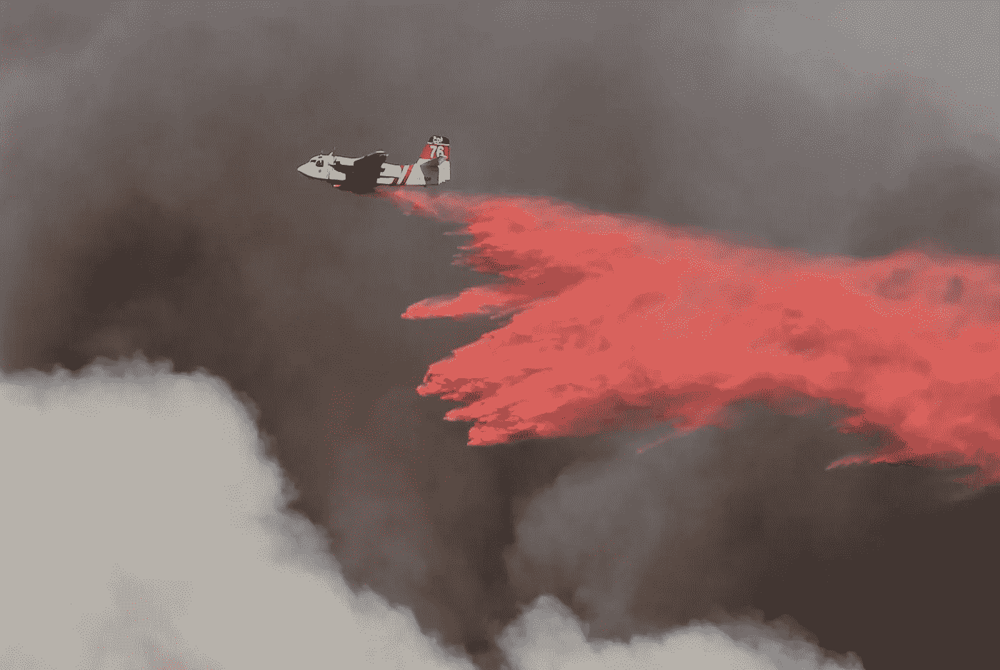
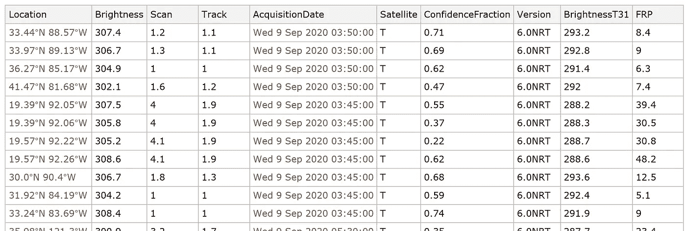
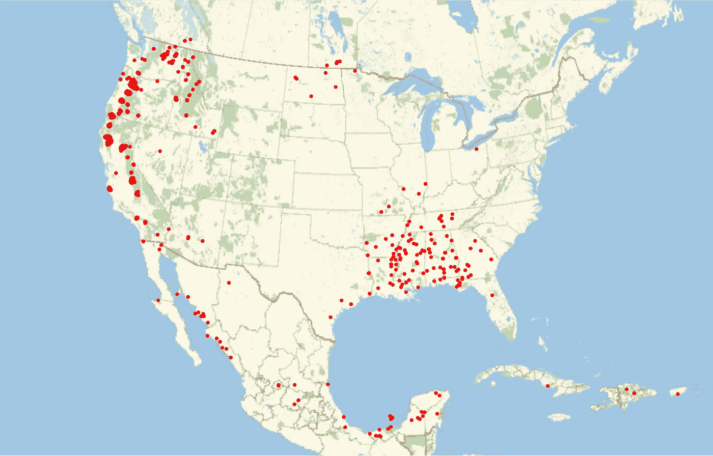
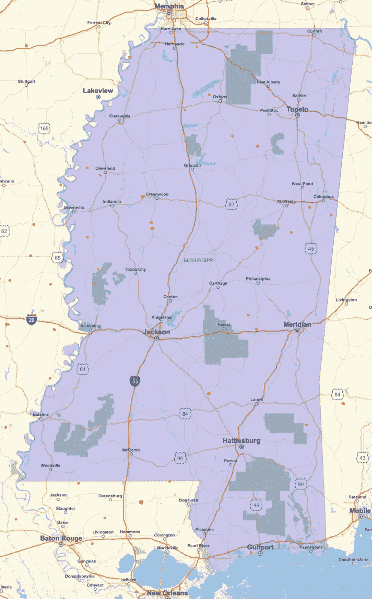
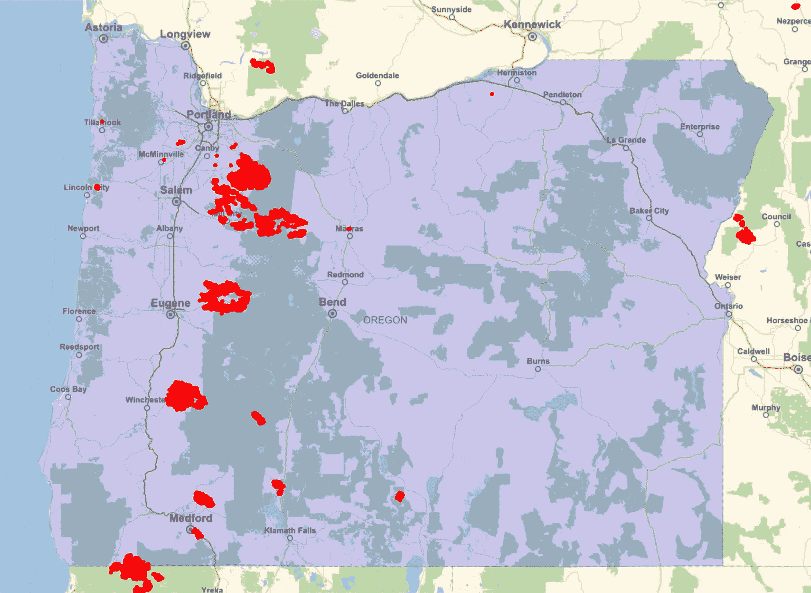
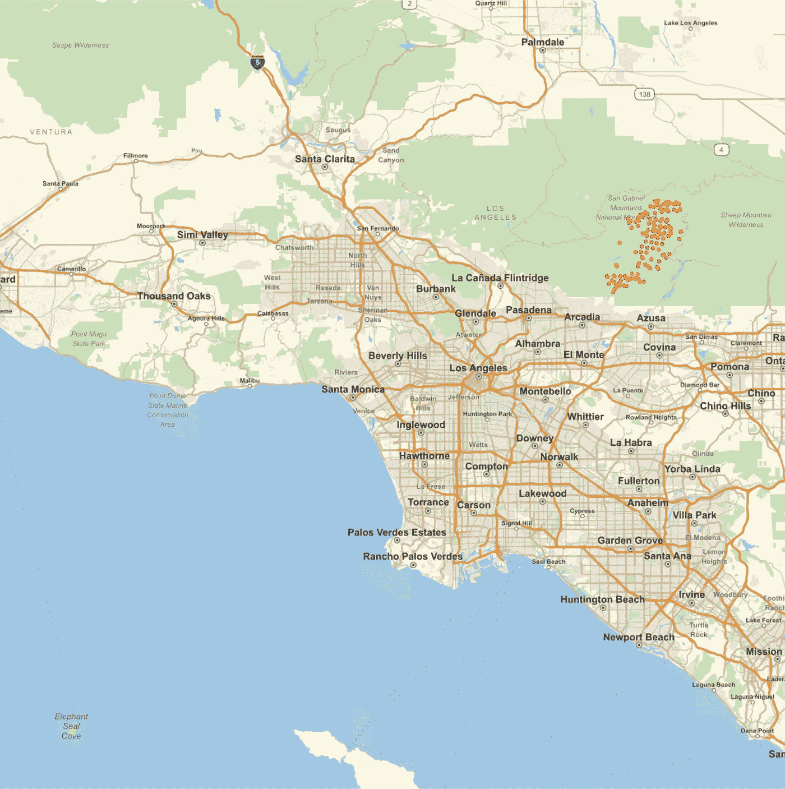
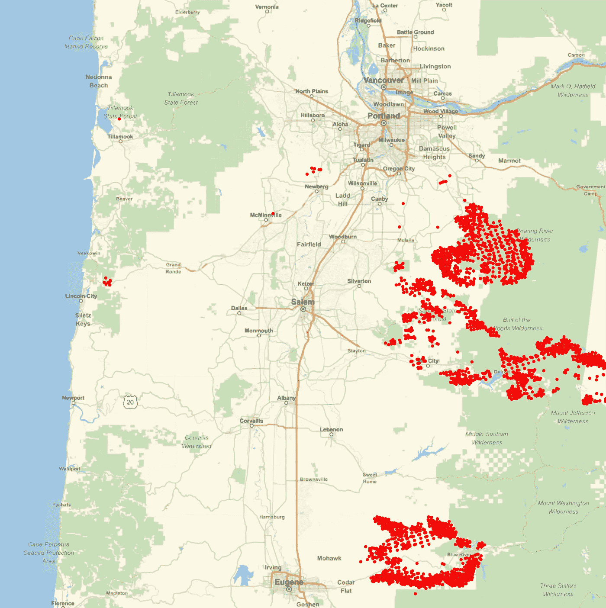

# 用 Wolfram 语言绘制野火地图

> 原文：<https://towardsdatascience.com/mapping-wildfires-with-the-wolfram-language-6ddbd9b030b0?source=collection_archive---------51----------------------->

## 探索和测绘 NASA 野火卫星数据



[本阔](https://unsplash.com/@benkuo?utm_source=unsplash&utm_medium=referral&utm_content=creditCopyText)在 [Unsplash](https://unsplash.com/s/photos/wildfire?utm_source=unsplash&utm_medium=referral&utm_content=creditCopyText) 上拍照

最近野火在多个州蔓延。加州遭受了历史上最大的几场野火。俄勒冈州有 20 处大火，覆盖面积超过 40 万英亩。甚至华盛顿今年也不能幸免。

为了了解当前的野火在哪里，我实现了一个名为 [WildfireData](https://www.wolframcloud.com/obj/arnoudb/DeployedResources/Function/WildfireData) 的功能，该功能从美国宇航局的 Terra 和 Aqua 卫星上的 MODIS 仪器获取数据(代码包含在本文末尾):

[https://modis.gsfc.nasa.gov/](https://modis.gsfc.nasa.gov/)

此 WildfireData 函数可通过以下全局资源函数 URI 进行访问:

```
WildfireData = ResourceFunction[
  "user:arnoudb/DeployedResources/Function/WildfireData"
]
```

我们现在可以立即使用该功能从 NASA 获取当前可用的野火数据:

```
data = WildfireData[]
```

输出是一个包含几列的数据集。第一列保存野火观测的地理位置，第二列保存其亮度:



(图片由作者提供)

我们可以从在地图上标出所有地点开始:

```
GeoGraphics[{Red, Point[data[All, "Location"]]}]
```

输出显示了观察到的野火:



(图片由作者提供)

在这个缩放级别，看起来南方有很多野火，但是我们可以放大到，例如，密西西比州来近距离观察:

```
ms = Entity["AdministrativeDivision", 
  {"Mississippi", "UnitedStates"}];GeoGraphics[{
  Blue, Polygon[ms], 
  Red, Point[data[All, "Location"]]
  },
  GeoRange -> ms
]
```

近距离观察，可以清楚地看到这些野火相当分散且孤立:



(图片由作者提供)

我们可以比较密西西比州和俄勒冈州的差异:

```
or = Entity["AdministrativeDivision", {"Oregon", "UnitedStates"}];GeoGraphics[{
  Blue, Polygon[or], 
  Red, Point[data[All, "Location"]]},
  GeoRange -> or
]
```

俄勒冈州的野火数量要多得多:



(图片由作者提供)

我们可以放大任何区域，例如，洛杉矶中心 40 英里以内的区域:

```
la = Entity["City", {"LosAngeles", "California", "UnitedStates"}];GeoGraphics[{
  Red, Point[data[All, "Location"]]},
  GeoRange -> GeoDisk[la, Quantity[40, "Miles"]]
]
```

圣加布里埃尔山脉有许多野火:



(图片由作者提供)

这些野火被命名为山猫火(Twitter 上的#山猫火):

俄勒冈州塞勒姆东部也有大面积的野火:

```
area = Entity[“City”, {“Salem”, “Oregon”, “UnitedStates”}]GeoGraphics[{
   Red, Point[data[All, "Location"]]},
   GeoRange -> GeoDisk[area, Quantity[60, "Miles"]]
]
```

这显示了一个非常大的野火群:



(图片由作者提供)

不幸的是，西部的野火季节预计要到 11 月份才会结束。到目前为止，仅在加利福尼亚，超过 3，000，000 英亩的土地被烧毁，估计损失达 8 亿美元。俄勒冈州损失了 60 多万英亩，华盛顿州损失了 50 多万英亩。

WildfireData 函数的代码: