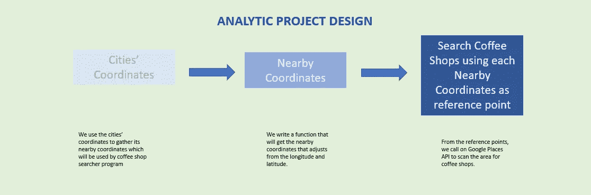
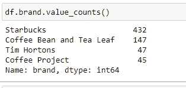
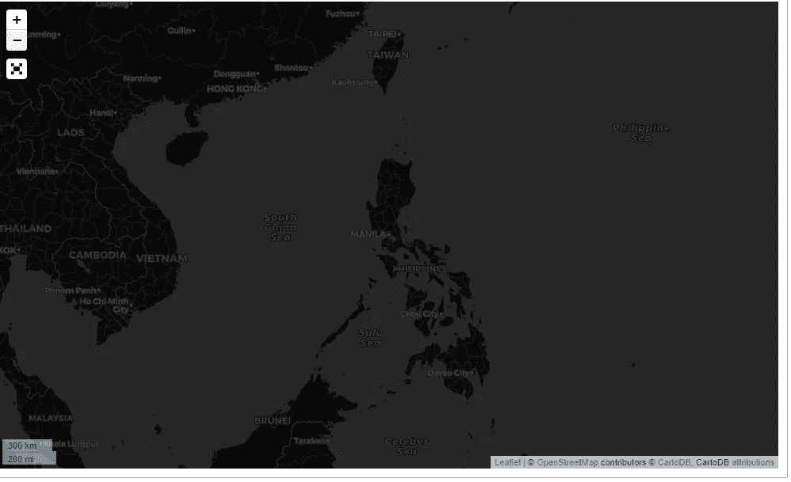
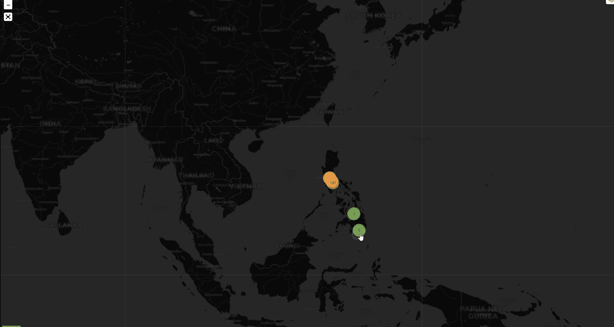
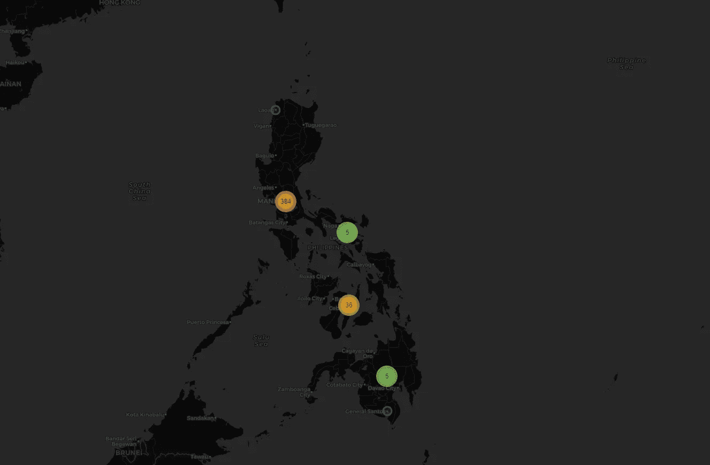

# 使用 Google Places API 和 leav 绘制您在菲律宾最喜欢的咖啡店地图

> 原文：<https://towardsdatascience.com/mapping-your-favorite-coffee-shop-in-the-philippines-using-google-places-api-and-folium-2f9d5ad697bf?source=collection_archive---------60----------------------->

## [实践教程](https://towardsdatascience.com/tagged/hands-on-tutorials)

## 使用 Google Places API 和 leav 绘制菲律宾的咖啡馆地图


照片由 [Vicky Gu](https://unsplash.com/@vickygu?utm_source=medium&utm_medium=referral) 在 [Unsplash](https://unsplash.com?utm_source=medium&utm_medium=referral) 上拍摄

# 为什么是咖啡？

对我们大多数人来说，咖啡已经成为我们早晨日常生活中不可或缺的一部分。

但在很多城市规划研究中，咖啡店的数量已经成为一个地方或一个城市发展水平的标志。这并不奇怪，因为咖啡店是商业和客户会议的场所，而且位于商业区，忙碌的员工需要快速获得咖啡。

因此，仅仅通过知道一个地方咖啡店的数量，就能告诉我们一些有价值的东西。但是我们如何进行呢？

# **数据科学如何改善这一过程**

既然我们知道了这些数据的重要性，那么我们应该如何收集这些数据呢？

一些咖啡连锁店有一个位置列表，可以在他们的网站上找到，我们可以通过复制信息并自己对数据进行地理编码来手动获取。

但是这将导致冗长的过程，容易出错，并且可能需要更长的时间来清理。

这就是数据科学的魔力所在。对于本教程，让我们使用 Google API 收集数据，并使用 follow 以 HTML 格式可视化我们的数据。

> 演职员表:我们从 artemrys 借用了一些代码，并对其进行了修改，以满足菲律宾城市的需要，并返回比 count 更多的代码。

**分析项目设计**



我们这个项目的设计

上面的图片总结了我们处理这个项目的过程。**注意，这仅用于数据采集**。我没有把清理和数据可视化放在这里，因为它们通常是通常分析项目的一部分。

**准备工作**

```
#Preliminaries
from collections import namedtuple
import requests
import csv
import time
import json
import os
import pandas as pd#For Interactive GeoVisualization
import folium
from folium import Map
from folium.map import Layer, FeatureGroup, LayerControl, Marker
from folium.plugins import MarkerCluster, FeatureGroupSubGroup, Fullscreen#To turn our DataFrame to a GeoDataFrame
import geopandas as gpd
from shapely.geometry import Point, Polygon
```

**为什么选择 Google API？**

在*谷歌地图 API* 和 *OpenStreetMap* 之间，*谷歌地图 API* 返回更多更新的数据。这可能是因为谷歌使用了更多的资源，拥有了更多的用户。不过需要注意的是，在多次调用后，谷歌开始收费，所以我建议开发者阅读成本矩阵，并在使用 API 时保持警惕。

出于本教程的目的，假设您本月没有使用 Google API(*免费层每月刷新*)，这不会花费您什么。

测试代码时，将 API 调用限制在几行内，这样就不会出现耗尽自由层的错误。

不言而喻，为了继续，你应该注册一个 Google API 密钥。

```
#the namedtuple method returns a new subclass of tuple with named fields
#this is a convenient way of assigning names to tuples so you can later access them by name
CityCoords = namedtuple("CityCoords", ["city_name", "lat", "lng", "region"])# Google Maps Key
# GMAPS_KEY = {Place your GMAPS Key here}#Google Place API Request
#Note that we {lat}, {long}, {radius}, {keywords} and {key} will be arguments that we need to supply in later
G_PLACES_API = "[https://maps.googleapis.com/maps/api/place/nearbysearch/json?location={lat},{lng}&radius={radius}&keyword={keyword}&key={key](https://maps.googleapis.com/maps/api/place/nearbysearch/json?location={lat},{lng}&radius={radius}&keyword={keyword}&key={key)}"#Token to skip to next page
G_PLACES_NEXT_PAGE_TOKEN = "[https://maps.googleapis.com/maps/api/place/nearbysearch/json?pagetoken={page_token}&key={key](https://maps.googleapis.com/maps/api/place/nearbysearch/json?pagetoken={page_token}&key={key)}"
```

您现在就可以指出您希望形象化的品牌。我最喜欢的四个咖啡品牌是星巴克、咖啡豆和茶叶、蒂姆·霍顿和咖啡计划。

```
#Indicate brands you wish to collect
coffee_brands = ["Coffee Bean and Tea Leaf", "Starbucks", "Tim Hortons", "Coffee Project"]
```

**定义功能**

让我们定义我们稍后将调用的函数。回想一下，我们有一个分析设计要遵循，我们将编写与过程的每一步相对应的函数。

这一步相当长，所以我们不把它们放在这里。相反，请访问我的 [Github 页面](https://github.com/francisadrianviernes/Mapping-Your-Favorite-Coffee-Shop-in-the-Philippines-using-Google-Places-API-and-Folium)获取完整代码。

我的页面将包含地理编码的菲律宾城市供所有人使用。

**清理数据集**

运行代码收集数据后，现在是清理数据的时候了。

我们从 API 请求中获得的数据可能不完全干净。当你使用的关键词与其他品牌的关键词匹配时，这种情况尤其会发生。以咖啡豆和茶叶为例，那里的咖啡也可能与其他咖啡店的相匹配。

截至 2020 年 10 月，我们最喜爱的咖啡店的最终统计结果如下:



**通过树叶进行地理可视化**

首先，要使用 our，我们必须将数据框转换为地理数据框:

```
geometry = [Point(xy) for xy in zip(df['lng'], df['lat'])]#Let us create GeoDataFrame with df data and list of Point Geometries
gdf = gpd.GeoDataFrame(df, geometry=geometry)
```

接下来，我们实例化叶子地图:

```
#The folium.Map instantiates a folium map object with given parameters
coffee_map = folium.Map(location = [14.5540,120.9752],
                       zoom_start=5, #from experience, this zoom level captures the whole PH
                       tiles='CartoDB dark_matter',
                       control_scale=True,
                       prefer_canvas=True)
#Add Fullscreen Control
Fullscreen(
            title="Full Screen",
            title_cancel = "Exit fullscreen",
            force_separate_button=True).add_to(coffee_map)
```



这就是我们的树叶地图的样子

在我们继续之前，我们需要为每个咖啡品牌分配不同的颜色，以便它在地图上看起来更好:

```
#Let's Create a Color Dictionary for the Markers
color_dict = {
    "Starbucks": ' #00704A',
    "Coffee Bean and Tea Leaf": '#362d26',
    "Coffee Project": '#654321',
    "Tim Hortons": '#dd0f2d'
}
```

之后，让我们添加标记和聚类工具。

```
#Since we need to add a filter for this, we need to add them by brand:for brand in coffee_brands:
    df_i = gdf[gdf['brand']==brand]
    df_i.loc[:, "color"] = color_dict[brand]

    #Let's add a marker feature - clustering
    marker_cluster = MarkerCluster(control=False) #False so it will not appear as a layer
    marker_cluster.add_to(coffee_map)
    sub_group = FeatureGroupSubGroup(marker_cluster, name=brand, control=True, show=True)

    #Popup Contents
    for index, row in df_i.iterrows():

        html = """

        <h3>{title}</h3><br>
        <b> {brand}</b><br>
          {vicinity}<br>

        """

        popup_contents = folium.Html(html.format(title = df_i.loc[index, 'name'],
                                                     brand = row.brand,
                                                     vicinity = row.vicinity),
                                         script = True)

        popup = folium.Popup(popup_contents, max_width=2650)

        folium.vector_layers.CircleMarker(radius = 8,
                                                  location = (row.geometry.y,
                                                              row.geometry.x),
                                                  popup = popup,
                                                  color = row.color,
                                                  fill = True,
                                                  fill_color = row.color,
                                                  name = brand,
                                                  control = True,
                                                  overlay = True
                                                 ).add_to(sub_group)
        sub_group.add_to(coffee_map)
```

当我们完成后，我们的地图将看起来像这样:



活动中的叶子标记

**见解**



菲律宾的咖啡店集群(星巴克、咖啡豆、茶叶、蒂姆·霍顿和咖啡项目)

从上面这张地图，我们可以清楚地看到，我们最喜欢的咖啡品牌大多都相当集中在菲律宾的老牌商业区。

不过有一点需要注意的是，在菲律宾的其他地方可能没有那么受欢迎的咖啡连锁店，只有我们喜欢的咖啡连锁店才会出现在主要的商业区——大马尼拉、宿务、莱加斯皮、那加和达沃市。

人们可以假设一个集群中的咖啡店越多，商业区就越发达，因此我们可以使用这些信息来跟踪哪些正在快速发展。

让我知道你们的想法！

完整代码可从 [GitHub](https://github.com/francisadrianviernes/Mapping-Your-Favorite-Coffee-Shop-in-the-Philippines-using-Google-Places-API-and-Folium) 获得。