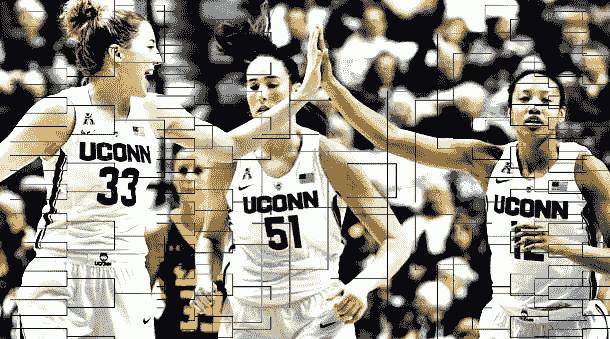
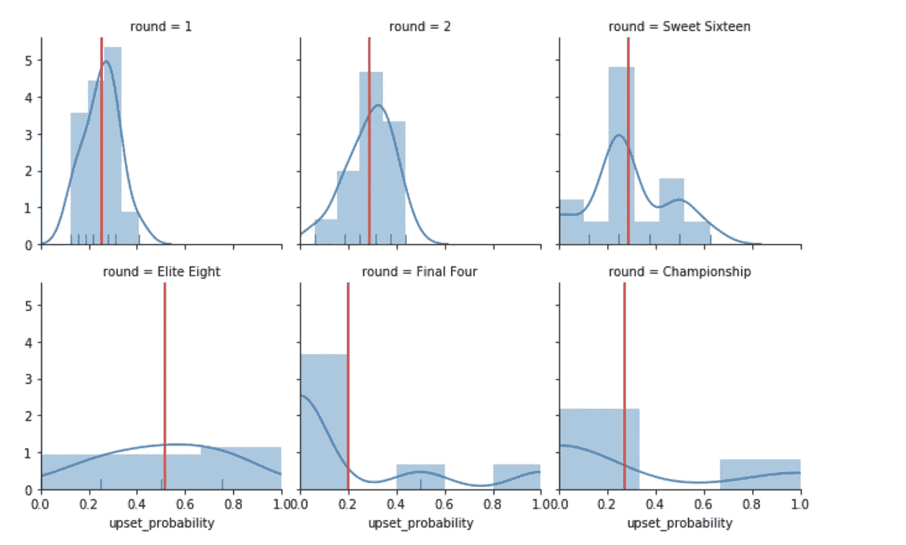
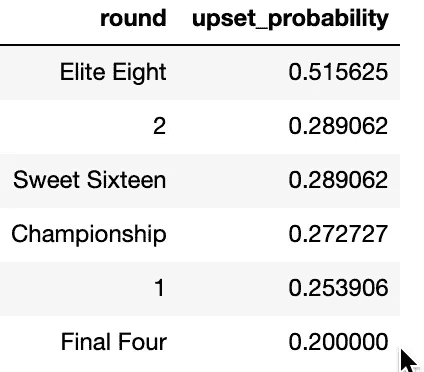
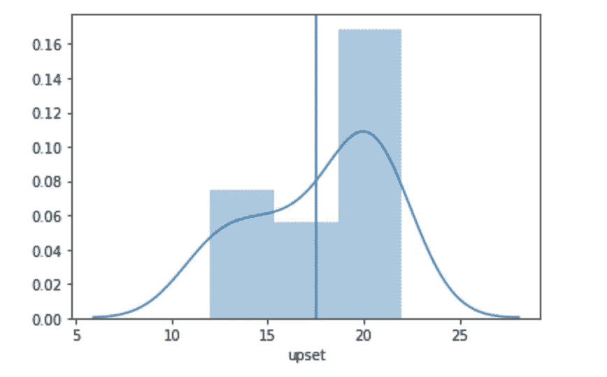
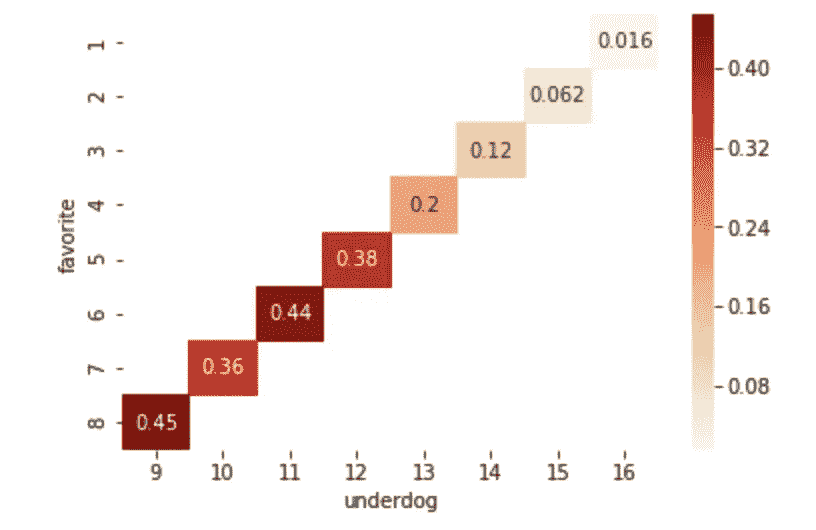
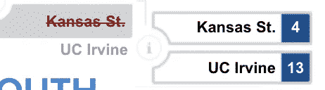
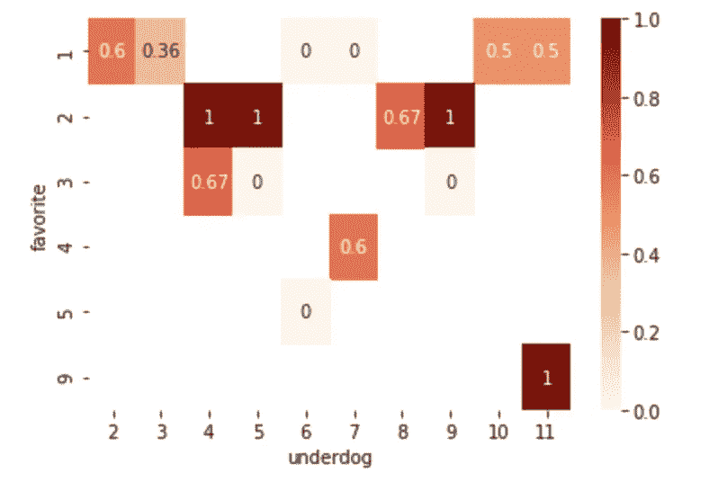
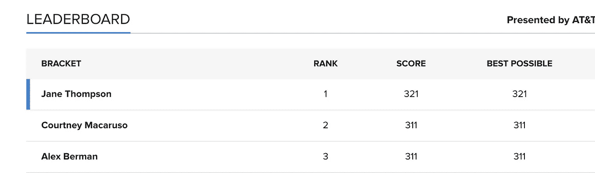

# 建立一个胜利的疯狂三月支架

> 原文：<https://towardsdatascience.com/march-madness-9212109bc8e8?source=collection_archive---------15----------------------->

## 使用统计数据对三月疯狂进行数据驱动预测的权威指南

[https://www . inter basket . net/news/printable-women-March-madness-bracket-2017/21290/](https://www.interbasket.net/news/printable-womens-march-madness-bracket-2017/21290/)

疯狂三月。盛大的舞会。35 年的 64 支球队篮球锦标赛，只有一个[孤独的支架](https://www.si.com/college-basketball/2019/03/26/march-madness-ncaa-tournament-perfect-bracket-greg-nigl)在头两轮比赛中保持完美。每年，一个由 10 名成员组成的评选委员会决定哪 64 支球队将参加 NCAA 锦标赛，并根据常规赛和联盟锦标赛的表现对他们进行排名。这种等级排序系统被称为“种子”，种子从 1 到 16 分布在 16 支球队的四个区域，其中 1 支种子被认为有最高的获胜概率，16 支种子被认为获胜的可能性最低。

对于我们的读者来说，首先不太清楚构建支架背后的动机，简单的答案是奖金。沃伦·巴菲特为任何员工提供终身每年循环[100 万美元存款](https://www.usatoday.com/story/sports/ncaab/tourney/2019/03/19/warren-buffett-prize-march-madness/3212487002/)，让他们在 16 岁之前选择一个完美的投资组合。

另一个不那么令人信服的原因是吹牛的权利。去年，我根据一个公认的非传统策略填写了我的组别，从而在 60+人组中获得了第一名，在 100+人组中获得了第二名。当然，不能保证我的方法会重复成功，但我还是要分享我的结果。要么接受，要么放弃，但不管你做什么，别忘了练习你的罚球。

# 1.翻转概率

我要介绍的第一个概念是“翻转概率”的概念提醒一下，当一个较高的种子队击败了一个较低的种子对手时，就会发生冷门。比如在这个具有历史意义的日子。现在 NCAA 锦标赛有 6 轮，在任何一轮中发生爆冷的平均概率是 31%。但是请注意，精英八人组相对于其他人来说是一个极端的异数。这篇文章的全部内容依赖于 2004 年至 2018 年的 NCAA 锦标赛数据(我选择了最近 15 年的时间，希望能够提取大学篮球的最新趋势，而不会引入 90 年代锦标赛的不必要的噪音)。

事实上，从历史上看，我们已经看到 4 场精英八强赛中有 2.1 场以冷门告终——对我来说，这是一个非常令人惊讶的见解，并促使我将奥本(5 号种子)推进到四强。

在继续之前，应该注意的是，一种观点认为，当两个队之间的种子差距大于 1 时，爆冷应该被保守地定义为爆冷(这意味着 2 号种子击败 1 号种子不被认为是爆冷)。然而，这种分析允许 1 的种子差异有资格成为扰乱，这可能会在我的结果中引入一些偏差。使用更保守的定义来比较任何差异，写一篇后续文章会很有趣。

在这一点上，一个敏锐的读者可能会问自己，“但是我应该挑选多少个冷门呢？”答案是 17.5(平均)。绘制每场比赛的总冷门数分布图，我们可以看到 15 到 20 似乎是个神奇的数字。让我们明智地选择。

## 2.复仇者联盟。

希望现在我们都相信冷门是重要的，在正确的时间调用正确数量的冷门是设计成功的关键。接下来我想鼓励大家仔细检查的是*哪些种子会带来哪些挫折？*也就是说，我们知道 16 比 1 是最不可能的赌注，但历史上哪些热门球队最容易受到冷门的影响？为了回答这个问题，我们可以检查一下锦标赛第一轮比赛的热图。

不出所料，8s 在 45%的情况下推翻 9s(使用 2003 年以来的数据)。然而，不太明显的是，11 推翻 6 的频率几乎一样高(44%的时间)，12 推翻 5 的频率高于 10 推翻 7 的频率。这有什么奇怪的？种子之间的差异旨在作为技能差异的代表。理论上，种子的更大差异应该与技能的更大差异相关，这意味着 5s 应该比 7s 更经常击败 12s。不过，这些数据讲述的是一个不同的故事，这可能表明要么是糟糕的种子分配，要么是存在一些单靠播种无法捕捉到的获胜可能性的信号。同样值得注意的是，13 粒种子推翻 4 粒种子的几率约为 20%。可惜我错过了 2019 年锦标赛的这个机会:

## 3.精英八识

这里有一个类似的热图，显示了在精英八强的比赛中，失败者推翻了热门对手的百分比。当种子比对手低时，2 号种子在 8 场比赛中输掉了 7 场，这不值得。然而，他们在对阵 1 号种子时赢得了 20 场比赛中的 12 场。这是一个非常奇怪的统计数据，但我相信你可以猜到我的选择，如果我在精英八强中有 2 比 1(咳，2)。

希望这个演练能帮助你了解一些关于 NCAA 锦标赛种子赛的新东西。如果没有，我很高兴你能走到这一步，我也很感谢你在百忙之中通读我的作品。作为数据科学博客帖子的长期消费者，我不得不说我对那些花时间定期发布这样的教程的人重新产生了敬意。如果您有任何问题/请求/或想要联系，请随时发送评论！

对任何仍然怀疑这种方法有效性的人，我只能说，证据就在布丁里:

