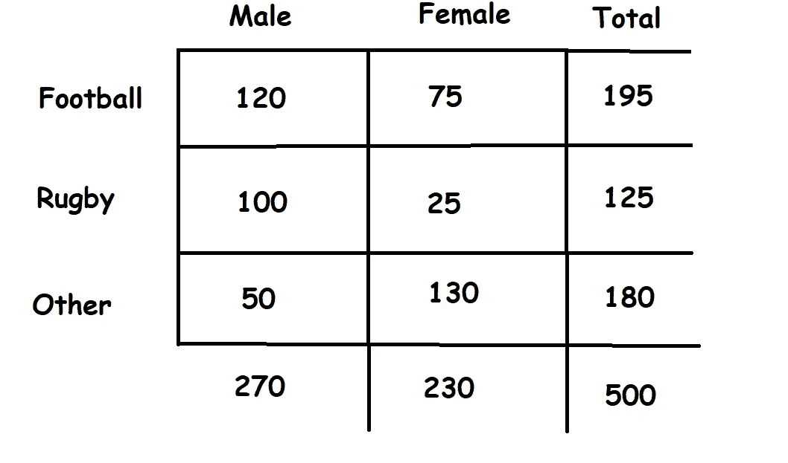
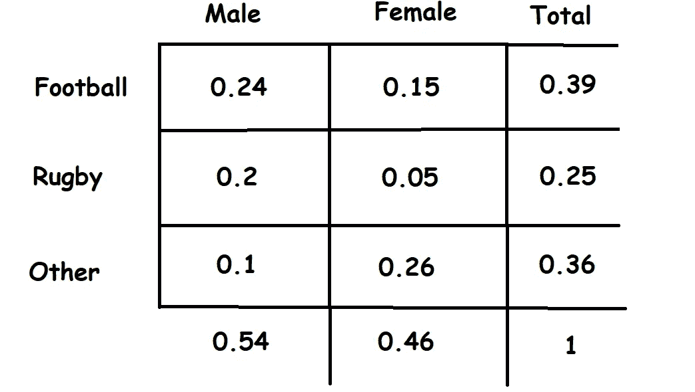
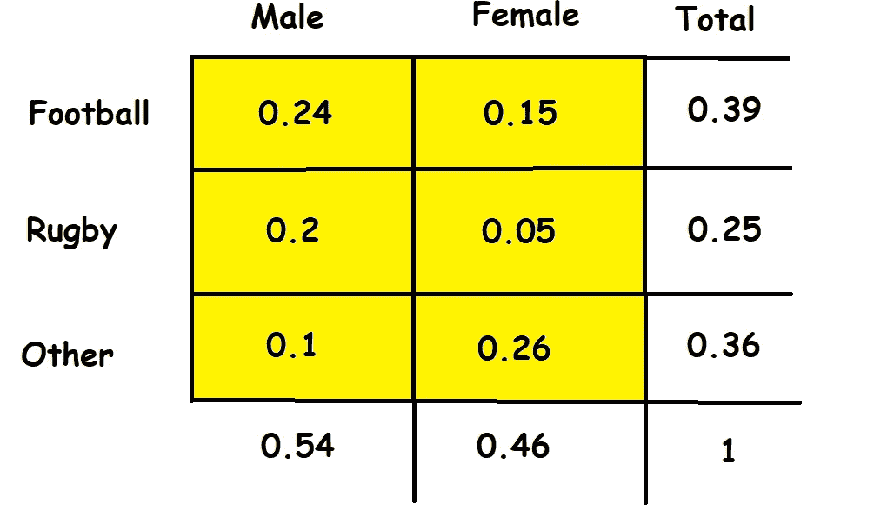
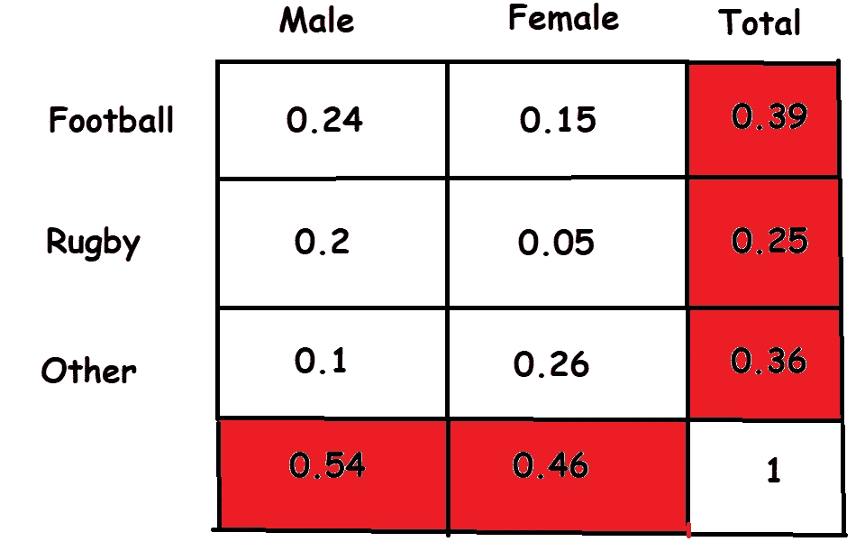
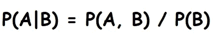

# 数据科学家解释边际、联合和条件概率

> 原文：<https://towardsdatascience.com/marginal-joint-and-conditional-probabilities-explained-by-data-scientist-4225b28907a4?source=collection_archive---------5----------------------->

## 以数据科学的方式学习概率

照片由[阿尔佩伦·亚兹古](https://unsplash.com/@armato?utm_source=medium&utm_medium=referral)在 [Unsplash](https://unsplash.com?utm_source=medium&utm_medium=referral) 上拍摄

P 概率在数据科学中扮演着非常重要的角色，因为数据科学家经常试图得出可以用来预测数据或更好地分析数据的统计推断。

统计推断是使用数据分析来推断潜在概率分布的属性的过程(**来源**:维基百科)，因此理解随机变量及其概率分布是解决许多数据科学问题所需的技能。

我将通过提供一个场景来开始这个讨论，因为我们将从这个场景中学习概率分布。

## 方案

在伦敦西区对 500 名陌生人进行了一项调查，以确定人们最喜欢的运动。选项是足球、橄榄球，其余的归类在其他选项中；测试结果显示在图 1 的*中。*

图 1:测试的结果

*图 1* 并不完全是一个概率分布，但是如果我们想要得到概率分布，我们可以简单地将图 1 中的每个数字除以 500(观察数字)，结果将是图 2 中的图像*。*

图 2:概率分布

## 联合概率

联合概率是一种统计度量，用于计算两个事件同时发生的概率，即 P(A 和 B)或 P(A，B)。比如用*图 2* 我们可以看到，某人是男性并且喜欢足球的联合概率是 0.24。

图 3:联合概率分布。

> **注意**:图 3 中高亮显示的单元格(联合概率分布)的总和必须为 1，因为分布中的每个人都必须在其中一个单元格中。

联合概率是对称的，这意味着 P(男性和足球)= P(足球和男性)，我们还可以用它来寻找其他类型的分布，边际分布和条件分布。

## 边际分布

在概率论和统计学中，随机变量集合的子集的边际分布是该子集中包含的变量的概率分布。它给出了子集中变量的各种值的概率，而没有参考其他变量的值(**来源** : [维基百科](https://en.wikipedia.org/wiki/Marginal_distribution))——如果这太过行话，简单地说，边际概率是一个事件的概率，而不考虑另一个变量的结果——P(A)或 P(B)。

图 4:边际分布

> **注意**:不管我们忽略性别还是运动，我们的边际分布总和一定是 1。

边际概率的一个有趣的事实是，所有的边际概率都出现在页边空白处——这多酷啊。因此，P(女性)= 0.46 完全忽略了女性喜欢的运动，而 P(橄榄球)= 0.25 完全忽略了性别。

## 条件概率

条件概率概念是概率论中最基本的概念之一，在我看来是一种更复杂的概率类型。它定义了在一个事件已经发生的情况下，另一个事件发生的概率(通过假设、推测、断言或证据)。

图 5:条件概率的表达式

为了理解这一点，让我们再次使用*图 2*；如果我们想计算一个人喜欢橄榄球的概率，假设他们是女性，我们必须得到这个人是女性并且喜欢橄榄球的联合概率( *P(女性和橄榄球)*)并除以条件概率。在这种情况下，概率是这个人是一个女性( *P(女性)*)，我们可以从边缘算出是 0.46，因此我们得到 0.11(两位小数)。

让我们把它写得更整洁些:

p(女性，橄榄球)= 0.05

p(女性)= 0.46

p(橄榄球|女性)= 0.05 / 0.46 = 0.11(精确到小数点后 2 位)。

如果我们继续填写偏好某项运动的概率，假设观察对象是女性，那么我们将得到一个条件概率分布。

## 包裹

这是指南是一个非常简单的介绍联合，边际和条件概率。作为一名数据科学家，了解这些分布可能仍然会让你遭到嫉妒的统计学家的死亡凝视，但至少这次是因为他们只是愤怒的人，而不是你错了— **我在开玩笑！**

让我们继续 LinkedIn 上的对话…

 [## Kurtis Pykes -人工智能作家-走向数据科学| LinkedIn

### 在世界上最大的职业社区 LinkedIn 上查看 Kurtis Pykes 的个人资料。Kurtis 有两个工作列在他们的…

www.linkedin.com](https://www.linkedin.com/in/kurtispykes/)