# 奥斯陆证券交易所的市场异常现象

> 原文：<https://towardsdatascience.com/market-anomalies-on-the-oslo-stock-exchange-40ce29886ed7?source=collection_archive---------18----------------------->

## 用 Python 分析挪威股票市场的日历效应


致谢:乔治·雷克斯，Flickr

# 有效市场假说

EMH 是一个经济假说，认为资产价格完全反映在可获得的信息中。假设这是真的，我们不能用过去来预测未来，因为所有的运动都是新信息的结果。更有可能的是，人类行为效应导致了市场的低效率，尽管价格发现更快的发达市场加剧了这种低效率。

# 市场异常

市场异常是指如果 EMH 是真实的，就不会发生的任何可见的影响。有数不清的可能异常，一些比另一些有更多的研究支持。与日历相关的影响得到了很好的研究，其中包括:

*   万圣节效应(在万圣节和 1。5 月份，今年剩余时间出售)
*   圣诞老人集会(圣诞节和新年之间价格飙升)
*   岁末效应(股票价格从年末到下一年上涨的趋势，类似于圣诞老人涨势)
*   一月效应(建立在一年之交的基础上，股票在一月份表现优于其他月份的趋势)
*   周末效应(周一的市场回报低于前一个周五)
*   月末效应(股票价格在月末上升到下个月的趋势)

如果这些异常情况存在，为什么？可能与机构何时重新平衡投资组合有关。发薪日可能会有影响，在接近发薪日时增加销售，而在发薪日之后增加销售。投资者想要在年底买入或卖出可能有与税收相关的原因。在挪威，你可以根据股票市场的损失获得减税，并为收益缴税。因为这是按 31 计算的。12 月份，有利于在年底前出售失败者，更快地获得税收优惠，并在新的一年出售获胜者，让你等待一年的纳税。如果这些影响大到足以创造一个有利可图的异常，那就是另一个问题了，需要进一步研究。

关于这些影响的更多信息，请查看 Investopedia:
https://www.investopedia.com/terms/a/anomaly.asp

# 工作日、月份、月份中的某一天

我们将使用奥斯陆证券交易所指数(OSEBX)的每日股票价格来探索 Python 中可能的季节性趋势。比较每个工作日的回报，每月的回报，以及每月的一天。我们使用每日收盘，因此回报将是从前一天收盘到当天收盘的价格变化百分比。如果我们发现异常，这能为我们所用吗？

# 用 Python 获取和处理数据

数据从奥斯陆证券交易所的网站下载:

 [## Markedsaktivitet

### 奥斯陆仪表、衍生和租赁生产商

www.oslobors.no](https://www.oslobors.no/markedsaktivitet/#/details/OSEBX.OSE/overview) 

在导入适当的库之后，我们将数据加载到 pandas 数据框架中。该数据包括 1996 年以来的每日收盘数据。这不是最长的时间序列，但在处理金融时间序列时，更长的时间框架并不总是更好。50 年前发生的任何异常现象现在可能都已经消失了。

```
import numpy as np
import pandas as pd
import matplotlib.pyplot as plt
import matplotlib as mplimport warnings
warnings.filterwarnings(“ignore”)# Import osbx (Oslo stock exchange index, OSEBX)
osbx = pd.read_excel(“osbx.xlsx”)
osbx.head()
```

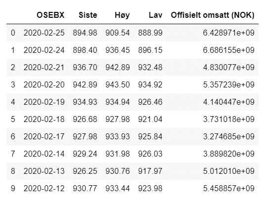

OSE 指数的价格数据，请原谅挪威人

```
# revese the order of the DataFrame
osbx = osbx.iloc[::-1]# only keep daily close
osbx = osbx[[“OSEBX”, “Siste”]]# rename columns
osbx.rename(columns={“OSEBX”: “Date”, “Siste”: “Close”}, inplace=True)# change the index to Date
osbx.set_index(“Date”, inplace=True)# calculate daily returns and add to the DataFrame
osbx[“return”] = osbx[“Close”].pct_change()# remove the first row, as it is nan
osbx.dropna(inplace=True)
osbx.head(10)
```

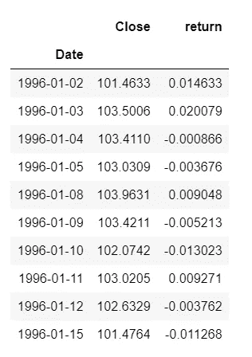

绘制整个时期的价格序列

```
osbx[“Close”].plot(figsize=(15,6), title=”Oslo stock exchange index price since 1996")
```

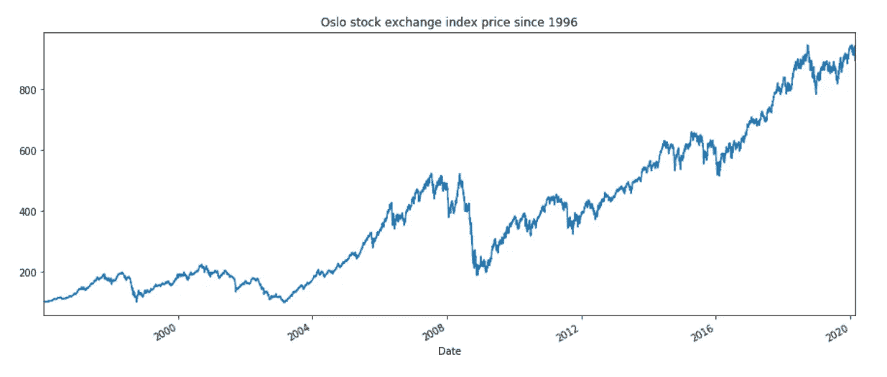

展开数据框架以包括工作日、月份和年份。

```
# Exclude 2020 onwards, only keeping the whole years 1996 through 2019
osbx = osbx[“1996”:”2019"]# Determine the weekday and add it as a new column to the DataFrame
osbx[“Weekday”] = osbx.index.weekday.values
osbx[“Weekday”] = osbx[“Weekday”].apply(lambda x: calendar.day_name[x])# Determine the month and add it as a new column to the DataFrame
osbx[“Month”] = osbx.index.month.values
osbx[“Month”] = osbx[“Month”].apply(lambda x: calendar.month_name[x])# Determine the year, convert it to string, and add it as a new column to the DataFrame
osbx[“Year”] = osbx.index.year.values
osbx[“Year”] = osbx[“Year”].astype(str)osbx.head(10)
```

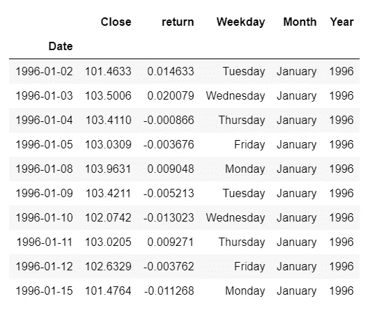

# 平日

首先，我们想探索一种趋势的可能性，这种趋势取决于一周中的某一天。若要计算平均值，请按工作日列分组并计算平均值。然后在周一到周五重新排序。

```
# Mean return for each weekday
osbx_weekday_mean = osbx.groupby(“Weekday”).mean()# Reorder
osbx_weekday_mean = osbx_weekday_mean.reindex([“Monday”, “Tuesday”, “Wednesday”, “Thursday”, “Friday”])
osbx_weekday_mean
```

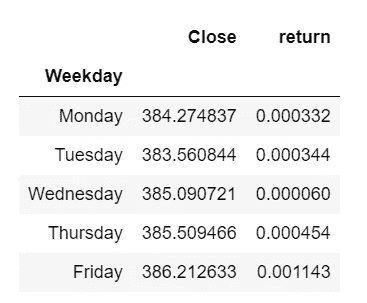

周一、周二和周四的平均回报率都差不多，而周三的回报率接近于零，周五的回报率更高。让我们用两种不同的方式来绘制它，以便更好地了解分布情况。首先让我们单独查看工作日的平均值，然后使用散点图来查看每个工作日的回报是如何分布的。

```
x = osbx[“Weekday”]
y = 100*osbx_weekday_mean[“return”]# reorder
osbx_weekday_mean = osbx_weekday_mean.reindex([“Monday”, “Tuesday”, “Wednesday”, “Thursday”, “Friday”])
osbx_weekday_mean# barplot of the average return for each week day
import seaborn as sns
sns.set_palette(“pastel”)
fig, ax = plt.subplots(figsize=(15,6))
ax = sns.barplot(x=osbx_weekday_mean.index, y=y, data=osbx_weekday_mean)
ax = plt.ylabel(“Return (%)”, size=15)
ax = plt.title(“Average daily return for each weekday in 1996 through 2019”, size=20)
plt.savefig(‘osbx1.png’)
plt.show()
```

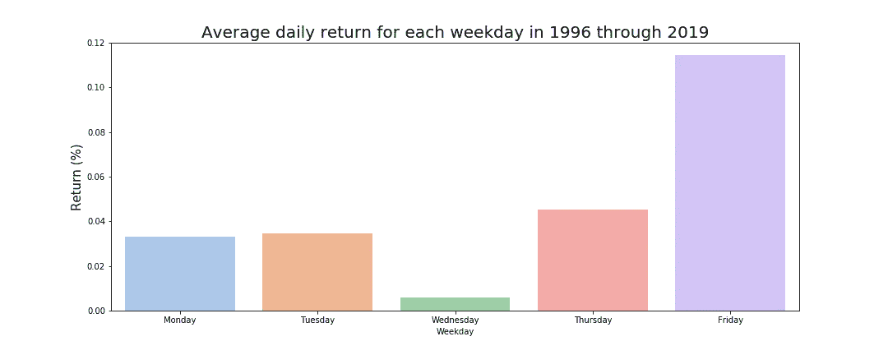

带有彩色调色板的 Seaborn 绘图库

```
# Scatter plot of all observations to see the variations for each weekday
x = osbx[“Weekday”].values
y = 100*osbx[“return”].valuesdays = [‘Monday’, ‘Tuesday’, ‘Wednesday’, ‘Thursday’, ‘Friday’]
points = [[x[i], y[i]] for i in range(0,len(x))]
for i in range(0,len(points)):
 points[i][0] = days.index(points[i][0])+1

x = [points[i][0] for i in range(0,len(points))]
y = [points[i][1] for i in range(0,len(points))]fig = plt.figure(figsize=(15,6))
ax = plt.scatter(x, y, color=”green”, linewidths=3, marker=”x”, s=30)
ax = plt.scatter([1,2,3,4,5], osbx_weekday_mean[“return”], color=”blue”, marker=”*”, s=100)
ax = plt.ylabel(“Return (%)”, size=15)
ax = plt.title(“Daily returns for each weekday for 1996 through 2019”, size=20)
plt.savefig(‘osbx2.png’)
plt.show()
```

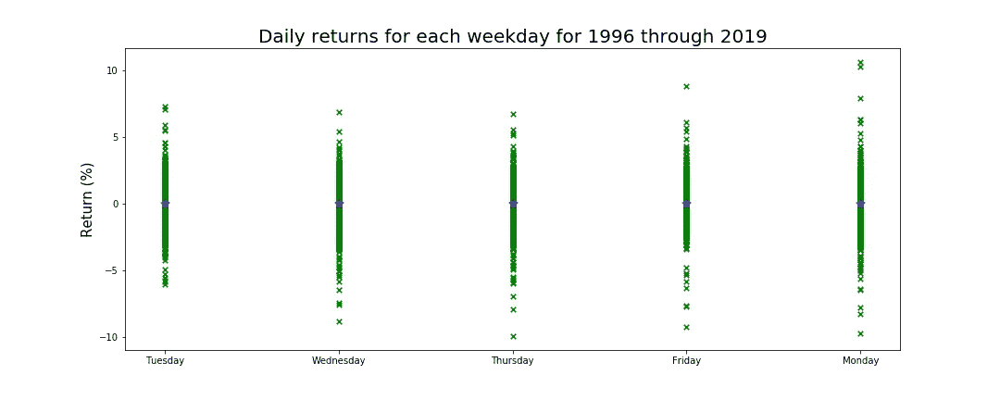

散点图显示按工作日排序的每日回报分布。请注意，星期一是最后一天

现在计算波动率，并计算每个工作日的观察次数

```
# Volatility of the returns for each weekday
osbx[“return”] = osbx[“return”]
weekday_vol = osbx[[“Weekday”, “return”]].groupby(“Weekday”).std()
print(weekday_vol)
print()# Number of weekdays
print(osbx[[“Weekday”, “return”]].groupby(“Weekday”).count())
```

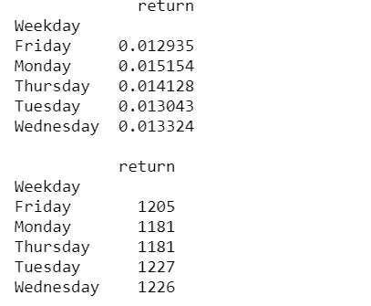

一周中每一天的波动性和计数

由于市场在此期间增长了 800%以上，我们预计每个工作日的平均日回报都是正的，并且有大致相同的回报。周一有点特殊，因为它紧接在周末之后，这意味着周末的风险会延续到周一，因此它应该有 3 天的风险。隔夜风险使投资者暴露于国际市场的事件，这表明周五将有更多抛售，这将推动价格下跌。由于市场在此期间随着时间的推移而上涨，我们也应该期待看到从周五收盘到周一收盘价的更高回报，以及更高的波动性。然而，相反的事情正在发生。周一的波动性比预期的要高，但回报率却没有提高。一个可能的原因可能是临近周末时人们的情绪，乐观情绪的增加会导致更多的购买，但我对此一点也不自信。

为了解释周五和周一之间比一周其他时间更长的时间，一个更准确的分析将改为查看每天从开盘到收盘的回报。

# 统计学意义？

现在，我们想使用 t 检验来测试每个工作日的平均回报是否与所有工作日的平均回报在统计上有显著差异。假设μᵢ是工作日 I 的所有回报的平均值。将零假设定义为μᵢ与大平均值相同，即所有日期的平均每日回报:

H₀: μᵢ =大平均
H₁: μᵢ ≠大平均

```
# Perform statistical analysis
from scipy import statsaverage_return = osbx_weekday_mean[“return”].mean()for day in osbx_weekday_mean.index.values:
 sample = np.array(osbx[osbx.Weekday == day][“return”])
 print(day,”:”, stats.ttest_1samp(sample, average_return))
```

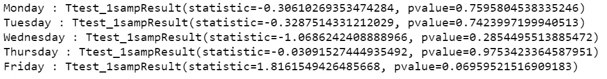

周五的 p 值为 0.0696，对应的置信度为 93.04%。虽然这在大多数实际情况下不会被认为是重要的，但深入研究这种机制并看看这背后是否有什么东西会很有趣，但它可能只是噪音。运行 5 次测试，我们只有大约 70%的概率看不到低于 0.0696 的 p 值(0.9304⁵= 0.6972……)。

我们来逐年比较一下。模式一致吗？

```
years = range(1996, 2020)
nr_rows = 6
nr_cols = 4
fig, axs = plt.subplots(nr_rows, nr_cols, figsize=(nr_cols*4,nr_rows*3), squeeze=False)axis = []
for r in range(0,nr_rows):
 for c in range(0,nr_cols):
 axis.append(axs[r][c])count = 0
for year in years:
 osbx_year = osbx[str(year)]
 # Mean return for each weekday
 osbx_year = osbx_year.groupby(“Weekday”).mean()
 # reorder
 osbx_year = osbx_year.reindex([“Monday”, “Tuesday”, “Wednesday”, “Thursday”, “Friday”])
 # plot
 sns.barplot(x=[1,2,3,4,5], y=”return”, data=osbx_year, ax=axis[count])
 plt.ylabel(‘Number of Occurrences’, fontsize=12)
 axis[count].legend([str(years[count])])
 count = count + 1fig.suptitle(“Average OSBX returns for each weekday by year from 1996 through 2019”, size=20)
plt.tight_layout()
fig.subplots_adjust(top=0.93)
plt.savefig(‘osbx3.png’)
plt.show()
```

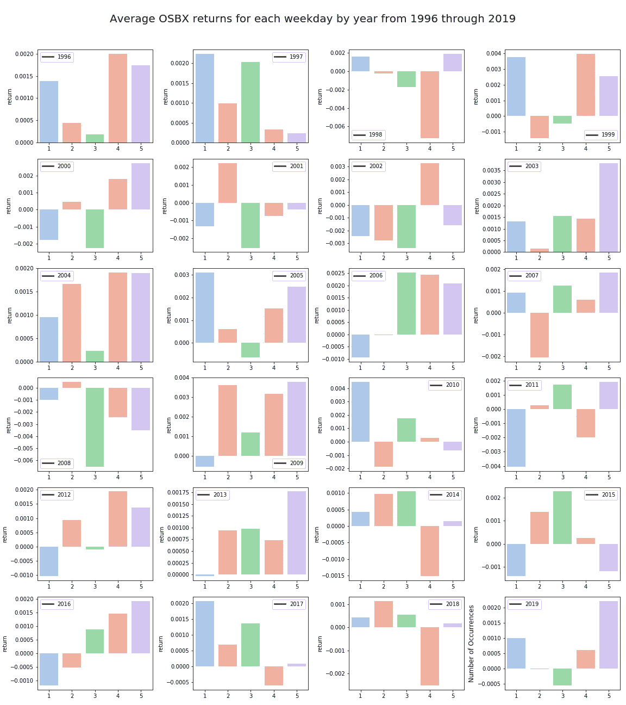

周一至周五，每年所有交易日的平均值

24 年中只有 7 年星期五比其他日子好。由于一年有 52 周，减去一些公共假期，我希望看到“星期五效应”更加一致。

周五的表现排名:

*   最佳表演:7 次
*   2.最佳表演:6 次
*   中等表现者:4 次
*   2.表现最差:6 次
*   表现最差:1 次

# 月度回报

我们分析的第二步是比较每月的回报。某些月份的回报比其他月份好吗？

剩下的代码类似，但是你可以在我的 github 找到完整的笔记本。

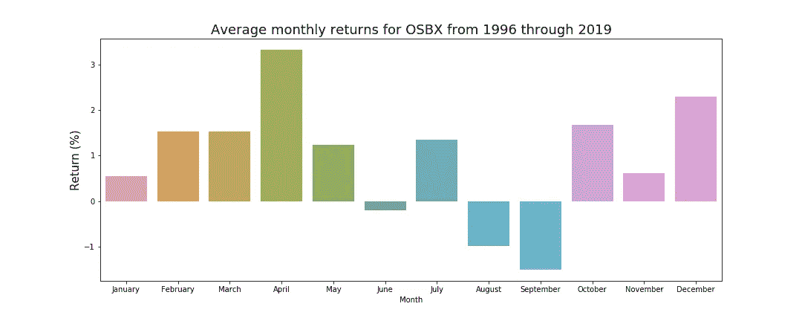

几乎像波浪状分布。虽然一月似乎不是很高，但十二月表现良好。也许是圣诞老人集会推高了 12 月份的价格？从历史数据来看，万圣节效应似乎是有利可图的，因为唯一的负回报发生在 6 月至 9 月。

每个月的分配情况如何？

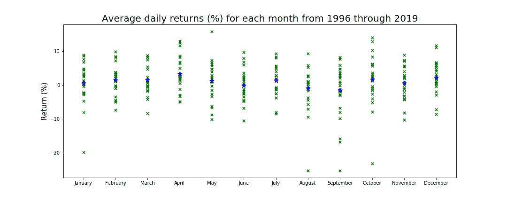

除了经历大幅下跌的几个月，每个月的波动性看起来都差不多。让我们看看每年的月回报

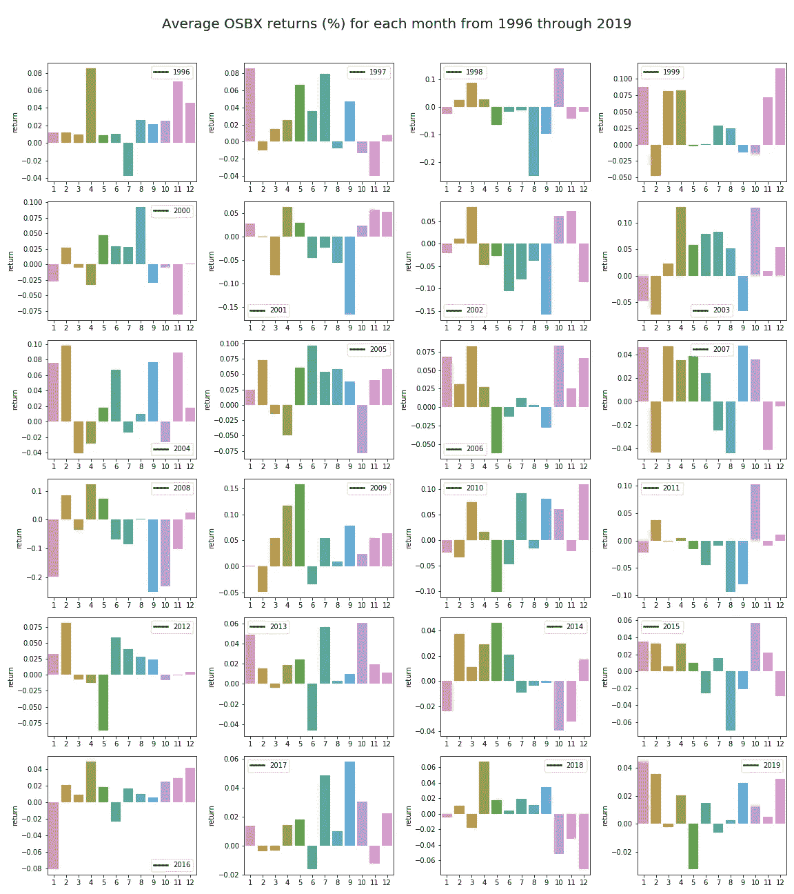

从 1996 年到 2019 年的月度回报柱状图，x 轴标注为 1-12，代表 1-12 月

```
# average monthly return over all months
average_return = osbx_month_returns.mean()
average_return[0]
```

输出:0.00928467867

约 1%的平均月回报率。让我们用 t 检验来测试每个月相对于平均值的表现。通过运行 12 个测试，请注意，我们需要一个较低的 p 值来拒绝空值。使用临界值 0.05，假设空值为真，我们在至少一个测试上拒绝空值的概率实际上是 1-0.95 ~46%。为了达到 95%没有错误拒绝，我们实际上需要大约 0.004 的个体 p 值。

```
for month in months:
 sample = osbx_returns[osbx_returns.Month == month][“return”]
 print(month,”:”, stats.ttest_1samp(sample, average_return))
 print()
```

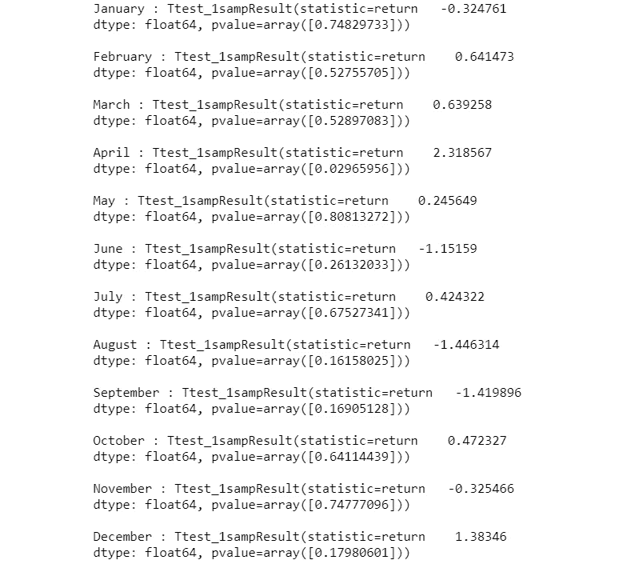

4 月的 p 值最低，为 0.0297，12 月为 0.0538。其余月份的值不重要。但是如前所述。当我们进行如此多的测试时，0.0297 并没有低到有意义的程度。

月度回报分析的一个明显缺陷是缺乏样本。我们只有 24 次观察，每年一次。使用更长的时间框架可能是有趣的，但范式会改变，如果市场异常变得众所周知，它会很快被利用和消除。随着市场变得越来越有效，找到这样的模式变得越来越困难。

# 一月中的某一天

最后，让我们看看一个月中的某一天。

```
# mean return of each day of the month (note that 31 will have a smaller sample size)
day_of_month_return = osbx[[“return”]].groupby(osbx.index.day).mean()
day_of_month_return.head()
```

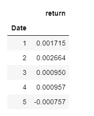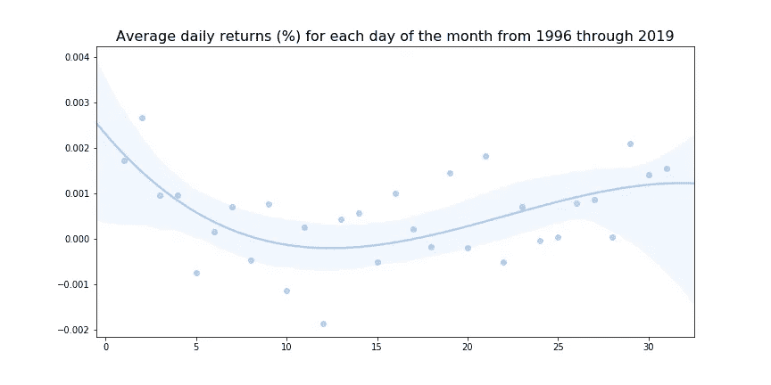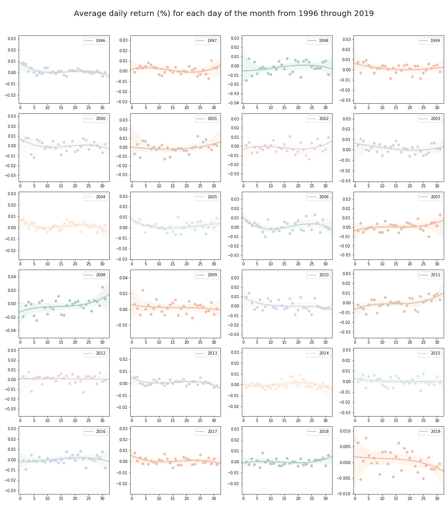

## 在每月的某一天进行 T-test

在对所有 31 天进行 t 检验后，p 值最低的三天是:

*   2.:0.07163584(回报率高于平均值)
*   12.:0.0114696(回报率低于平均值)
*   29.:0.08354356(回报率高于平均值)

通过 31 天的测试，我们预计平均至少有一次测试会拒绝零假设，事实也确实如此。

我们观察到一个轻微的 U 型回报。月初和月末的天数比月内天数的回报率稍高。这些年的曲线似乎没有非常一致的模式，这让我对 U 形的预测能力不太有信心。

# 结论

观察异常的一个问题是，我们总是会发现一些模式，如果我们足够努力的话，甚至可以进行显著的测试。然而，如果我们使用定量的方法来发现一些可能的异常，我们可以更深入地研究这些机制，以确定这种模式是否有一些价值。更好的是，首先，找到一些关于市场的有趣的工件，然后进行定量测试，以确定其有效性。这是一个有趣的练习，但仅此而已。我不建议用这个作为策略的基础，因为有限的重要性和巨大的变化会导致一个工作日或一个月的收益来自不相关的事件。

# 进一步分析:

*   寻找样本量较大的异常情况，如工作日
*   更高粒度的数据。日内异常？
*   欠发达市场可能会有更明显的异常
*   查看各种因素(如公司规模)是否会导致异常的显著变化

GitHub 上提供完整的笔记本:

[](https://github.com/RunarOesthaug/Oslo-stock-exchange-analysis) [## RunarOesthaug/奥斯陆证券交易所分析

### 该存储库将包含对来自挪威股票市场的数据进行的分析。主要是奥斯陆股票…

github.com](https://github.com/RunarOesthaug/Oslo-stock-exchange-analysis) 

如果您有任何问题，请随时留言。

感谢阅读！