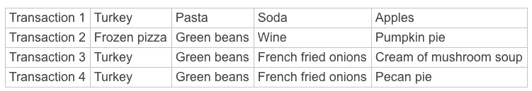

# 购物篮分析 101:关键概念

> 原文：<https://towardsdatascience.com/market-basket-analysis-101-key-concepts-1ddc6876cd00?source=collection_archive---------15----------------------->

## 在您的数据中找到客户或用户的行为模式。市场篮子分析可以提供这些新的见解。

[马达林·图多塞](https://unsplash.com/@madalintudose98?utm_source=unsplash&utm_medium=referral&utm_content=creditCopyText)在 [Unsplash](https://unsplash.com/@madalintudose98?utm_source=unsplash&utm_medium=referral&utm_content=creditCopyText) 上的照片

我一年只做一次绿豆砂锅。尽管这是一种对烹饪的嘲弄，但出于感情的原因，我们仍然把它作为感恩节晚餐的一部分。它的主要成分是青豆、罐装奶油蘑菇汤，最重要的是，撒在上面的所谓“法式油炸”洋葱(也是罐装的)。所有这三种成分通常在节日前后被集中在杂货店里。

*图片来自* [*GIPHY*](https://media.giphy.com/media/rokIerKIlxpZe/giphy-downsized.gif)

但是杂货店怎么知道把这些东西放在一起展示呢？他们也对绿豆砂锅有感情吗？

不，商店正在充分利用他们的顾客数据——你也可以。一种叫做购物篮分析的分析方法揭示了买家一起购买的物品。除其他目的外，这种分析可以向零售商展示如何将产品放在一起，以及如何交叉促销和推荐客户经常同时放入购物车的商品。营销信息和促销可以突出那些经常一起出现的项目，并且可以识别经常与额外购买相关的关键产品。无论商店和购物车是实体的还是数字的，这种方法都是可行的。购物篮分析还可以用来分析网页浏览历史，检测欺诈和管理库存。

让我们在这里浏览一下市场篮子分析的基本概念。

*图片来自* [*GIPHY*](https://giphy.com/gifs/teamcoco-grocery-store-shopping-3osBLiw1St6L0RGV9K)

# 购物篮分析的关键概念

尽管作为消费者，它的结果在我们的生活中随处可见，但购物篮分析起初听起来有点陌生:“先验”？“前因”和“后果”？一个叫做“信念”的指标？不要担心，我们将一起学习这些术语。

首先，我们假设您有一个事务信息数据集，其中标识了每个事务的组件，如下所示:

*交易数据*

给定这些数据，我们想找出哪些商品经常一起购买。(看起来交易 3 的客户在晚餐菜单上有绿豆砂锅！)我们可以观察这四个交易，其中两个包括火鸡、青豆和法式炸洋葱。然而，一名火鸡购买者没有购买其他两种物品，还有一名购买者没有购买绿豆和其他砂锅配料。

我们可能会从这四个事务中猜测这三种砂锅配料之间存在某种关系，但是很难确定在更大的数据集中是否存在这种关系。

*图片来自* [*吉菲*](https://giphy.com/gifs/bettercallsaulAMC-better-call-saul-bcs-503-5-iEvq4b4SJEoEioKsuW)

做出这一决定的市场篮子方法是建立“关联规则”“规则”这个词听起来非常权威或确定，但实际上这些只是将“前因”项与“后果”项联系起来的陈述。关联规则也没有暗示因果关系，只有共现，不要被那些小箭头欺骗。在我们的例子中，我们可能想知道青豆是否是法式炸洋葱的先行项。

> *{前因}*➡️*{后果}*
> 
> *青豆* ➡️ *法式炸洋葱*

为了查明情况是否如此，我们首先从事务数据中创建“项目集”。一个项目集可能是*{青豆，法式炸洋葱}* 。

在上面的小数据集中，我们看到四个事务中的两个包含那个项目集；但是两个也包含项目集*{火鸡，青豆}* 。如果我们有一个更大的数据集，我们如何知道那些项目集的关系中哪一个更重要，并且应该是我们如何组织我们的杂货店的基础？如果想象一下我们的四笔交易中包含的 10 种不同商品的所有可能组合，情况会更复杂。

(有趣的事实:根据食品工业协会的数据，2019 年，普通杂货店的货架上有 28112 件商品。即使创建 10 个项目集，他们仍有大约 8.5 x 1037 或 84，812，357，987，507，064，681，676，153，306，904，737，896 个项目集要检查。谢天谢地，软件甚至可以帮助一个部门进行计算！)

接下来我们需要做的不仅是测量我们在所有事务中识别的项目集的频率，还要评估这些项目之间的关联强度。我们将使用一些不同的衡量标准来衡量该强度，并且我们将“修剪”(丢弃)不符合我们设置的阈值的规则。保留下来的关联规则应该具有高水平的*(那是一个真实的术语！).*

**

**图片来自* [*GIPHY*](https://giphy.com/gifs/interesting-walrus-hmm-Bcnj6ObXtCNtS)*

# *评估关联规则的度量标准*

*您可以将一些不同的兴趣度指标应用于关联规则:*

*   ***支持**:这是最容易计算的指标，因为它只是包含关联规则的所有事务的比例。*

> *与*{青豆}*➡️*{炸洋葱}* 的交易笔数*
> 
> *除以*
> 
> *交易总数*

*在我们上面的数据集中，我们发现对*{青豆}*➡️*{法式炸洋葱}* 的支持是 0.5(4 个事务中的 2 个)。这里的数字越接近 1 越好。*

*Support 很容易计算，但是想象一下，尝试对商店中更受欢迎的商品进行这样的计算。有多少人在购物时会买*{面包，鸡蛋}* ？可能很多。对于关联规则，您可能会获得很高支持度，但是它不会增加您对客户习惯的理解的细微差别。*

**

**图片来自* [*GIPHY*](https://giphy.com/gifs/fullerhouse-season-4-fuller-house-82YkKZ9Mktu2gE56x6)*

*   *信心:信心给你对这个关联规则的判断带来更多的特异性。在这种情况下，它是包含项目集中所有项目的所有事务与只包含其中一项的事务的比例。(是的，这相当于将*{青豆}*➡️*{法式炸洋葱}* 的支持度除以仅*{青豆}* 的支持度。)*

> *与*{青豆}*➡️*{炸洋葱}* 的交易比例*
> 
> *除以*
> 
> *绿豆交易的比例*

*在我们上面的数据集中，4 个交易中有 2 个包含这两种商品，4 个交易中有 3 个包含青豆。也就是 0.5 / 0.75，或者 0.67。同样，这里的数字越接近 1 越好。*

*假设顾客购买了青豆(我们的先行词),信心给了我们顾客购买结果的可能性，即关联规则右侧的项目——法式炸洋葱。正如您所看到的，这个指标提供了一个不同的、也许更有用的对客户行为本质的洞察；我们得到的不仅仅是频率，还有可能性的度量。*

**

**图片来自* [*吉菲*](https://giphy.com/gifs/weinventyou-3rgXBN6i9LIUg6lSLe)*

*   ***抬**:有人会买绿豆。有些人会买法式炸洋葱。有些人会两样都买。如果我们想象这两样东西之间没有关系，那么我们可以看到当人们*买下*两样东西时，我们实际上超出了预期多少。这个计算叫做*升力*。*

> *与*{青豆}*➡️*{炸洋葱}* 的交易比例*
> 
> *除以*
> 
> *(与*{青豆}* 的交易比例)*(与*{炸洋葱}* 的交易比例)*

*对于我们的迷你数据集，这得出 0.5 / (0.75 * 0.5)或 1.33。以下是评估 lift 的方法:*

*   *如果 lift 大于 1，前提事实上增加了结果也出现在交易中的可能性(对青豆是，更可能对法式炸洋葱是，这就是我们这里的情况)。*
*   *如果 lift 小于 1，则相反；前一个因素降低了后一个因素的可能性(对青豆说是，更有可能对法式炸洋葱说不)。满足相同需求的产品可能就是这种情况；例如，如果我在购物时买了一瓶我常用品牌的洗发水，很可能我不会再买另一个品牌的。*
*   *如果 lift 等于 1，那么前因不会影响购买后果的机会。*

*提升指标让我们知道，我们关于项目之间“没有关系”的假设——它们是独立的——是否成立。*

*想要更多指标吗？支持、信心和提升是这种分析最常见的指标，你会在 Alteryx Designer 的[市场购物篮工具中看到它们。你可能还会在互联网上看到关于影响力和信念的讨论。这些是用于评估关联规则中表达的同现关系的强度的附加选项。](https://community.alteryx.com/t5/Data-Science/Market-Basket-Analysis-102-Alteryx-Designer-Python/ba-p/662029)*

**

**图片来自* [*GIPHY*](https://giphy.com/gifs/season-16-the-simpsons-16x11-l2Je71arANlHYjAVq)*

# *关联规则挖掘的 Apriori 和 Eclat 算法*

*显然，如果您有多个项目，那么对于基于许多潜在项目集的许多潜在关联规则，需要进行大量的潜在计算。如何在这个过程中高效的消耗你的计算能力，也就是常说的*关联规则挖掘*？*

*最常用的方法是应用 [*Apriori 算法*](http://www.vldb.org/conf/1994/P487.PDF) ，该算法首先为您的数据生成最少项目数 *k* 的频繁项目集，您可以设置最少项目数。它通过要求项目集满足最低支持级别来决定哪些项目集是频繁的(如上所述)。然后，这些频繁项集被重复地划分(分割)和重新组合，并为每个组合计算支持度，直到不能再创建更多的项集。*

*通过将频繁项集分为前件和后件，从频繁项集生成关联规则，然后计算每条规则的置信度。只有满足最低置信水平的关联规则将被保留，而其他的将被丢弃。*

*削减项目集(从而减少要评估的关联规则的数量)的过程是*修剪*。修剪对于减少重复检查数据和计算许多潜在项目集的度量的计算需求非常重要。*

*eclat 算法也用于建立关联规则。ECLAT 实际上是代表[等价类聚类和自底向上格遍历](https://sci2s.ugr.es/keel/pdf/algorithm/articulo/2000%20-%20IEEETKDE%20-%20Zaki%20-%20(Eclat)%20ScalableAlgorithms%20for%20Association%20Mining%20.pdf)的首字母缩写词(尽管单词 *éclat* 本身实际上意味着“炫耀的展示”或“炫目的效果”……它的创建者设定了一些很高的期望！).*

**

*éclat…而不是 eclat 算法。图片来自 [*吉菲*](https://giphy.com/gifs/cbc-canada-birds-canadian-jUDvU0mBA9trNjOV3e)*

*与 Apriori 算法用来识别频繁项集的[广度优先](https://en.wikipedia.org/wiki/Breadth-first_search)方法不同，eclat 使用的是[深度优先](https://en.wikipedia.org/wiki/Depth-first_search)方法。它查看每一项，确定该项出现的事务的事务 id，并列出这些 id。然后，它在这些列表中查找各个项目的交集，并基于交集计算支持度。*

*eclat 算法可能更快，但是它也可能是内存密集型的，因为它在这些中间步骤中构造和使用列表。(要了解这些算法之间的更多比较和对比，请查看这些幻灯片。)*

*限制需要分析的关联规则数量的另一种方法是在构建规则之前，通过*将*项聚集到更大的类别中。例如，在我们上面的杂货交易中，我们可以将火鸡和比萨饼放入“冷冻食品”类别，并将两个馅饼放入更大的“甜点”类别。然后我们会得到关联规则，它可以告诉我们在这些更大的类别中发生购买的频率。然而，虽然我们在聚合这些项目时获得了效率，但我们会丢失可能有用的细节。*

# *分析我的篮子！*

*我希望你受到启发，尝试一下这种分析方法。您可以使用多种工具来实现这种分析:如果您更喜欢 R，请查看 [arules](https://cran.r-project.org/web/packages/arules/index.html) 包；如果是 Python，试试 [mlxtend](https://rasbt.github.io/mlxtend/user_guide/frequent_patterns/association_rules/) 包。Alteryx Designer 中还内置了用于购物篮分析的工具。无论你是否使用 Designer，你都可以阅读这篇博文中的[关于如何使用 pandas 和 seaborn Python 包来可视化你的市场购物篮分析，并使其更容易理解你所发现的关系。](https://community.alteryx.com/t5/Data-Science/Market-Basket-Analysis-102-Alteryx-Designer-Python/ba-p/662029)*

****原载于***[***Alteryx 社区***](https://community.alteryx.com/t5/Data-Science/Market-Basket-Analysis-101-An-Introduction/ba-p/661963) ***及精选于***[***Alteryx 数据科学门户***](http://alteryx.com/data-science) ***。****