# Python 中的关联规则挖掘:完全指南

> 原文：<https://towardsdatascience.com/market-basket-analysis-using-association-rule-mining-in-python-pyshark-412aa6b4d0ea?source=collection_archive---------38----------------------->

## 在本文中，我们将使用 Python 中的各种关联规则挖掘算法来探索购物篮分析。


照片由[玛利亚·林·金](https://unsplash.com/@mrsmaria?utm_source=unsplash&utm_medium=referral&utm_content=creditCopyText)在 [Unsplash](https://unsplash.com/s/photos/grocery?utm_source=unsplash&utm_medium=referral&utm_content=creditCopyText) 上拍摄

**目录:**

*   介绍
*   关联规则挖掘(概述)
*   概念
*   Apriori 算法
*   喝彩
*   F-P 增长
*   算法比较
*   Python 中的关联规则挖掘(示例)
*   结论

# 介绍

随着电子商务网站的快速增长和跨行业(尤其是零售业)转向数据答案的普遍趋势，每个组织都在努力寻找更多机会，以获得最佳产品组合来进行折扣和促销。

对这些决策的回报是期望销售的增长和库存水平的降低。

对“一起买了什么”进行分析通常会产生非常有趣的结果。

零售业的一个经典故事是关于一家沃尔玛商店，其中一家商店的同事开始将商品捆绑在一起，以便更容易找到。例如，他们把面包和果酱放在一起，牛奶和鸡蛋，等等。

这些是我们在商店购物时马上想到的例子。

他们没想到的是，在分析了每个顾客的收据后，他们发现了一个规律，美国爸爸在一张收据上有尿布和啤酒(尤其是在周五)。

市场购物篮分析(或相似性分析)主要是一种数据挖掘过程，有助于识别用户组执行的某些事件/活动的同现。在我们的例子中，我们将通过使用 Python 中的关联规则挖掘来分析个人的收据，从而关注个人在零售店中的购买行为。

# 关联规则挖掘(概述)

关联规则学习是一种基于规则的方法，用于发现大型数据集中变量之间的关系。对于零售 POS(销售点)交易分析，我们的变量将是零售产品。它本质上发现了具有某种“强”水平的强关联(规则)，这由几个参数表示。

现在我们将转向一些数学，以技术的方式解释关联规则。

以下是 Agrawal、Imieliński、Swami 在他们的[论文](https://dl.acm.org/doi/10.1145/170035.170072)(以此为基础)中描述关联规则学习的总结，以及我们的一些补充:

1.  设 ***I*** *= i_1，i_2，…，i_n* 为一组 *n* 的商品(在一个零售例子中:让我们把它想象成商店中所有可用产品的列表:香蕉、牛奶等等)。
2.  设 ***D*** *= t_1，t_2，…，t_m)* 为一组 *m* 的交易(在一个零售的例子中:姑且认为是客户收据)。

*中的每笔交易 *t_m* 都有一个唯一的 ID(在一个零售例子中:每张收据都有一个唯一的编号)。*

*同样，每笔交易 *t_m* 由集合 ***I*** 中的商品子集组成(在零售示例中:每张收据包含来自商店的产品)。*

*一个 ***规则*** 被定义为形式***y***->***x***其中***x***⊆***I***和***y***⊆***I***(相当于*

*这些数学术语的含义如下:*

*   ****x***⊆***I***是指 ***X*** 是 ***I*** 的子集(在一个零售例子中: ***X*** 可以是商店中所有可用产品列表中的 1 个或多个产品)。*
*   ****y***⊆***I***的意思是 ***Y*** 也是 ***I*** 的子集(解释同上)。*
*   ****X***∩***Y***= 0 表示 ***X*** 和 ***Y*** 没有公共元素(两个项集不能有相同的乘积)。*

*为了便于理解，我们来看下面的例子:*

1.  *你去购物，你的收据上有以下商品:{面包、牛奶、鸡蛋、苹果}。*
2.  *我们来创建一个任意项集***X***:{面包，鸡蛋}。*
3.  *让我们创建一个任意项集***Y***:{ apple }。*

*回头看看*规则*的定义，你会发现你已经满足了所有的假设。项目集 ***X*** 中的每个项目都是收据上产品列表中的一个产品。项目集 ***Y*** 中的每个项目都是收据上产品列表中的一个产品。 ***X*** 和 ***Y*** 中的产品不重复(在您的收据上的产品列表中是唯一的)。*

*使用这些项目集，*规则*的一个例子是:**{面包，鸡蛋}→{苹果}** ，这意味着买面包和鸡蛋的人可能会买苹果。*

*到目前为止，我们只处理了作者选择的两个项目集。然而，我们的收据有 4 个项目，所以我们可以创建更多的项目集，从而创建更多的规则。例如，另一个*规则*可能是 **{milk}→{eggs}** 或 **{bread，milk}→{eggs}** 。*

# *概念*

*正如您在上一部分中看到的，我们能够提出几个任意的 ***规则*** ，这些规则甚至可以从一个非常小的包含几个项目的交易样本中导出。*

*我们现在要做的是确定几个有用的度量，允许我们评估可以作为潜在关联规则提出的*规则*的“强度”。我们基本上会努力寻找最有意义和最重要的规则。*

*首先，让我们从杂货店创建一个任意的交易数据库:*

*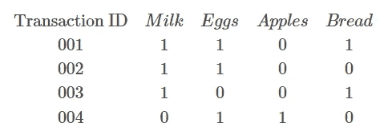*

*作者图片*

*在上面的数据库中，每一行都是来自客户的唯一收据。其他列中的值为布尔值(1 表示真，0 表示假)。这张表格显示了我们在什么收据上买了什么。*

*现在我们都准备好做一些计算了。*

*假设两个单项集 ***X*** 和 ***Y*** ，其中 ***X*** 包含牛奶( ***X*** : {Milk})和 ***Y*** 包含鸡蛋( ***Y*** : {Eggs})。*

*我们要探讨的是***X***->***Y***，即“购买牛奶的顾客也购买鸡蛋的*规则*有多强？”*

*我们需要熟悉购物篮分析中最常用的一组概念。*

## *支持*

*一个项集 ***X*** 的支持度定义为数据库中包含 ***X*** 的事务的比例。*

*理论:*

*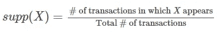*

*作者图片*

*那么我们来统计一下看到 ***X*** (奶)出现的交易数量。这是 3 个事务(id:001，002，003)。交易总数为 4。*

*因此，我们的计算如下:*

*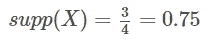*

*作者图片*

## *信心*

*置信度是对*规则*为真的指示的显著性的度量。简单来说，就是计算项集 ***Y*** 被项集 ***X*** 购买的可能性。*

*理论:*

*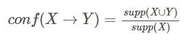*

*作者图片*

*首先，我们需要计算项目集 ***X*** 和 ***Y*** 的联合支持度。这是牛奶和鸡蛋同时出现的交易数(交易的[交集](https://pyshark.com/python-set-operations/#python-set-intersection))。*

*这是两个事务(id:001，002)。交易总数为 4。*

*因此，我们的计算如下:*

*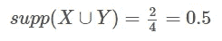*

*作者图片*

*从上一部分我们知道 supp(***X***)= 0.75。*

*使用上面的数字，我们得到:*

*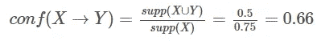*

*作者图片*

*这表明，每次顾客购买牛奶，有 66%的机会他们也会购买鸡蛋。*

*也可以称为 ***Y*** 对 ***X*** 的条件概率:P(***Y***|***X***)= 0.66。*

## *电梯*

*如果 ***X*** 和 ***Y*** 是独立的，则提升是观察到的支持与预期支持的比率。*

*换句话说，它告诉我们 ***规则*** 在计算结果时，同时考虑到项目集 ***Y*** 的流行度有多好。*

*理论:*

*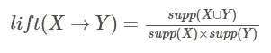*

*作者图片*

*   *如果 lift(***X***->***Y***)= 1，那么这就意味着项目集 ***X*** 和项目集*的出现概率是相互独立的，也就是说 ***规则*** 不显示任何**
*   **如果 lift(***X***->***Y***)>为 1，则意味着项目集 ***X*** 和 ***Y*** 的出现概率是正相关的。它还会告诉我们依赖程度的大小。提升值越高，依赖性越高，这也可以称为项目集是互补的。**
*   **如果 lift(***X***->***Y***)<为 1，那么这就意味着项目集 ***X*** 和 ***Y*** 出现的概率是相互负相关的。提升值越低，依赖性越低，这也可以称为项目集相互替代。**

**到目前为止，我们已经计算了我们需要的大部分值。**

**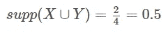**

**作者图片**

**和**

**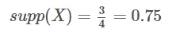**

**作者图片**

**现在，让我们找到第三块:supp( ***Y*** )**

**我们需要鸡蛋出现的交易数量。这是 3 个事务(id:001，002，004)。交易总数为 4。**

**因此，我们的计算如下:**

**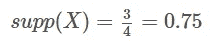**

**作者图片**

**将所有这些代入一个公式，我们得到:**

**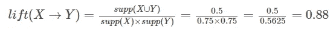**

**作者图片**

**我们发现升力有一个有趣的值。当我们看表时，似乎很明显牛奶和鸡蛋经常一起买。我们还知道，从本质上讲，这些产品通常会一起购买，因为我们知道有多种菜肴同时需要这两种产品。**

**注意:即使从统计学上来说，它们不是互补的，我们用我们的判断来评估关联 ***规则*** 。这是我们需要强调领域知识的时刻。公式不知道我们知道什么，我们可以获得很多信息，公式做的一切都基于数字。计算这些值是对你决策的补充，而不是替代。评估关联规则时，由您来设置最小阈值。在 Python 中执行关联规则挖掘之前，理解这一部分很重要。**

# **Apriori 算法(举例说明)**

**Apriori 算法(最初由 Agarwal 提出)是购物篮分析中最常用的技术之一。它用于分析事务数据库中的频繁项集，然后用于生成产品之间的关联规则。**

**我们来举个例子。回想一下我们在“概念”课程中介绍的数据集:**

**以下是 Apriori 算法如何探索牛奶关联规则的示例树:**

**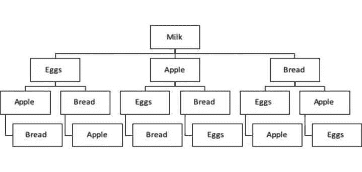**

**作者图片**

**在本例中，算法首先查看级别 1(牛奶)并找到其频率，然后移动到下一个深度层并查看[牛奶、鸡蛋]、[牛奶、苹果]和[牛奶、面包]的频率。在分析了第二个深度级别后，它会移动到下一个深度级别。这将一直持续到最后一个深度级别，这意味着一旦不再有新的项集，算法将停止计算。**

**作为说明，考虑上面的图表，但是现在我们将标记算法采取的步骤，而不是项目:**

**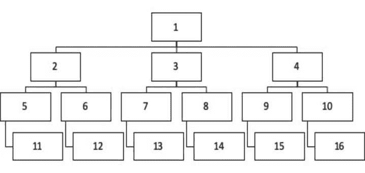**

**作者图片**

**上图显示了算法在执行搜索时所采取的步骤(1:16)。**

**因此，它计算对所有可能的项集组合的支持。请记住，由我们来设置支持的最小参数。如果我们将它设置为 0.01，我们显然会看到比设置为 0.4 更多的可能规则。**

**结果输出将是一个关联规则列表，这些规则是在满足我们设置的参数值时发现的。**

# **ECLAT(举例说明)**

**ECLAT 算法是另一种流行的购物篮分析工具。它代表等价类聚类和自底向上的格遍历。它被称为“更有效”的 Apriori 算法。**

**这是一种深度优先搜索(DFS)方法，通过数据集结构进行垂直搜索。该算法从树根开始搜索，然后探索下一个深度级别节点，并继续向下搜索，直到到达第一个终端节点。然后，它后退一步(到 n-1 级),探索其他节点，并向下到达终端节点。**

**当我们把它作为一棵树来探索时，它更有意义。回想一下我们在“Apriori 算法”部分中使用的数据集(在本课中进一步添加以供参考)。下面是 DFS 将如何分析它:**

**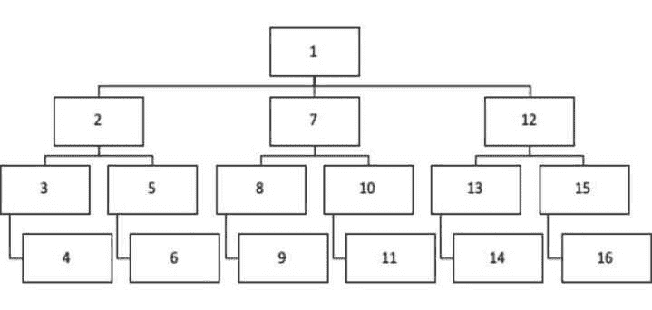**

**作者图片**

**逻辑的总结是:**

*   **找到根(方框 1)。**
*   **探索下一个深度级别节点，直到到达一个终端节点(框 2:4)。**
*   **一旦到达终端节点(框 4)，后退一步到先前的深度级别，并查看是否有其他节点可供探索(框 3 级别没有)。**
*   **再后退一步(回到方框 2 的层次)，现在有另一条“路径”可用(方框 5)。**
*   **向下走，直到到达终点(方框 6)。**
*   **不断重复上述步骤，直到不再有节点需要探索。**

**如果我们将其与广度优先搜索(BFS)进行比较，计算速度将取决于树的宽度和深度(顶点排序的不同属性)。**

**回到 ECLAT 算法的技术部分，其流程如下:**

*   **在第一次运行中，ECLAT 查找所有单个项目集(k=1)的事务 id。**
*   **在第二次运行时，ECLAT 查找所有两项项目集(k=2)的事务 id。**

**我们再举个例子。这是我们的数据集:**

****

**作者图片**

**下面展示了 ECLAT 算法将对该数据集执行的所有运行:**

*   **对于 k=1:**

**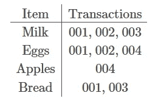**

**作者图片**

*   **对于 *k* =2:**

**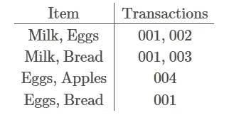**

**作者图片**

*   **对于 *k* =3:**

**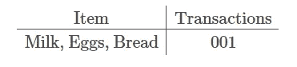**

**作者图片**

*   **对于 *k* =4:
    一旦我们到达四项项目集，我们可以从我们的数据中看到没有任何一项。在这种情况下，ECLAT 算法将在 *k* =3 时停止搜索。**

**需要注意一些事情:**

*   **如果两个项目没有一起出现在任何交易上(比如{牛奶，苹果})，它就不会出现在矩阵中。**
*   **该矩阵不包含重复项({牛奶、鸡蛋}与{鸡蛋、牛奶}相同)。**

****结果:****

**现在，假设我们已经为 ECLAT 搜索预设了最小支持计数要求等于 2(支持计数=2)。
这意味着一个规则要符合输出条件，它必须至少有两个出现这些项目的交易:**

****

**作者图片**

**注意:支持计数和支持是两个不同的概念。支持计数(σ)是项目发生的事务计数。Support 是项目出现的事务占事务总数的分数(支持计数除以事务总数)。**

# **F-P 增长(举例说明)**

**F-P 增长(或频繁模式增长)算法是购物篮分析中另一种流行的技术(首先由韩介绍)。它产生与 Apriori 算法相同的结果，但由于数学上不同的技术(分治)，计算速度更快。**

1.  **首先，它计算事务数据集中每个项目的出现次数。**
2.  **然后，它使用事务创建一个搜索树结构。**

**F-P 增长遵循两步数据预处理方法:**

**与 Apriori 算法不同，F-P Growth 在将事务插入到树中之前，根据事务出现的频率从大到小对事务进行排序。这是它比 Apriori 算法具有显著计算优势的地方，因为它在早期就进行频率排序。不符合最低支持(频率)要求(我们可以设置)的项目将从树中丢弃。**

**另一个优点是重复的频繁项集将具有相同的路径(不像 Apriori 算法，每个项集具有唯一的路径)。**

**这里有一个例子:**

****

**作者图片**

**左手边是 Apriori 算法，它通过以下步骤查看两个单独的序列:**

1.  **牛奶->鸡蛋->苹果**
2.  **牛奶->鸡蛋->面包**

**右手边是 F-P 生长算法，它查看两个序列，其中公共部分[牛奶、鸡蛋]被压缩:**

1.  **【牛奶、鸡蛋】->苹果**
2.  **【牛奶、鸡蛋】->面包**

**这允许对树的根进行更高的压缩和更少的计算步骤(在这种情况下是 2 步)，这意味着计算比 Apriori 算法快得多(在这种情况下是 4 步)。**

# **算法比较**

**本节旨在通过比较和对比的方式，向您简要介绍本课程中学习的三种算法。**

**请参考下表:**

**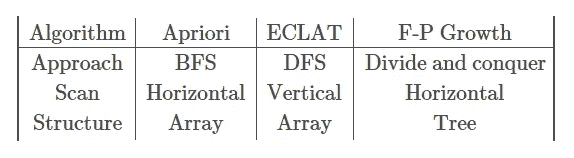**

**作者图片**

**上表表明，主要的速度优势是由于不同的计算技术和数据格式。因为 F-P 增长只遍历数据库两次，所以在大量项目集上要快得多。在我们使用的例子中，整个数据库只包含 4 个唯一的条目，计算速度的差异很小，不明显。**

# **Python 中的关联规则挖掘(示例)**

**在这一节中，我们将创建一些 Python 中关联规则挖掘的例子。**

**让我们回忆一下我们在本课程的第一节课中创建的数据集:**

**我们将把它作为模型的输入。**

**为了继续学习本教程，我们需要两个 Python 库:pandas 和 mlxtend。**

**如果您没有安装它们，请打开“命令提示符”(在 Windows 上)并使用以下代码安装它们:**

```
**pip install pandas
pip install mlxtend**
```

**一旦下载并安装了库，我们就可以继续 Python 代码实现了。**

## **步骤 1:创建包含所需数据的列表**

**上面的代码创建了一个我们将使用的事务列表。**

**让我们来看看结果:**

```
**[['Milk', 'Eggs', 'Bread'], ['Milk', 'Eggs'], ['Milk', 'Bread'], ['Eggs', 'Apple']]**
```

## **步骤 2:用布尔值将列表转换成数据帧**

**我们首先导入所需的库。然后我们将 TransactionEncoder()函数保存为局部变量 **te** 。
下一步是从**数据集**列表中创建一个具有真/假值的数组( **te_array** )。
然后，我们使用条目作为列名，将这个数组转换成 dataframe ( **df** )。**

**让我们来看看结果:**

```
**Apple  Bread   Eggs   Milk
0  False   True   True   True
1  False  False   True   True
2  False   True  False   True
3   True  False   True  False**
```

**这向我们显示了在所有事务处理中，哪些项目会/不会出现在特定的收据上。**

## **步骤 3.1:使用 Apriori 算法找到频繁出现的项目集**

**首先，我们从库中导入 Apriori 算法函数。
然后，我们将该算法应用于我们的数据，以提取具有最小支持值 0.01(该参数可以改变)的项目集。**

**让我们来看看结果:**

```
**support             itemsets
0     0.25              (Apple)
1     0.50              (Bread)
2     0.75               (Eggs)
3     0.75               (Milk)
4     0.25        (Eggs, Apple)
5     0.25        (Eggs, Bread)
6     0.50        (Bread, Milk)
7     0.50         (Eggs, Milk)
8     0.25  (Eggs, Bread, Milk)**
```

## **步骤 3.2:使用 F-P 增长找到频繁出现的项目集**

**首先，我们从库中导入 F-P 增长算法函数。
然后，我们将该算法应用于我们的数据，以提取最小支持值为 0.01 的项目集(该参数可以根据具体情况进行调整)。**

**让我们来看看结果:**

```
**support             itemsets
0     0.75               (Milk)
1     0.75               (Eggs)
2     0.50              (Bread)
3     0.25              (Apple)
4     0.50         (Eggs, Milk)
5     0.50        (Bread, Milk)
6     0.25        (Eggs, Bread)
7     0.25  (Eggs, Bread, Milk)
8     0.25        (Eggs, Apple)**
```

**注意:您所观察到的是，无论您使用何种技术，您都会得到相同的项目集和支持值。唯一的区别是它们出现的顺序。你应该注意到，F-P 增长的产出是以降序出现的，因此证明了我们在理论部分提到的这个算法。**

## **第四步:挖掘关联规则**

**在最后一步中，我们将找到在第三步中计算的频繁项集的关联规则。**

**首先，我们从页面导入所需的函数，使用一些参数集来确定给定数据集的关联规则。然后，我们将它应用于我们在步骤 3 中创建的两个频繁项目数据集。**

**注意:“metric”和“min_threshold”参数可以根据具体情况进行调整，这取决于业务问题的需求。**

**让我们来看看这两套规则:**

```
**antecedents consequents  antecedent support  consequent support  support  confidence      lift  leverage  conviction
0        (Apple)      (Eggs)                0.25                0.75     0.25         1.0  1.333333    0.0625         inf
1        (Bread)      (Milk)                0.50                0.75     0.50         1.0  1.333333    0.1250         inf
2  (Eggs, Bread)      (Milk)                0.25                0.75     0.25         1.0  1.333333    0.0625         inf**
```

```
**antecedents consequents  antecedent support  consequent support  support  confidence      lift  leverage  conviction
0        (Bread)      (Milk)                0.50                0.75     0.50         1.0  1.333333    0.1250         inf
1  (Eggs, Bread)      (Milk)                0.25                0.75     0.25         1.0  1.333333    0.0625         inf
2        (Apple)      (Eggs)                0.25                0.75     0.25         1.0  1.333333    0.0625         inf**
```

**从上面的两个例子中，我们看到两种算法都找到了系数相同的关联规则，只是顺序不同。**

# **结论**

**本文是一个用 Python 实现用于购物篮分析的关联规则挖掘的基本示例的演练。我们关注最常见算法的理论和应用。**

**事情远不止如此:**

*   **更多算法**
*   **更多参数调整**
*   **更多的数据复杂性**

**本文的目的是展示这种数据挖掘技术在 Python 中应用于购物篮分析的可能性，这肯定可以进一步探索。**

**如果你有任何问题或对编辑有任何建议，请随时在下面留下评论，并查看更多我的[统计](https://pyshark.com/category/python-programming/)文章。**

****推荐人:****

*   **阿格拉瓦尔河；t .伊梅利斯基；Swami，A. (1993 年)。“挖掘大型数据库中项目集之间的关联规则”。*1993 年 ACM SIGMOD 数据管理国际会议记录—SIGMOD’93*。第 207 页。[citeserx](https://en.wikipedia.org/wiki/CiteSeerX)T910 . 1 . 1 . 40 . 6984。[doi](https://en.wikipedia.org/wiki/Digital_object_identifier):[10.1145/170035.170072](https://doi.org/10.1145%2F170035.170072)。国际标准书号[978–0897915922](https://en.wikipedia.org/wiki/Special:BookSources/978-0897915922)。**
*   **韩(2000)。*挖掘无候选生成的频繁模式*。*2000 年 ACM SIGMOD 数据管理国际会议论文集*。西格蒙德 00。第 1-12 页。[citeserx](https://en.wikipedia.org/wiki/CiteSeerX)[10 . 1 . 1 . 40 . 4436](https://citeseerx.ist.psu.edu/viewdoc/summary?doi=10.1.1.40.4436)。[doi](https://en.wikipedia.org/wiki/Digital_object_identifier):[10.1145/342009.335372](https://doi.org/10.1145%2F342009.335372)。**

***原载于 2020 年 3 月 24 日 https://pyshark.com*[](https://pyshark.com/market-basket-analysis-using-association-rule-mining-in-python/)*/*。****