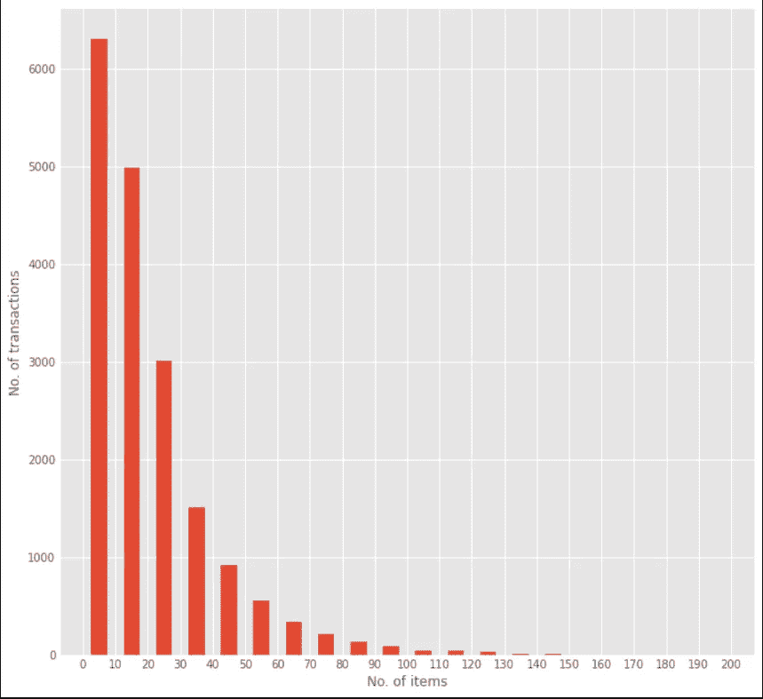
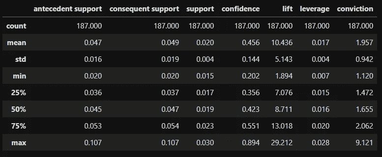

# 市场篮子分析和预测

> 原文：<https://towardsdatascience.com/market-basket-analysis-using-associative-data-mining-and-apriori-algorithm-bddd07c6a71a?source=collection_archive---------7----------------------->

## 使用关联数据挖掘和 Apriori 算法


布鲁克·卡吉尔在 [Unsplash](https://unsplash.com?utm_source=medium&utm_medium=referral) 上的照片

# **简介**

最近，我们都越来越多地从在线电子商务网站购物，这可能是因为世界上大多数地方都实行了封锁。你一定注意到了一个名为' ***的追加销售功能，在大多数网站上经常一起购买*** '，例如亚马逊，它会预测所有商品的价格，以及你刚刚添加到购物车中的商品。客户可以选择将该功能下显示的所有商品添加到购物车中，或者选择所需的商品。亚马逊通过他们所谓的“商品对商品的协同过滤”来实现这一点，它根据顾客的商品搜索历史来运行推荐算法，以改善购物体验。对于线下零售商来说，情况也差不多。让我们考虑面包和果酱的基本例子。如果零售商发现面包的销量有所增加，他可以通过在果酱价格上打折来进一步向上销售，这样一来，更多的顾客势必会一起购买。

这个分析顾客购物趋势的全过程被称为“ ***购物篮分析*** ”。这是一种分析技术，基于这样一种想法，如果我们购买一件商品，那么我们必然会购买或不购买一组(或单个)商品。例如，如果顾客正在购买面包，那么他/她购买果酱的机会就更大。这由以下等式表示:


关联挖掘规则

这个等式被称为关联挖掘规则。这可以被认为是一种如果-那么的关系。如果商品 A 被一个顾客购买，那么商品 B 在同一交易中被同一用户购买的机会被发现。这里 A 称为前因，B 称为后果。先行项是在购物篮中找到的主要项目，而结果项是与先行项/一组先行项一起找到的项目。衡量关联性的指标包括:

**支持:**告诉我们经常一起买的物品组合。它给出了包含 A 和 b 的交易部分。


我们可以使用支持过滤掉不经常出现的项目集。

置信度:它告诉我们 A 和 B 一起被购买的频率，因为 A 被购买的次数。


**Lift:** 表示一个规则对 A 和 B 一起被买的随机性的强度。它基本上衡量了任何关联规则的强弱(下面我们会讲到关联规则)。


升力越大，规则的力量就越大。如果 A -> B 的升力是 3，那么这意味着如果我们买 A，买 B 的机会是 3 倍。

因此，这个过程是为每个项目集制定规则，以找出其关联的度量标准，从而决定是否将它包括在分析中。但是考虑具有数百万用户和事务大型数据集，从而产生大量的项目集。因此，为所有这些制定规则将是一项艰巨的任务。这就是 Apriori 算法的用武之地。

**Apriori 算法**使用频繁购买的项目集生成关联规则。它建立在频繁购买项目集的子集也是频繁购买项目集的思想上。如果频繁购买的项目集的支持值高于最小阈值支持值，则判定频繁购买的项目集。

为了演示该算法的工作原理，考虑以下事务:


交易详细信息

总共有 5 种商品 A、B、C、D 和 E，在每笔交易中以不同的组合一起购买。让我们将项目集的最小阈值支持值固定为 2。

**迭代 1:** 形成具有 1 个项目的项目集，并计算它们的支持度。


迭代 1

从每个项目集的支持度值可以看出，D 的支持度为 1，小于阈值。因此，我们将忽略该项目集。


迭代 1 最终版

**迭代-2:** 接下来，我们创建所有可能的包含 2 个项目的项目集。表 F1 中的所有项目都用于此。


迭代 2

在此迭代中，支持度小于 2 的项目集再次被忽略，{A，B}。

**迭代-3:** 列出了所有包含 3 个项目的可能项目集。然后，我们将把这些项目集分成它们的子集，并省略那些支持值小于阈值(即 2)的项目集。这个过程叫做**修剪**。


迭代 3 和修剪

我们将省略{A，B，C}和{A，B，E},因为它们都包含迭代 2 中省略的{A，B}。这个剪枝部分是 Apriori 算法的关键部分。


迭代 3 最终版

**迭代-4** :使用 F3，我们将创建包含 4 个项目的项目集。


迭代 4

我们可以看到，只有 4 个项目的项目集的支持度小于 2。所以我们在这里停止迭代，最终的项目集是 F3。

如果 I={A，C，E}那么子集是{A，C}，{A，E}，{C，E}，{A}，{C}，{E}。

如果 I={B，C，E}，则子集为{B，C}，{B，E}，{C，E}，{B}，{C}，{E}。

**规则**:为了过滤掉相关的项目集，我们将创建某些规则，并将其应用于子集。假设最小置信度值为 60%。

对于 I 的每个子集 S，我们制定规则

**S →(I-S)** (表示如果 S 那么 I 减去 S)如果

**支持度(I)/支持度(S) ≥最小置信值**即 60%。

考虑{A，C，E}

**规则 1** : {A，C} →({A，C，E}- {A，C})也就是{A，C} → {E}

信心=支持{A，C，E }/支持{A，C} = 2/3 = 66.6% > 60%

所以选择了规则 1，即{A，C} → {E}。

**规则二** : {A，E} →({A，C，E}- {A，E})也就是{A，E} → {C}

信心=支持{A，C，E }/支持{A，E} = 2/2 = 100% > 60%

所以选择了规则 2，即{A，E} → {C}。

**规则三** : {C，E} →({A，C，E}- {C，E})哪个是{C，E} → {A}

信心=支持{A，C，E }/支持{C，E} = 2/3 = 66.6% > 60%

所以选择了规则 3，即{C，E} → {A}。

**规则 4** : {A} →({A，C，E}- {A})也就是{A} → {C，E}

信心=支持{A，C，E }/支持{A} = 2/3 = 66.6% > 60%

所以选择了规则 4，即{A} → {C，E}。

**规则 5** : {C} →({A，C，E}- {C})也就是{C} → {A，E}

置信度=支持{A，C，E }/支持{C} = 2/4 = 50% < 60%

So rule 5 i.e., {C} → {A,E} is rejected.

**规则 6** : {E} →({A，C，E}- {E})即{E} → {A，C}

信心=支持{A，C，E }/支持{E} = 2/4 = 50% < 60%

So rule 6 i.e., {E} → {A,C} is rejected.

Same steps can be done to {B,C,E}. Lift is not being used as the size of the input data-set is small and there is no need of further filtering. But in the case of larger data set further filtering is done by imposing a minimum lift value for the rules. The values of all three of the association metrics can be tweaked as per requirement.

Lets consider an actual data-set and see how the analysis is done.

The link to the data-set being used is given below

 [## transaction_data.csv

### Edit description

drive.google.com](https://drive.google.com/file/d/1vE3xyM-hbZMB5RS8c3H13Ll1PnFXJ7Ui/view?usp=sharing) 

We are going to sue python and pandas. We are also going to use Mlxtend lib as it contains inbuilt functions for Apriori algorithm and Associaction rules.

Load the necessary libraries:

```
import pandas as pd
from mlxtend.frequent_patterns import apriori
from mlxtend.frequent_patterns import association_rules
import matplotlib.pyplot as plt
from matplotlib import style
import numpy as np
```

Ingest the data into a pandas data-frame and try to know about the features.

```
read_df = pd.read_csv(‘transaction_data.csv’)
df = read_df.copy()
df.info()
```


Further description of the features are as follows:

UserId — Unique identifier of a user.

TransactionId — Unique identifier of a transaction. If the same TransactionId is present in multiple rows, then all those products are bought together in the same transaction.

TransactionTime — Time at which the transaction is performed

ItemCode — Unique identifier of the product purchased

ItemDescription — Simple description of the product purchased

NumberOfItemsPurchased — Quantity of the product purchased in the transaction

CostPerItem — Price per each unit of the product

Country — Country from which the purchase is made.

EDA and data cleaning is done as follows:

```
df = df[df.UserId>0] # usedid <=0 : 25%
df = df[df.ItemCode>0]
df = df[df.NumberOfItemsPurchased>0]
df = df[df.CostPerItem>0]
df = df[df.ItemDescription.notna()]
df = df[df.TransactionTime.str[-4:] != ‘2028’]
```

The following data-frame is obtained:


First five rows of the data-frame

**EDA:**

现在让我们做一些探索性的数据分析。让我们来看看在一年的每一段时间里完成的交易数量。

```
df.TransactionTime = pd.to_datetime(df.TransactionTime)
df[‘month_year’]= pd.to_datetime(df.TransactionTime).dt.to_period(‘M’)
df.sort_values(by = [‘month_year’], inplace = True)
Ser = df.groupby(‘month_year’).TransactionId.nunique()
x = np.arange(0,len(Ser),1)
style.use(‘ggplot’)
fig = plt.figure(figsize = (10,10))
ax1 = fig.add_subplot(111)
ax1.plot(x, Ser, color = ‘k’)
ax1.fill_between(x, Ser, color = ‘r’, alpha = 0.5)
ax1.set_xticks(x)
ax1.set_xticklabels(Ser.index)
plt.xlabel(‘Time period’)
plt.ylabel(‘No. of transactions’)
```

基本上，我们创建一个名为 month_year 的列，将数据点划分到它们发生的月份。然后，我们取每个月发生的唯一事务的数量，并使用 matplotlib 绘制它。


每月完成的交易

我们可以看到，随着时间的推移，在线零售商的购买量越来越多，在 2019 年 1 月达到了峰值。

让我们来看看每笔交易中购买的商品数量。

```
Ser = df.groupby(‘TransactionId’).ItemDescription.nunique()
Ser.describe()
```


Ser 的描述

正如我们所见，项目的最小数量是 1，最大数量是 540。因此，我们需要绘制直方图，如下所示:

```
bins = [0,50,100,150,200,250,300,350,400,450,500,550]
fig = plt.figure(figsize = (10,10))
plt.hist(Ser, bins, histtype = 'bar', rwidth = 0.5)
plt.xlabel('No. of items')
plt.ylabel('No. of transactions')
plt.show()
```


哎呀！我们可以看到，大多数交易包括 0–100 之间的项目，也有一些是 100–200 之间的项目。上面显示的最大项目交易可能是一个异常值，或者是一个大规模购买的客户。所以我们需要重新调整直方图。

```
bins = [0,10,20,30,40,50,60,70,80,90,100,110,120,130,140,150,160,170,180,190,200]
fig = plt.figure(figsize = (10,10))
ax1 = fig.add_subplot(111)
ax1.hist(Ser, bins, histtype = 'bar', rwidth = 0.5)
ax1.set_xticks(bins)
plt.xlabel('No. of items')
plt.ylabel('No. of transactions')
plt.show()
```



正如我们所见，大多数交易包括不到 10 个项目。

让我们找出市场上最畅销的商品。这可以有多种解释，如带来最大收入的项目、在最大交易数中发现的项目等。我们将考虑能带来最大收益的项目。

```
df[‘total_cost_item’] = df.NumberOfItemsPurchased*df.CostPerItem
Ser = df.groupby(‘ItemDescription’).total_cost_item.sum()
Ser.sort_values(ascending = False, inplace = True)
Ser = Ser[:10]
fig = plt.figure(figsize = (10,10))
ax = fig.add_subplot(111)
ax.barh(Ser.index, Ser, height = 0.5)
```


从上图显示的前 10 项商品中，我们可以看到“retrospot lamp”商品的销售价值最高。

发现唯一 TransactionId 的编号为 18334，唯一 ItemDescription 的编号为 3871。

既然我们在所有的预处理之后有了数据，让我们用 TransactionId 作为索引，用 ItemDescriptions 作为列，用在每个项目的每个交易中购买的项目总数作为数据点来排列它。

```
df_set = df.groupby(['TransactionId', 'ItemDescription']).NumberOfItemsPurchased.sum().unstack().reset_index().fillna(0).set_index('TransactionId')
```

获得以下数据帧:


我们需要确保任何正值被编码为 1，所有负值(如果有的话)被编码为零。

```
def encode(x):
 if x <= 0:
 return 0
 else:
 return 1
df_set = df_set.applymap(encode)
df_set
```

当数据框架准备好了，我们可以应用 Apriori 算法得到频繁购买的项目集。

```
frequent_itemsets = apriori(df_set, min_support = 0.015, use_colnames = True)
```

这里，最小阈值支持值被设置为 1.5%。我们得到以下项目集。


然后，我们按照支持值的降序排列项目集，这就给出了

```
frequent_itemsets = apriori(df_set, min_support = 0.015, use_colnames = True)
top_items = frequent_itemsets.sort_values('support', ascending = False)[:20]
for i in range(len(top_items.itemsets)):
    top_items.itemsets.iloc[i] = str(list(top_items.itemsets.iloc[i]))
fig = plt.figure(figsize = (10,10))
ax = fig.add_subplot(111)
ax.bar(top_items.itemsets, top_items.support)
for label in ax.xaxis.get_ticklabels():
    label.set_rotation(90)
plt.xlabel('Item')
plt.ylabel('Support')
```


然后，我们将关联规则应用到这些由 Apriori 算法形成的项目集上。

```
rules = association_rules(frequent_itemsets, metric = 'confidence', min_threshold = 0.2)
```

这里使用的度量是置信度，其最小阈值设置为 0.2。

获得下面的数据帧


所有具有相应结果的前因都列出了它们各自的支持度、项目集的总支持度以及所有其他度量。



规则数据框架的总结让我们获得了以下启示:

1.  总共有 187 条规则。
2.  各种指标的摘要。

让我们来看看可信度最高的规则

```
top_rules = rules.sort_values(‘confidence’, ascending = False)[:10]
```


```
fig = plt.figure(figsize = (10,10))
ax = fig.add_subplot(111)
ax.scatter(top_rules.support, top_rules.confidence, top_rules.lift)
```


在图表中绘制规则:

```
import networkx as nx
G1 = nx.DiGraph()
color_map = []
N = 50
colors = np.random.rand(N)
strs = ['r0', 'r1', 'r2', 'r3', 'r4', 'r5', 'r6', 'r7', 'r8', 'r9']
for i in range(10):
    G1.add_nodes_from('r'+str(i))
    for a in top_rules.iloc[i]['antecedents']:
        G1.add_nodes_from([a])
        G1.add_edge(a, 'r'+str(i), color = colors[i], weight = 2)
    for c in top_rules.iloc[i]['consequents']:
        G1.add_nodes_from([c])
        G1.add_edge('r'+str(i), c, color = colors[i], weight = 2)
for node in G1:
    found_a_string = False
    for item in strs:
        if node == item:
            found_a_string = True
    if found_a_string:
        color_map.append('red')
    else:
        color_map.append('black')
edges = G1.edges()
colors = [G1[u][v]['color'] for u,v in edges]
weights = [G1[u][v]['weight'] for u,v in edges]
pos = nx.spring_layout(G1, k = 16, scale = 1)
fig = plt.figure(figsize = (20,20))
nx.draw(G1, pos, edges = edges, node_color = color_map, edge_color = colors, width = weights, font_size = 16, with_labels = False)
for p in pos:
    pos[p][1] += 0.07
nx.draw_networkx_labels(G1, pos)
```


所有这些绘图和进一步的分析在 R 中比在 python 中更容易完成，因为 R 中有更多兼容的数据挖掘和关联规则库。

可以使用提升值和置信度值(因为它们度量关联规则强度)对所获得的项目集进行进一步过滤。

这里发现升力和置信度的平均值分别为 9.388 和 0.429。

```
rules[(rules.lift >= 9.388) & (rules.confidence >= 0.429)]
```

项目集被过滤，使得只有那些提升值和置信度值高于平均值的项目集被包括在内。


通过这种方式，可以找到所有需要的项目集。可以通过增加支持度和提升度的阈值来进一步微调项目集以找到更可能的项目集。我们可以将找到的项目集存储在一个 csv 文件中以备将来使用。

**总结**:

我们看了基本的关联挖掘规则及其应用。然后利用 Apriori 算法解决了频繁购买项目集的生成问题。将关联规则应用于这些生成的项目集的过程被查看。我们还学习了如何在相对大规模的数据集上使用 Pandas 和 Mlxtend 在 Python 中完成整个过程。

**参考文献**:

[](https://www.edureka.co/blog/apriori-algorithm/) [## Apriori 算法:知道如何找到频繁项集| Edureka

### 有没有发生过这样的情况，你出去买东西，结果却买了很多超出你计划的东西？这是一个…

www.edureka.co](https://www.edureka.co/blog/apriori-algorithm/) [](http://pbpython.com/market-basket-analysis.html) [## Python 中的购物篮分析简介

### python 分析师可以使用多种数据分析工具，但要知道使用哪种工具可能很困难…

pbpython.com](http://pbpython.com/market-basket-analysis.html)