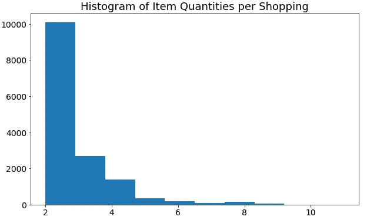

# 熊猫菜篮子分析

> 原文：<https://towardsdatascience.com/market-basket-analysis-with-pandas-246fb8ee10a5?source=collection_archive---------18----------------------->

## 一般有哪些物品是一起买的？


Nathália Rosa 在 [Unsplash](https://unsplash.com/s/photos/grocery-store?utm_source=unsplash&utm_medium=referral&utm_content=creditCopyText) 上拍摄的照片

购物篮分析是零售商实施的常见数据科学实践。目标是发现项目之间的关联。了解人们倾向于一起购买什么是非常重要的。

有一个像样的市场篮子分析提供了有用的洞察力过道组织，销售，营销活动，等等。

在本帖中，我们将分析 Kaggle 上可用的杂货店[数据集](https://www.kaggle.com/heeraldedhia/groceries-dataset)。让我们从读取数据集开始。

```
import numpy as np
import pandas as pdgroceries = pd.read_csv("/content/Groceries_dataset.csv")groceries.shape
(38765, 3)groceries.head()
```


(图片由作者提供)

数据集的组织方式是每行代表特定客户在给定日期购买的商品。

在开始分析之前，我们应该检查数据类型，以及是否有任何丢失的值。

```
groceries.isna().sum().sum()
0groceries.dtypes
Member_number       int64 
Date               object 
itemDescription    object
```

没有丢失值，但是“日期”列的数据类型应该转换为日期时间，这可以通过 pandas 的 to_datetime 函数来完成。

```
groceries.Date = pd.to_datetime(groceries.Date)
```

我们先来看看平均每天售出的商品数量。一种方法是按日期对项目进行分组并对项目进行计数。然后我们可以画出结果。

```
import matplotlib.pyplot as pltgroceries[['Date','itemDescription']].groupby('Date').count()\
.plot(figsize=(12,6), legend=False, fontsize=14)plt.title('Number of Items Sold per Day', fontsize=18)
plt.xlabel('Date',fontsize=14)
plt.ylabel('Qty', fontsize=14)
```


(图片由作者提供)

如果我们降采样会更好看。我们可以使用重采样功能来降低频率。

```
groceries[['Date','itemDescription']].groupby('Date').count()\
.resample('M').mean()\
.plot(figsize=(12,6), legend=False, fontsize=14)plt.title('Number of Items Sold per Day', fontsize=18)
plt.xlabel('Date',fontsize=14)
plt.ylabel('Qty', fontsize=14)
```


(图片由作者提供)

看起来生意越来越好，因为商品数量呈普遍增长趋势。

数据集中的每一行都代表客户在某一天购买的一件商品。如果一个顾客一次购买了三件商品，将会有三行具有相同的顾客号和日期，但是具有不同的商品描述。

另一个衡量标准是每次购物的平均商品数量，它可以通过按客户编号和日期对商品进行分组来计算。

```
item_qty = groceries[['Member_number', 'Date','itemDescription']]\
.groupby(['Member_number','Date']).count().reset_index()item_qty.head()
```


(图片由作者提供)

Item_qty dataframe 显示每次购物的商品数量。例如，客户 1000 在 2014 年 6 月 24 日购买了 3 件商品。

平均每次购物的商品数量在 2.5 件左右。

```
item_qty.itemDescription.mean()
2.5907
```

我们还来看看每次购物的商品数量分布。

```
item_qty.itemDescription.plot(figsize=(10,6), kind='hist',
                              legend=False, fontsize=14)plt.title('Histogram of Item Quantities per Shopping', fontsize=18)
```



(图片由作者提供)

顾客最有可能一起购买 2-3 件商品。

购物篮分析的主要焦点是一起购买哪些项目。一种常见的技术是关联规则学习，这是一种发现变量之间关系的机器学习方法。Apriori 算法是一种常用的关联规则学习算法。

在这篇文章中，我们不会详细讨论 apriori 算法或关联规则学习。相反，我会告诉你一个简单的方法来检查哪些物品是经常一起购买的。

让我们首先创建一个包含每次购物的商品列表的数据框架。

```
items = groceries.groupby(['Member_number', 'Date'])\
.agg({'itemDescription': lambda x: x.ravel().tolist()}).reset_index()items.head()
```


(图片由作者提供)

客户 1000 在 2014 年 6 月 24 日购买的三种商品是全脂牛奶、糕点和咸点心。

我们需要确定哪些项目经常出现在“itemDescription”列的相同行中。

一种方法是在每行中创建项目的组合，并计算每个组合的出现次数。python 的 itertools 可以用来完成这项任务。

以下是第一行的示例。

```
import itertoolslist(itertools.combinations(items.itemDescription[0], 2))
```


(图片由作者提供)

第一行有 3 个项目，所以我们有 3 对组合。Itertools.combinations 不返回我们需要的重复组合(例如(' pastry '，' pastry '))。

下面的代码将对每一行执行该操作，并将组合添加到一个列表中。

```
combinations_list = []
for row in items.itemDescription:
    combinations = list(itertools.combinations(row, 2))
    combinations_list.append(combinations)
```

我们创建了一个列表列表:


(图片由作者提供)

我们可以通过使用 pandas 的 explode 函数从这个列表中创建一个列表，但是我们需要首先将它转换成 pandas 系列。

```
combination_counts = pd.Series(combinations_list).explode().reset_index(drop=True)
```


(图片由作者提供)

现在，我们可以使用 value_counts 函数来计算每个组合的出现次数。以下是十种最常见的组合:


(图片由作者提供)

第一个是惊喜，因为它是重复的。我们已经做出了没有重复元素的组合。数据集可能包含 repating 元素。例如，如果一个顾客一次买了 2 瓶全脂牛奶，那就必须有两行全脂牛奶。

我们可以通过计算每次购物时全脂牛奶的数量来确认。

```
whole_milk = groceries[groceries.itemDescription == 'whole milk']\
.groupby(['Member_number','Date']).count()\
.sort_values(by='itemDescription', ascending=False).reset_index()whole_milk.head()
```


(图片由作者提供)

看来我们怀疑的是正确的。例如，顾客 1994 在 2015 年 11 月 3 日购买了 4 瓶全脂牛奶。因此，最常见的组合是全脂牛奶和全脂牛奶是完全有道理的。

我们应该关注不重复的组合。例如，第二常见的组合是全脂牛奶和面包卷。全脂牛奶似乎主宰了购物清单。

我们已经做了一个简单和基本的市场篮子分析。大型零售商正在做更复杂的事情，他们可能会从许多不同的角度进行分析。

然而，总体目标通常是相同的，即能够预测客户的购买行为。

感谢您的阅读。如果您有任何反馈，请告诉我。