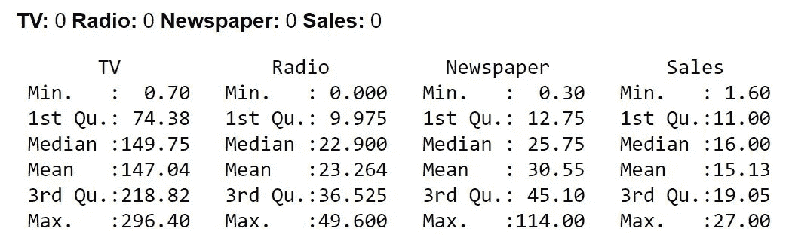
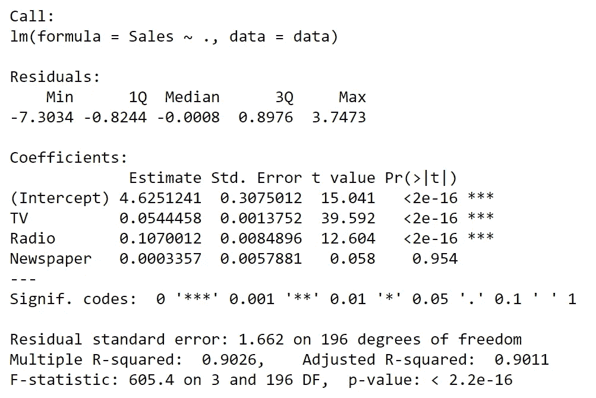
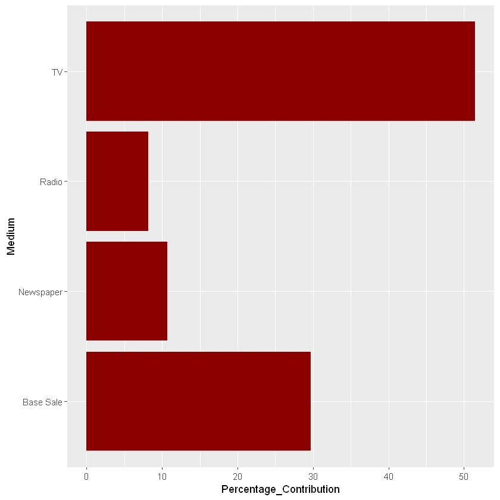
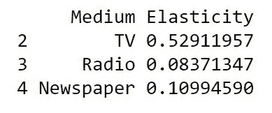

# MLR 的市场组合建模应用

> 原文：<https://towardsdatascience.com/market-mix-modelling-application-with-mlr-60b18bd3dc81?source=collection_archive---------29----------------------->

## 如何量化每个营销渠道对销售量的影响

市场组合建模(MMM)是一种分析方法，它将营销和销售数据转化为可以衡量营销渠道对销售量的影响的数量。这种技术和经验关系的关系，可以是线性的，也可以是非线性的，是通过每个渠道上的销售和营销费用之间的回归得到的。


在 [Unsplash](https://unsplash.com/s/photos/sales?utm_source=unsplash&utm_medium=referral&utm_content=creditCopyText) 上由 [Austin Distel](https://unsplash.com/@austindistel) 拍摄的照片

使用模拟，其中每个营销渠道的成本是不同的，产生了多种情况，并取决于结果；衍生出有效的营销策略。由于使用了多线性回归，等式可以给出如下:

```
Sales= β_0 + β_1*(Channel 1) + β_2*(Channel 2)
```

其中销售代表销售量，渠道 1 和渠道 2 是不同的营销渠道，β_0 代表基本销售，即在没有任何营销活动的情况下，由于自然需求、品牌忠诚度和认知度而产生的销售量。另一方面，β_1 和β_2 是渠道 1 和渠道 2 的系数，代表每个渠道对销售量的贡献。

我们的数据集将是在 [Kaggle](https://www.ipsos.com/en/ipsos-encyclopedia-marketing-mix-modelling) 上可用的广告数据集。为了说明多元线性回归(MLR)如何应用于该数据集，我将只关注市场组合建模(MMM)的实施部分。

我们将使用 R 进行分析，让我们从导入我们的库开始:

```
library(ggplot2)
library(reshape2)
```

然后，阅读我们的数据集，检查缺失值并了解每一列的汇总统计数据:

```
*# Reading the dataset* 
data = read.csv('advertising.csv')*# Checking for missing values*
sapply(data, function(x) sum(is.na(x)))*# Checking summary statistics of each column*
summary(data)
```



每列的汇总统计信息

我们现在执行多元线性回归，将销售额作为因变量，将电视、广播和报纸支出作为因变量:

```
*# Multiple Linear Regression*linear_model = lm( Sales ~., data)
summary(linear_model)
```



线性回归模型汇总表

整体模型非常显著，p 值为 2.2e-16。除了截距这一常数项，电视和广播都是最重要的变量，分别与销售量有很强和中等的相关性。R 平方值为 0.9026，这意味着模型捕获了数据中 90%的方差。

最后，该等式可被给出为:

```
Sales= 4.6251241 + 0.0544458*TV + 0.1070012*Radio + 0.0003357*Newspaper
```

这里的基本销售额约为 4.63，这意味着无论营销策略是否到位，这都是将产生的最低销售额。还可以看出，与其他营销渠道相比，报纸的贡献是微不足道的，因为系数非常小。

此外，在所有营销渠道上的支出，无论贡献大小，都对销量有积极影响。我们现在来看看电视、广播和报纸的贡献图表。

贡献图是一种可视化营销活动影响的方法，以总贡献为基础，根据对销售额的百分比贡献来显示。

```
Contribution of TV spends = (Coefficient of TV spends) * Mean(TV spends)
```

同样，其他媒体的贡献也是确定的，电视贡献的百分比由电视贡献占总贡献的比率给出。

```
*# Contribution Charts*Base_Sale = linear_model$coefficients[1]
TV = linear_model$coefficients[2]*mean(data$TV)
Radio = linear_model$coefficients[2]*mean(data$Radio)
Newspaper = linear_model$coefficients[2]*mean(data$Newspaper)df_cc = data.frame(Medium = c("Base Sale","TV","Radio","Newspaper"),Contribution = c(Base_Sale,TV,Radio,Newspaper))
df_cc$Percentage_Contribution = round(df_cc$Contribution*100/sum(df_cc$Contribution),2)ggplot(df_cc,aes(y=Percentage_Contribution,x=Medium))+geom_bar(stat='identity',fill = 'darkred')+coord_flip()
```



每个营销渠道的贡献细分

在评估了每种媒体的贡献后，我们现在计算每种媒体的有效性或弹性，即销售额随单位支出变化的百分比变化:

```
*# Price Elasticity*df_cc$Elasticity = df_cc$Contribution/mean(data$Sales)
df_cc2 = df_cc
df_cc2 = df_cc2[df_cc2$Medium != 'Base Sale',c("Medium","Elasticity")]
print(df_cc2)
```



所有营销渠道的弹性表

在给定数据集上使用 MMM，我们能够量化不同营销渠道对销量的影响，并确定电视是开展促销和活动的最有效媒体。这一发现也得到了鲁宾逊在 2009 年进行的研究的支持，他引用说“电视广告似乎和以往一样有效，甚至可能增加无效性。”

MMM 可用于创建优化的策略，使得基于不同信道的性能，性能差的信道的预算可被重新分配给性能更强的媒体。

但是，请注意，通过时间序列分析，可以观察到最佳花费。这是因为在某个时间点之后，达到了饱和，无论花费多少，对销售量都没有影响。此外，当营销活动进行时，总会有一种溢出或结转效应，随着时间的推移而逐渐衰减。为了理解这一点，可以进行 Adstock 分析，以了解结转效应以及收益递减规律，即花第一美元比第二、第三或第四美元更有效。

感谢您的阅读。对于任何想法或反馈，请随时通过给我的 Linkedin 发送消息来与我分享！

https://www.linkedin.com/in/faizfablillah/➡️