# 马尔可夫和隐马尔可夫模型

> 原文：<https://towardsdatascience.com/markov-and-hidden-markov-model-3eec42298d75?source=collection_archive---------0----------------------->

## 用例子详细说明

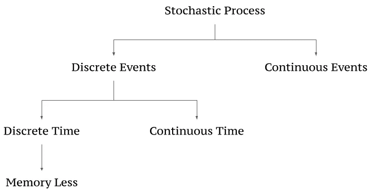

图 1 .随机过程——作者图片

一个**随机** **过程**是由一些数学集合索引的随机变量的集合。也就是说，**随机过程**的每个随机变量与集合中的一个元素唯一关联。用于索引随机变量的集合称为**索引集合**，随机变量集合形成**状态空间**。一个**随机** **过程**可以基于状态空间、指标集等以多种方式分类。

当**随机** **过程**被解释为时间时，如果该过程有整数、数字、自然数等有限个元素，那么它就是**离散时间。**

## 随机性模型

它是一个**离散时间过程**，在时间 1、2、3……获取被观察的状态**的值。**

> 例如，如果状态**(S)= {热，冷}**
> 
> 状态序列随时间变化=> **z∈ S_T**
> 
> 4 天的天气可以是一个序列= >**{ Z1 =热，z2 =冷，z3 =冷，z4 =热}**

马尔可夫和隐马尔可夫模型被设计用来处理数据，这些数据可以被表示为一段时间内的观察“序列”。隐马尔可夫模型是概率框架，其中观察到的数据被建模为由几个(隐藏的)内部状态之一生成的一系列输出。

## 马尔可夫假设

马尔可夫模型主要是基于两个假设开发的。

1.  **有限视界假设**:处于 t 时刻状态的概率只取决于(t-1)时刻的状态。

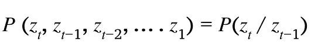

**等式 1 .有限视野假设**

这意味着在时间 **t** 的状态代表*对过去的足够总结*来合理地预测未来。这个假设是一阶马尔可夫过程。k 阶马尔可夫过程假设状态 z_t 与其前 k + 1 步的状态条件无关。

2.**平稳过程假设**:给定当前状态，下一个状态的条件(概率)分布不随时间变化。

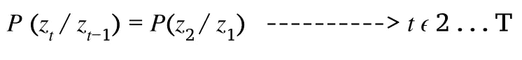

**等式 2 .平稳过程假设**

这意味着状态会随着时间不断变化，但潜在的过程是静止的。

## 符号约定

*   有一个初始状态和一个初始观测 z0 = s0
*   s_0 —时间 0 时状态的初始概率分布。
*   初始状态概率— (π)
*   在 t=1 时，看到第一真实状态 Z1 的概率是 p(Z1/z0)
*   因为 z0 = s0，

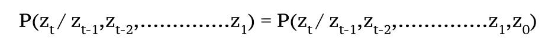

## 状态转移矩阵

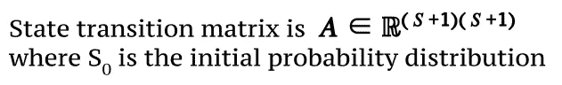

在任何时间 t 从状态 *i* 转换到状态 j 的𝐀𝐢,𝐣=概率。以下是包括初始状态在内的四个状态的状态转换矩阵。

图 2 .状态转移矩阵—作者图片

## 马尔可夫模型中的两个主要问题

1.  状态 z 的特殊序列的概率？
2.  我们如何估计状态转移矩阵 A 的参数以最大化观察序列的可能性？

## 特定序列的概率

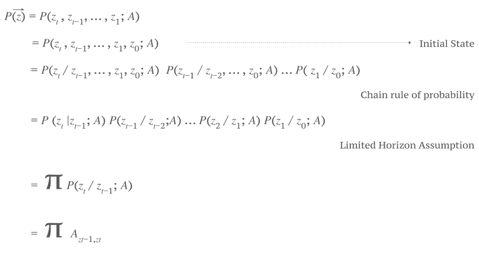

**等式 4 .找到特定序列的概率**

考虑上面的状态转移矩阵**(图 2)**，让我们找出序列的概率— > {z1 = s_hot，z2 = s_cold，z3 = s_rain，z4 = s_rain，z5 = s_cold}

> P(z)= P(s _ hot | s _ 0)P(s _ cold | s _ hot)P(s _ rain | s _ cold)P(s _ rain | s _ rain)P(s _ cold | s _ rain)
> 
> = 0.33 x 0.1 x 0.2 x 0.7 x 0.2 = 0.000924

# 隐马尔可夫模型(HMM)

当我们不能观察状态本身，而只能观察状态的一些概率函数(观察)的结果时，我们利用 HMM。HMM 是一个统计的**马尔可夫模型**，其中被建模的系统被假设为一个**马尔可夫过程**，具有未观察到的(**隐藏的**)状态。

> **马尔可夫模型**:一系列(隐藏)状态 z={z_1，z_2…………}取自州字母表 S ={s_1，s_2，…。𝑠_|𝑆|}，z_i 属于 s。
> 
> **隐马尔可夫模型**:从一个输出字母表 V= {𝑣1，𝑣2，…中抽取的一系列观测输出 x = {x_1，x_2，…}。。，𝑣_|𝑣|}其中 x_i 属于 v

## HMM 的假设

嗯，也是建立在几个假设之上的，以下是至关重要的。

*   **输出独立性假设**:当*给定当前隐藏状态*时，输出观察有条件地独立于所有其他隐藏状态和所有其他观察。

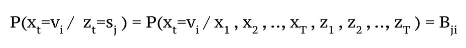

等式 5

*   **发射概率矩阵**:给定相应时间的状态为 s_j，隐藏状态产生输出 v_i 的概率

## 作为有限状态机的隐马尔可夫模型

考虑下面图 3 中给出的例子，它详细说明了一个人在不同气候下的感觉。

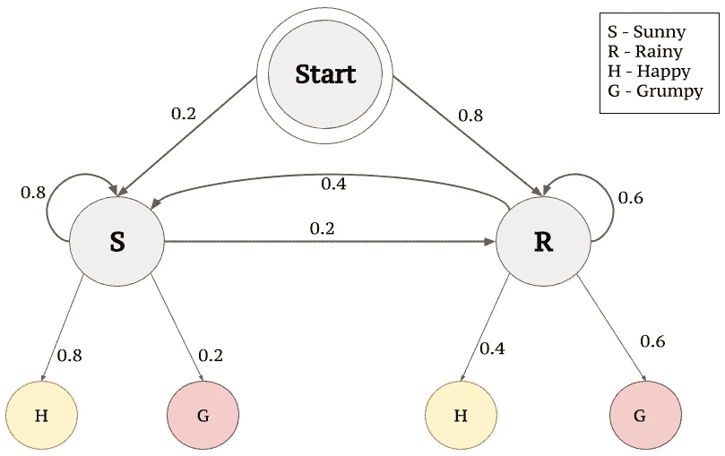

图 3 .作为有限状态机的马尔可夫模型—作者图片

> 一组状态= {快乐，暴躁}
> 
> 隐藏状态集(Q)= {晴天，雨天}
> 
> 随时间变化的状态序列= z∈ S_T
> 
> 四天的观察状态= { z1 =快乐，z2=暴躁，z3 =暴躁，z4 =快乐}

*   你从一个人的情绪中理解的感觉被称为**观察**，因为你观察它们。
*   影响一个人感觉的天气被称为**隐藏状态**，因为你无法观察到它。

## 排放概率

在上面的例子中，感觉(开心或暴躁)只能被观察到。一个人可以观察到一个人有 80%的机会快乐,只要在特定的观察点(或者在这种情况下是一天)气候晴朗。同样，在多雨的气候下，一个人有 60%的几率变得**暴躁**。这里提到的 80%和 60%是**排放概率**，因为它们处理的是观测数据。

## 转移概率

当我们考虑影响观察的气候(隐藏状态)时，在连续的晴天或隔天下雨之间存在相关性。有 80%的机会连续几天天气晴朗，而有 60%的机会连续几天下雨。解释向/从隐藏状态转移的概率是**转移概率。**

## HMM 中的三个重要问题是

1.  一个观测序列的概率是多少？
2.  最有可能产生观察序列的状态序列是什么？
3.  给定一些数据，我们如何学习 HMMs 参数 A 和 B 的值？

## 1.观察序列的概率

我们必须把数据 x 的可能性加起来，给定每一个可能的隐藏状态序列。这将导致 **O(|S|)^T.** 的复杂性，因此引入了两个替代程序来寻找观察序列的概率。

*   **正向程序**

> 计算所有观测值(从 t1 开始)到时间 t 的总概率。
> 
> 𝛼_𝑖 (𝑡) = 𝑃(𝑥_1 , 𝑥_2 , … , 𝑥_𝑡, 𝑧_𝑡 = 𝑠_𝑖; 𝐴, 𝐵)

*   **反向程序**

> 类似地，计算从最终时间(T)到 T 的所有观测值的总概率。
> 
> 𝛽_i (t) = P(x_T，x_T-1，…，x_t+1，z _ t = s _ I；a，B)

## **使用正向程序的示例**

S = {热，冷}

v = {v1=1 个冰淇淋，v2=2 个冰淇淋，v3=3 个冰淇淋}其中 V 是一天消费的冰淇淋数量。

示例序列= {x1=v2，x2=v3，x3=v1，x4=v2}

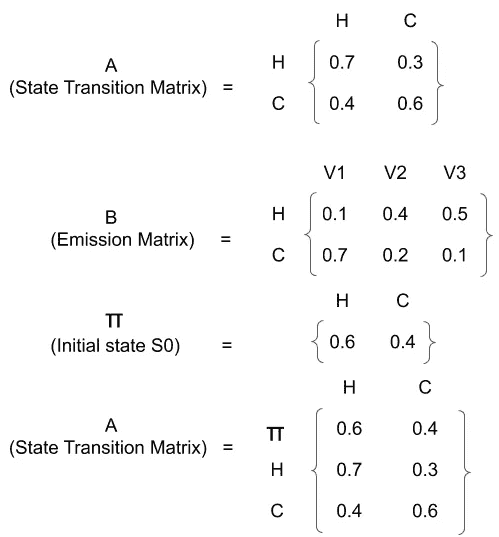

图 4 .以矩阵形式给出的数据——作者提供的图片

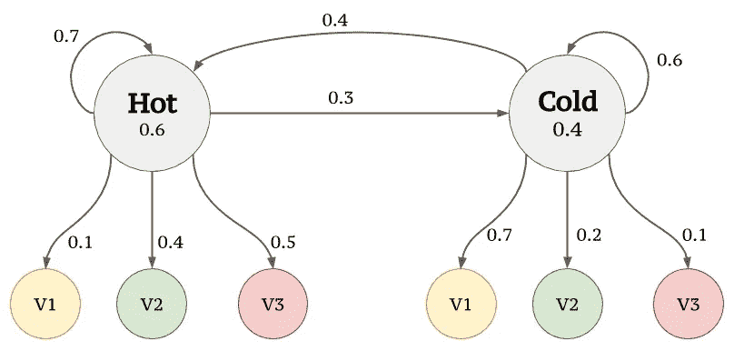

图 5 .为 HMM 生成的有限状态机—作者图片

**我们首先需要计算先验概率**(即在任何实际观察之前热或冷的概率)。这可以从 S_0 或π得到。从图 4 中，S_0 被提供为 0.6 和 0.4，它们是**先验概率。**然后，基于 Markov 和 HMM 假设，我们遵循下面图 6、图 7 和图 8 中的步骤来计算给定序列的概率。

## 1.对于第一次观察到的输出 x1=v2

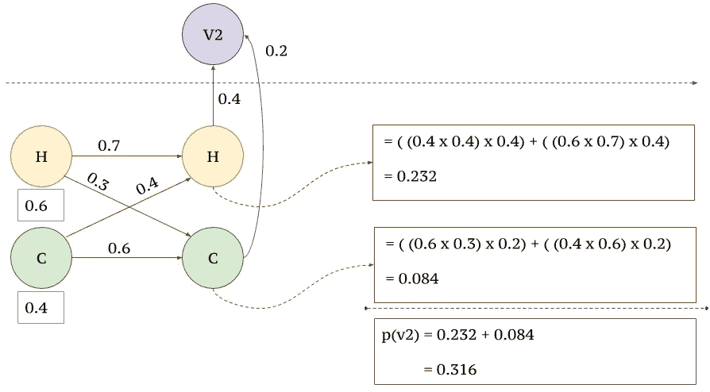

图 6 .步骤 1 —作者提供的图片

## 2.对于观察到的输出 x2=v3

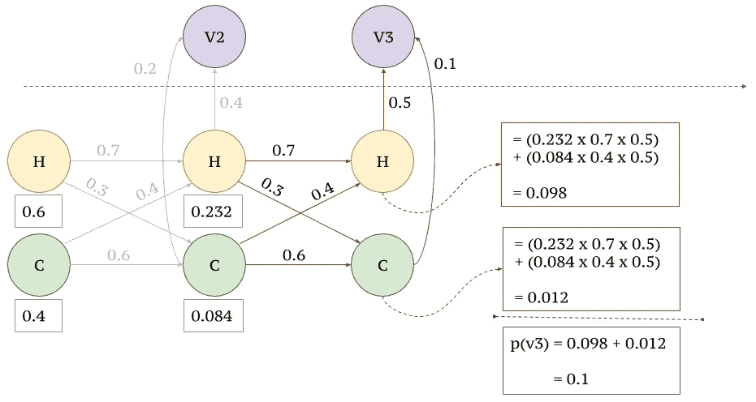

图 7 .步骤 2 —作者提供的图片

**3。** **为观察输出 x3 和 x4**

类似地，对于 x3=v1 和 x4=v2，我们必须简单地将通向 v1 和 v2 的路径相乘。

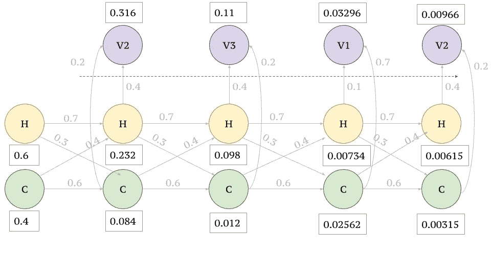

图 8 第 3 步和第 4 步—作者提供的图片

**2。最大似然分配**

对于给定的观察到的输出序列𝑥 𝜖 𝑉_𝑇，我们打算找到最可能的状态序列𝑧 𝜖 𝑆_𝑇.我们可以通过下面的例子来理解这一点。

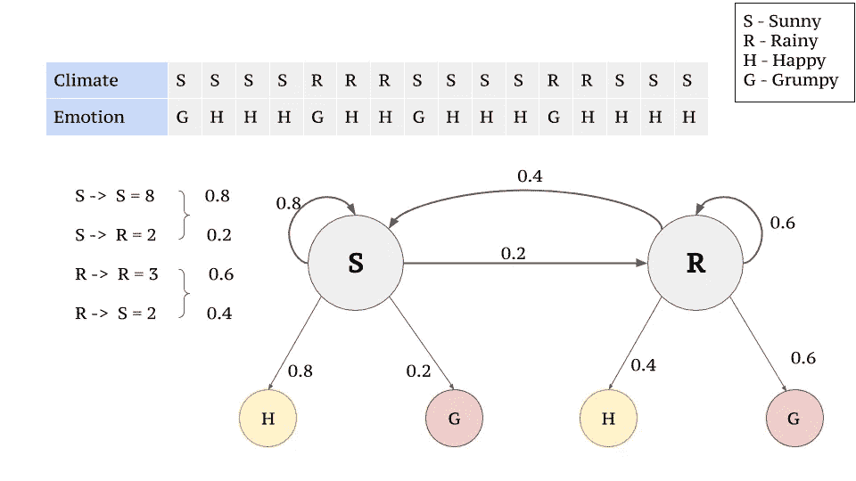

图 9 .实施例 2 的数据—作者提供的图片

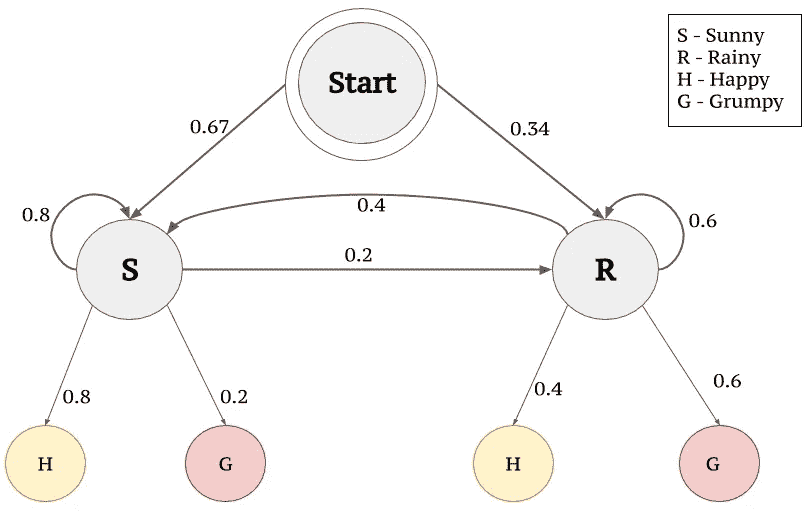

图 10 .来自图 9 的作为有限状态机的马尔可夫模型

**维特比算法**是一种动态编程算法，类似于常用于寻找最大似然的正向程序。它不是跟踪生成观测值的总概率，而是跟踪最大概率和相应的状态序列。

考虑情绪的顺序:H，H，G，G，G，H 连续 6 天。使用维特比算法，我们将找到更多的序列的可能性。

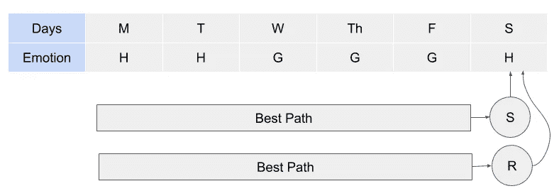

图 11 .维特比算法要求选择最佳路径——作者的图像

将会有几条路径会导致周六的晴天，而很多路径会导致周六的雨天。在这里，我们打算确定最佳路径，直到晴天或雨天的星期六，并乘以快乐的转换发射概率(因为星期六使人感到快乐)。

让我们考虑一个晴朗的星期六。前一天(星期五)可以是晴天也可以是雨天。然后我们需要知道周五之前的最佳路径，然后乘以导致暴躁情绪的排放概率。迭代地，我们需要计算出在一系列日子中更有可能结束的每一天的最佳路径。

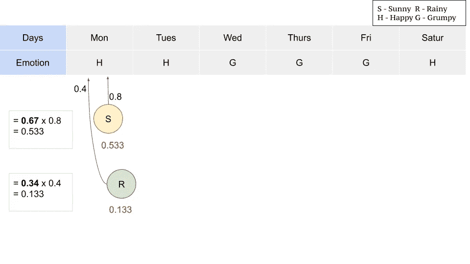

图 12 .步骤 1 —作者提供的图片

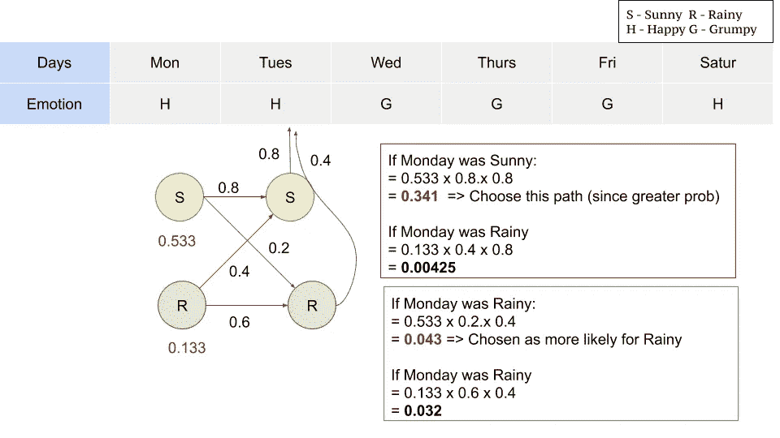

图 13 .步骤 2 —作者提供的图像

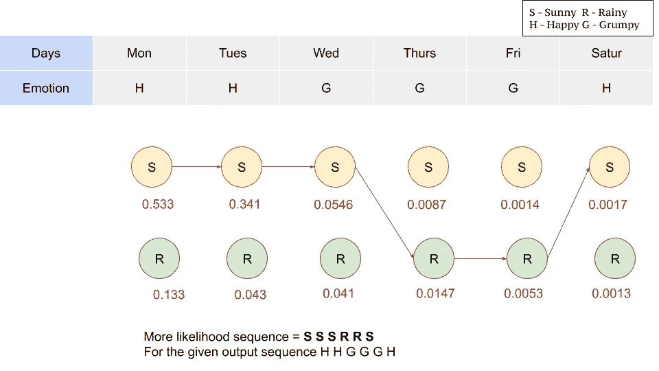

图 14 .迭代算法以选择最佳路径——作者图片

该算法留给你最大似然值，我们现在可以为给定的输出序列产生具有最大似然的序列。

**3。学习 HMMs 参数 A 和 B 的值**

HMMs 中的学习包括估计状态转移概率 A 和输出发射概率 B，这使得观察到的序列最有可能。期望值最大化算法用于此目的。一种被称为 **Baum-Welch 算法**的算法被广泛使用，它属于这一类别，并且使用前向算法。

博客全面描述了 Markov 和 HMM。这个博客主要是提供一个例子来解释给定序列的概率和 HMM 的最大似然，这在考试中也经常是有问题的。感谢你一直阅读博客，希望这对备考有所帮助。