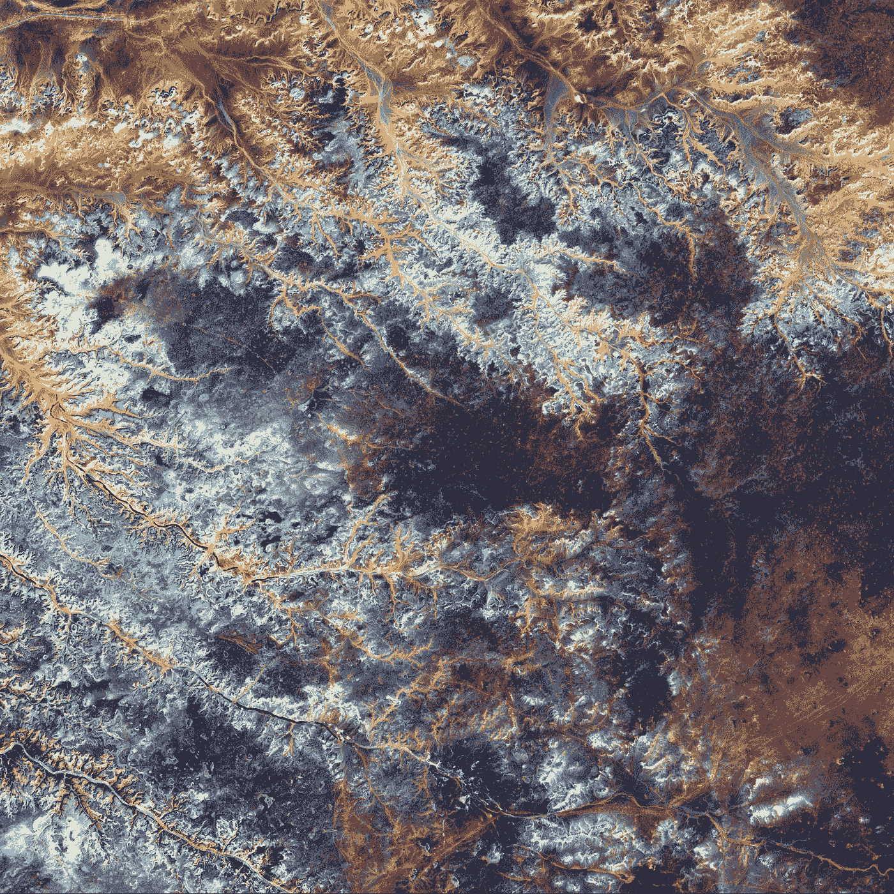

# 马尔可夫随机场与图像处理

> 原文：<https://towardsdatascience.com/markov-random-fields-and-image-processing-20fb4cf7e10d?source=collection_archive---------8----------------------->

## 网格上的无向图形模型



美国地质勘探局在 [Unsplash](https://unsplash.com/s/photos/noisy-image?utm_source=unsplash&utm_medium=referral&utm_content=creditCopyText) 上拍摄的照片

这篇文章涵盖了马尔可夫随机场及其在图像处理中的具体问题的应用。我们不深究，不拘泥于形式，只凭直觉。

马尔可夫随机场是这样一种图，其节点模拟随机变量，其边模拟随机变量对之间的期望局部影响。本地的影响传播到全球，利用图的连通性。

这里有一个例子。考虑矩形网格上的图像。它由像素组成。每个像素都有一个值，表示它的颜色。在内部，对于黑白图像，像素可以表示为二进制变量，对于灰度图像，可以表示为连续变量，对于彩色图像，可以使用多个变量(例如 RGB)的混合。这些差异对我们来说无关紧要。就我们而言，一个像素有一个代表其颜色的值。

对此进行建模的自然 MRF 对每个像素都有一个节点。一条边连接两个相邻的节点(在网格上)。下面是一个 3x3 网格上的 MRF 示例。竖线和横线是它的边。

```
o — o — o
|   |   |
o — o — o
|   |   |
o — o — o
```

好的，这个 MRF 的结构与网格相匹配。听起来是件好事。选择这种结构是否有更深层次的原因？是的。

真实世界的图像往往是平滑的。也就是说，相邻像素倾向于具有相似的颜色。当然，它们也可能是突变，如边缘或对象边界。然而，在这些过渡之间通常有很多平滑。

正是 MRF 边缘在某种程度上有利于相邻像素具有相似的值。怎么会？首先，它将有助于引入一些新概念。然后我们再回来回答这个问题。

**派系和能源职能**

这种材料会有点钝。你可能会想，为什么我需要知道这些？这些点将很快开始连接，所以请耐心等待。

图中的团是一组节点，其中每一对节点都由一条边连接。如果一个团不是一个更大的团的一部分，那么它是最大的。

最大派系在 MRF 的运作中起着至关重要的作用。直觉上，每个这样的集团指定一组节点，所有这些节点的值直接相互影响。

在我们的 2D 图像例子中，最大团是图的边。三角形是不可能的，因为一条边只能连接相邻的像素。

好了，我们已经描述了哪些节点直接相互影响。我们如何控制这种影响的*性质*？在我们的 2D 图像示例中，我们希望相邻像素具有相似的*值。*

我们通过自己选择的所谓能量函数来控制集团中节点值之间的交互细节。这个函数(每个最大团一个)输入所有团节点的值，并输出其能量，一个标量。我们选择的能量函数应该将低能量分配给这些节点值的良好组合。也就是低能好。

对其节点的特定赋值的全局能量是图中所有最大团的能量之和。

**平滑-支持能量函数**。在我们的图像 MRF 中，什么能量函数会产生平滑度？考虑|*-*XJ*|。这里 *i* 和 *j* 表示相邻像素， *xi* 和 *xj* 表示它们的值。该能量函数更希望 *xi* 和 *xj* 具有相似的值。结果，全局能量将被最大程度平滑的图像最小化。*

*请注意，在引擎盖下， *xi* 和 *xj* 可能有多个维度，例如颜色的 RGB。我们不在乎，只要我们能有意义地计算出两种颜色之间的距离，这就是| *xi* - *xj* |是什么。*

*嗯，这很好，但是最平滑的图像有什么好处呢？所有像素将具有相同的颜色。*

*下面我们看到一些具体的有用的图像处理问题，其中平滑度，因此 MRF，发挥了重要作用。*

***图像去噪***

*考虑这个例子。*

**

*照片由[乔希·卡恩](https://unsplash.com/@joshkahen?utm_source=unsplash&utm_medium=referral&utm_content=creditCopyText)在 [Unsplash](https://unsplash.com/s/photos/noisy-black-and-white-image?utm_source=unsplash&utm_medium=referral&utm_content=creditCopyText) 上拍摄*

*看那些白点(星星)。假设有人愿意把它们当成噪音(尽管它们不是)。只需点击一个按钮，这个人就可以要求这个图像去噪。denoiser 的工作是将这些白点识别为最有可能的罪犯，并将它们涂黑。*

*为什么我们期望 MRF 能够把这些白点当成噪音来检测呢？为了便于讨论，假设每个白点是单个像素。一个点的像素是白色的，它所有的邻居都是黑色的。此外，黑色和白色是非常不同的颜色。MRF 不喜欢这种不和谐。也就是说，如果我们把光斑的颜色变成黑色，总能量会显著降低。这个推理适用于所有的白点。*

*对于亮红色球体中的任何像素，它至少有一些颜色相似的邻居。因此，大幅改变这种像素的颜色不会降低能量。*

***更丰富的 MRF 用于图像去噪***

*这个 MRF 有两层节点。两个表中的节点表示像素，就像在网格上布置的那样。像以前一样，第一个页面的边缘由网格决定。第二个工作表中的节点之间没有边。一条边连接两个工作表中表示同一像素的两个节点。*

*下面是一个 1X3 网格上的 MRF 示例。*

```
*o — o — o      sheet one
|   |   |
o   o   o      sheet two*
```

*我们将表一中的节点表示为 Y，表二中的节点表示为 X。我们将从要去噪的图像中设置 X 的值。这些值保持不变。Y 中的值表示去噪后的图像。这些值随着去噪过程的发展而变化。*

*我们将使用和以前一样的能量函数。这对全球能源有什么影响？它试图找到一个既接近输入图像又比输入图像平滑的去噪图像。*

***图像恢复***

*在这里，我们得到的图像既有*噪声*(即它的一些像素具有不正确的值)，又有*不完整*(即它的一些像素没有值)。双张 MRF 也很适合解决这个问题。和以前一样，我们将从输入图像中设置 X 的值。除了输入图像中缺失值的像素保持空闲。*

***图像分割***

*这里我们想把图像分割成最大程度上同质的区域。同质性意味着某些属性在整个区域保持相似。该属性可以是颜色。还是质感。或者两者结合。最大化意味着不同的区域，尤其是相邻的区域，是不相似的。听起来像集群？是的，在图像属性的 2D 设置中:颜色等。*

*分割的一个特别关键的情况是将图像分成前景和背景。在我们的球体例子中，球体是前景，黑色的天空(包括星星)是背景。*

*一般来说，即使这样的二元分割也不容易做到。与我们示例中的简单背景(黑色天空)不同，其他背景可能有不同的纹理或颜色。另外，图像可能包含多个对象。事实上，在这种情况下，前景是如何定义的？*

*一种既能简化问题又能消除歧义的有效方法叫做*交互式分割*。用户在想要分割的目标周围画一个边界框。该算法将该框作为粗略的初始分割，并试图对其进行改进。*

*以天空为例，修改后的天空中有两个不同的球体。把它们想象成太阳和月亮。用户可以将边界框放在月亮周围。所以太阳和天空都在背景中。*

***建筑与能源功能***

*我们在这里也将使用两层 MRF 结构。和以前一样，X 页将包含图像。工作表 Y 将捕获其分段。工作表 Y 的节点是二进制值，用*零*表示背景，*一*表示前景。Y 中的边将形成与之前相同的网格结构。连接 X 和 Y 的边也是一样的。*

*我们将针对这个问题使用不同的能量函数。为什么？在前景上施加实质上的同质性而在背景上施加较弱的同质性(如果有的话)似乎是合理的。我们如何才能做到这一点？通过选择将 1 值比 0 值更“有力”地传播到相邻节点的能量函数。*

*我们将举例说明这个算法和能量函数，特别是简单的例子。(虽然，不好看。)*

```
*______ __|___ ____| ____ ______*
```

*这个例子是一个 1D 二进制图像。水平线段是不同长度的黑色像素串。这些被白色像素点打断。竖线划分边界框。*

*现在来看插图。给定边界框，Y 的初始赋值为*

```
*Y           ________X ______ __|___ ____| ____ ______*
```

*注意，X 中的框内部的白色像素在 y 中已经是黑色的。这就好像我们使用了先前的信念，即用户指定的边界框的内部应该全部被认为是在前景中，除非有实质的相反证据。*

*从这个初始 Y 开始，算法将把边界框向左扩展两个像素。为什么？因为能量函数的每个分量都会喜欢这个扩展。为什么？因为平滑度分量喜欢将 1 值传播给它的邻居。碰巧图像中这些点的实际像素也是 1 值(黑色)。所以算法会在下面描绘的 Y 处停止。*

```
*Y        ___________X ______ __|___ ____| ____ ______*
```

***高阶模型***

*我们能丰富我们的模型而不牺牲它的简单和优雅吗？在这里我们如何触及？更广泛的治疗，见[1]。*

*一种方法是扩展像素的邻域，例如，通过添加对角线连接，或者如果两个像素在特定距离 *d* 内，则连接两个像素。对于后者，我们可以使用欧几里德距离或曼哈顿距离。*

*如果我们要扩展一个像素的邻域，我们可以在边上引入权重，权重随着它们连接的像素之间的距离而衰减。*

*第二种方法是让节点不是代表单个像素，而是代表方形像素块。补丁的值将是我们想要的任何值。例如，块中像素强度的平均强度。如果片足够接近，则边将连接代表两个片的节点。还可以基于面片之间的距离将权重附加到边上。*

***延伸阅读***

1.  *[网格模型](http://www.cs.toronto.edu/~fleet/courses/2503/fall11/Handouts/mrfChapter-Prince2011.pdf)*
2.  *[吉布斯场&马尔可夫随机场 1 吉布斯场](http://www.cs.cmu.edu/~16831-f14/notes/F11/16831_lecture07_bneuman.pdf)*
3.  *[马尔可夫随机场和吉布斯采样用于图像去噪](http://stanford.edu/class/ee367/Winter2018/yue_ee367_win18_report.pdf)*