# 使用计算机视觉的掩模适应性跟踪

> 原文：<https://towardsdatascience.com/mask-adaptivity-tracking-using-computer-vision-8d36de26f29?source=collection_archive---------45----------------------->

## 使用 YOLOv3 构建实时掩模适应性检测器

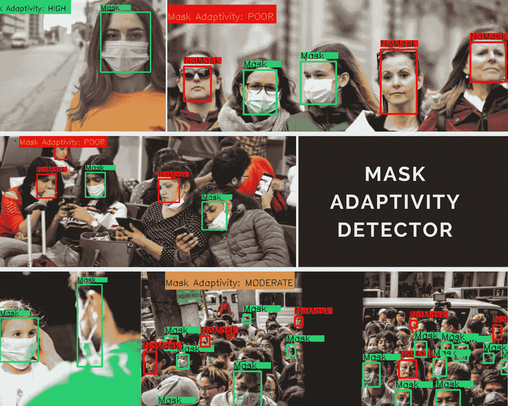

原始图片来源:Pixabay

口罩迅速成为新冠肺炎疫情的象征，超过 50 个国家强制规定。刚摆脱封锁的国家正强制要求在公共场合戴口罩，并接受一般服务。执行这一新规范也给全球各地的机构带来了新的挑战，即我们的安全摄像头无法自动跟踪社交距离和其他预防措施是否得到遵守。在本案例研究中，我们的目的是开发一种解决方案来跟踪人群的面具适应性，跟踪大多数人是否使用面具。

**问题陈述**

根据佩戴口罩的人数，确定口罩适应性是差、中还是高。从技术上讲，我们可以细分如下:

1.  检测一帧中戴面具的人数(X)。
2.  检测一帧中未戴口罩的人数(Y)。
3.  计算度量(X/(X+Y))，基于某些阈值确定适应性的类别。

**我们的方法**

我们将该问题转化为两类(掩模，无掩模)对象检测问题，并训练了一个微小的 YOLO(基于卷积神经网络的最先进的对象检测框架)模型来服务于该目的。

**有点 YOLO(你只看一次)**

YOLO 是由 Joseph Redmon 等人开发的实时对象识别算法。在此之前，对象检测主要由分类器分两个阶段执行:

1.  将图像分成各种区域，并找到感兴趣的区域(具有物体的概率高的区域)
2.  使用 CNN 对这些区域进行分类

整个过程很慢，因为我们需要在多个区域中运行预测。YOLO 提出了另一种方法，不是从图像中选择 ROI，而是将问题映射到回归问题。在 YOLO，单个卷积神经网络被应用于整个图像，该网络在单次通过中预测每个区域的边界框和概率。这些预测的有界框然后被预测的概率加权。这种单次预测使它比其他算法快得多，如 R-CNN，更快的 R-CNN 等。

YOLO 在 COCO 数据集上的地图准确率达到 48.1，高于 SSD500 模型(46.1)。虽然它比两级检测器实现了更高的 FPS，但我们仍然认为它不足以满足我们基础设施有限的用例(单个 GPU)。我们选择了 YOLO 的一个更轻的版本，叫做小 YOLO，它比完整版快了将近 442%。虽然这是准确性和速度之间的权衡，我们仍然能够实现下降性能。

**如何使用 YOLO 构建屏蔽检测器？**

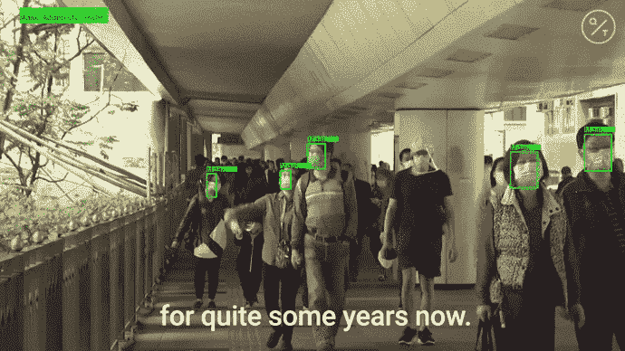

很酷的东西，原始视频来源:[彭博快拍](https://www.youtube.com/channel/UChirEOpgFCupRAk5etXqPaA)

现在让我们讨论真正有趣的部分。我将带你一步步使用微小的 YOLOv3 自己构建一个掩膜检测器。

**步骤 0:** 喝杯咖啡(完全可选)并下载[这个包含所有必要文件的资源库](https://github.com/arpan65/Mask-Adaptivity-Detection-Using-Computer-Vision)。

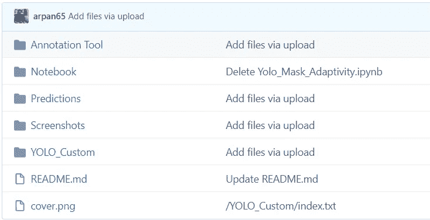

1.  **数据采集**

收集高质量的数据是任何数据科学案例研究的关键部分，同样，谷歌是你的最佳选择。试着下载戴面具的人、不戴面具的人以及两者在不同背景、角度和尺度下的照片。更多高质量的数据使您的模型更加智能。我比较喜欢用一个叫 ***的 chrome 扩展来批量下载图片*** 。如果你想使用我的数据集，在这里找到它。

2.**注释图像**

> 如果您正在使用我的数据集，请跳过此步骤。如果您想使用自己的数据，我们建议使用***label mg***工具创建注释文件。

对于 windows，你可以在下载的库的**注释工具**文件夹中找到它。对于 Linux，你可以从[这里](https://tzutalin.github.io/labelImg/)下载。

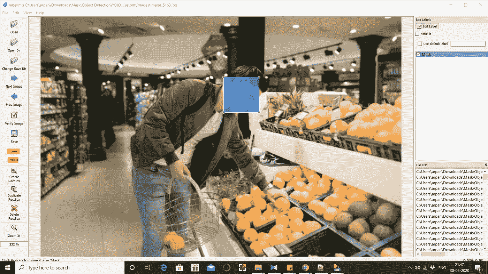

标签工具

它将创建一个 txt 文件，如下所示，包含边界框的标签和坐标。

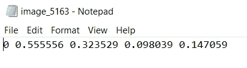

生成的注释文件

3.**准备培训文件**

为了让所有人都可以访问这个案例研究，并以最少的努力轻松再现它，我们将使用免费的 GPU 在 colab 中训练我们的模型。

a.进入 google drive，创建一个名为 **darknet** 的文件夹

b.你会在**YOLO _ 自定义**文件夹中找到培训所需的所有文件。

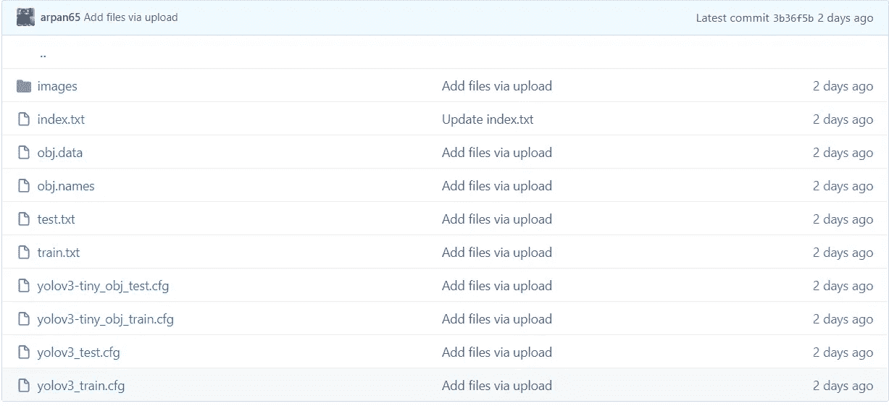

YOLO _ 自定义文件夹

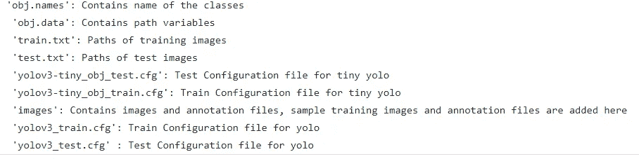

文件描述

将您的图像和注释文件包含在**图像**文件夹中，并将路径添加到 **train.txt** 文件中，如下所示(无需更改图像文件夹的路径)。同样，如果你想坚持我的数据集，跳过这一步。上传**YOLO _ 自定义**文件夹到新建的**暗网**文件夹下的驱动器

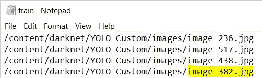

train.txt 文件

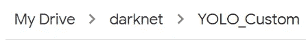

Google Drive 文件夹结构

4.**残局**

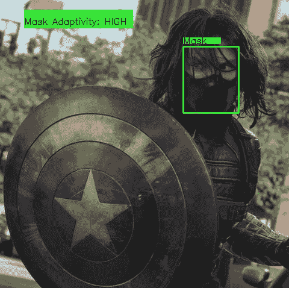

原创图片鸣谢:www.syfy.com

现在去[https://colab.research.google.com](https://colab.research.google.com/)，用你的谷歌 id 登录

从下载的资源库上传**YOLO _ 面具 _ 适应性. ipynb** 笔记本(你会在笔记本文件夹下找到)。

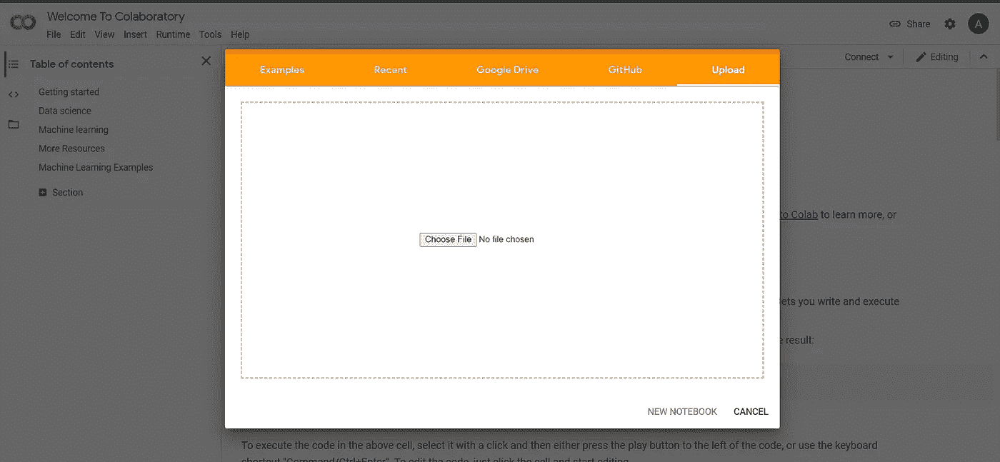

确保从**运行时**启用 GPU

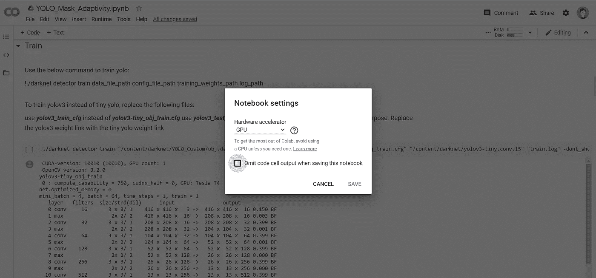

按照笔记本中提到的一步一步运行单元，准备 darknet 环境(相信我，它可以省去设置 CUDA 环境的许多麻烦)和培训。您还会发现检查图像、视频和网络摄像头预测所需的实用程序(不幸的是，colab 无法检测本地硬件，无论如何，我已经添加了代码，以防您有自己的 darknet 配置箱)。


笔记本中的步骤

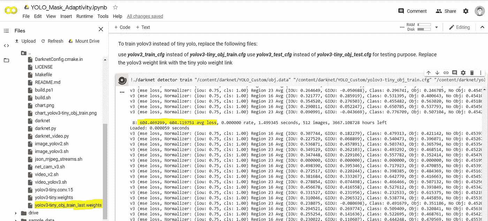

留意平均损失，训练时会定期保存重量

我需要训练多长时间？

训练，直到你达到下降平均损失(0。XX)。您可以在**yolo v3-tiny _ obj _ train . CFG**文件中配置最大批次数量。训练时会定期保存重量，您也可以保存这些重量，下次从那里继续训练。


更换重量路径以恢复训练

冬天终于来了！

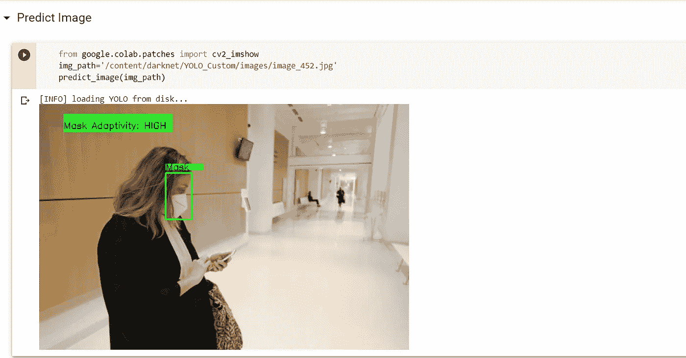

**现实世界影响**

该模型具有 244 FPS 的帧速率，适用于实时人群监控应用，并且可以通过公共场所的摄像头轻松使用。

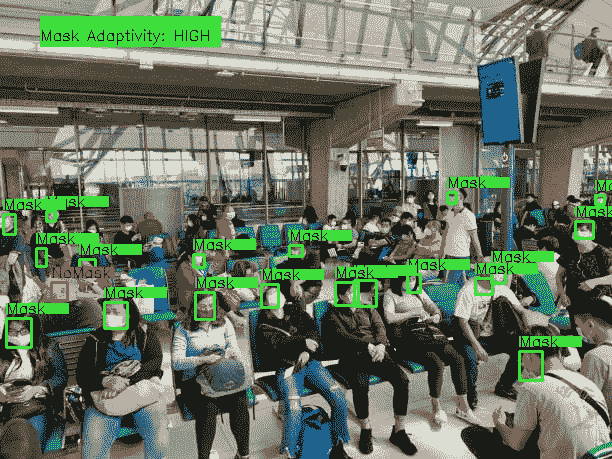

人群面具适应性监测，原始图像学分:Pixabay

**尾注**

在这个案例研究中，我们学习了如何使用 colab 中的微小 YOLOv3 轻松构建一个遮罩自适应检测器。为了简单起见，我们避免了详细的培训步骤。实际上，您可以直接下载存储库，在 drive 中创建文件夹结构，然后立即在 colab 中启动，不需要担心设置 darknet、更改配置文件或文件路径。我们的目的是创建训练框架，以便您只需做最小的更改来训练掩模适应性模型或改进我们的案例研究。一个很好的练习将是使用您的家庭安全摄像机或网络摄像头部署模型。保持安全和愉快的学习！

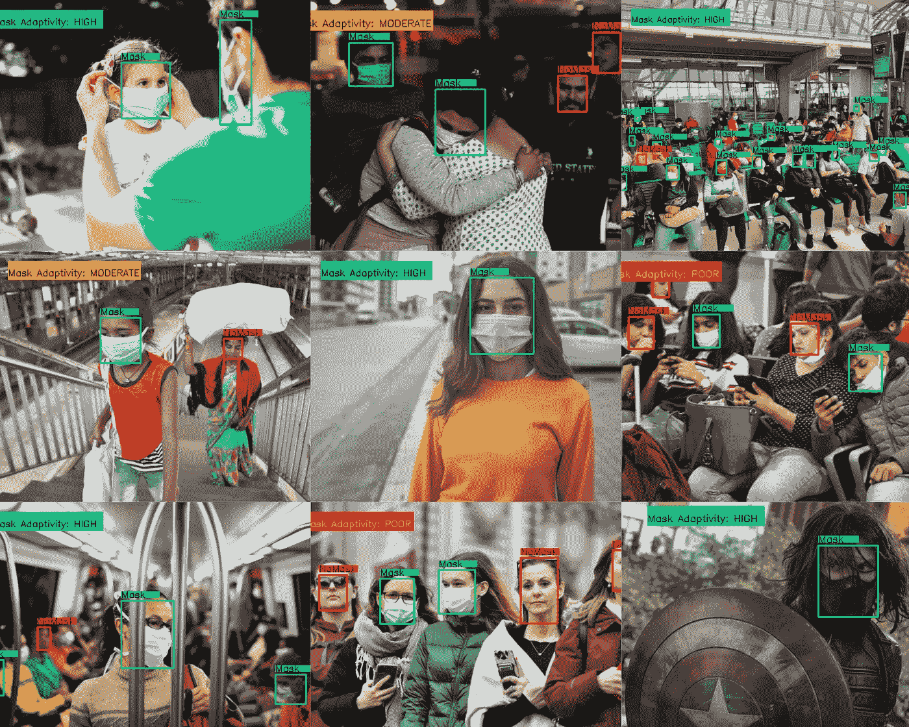

预测，原始图片来源:Pixabay

**附加链接**

请参考以下文章，了解有关对象检测的更多信息

1.  Neptune.ai 博客—[https://bit.ly/3tOjbSI](https://neptune.ai/blog/object-detection-algorithms-and-libraries)
2.  [https://pjreddie.com/darknet/yolo/](https://pjreddie.com/darknet/yolo/)
3.  [https://drive.google.com/drive/folders/1T6N4qd4ep2YgxXdpCrkngOe_o1NszHH](https://drive.google.com/drive/folders/1T6N4qd4ep2YgxXdpCrkngOe_o1NszHH_?usp=sharing)
4.  [https://github.com/AlexeyAB/darknet](https://github.com/AlexeyAB/darknet)

**引用(T5)**

1.  [https://arxiv.org/abs/1506.02640](https://arxiv.org/abs/1506.02640)

```
@misc{darknet13,
  author =   {Joseph Redmon},
  title =    {Darknet: Open Source Neural Networks in C},
  howpublished = {\url{http://pjreddie.com/darknet/}},
  year = {2013--2016}
}
```