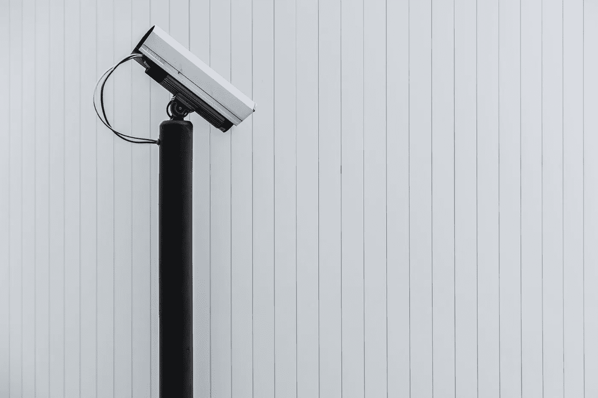
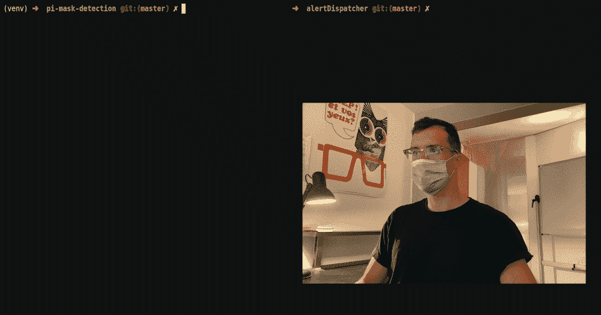
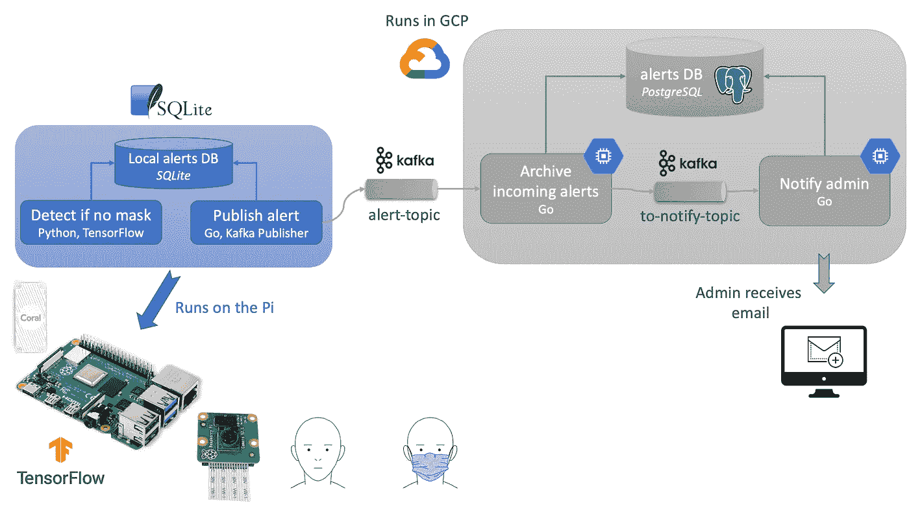
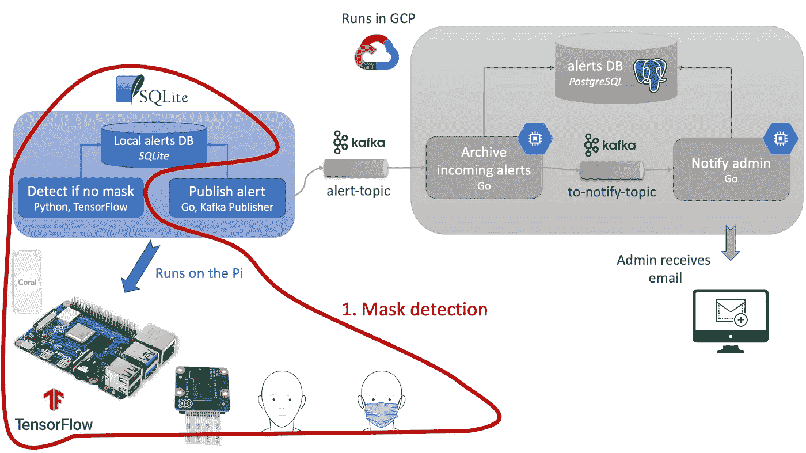
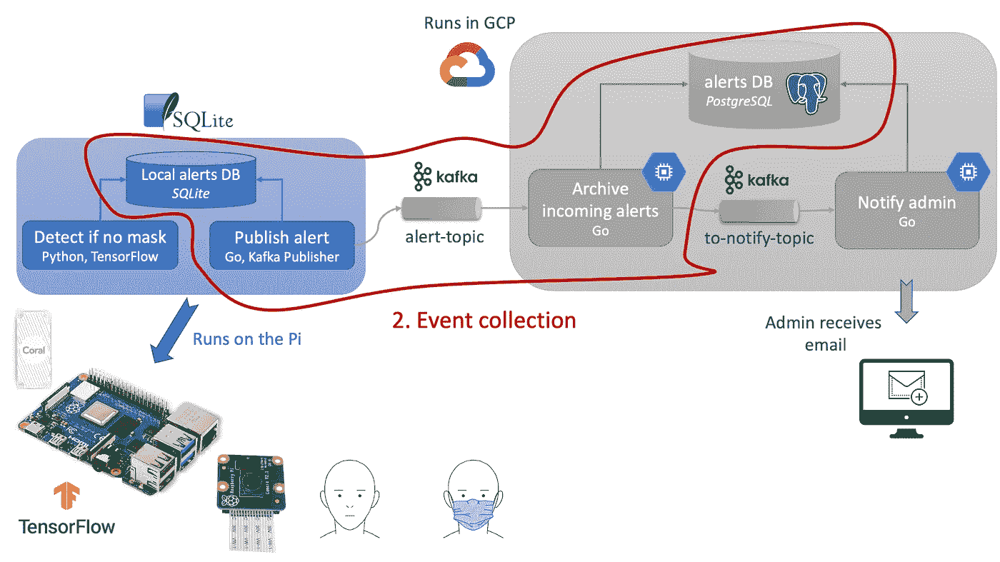
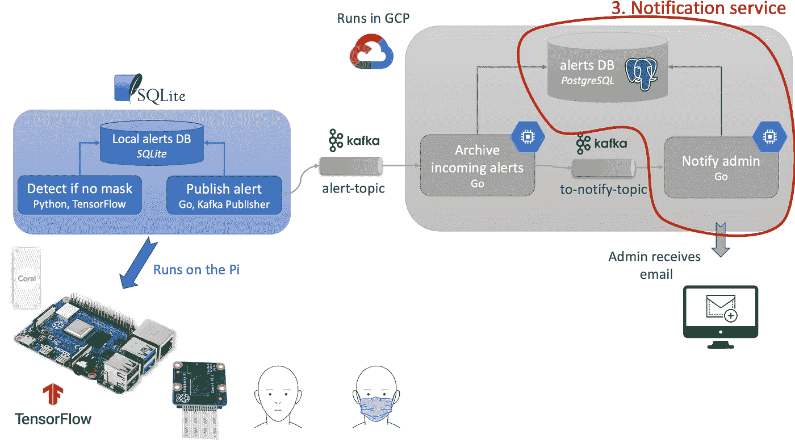
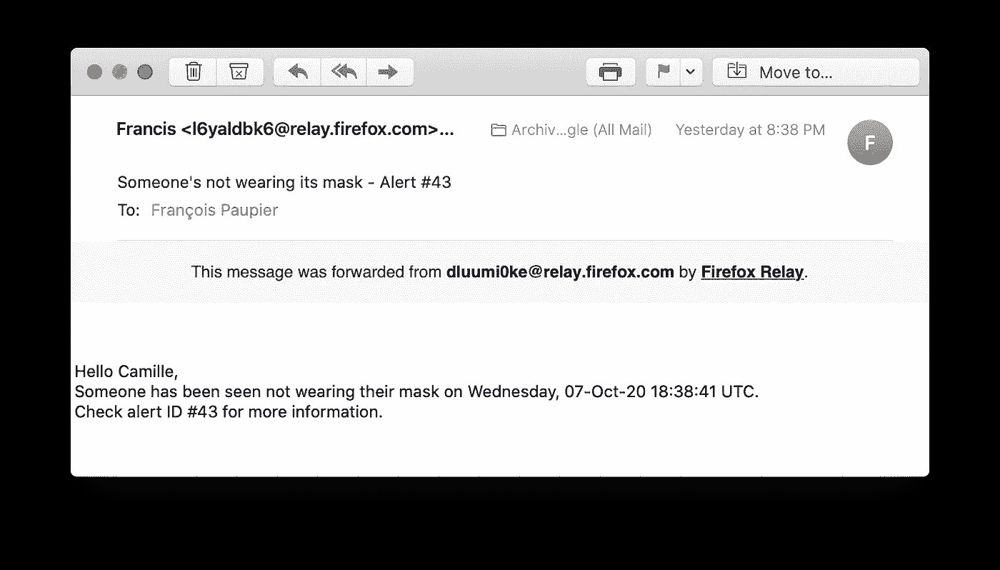

# 从边缘到云的遮罩检测—使用 TensorFlow 和 Kafka

> 原文：<https://towardsdatascience.com/mask-detection-from-the-edge-to-the-cloud-with-tensorflow-and-kafka-1b6668f15a60?source=collection_archive---------47----------------------->

## 使用 Raspberry Pi 和 Coral USB edge TPU 在边缘进行模型推断

Benedikt Geyer 在 [Unsplash](https://unsplash.com/?utm_source=unsplash&utm_medium=referral&utm_content=creditCopyText) 上拍摄的照片

一个在这个社会距离越来越远的时代，科技更新了它建立一个更安全世界的承诺。热像仪、掩模检测机制不是 COVID 疫情的解决方案，但可以帮助检测风险区域，并通过调整当地公共政策来减缓集群的增长。

在本文中，我概述了如何基于配备摄像头和人脸检测人工智能的物联网设备网络构建一个系统，以识别某个空间内的人们是否戴着面罩，并收集此类事件。

演示—在 Pi 上运行屏蔽检测，并向 Kafka 主题发出和发布警报—图片由作者提供

本项目中使用的工具有:

*   面向人脸检测模型(TensorFlow)的边缘 Python。
*   剩下的代码用 [Go](https://golang.org/) 编程语言。
*   [Kafka](https://kafka.apache.org/) 用于服务间的异步通信。
*   [用于模式定义和消息串行化的协议缓冲器](https://developers.google.com/protocol-buffers)。
*   用于存储的 SQL 数据库( [SQLite](https://www.sqlite.org/index.html) 在边缘， [PostgreSQL](https://www.postgresql.org/) 在云端)。

这个项目你需要一个[树莓 Pi](https://en.wikipedia.org/wiki/Raspberry_Pi) 4 和它的[相机](https://projects.raspberrypi.org/en/projects/getting-started-with-picamera)。我还使用了一个 [Coral USB 加速器](https://coral.ai/products/accelerator/)来更快地推断圆周率。

用于收集和处理事件“这个人没有戴面具”的架构的大图—事件驱动的架构—图片由作者提供

与任何架构和工具选择一样，这是一个固执己见的问题。我在文章的最后略微阐述了我选择的工具的优点、缺点、局限性和优势。你有什么烦心事吗？大家在评论里讨论一下吧。😉

# 深潜

现在，让我们看看如何实现这个体系结构的每个组件。从逻辑上讲，我们可以把这个系统分成三个不同的部分。完整的代码可以从我的 GitHub 获得。

1.  从 Raspberry Pi 摄像头馈送中检测某人是否戴着面具。【github.com/fpaupier/pi-mask-detection】-
2.  从 Pi 到 Google Cloud 引擎的事件收集和分发:
    -[github.com/fpaupier/alertDispatcher](https://github.com/fpaupier/alertDispatcher)-
    -[github.com/fpaupier/alertIngress](https://github.com/fpaupier/alertIngress)
3.  事件的进一步处理:
    -[github.com/fpaupier/notifyMask](https://github.com/fpaupier/notifyMask)

在本文中，我们重点关注这些组件之间的联系。

## 1.掩模检测

在我们系统的边缘，配备了一个 Pi，它的摄像头检测是否有*事件*发生。我将事件定义为:“*某人没有戴面具。”*

作者图片

为了检测某人是否戴着面具，我们遵循以下步骤:

1.  检测当前画面中是否有人脸( [MobileNet v2](https://ai.googleblog.com/2018/04/mobilenetv2-next-generation-of-on.html) )
2.  如果是，将图像裁剪到该面部边界框。
3.  在裁剪的面上应用遮罩/无遮罩二元分类器。([型号](https://github.com/fpaupier/pi-mask-detection/tree/master/models/mask_detector)为此项目培训)
4.  如果没有检测到掩码，则创建一个事件，并将其存储在本地存储中。

逻辑详见我的`[detect_mask.py](https://github.com/fpaupier/pi-mask-detection/blob/master/detect_mask.py)`的`main()`功能

## 2.收集事件

一旦 Pi 记录了一个事件，我们就将其发送到服务器进行存档和进一步处理。

作者图片

当然，我们可以在 Pi 上直接运行通知系统。尽管如此，我们在这里的目标是说明一个由几个物联网设备报告事件的系统。进一步的处理是在云上完成的，以便在 1)边缘的事件收集和 2)受控环境中的高级处理之间进行适当的分离。

考虑这部分的两个存储库:

*   [github.com/fpaupier/alertDispatcher](https://github.com/fpaupier/alertDispatcher)为圆周率上运行的代码发布了一个卡夫卡主题的提示。
*   [github.com/fpaupier/alertIngress](https://github.com/fpaupier/alertIngress)用于在服务器上运行的代码，订阅 Kafka 主题并将来自不同设备的警报存储到 PostgreSQL 实例中。

每个设备将其事件发布到 Kafka 主题—“*警报—主题*”—用于 Pi 和警报入口服务之间的异步通信。事件消息符合使用[协议缓冲区定义的模式。](https://developers.google.com/protocol-buffers)

在云上，alert ingress 服务订阅了 *alert-topic* ，并将传入的事件存档在 PostgreSQL 中。然后，入口服务发布通知服务将使用的消息。

## 3.通知服务

作者图片

您已经将事件存档在云中，现在该怎么办？让我们添加一个通知服务，向管理员发送包含事件摘要的电子邮件。

通知服务发送的电子邮件-作者图片

一个有趣的后续工作是构建一个地理可视化工具来分析每个位置和时间的事件📍🗺

## 改进的余地

这个原型说明了这个概念，但不是一个生产就绪的基础设施。将这一概念应用到生产中需要考虑的关键因素有:

*   事件重复数据删除——当前的实施为单个警报发送多个通知，因为我们为每个引发的警报发送一封电子邮件。某个没戴面具的人可能会出现在摄像机视频中一段时间。可以在服务器级别实施重复数据消除策略。
*   想想您的[保留策略](https://en.wikipedia.org/wiki/Retention_period) —定义一个合理的期限，在此期限内，您可以存储警报，然后再删除它们。您不希望将敏感数据(如人脸)保留一段不确定的时间。
*   [模式注册中心](https://docs.cloudera.com/csp/2.0.1/schema-registry-overview/topics/csp-schema_registry_overview.html) —模式注册中心确保跨服务的一致消息定义。更新和向后兼容性不是小事。如果您决定更改、添加或删除警报事件中的字段，该怎么办？您如何将这种变化传播到您的物联网设备中？
*   机器学习模型管理-您在边缘推送和部署的模型可能会随着时间的推移而[漂移](https://en.wikipedia.org/wiki/Concept_drift)并看到其性能下降，从而导致误报或戴面具的人未被报告。检查 [ML 流程](https://mlflow.org/)项目，了解关于该主题的见解。
*   设备注册流程—可以手动部署和设置您的第一批设备。十几年后它变成了挑战，一百年后它变成了噩梦。考虑为加入您的物联网设备群的设备自动执行入职流程(下载 ML 模型，获取 Kafka 证书)

## 工具

**语言选择—** 为什么选择 Python 和 Go？Python 便于与 TensorFlow 集成。请使用它的强类型和对网络相关操作的本机支持。

**异步消息队列选择** —为什么是卡夫卡？许多其他解决方案在内存占用方面更轻量级，可以在边缘实现这个功能( [MQTT](https://mqtt.org/) )。但是，随着今天日益增长的计算能力的边缘，为什么烦恼呢？一个树莓 Pi 4 有 8Go 内存。

**模式定义策略—** 为什么选择 Protobufs？我明白你的意思；JSON 使用起来会更舒服，而且在这里也能做到。为了像这样的概念验证，使用 JSON 将省去很多麻烦，因为我们处理的是单个设备。然而，模式定义和一致性是事件驱动架构的一个关键特性，protobufs 使这变得更容易。

## 伦理考虑

这种想法有助于定位和缓解集群的增长，但可能会对个人隐私构成严重威胁。

关于负责任的机器学习的资源变得越来越容易获得，我邀请你在构建基于人工智能的系统时记住这些指导原则。

另请注意，通用数据保护条例( [GDPR](https://eur-lex.europa.eu/eli/reg/2016/679/oj) )对个人数据的收集和处理进行了严格的规定。

> 没有良知的科学是永恒的— [*弗朗索瓦·拉伯雷*](https://en.wikipedia.org/wiki/Fran%C3%A7ois_Rabelais) *在* [*的《巨大的生命与巨大的痛苦》*](https://en.wikipedia.org/wiki/Gargantua_and_Pantagruel)