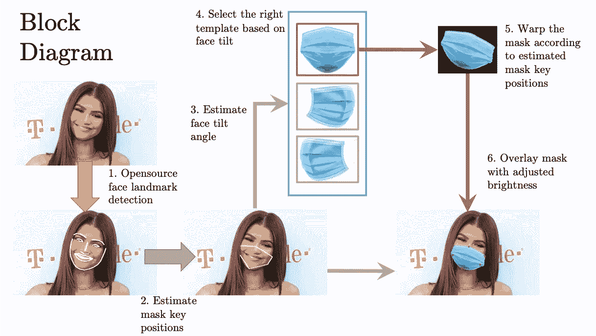
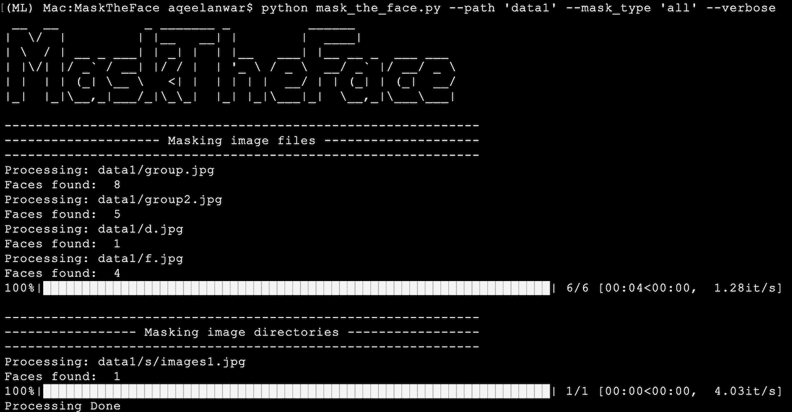
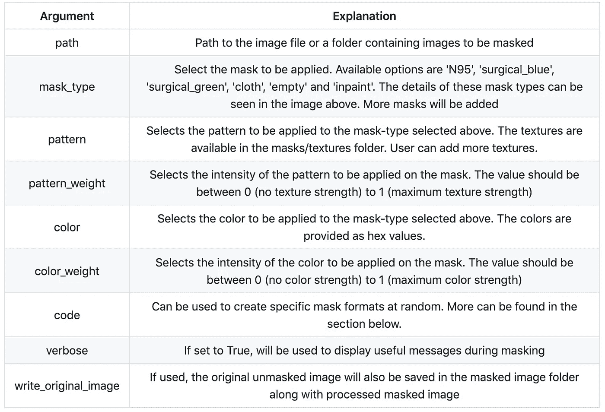
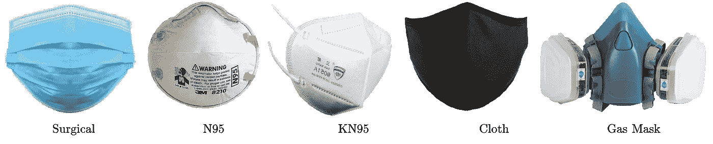
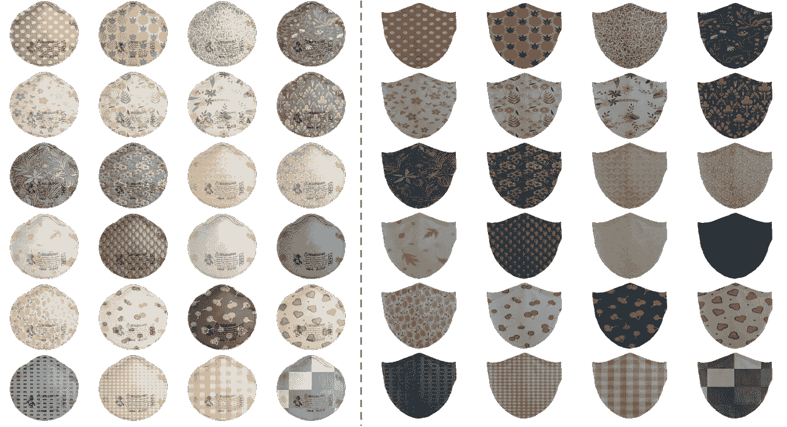
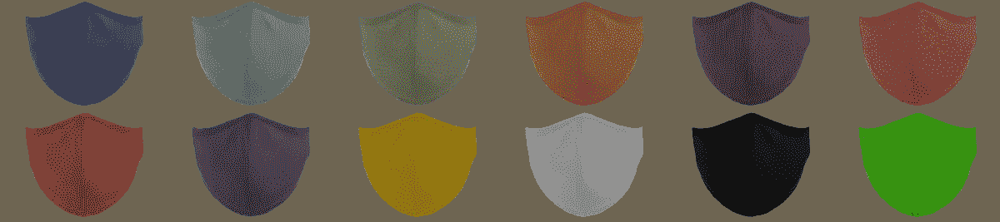
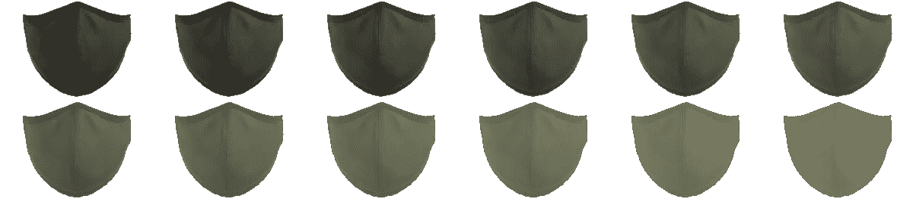
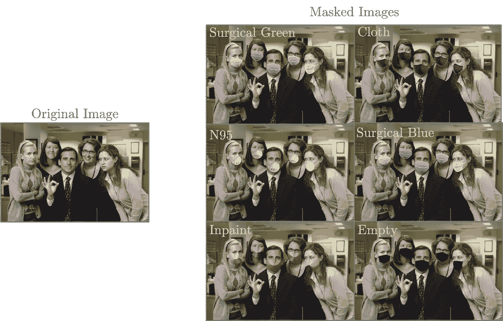
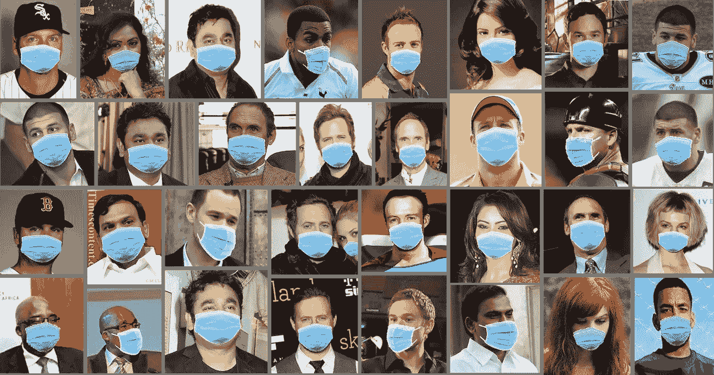
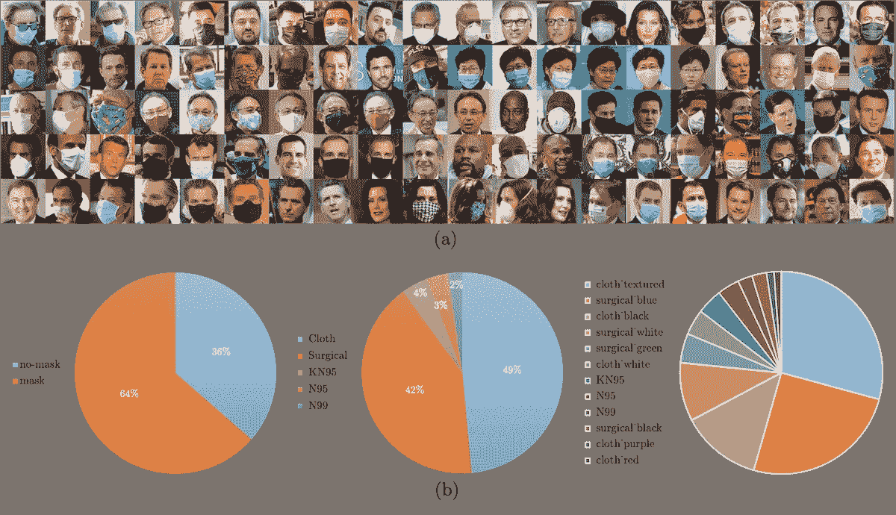

# 掩膜面-基于 CV 的工具，用于掩膜面数据集

> 原文：<https://towardsdatascience.com/masktheface-cv-based-tool-to-mask-face-dataset-1a71d5b68703?source=collection_archive---------29----------------------->

## 将面部数据集转换为掩膜数据集


图片来源:[https://github.com/aqeelanwar/MaskTheFace](https://github.com/aqeelanwar/MaskTheFace)

> 【https://github.com/aqeelanwar/MaskTheFace】跳转代码:

# 什么是 MaskTheFace？

MaskTheFace 是一个基于计算机视觉的脚本，用于遮罩图像中的人脸。它使用基于 dlib 的面部标志检测器来识别面部倾斜和应用面具所必需的面部的六个关键特征。基于面部倾斜，从掩模库中选择相应的掩模模板。然后基于六个关键特征对模板面具进行变换，以完美地适合人脸。完整的框图如下所示。MaskTheFace 提供了几个可供选择的遮罩。很难在各种条件下收集掩膜数据集。MaskTheFace 可用于将任何现有的人脸数据集转换为被遮罩的人脸数据集。MaskTheFace 识别图像中的所有人脸，并将用户选择的遮罩应用于这些人脸，同时考虑各种限制，如人脸角度、遮罩适合度、光照条件等。单个图像或整个图像目录可以用作代码的输入。



图片来源:[https://github.com/aqeelanwar/MaskTheFace](https://github.com/aqeelanwar/MaskTheFace)

# 如何安装 MaskTheFace

建议[用 Python 3.6 创建一个新的虚拟环境](/setting-up-python-platform-for-machine-learning-projects-cfd85682c54b)并安装依赖项。可以采取以下步骤下载 MaskTheFace 入门

# 克隆存储库

```
git clone [https://github.com/aqeelanwar/MaskTheFace.git](https://github.com/aqeelanwar/MaskTheFace.git)
```

# 安装所需的软件包

提供的 requirements.txt 文件可以用来安装所有需要的包。使用以下命令

```
cd MaskTheFace
pip install –r requirements.txt
```

这将在激活的 python 环境中安装所需的包。

# 如何运行 MaskTheFace

```
cd MaskTheFace
# Generic
python mask_the_face.py --path <path-to-file-or-dir> --mask_type <type-of-mask> --verbose --write_original_image# Example
python mask_the_face.py --path 'data/office.jpg' --mask_type 'N95' --verbose --write_original_image
```



图片来源:[https://github.com/aqeelanwar/MaskTheFace](https://github.com/aqeelanwar/MaskTheFace)

# 争论



图片来源:[https://github.com/aqeelanwar/MaskTheFace](https://github.com/aqeelanwar/MaskTheFace)

# 解释:

## 1.—代码

— code 参数可用于将不同类型的掩膜随机统一应用于数据集中的影像。

```
# Generic format
--code < masktype1 >-< color as hex or texture file path >, < masktype2 >-< color as hex or texture file path>, ...# Example
--code cloth-masks/textures/check/check_4.jpg, cloth-#e54294, cloth-#ff0000, cloth, cloth-masks/textures/others/heart_1.png, cloth-masks/textures/fruits/pineapple.png, N95
```

以上示例将对所选的人脸数据集应用 7 个随机统一的不同遮罩(通过路径参数)。

# 支持的掩码:

# 遮罩类型:

目前，MaskTheFace 支持以下 4 种遮罩类型

1.  外科的
2.  N95
3.  KN95
4.  布
5.  气体



图片来源:[https://github.com/aqeelanwar/MaskTheFace](https://github.com/aqeelanwar/MaskTheFace)

正在添加新的面具。用户也可以按照提供的指南添加自定义遮罩。

# 遮罩变化:

上面提到的每种掩模类型可以在下面的术语中变化，以创建更多的掩模

## 1.纹理/图案变化:

MaskTheFace 提供了 24 种现有模式，可应用于上述遮罩类型，以创建更多的图形变化。此外，用户可以按照提供的指南轻松添加自定义模式。



图片来源:【https://github.com/aqeelanwar/MaskTheFace 

## 2.颜色变化:

MaskTheFace 提供了一个脚本来根据颜色修改现有的遮罩类型，以生成现有图形的变体。



图片来源:【https://github.com/aqeelanwar/MaskTheFace 

## 3.强度变化:

MaskTheFace 提供了一个脚本来根据强度修改现有的遮罩类型，以生成现有图形的变体。



图片来源:[https://github.com/aqeelanwar/MaskTheFace](https://github.com/aqeelanwar/MaskTheFace)

# 特点:

## a.支持多种遮罩类型



图片来源:[https://github.com/aqeelanwar/MaskTheFace](https://github.com/aqeelanwar/MaskTheFace)

## b.支持单面和多面图像:


图片来源:[https://github.com/aqeelanwar/MaskTheFace](https://github.com/aqeelanwar/MaskTheFace)

## c.宽面角覆盖


图片来源:[https://github.com/aqeelanwar/MaskTheFace](https://github.com/aqeelanwar/MaskTheFace)

## d.亮度校正掩模应用


图片来源:[https://github.com/aqeelanwar/MaskTheFace](https://github.com/aqeelanwar/MaskTheFace)

## e.数据集上的批量屏蔽



图片来源:[https://github.com/aqeelanwar/MaskTheFace](https://github.com/aqeelanwar/MaskTheFace)

# MFR2 —现实世界中用于人脸识别的蒙面人脸

用于人脸识别的真实世界中的蒙面人脸(MFR2)是一个小型数据集，具有 53 个名人和政治家的身份，总共有 269 幅图像，这些图像是从互联网上收集的。每个身份平均有 5 个图像。数据集包含身份的掩蔽和非掩蔽面。数据集根据面部对齐和图像尺寸进行处理。每个图像的尺寸为(160×160×3)。来自 MFR2 数据集和掩模分布的样本图像如下所示。



图片来源:[https://github.com/aqeelanwar/MaskTheFace](https://github.com/aqeelanwar/MaskTheFace)

# 下载 MFR2

可以使用以下命令下载数据集

```
cd MaskTheFace
python utils/fetch_dataset.py --dataset mfr2
```

这将下载并提取 datasets 文件夹中的 mfr2 数据集。

```
# path to mfr2
MaskTheFace/datasets/mfr2
```

或者，你可以从[这里](https://drive.google.com/file/d/1ukk0n_srRqcsotK2MjlFPj7L0sXcR2fH/view?usp=sharing)下载 mfr2.zip 文件

# MFR2 的含量

下载的数据集文件夹包含

1.  带有身份图像的文件夹
2.  mfr2_labels.txt:一个标签文本文件，包含身份名称、图像编号和遮罩基础事实的类型
3.  pairs.txt:包含 848 个正对和负对的文本文件，用于测试。

# 总结:

MaskTheFace 工具可用于生成合成的面具人脸数据集，然后可用于训练各种面向应用的 ML 网络，如室内考勤系统的人脸识别、面具检测、面具分类等。

**如果这篇文章对你有帮助，欢迎鼓掌、分享和回复。如果你想了解更多关于机器学习和数据科学的知识，请关注我@**[**Aqeel an war**](https://medium.com/u/a7cc4f201fb5?source=post_page-----1a71d5b68703--------------------------------)**或者在**[***LinkedIn***](https://www.linkedin.com/in/aqeelanwarmalik/)***上与我联系。***