# 掌握 Seaborn 的三分之一:用 relplot()统计绘图

> 原文：<https://towardsdatascience.com/master-a-third-of-seaborn-statistical-plotting-with-relplot-df8642718f0f?source=collection_archive---------7----------------------->

## 如果你能在锡伯恩做到，就在锡伯恩做吧


照片由来自[像素](https://www.pexels.com/photo/black-blue-and-red-graph-illustration-186461/?utm_content=attributionCopyText&utm_medium=referral&utm_source=pexels)的[布拉克·K](https://www.pexels.com/@weekendplayer?utm_content=attributionCopyText&utm_medium=referral&utm_source=pexels)拍摄

## 介绍

> 本文的目标是让你对使用 Seaborn 的`relplot()`函数绘制任何类型的定量变量统计图表有一个很好的了解。

当我开始学习数据可视化时，我第一次接触到 Matplotlib。这是一个如此巨大和深刻的图书馆，你可以想象几乎任何与数据相关的东西。正是这种辽阔，使人们能够以多种方式创造一个单一的情节。

虽然它的灵活性对于有经验的科学家来说是理想的，但作为初学者，区分这些方法之间的代码对我来说是一场噩梦。我甚至考虑过使用 Tableau 的无代码界面，作为一名程序员，我很惭愧地承认这一点。我想要一些易于使用的东西，同时，使我能够创建其他人正在制作的那些很酷的情节(用代码)。

我在 Udacity 攻读纳米学位时了解了 Seaborn，并最终找到了我的选择。这就是为什么我的数据可视化的黄金法则是“如果你能在 Seaborn 做，就在 Seaborn 做”。与 Matplotlib 相比，它提供了许多优势。

首先，它非常容易使用。您可以只用几行代码创建复杂的情节，并且仍然通过内置的样式使它看起来很漂亮。其次，它与熊猫数据框架配合得非常好，这正是你作为一名数据科学家所需要的。

最后但同样重要的是，它是建立在 Matplotlib 本身之上的。这意味着您将享受 Mpl 提供的大部分灵活性，并且仍然保持代码语法最少。

是的，我在标题中说的是真的。Seaborn 将其所有 API 分为三类:绘制统计关系、可视化数据分布和分类数据绘制。Seaborn 提供了三个高级功能，涵盖了它的大部分特性，其中之一是`relplot()`。

`reltplot()`可以可视化定量变量之间的任何统计关系。在这篇文章中，我们将涵盖这个功能的几乎所有特性，包括如何创建支线剧情等等。

[](https://ibexorigin.medium.com/membership) [## 通过我的推荐链接加入 Medium-BEXGBoost

### 获得独家访问我的所有⚡premium⚡内容和所有媒体没有限制。支持我的工作，给我买一个…

ibexorigin.medium.com](https://ibexorigin.medium.com/membership) 

获得由强大的 AI-Alpha 信号选择和总结的最佳和最新的 ML 和 AI 论文:

[](https://alphasignal.ai/?referrer=Bex) [## 阿尔法信号|机器学习的极品。艾总结的。

### 留在循环中，不用花无数时间浏览下一个突破；我们的算法识别…

alphasignal.ai](https://alphasignal.ai/?referrer=Bex) 

## 概观

```
 I. Introduction II. SetupIII. Scatter plots with relplot()
     1\. Scatter plot point size
     2\. Scatter plot point hue
     3\. Scatter plot point style
     4\. Scatter plot point transparency
     5\. Scatter plot in subplots IV. Seaborn lineplots
     1\. Lineplot multiple lines
     2\. Lineplot line styling
     3\. Lineplot point markers
     4\. Lineplot confidence intervals
  V. Conclusion
```

> 获取关于 [this](https://github.com/BexTuychiev/medium_stories/tree/master/learn_one_third_of_seaborn_relplot) GitHub repo 文章的笔记本和样本数据。

## 设置

我们导入 Seaborn 作为`sns`。你可能想知道为什么它不像任何正常人一样别名为`sb`。好吧，听听这个:它的别名来自电视剧《白宫风云》中的一个虚构人物塞缪尔·诺曼·西本。这是一个开玩笑的缩写。

对于样本数据，我将使用 Seaborn 的一个内置数据集和一个从 Kaggle 下载的数据集。你可以使用[这个](https://www.kaggle.com/dgawlik/nyse/download)链接得到它。

第一个数据集是关于汽车的，包含关于它们的引擎、型号等的数据。第二个数据集提供了 500 多家公司的纽约股票价格信息。

## 基础探索

```
cars.head()
cars.info()
cars.describe()
```

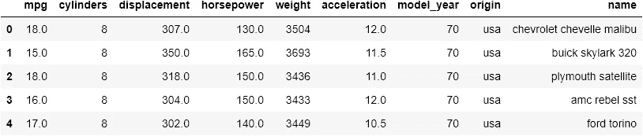

```
<class 'pandas.core.frame.DataFrame'>
RangeIndex: 398 entries, 0 to 397
Data columns (total 9 columns):
 #   Column        Non-Null Count  Dtype  
---  ------        --------------  -----  
 0   mpg           398 non-null    float64
 1   cylinders     398 non-null    int64  
 2   displacement  398 non-null    float64
 3   horsepower    392 non-null    float64
 4   weight        398 non-null    int64  
 5   acceleration  398 non-null    float64
 6   model_year    398 non-null    int64  
 7   origin        398 non-null    object 
 8   name          398 non-null    object 
dtypes: float64(4), int64(3), object(2)
memory usage: 28.1+ KB
```

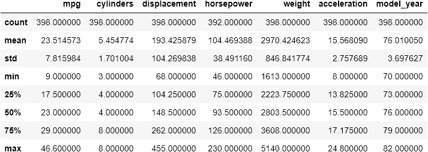

```
stocks.head()
stocks.info()
```

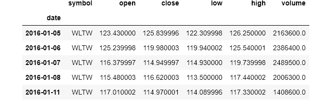

```
<class 'pandas.core.frame.DataFrame'>
DatetimeIndex: 851264 entries, 2016-01-05 to 2016-12-30
Data columns (total 6 columns):
 #   Column  Non-Null Count   Dtype  
---  ------  --------------   -----  
 0   symbol  851264 non-null  object 
 1   open    851264 non-null  float64
 2   close   851264 non-null  float64
 3   low     851264 non-null  float64
 4   high    851264 non-null  float64
 5   volume  851264 non-null  float64
dtypes: float64(5), object(1)
memory usage: 45.5+ MB
```

两个数据集中有一些空值。由于我们没有进行任何认真的分析，我们可以放心地放弃它们。

```
cars.dropna(inplace=True)
stocks.dropna(inplace=True)
```

> **专业提示**:让你的数据集尽可能的整洁，这样 Seaborn 才能有好的表现。确保每行是一个观察值，每列是一个变量。

## 用`relplot`散点图

让我们从散点图开始。散点图是找出变量之间的模式和关系的最好和最广泛使用的图之一。

这些变量通常是定量的，如测量值、一天中的温度或任何数值。散点图将 x 和 y 值的每个元组可视化为单个点，并且该图将形成点云。这些类型的图非常适合人眼检测模式和关系。

你可以用 SB 的(我从现在开始缩写)内置`scatterplot()`函数来创建散点图。但是这个功能缺乏`relplot()`版本所提供的灵活性。让我们看一个使用`relplot()`的例子。


照片由[麦克](https://www.pexels.com/@mikebirdy?utm_content=attributionCopyText&utm_medium=referral&utm_source=pexels)从[像素](https://www.pexels.com/photo/greyscale-photography-of-car-engine-190574/?utm_content=attributionCopyText&utm_medium=referral&utm_source=pexels)拍摄

使用`cars`数据集，我们想找出是否更重的汽车往往有更大的马力。由于这两个特征都是数字，我们可以使用散点图:

```
sns.relplot(x='weight', y='horsepower', 
            data=cars, kind='scatter');
```

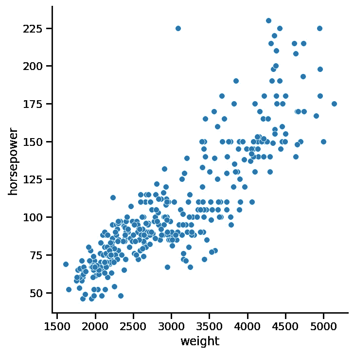

`relplot()`函数有自变量`x`、`y`和`data`参数，分别指定要绘制在`XAxis`、`YAxis`上的值及其应使用的数据。我们使用`kind`参数来指定它应该使用散点图。其实默认设置为`scatter`。

从剧情可以解读出，更重的车确实马力更大。同样清楚的是，有更多的汽车重量在 1500 到 3000 之间，马力在 50 到 110 之间。

## 散点图点大小

基于我们之前的绘图，现在我们还想添加一个新的变量。我们来看看更重的车是不是排量更大(能储多少油)。理想情况下，我们希望将该变量绘制为磅值:

```
sns.relplot(x='weight',
            y='horsepower',
            data=cars,
            kind='scatter',
            size='displacement');
```

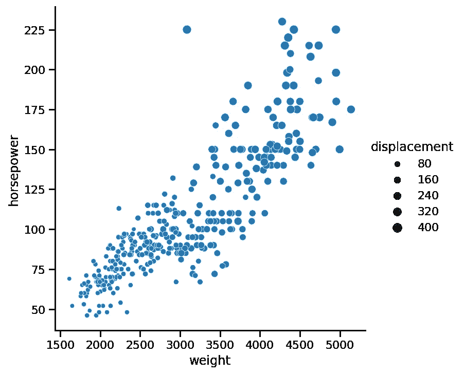

使用`size`参数改变第三个变量的点大小。只需将列名作为字符串传递，就可以设置好了，就像我们的例子一样。该图显示了重量和发动机尺寸之间的明确关系。然而，你可以在中间看到一些不符合趋势的点。

重要的是，您要传递一个“值周期”较少的数值变量。在我们的例子中，位移为 5(0–80，80–160 等)。如果这些时间变得太多，将很难解释你的情节，因为人眼不善于判断事物。如果我们以重量作为第三个变量来创建上面的图，您可以看到这一点:

```
sns.relplot(x='displacement',
            y='horsepower',
            data=cars,
            kind='scatter',
            size='weight');
```

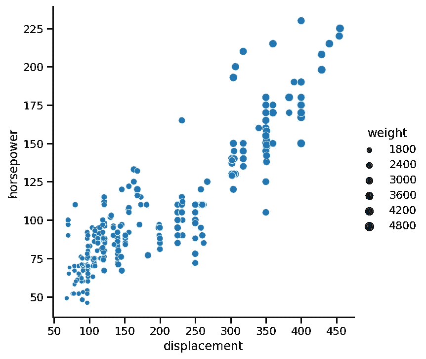

正如你所看到的，趋势不明显，很难区分大小。

## 散点图点色调

散点图中的第三个变量也可以使用彩色标记。它也非常简单，就像磅值一样。假设我们还想将加速度(汽车达到 60 英里/小时所需的时间，以秒为单位)编码为点颜色:

```
sns.relplot(x='weight',
            y='horsepower',
            data=cars,
            kind='scatter',
            size='displacement',
            hue='acceleration');
```

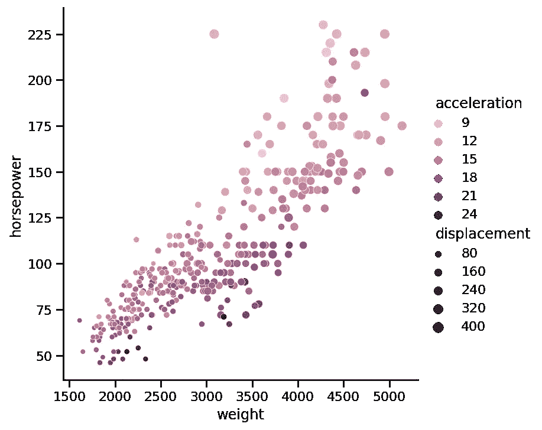

从图中，我们可以看到数据集中一些最快的汽车(暗点)马力较低，但重量也较轻。注意，我们使用了`hue`参数对颜色进行编码。颜色根据传递给该参数的变量类型而变化。如果我们已经通过了`origin`列，这是一个分类变量，它将有三个颜色标记，而不是一个连续的(从亮到暗)调色板:

```
sns.relplot(x='weight',
            y='horsepower',
            data=cars,
            kind='scatter',
            size='displacement',
            hue='origin');
```

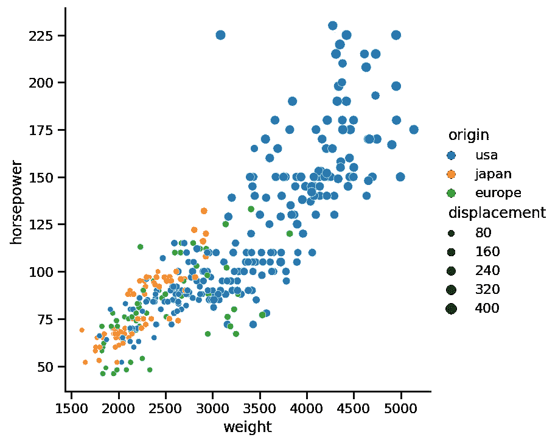

> **专业提示**:注意您输入到`hue`参数的变量类型。类型可以完全改变结果。

如果您不喜欢默认的调色板(默认情况下非常好)，您可以轻松地自定义:

```
sns.relplot(x='weight',
            y='horsepower',
            data=cars,
            kind='scatter',
            size='displacement',
            hue='acceleration',
            palette='crest');
```

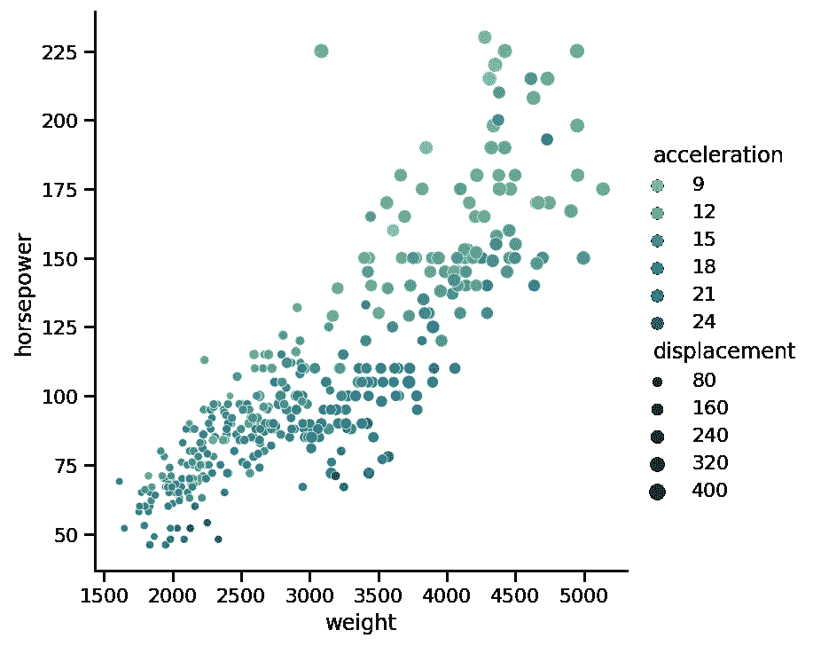

将`palette`参数设置为您自己的颜色映射。可用调色板列表可在[这里](http://seaborn.pydata.org/tutorial/color_palettes.html)找到。

## 散点图点样式

让我们回到第一个情节。我们绘制了重量与马力的散点图。现在，让我们添加原点列作为第三个变量:

```
sns.relplot(x='weight', y='horsepower', 
            data=cars, hue='origin');
```

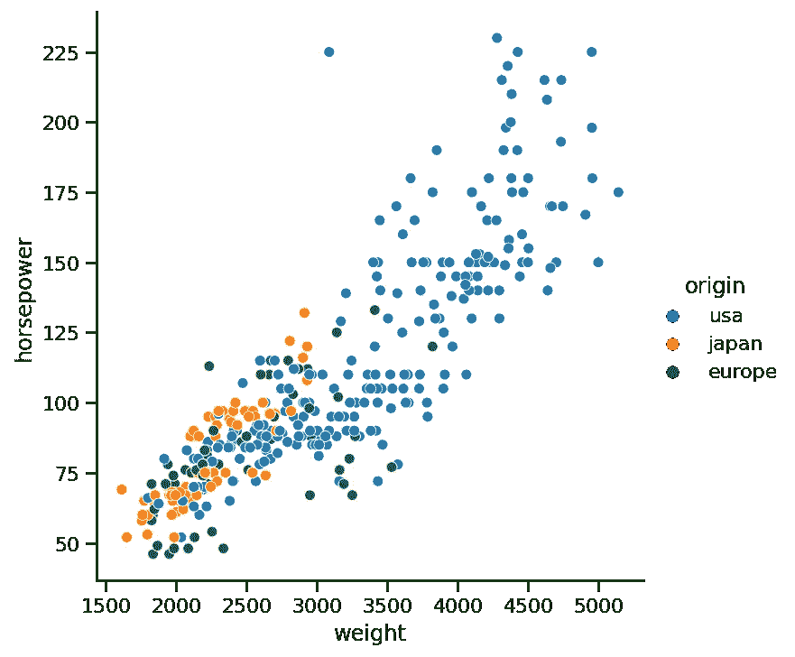

虽然颜色在该图中增加了额外的信息层，但在更大的数据集中，可能很难区分点群中的颜色。为了更加清晰起见，让我们在图中添加一个点样式:

```
sns.relplot(x='weight',
            y='horsepower',
            data=cars,
            hue='origin',
            style='origin');
```

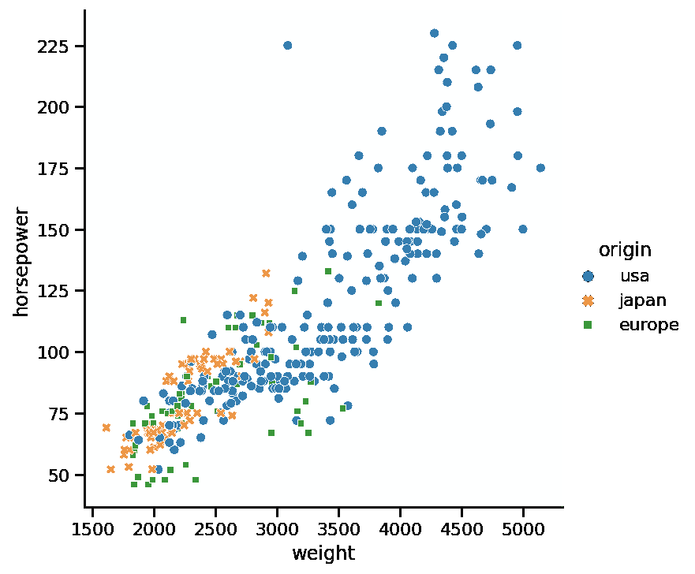

现在，好一点了。改变点的样式和颜色是非常有效的。如果我们仅使用点样式来指定原点，看看会发生什么:

```
sns.relplot(x='weight', y='horsepower', 
            data=cars, style='origin');
```

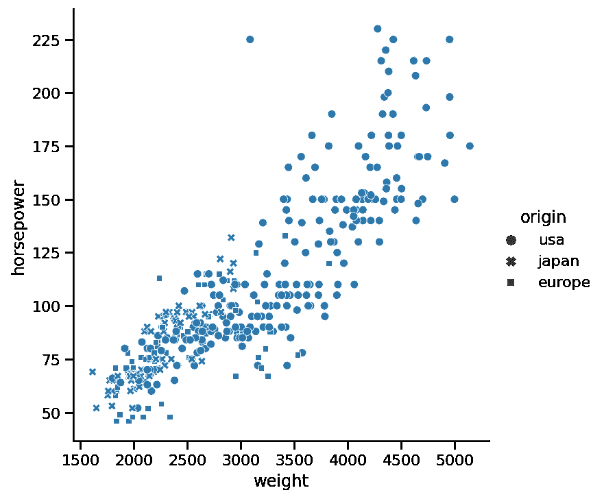

> **专业提示**:结合使用`hue`和`style`参数，让你的绘图更加清晰。

我们删除了`hue`参数，这使得我们的情节更加难以理解。如果您不喜欢默认颜色，您可以更改它:

首先，您应该创建一个字典，将各个颜色映射到每个类别。请注意，该字典的键应该与图例中的名称相同。

```
hue_colors = {'usa': 'red', 
              'japan': 'orange', 
              'europe': 'green'}
sns.relplot(x='weight',
            y='horsepower',
            data=cars,
            hue='origin',
            style='origin',
            palette=hue_colors);
```

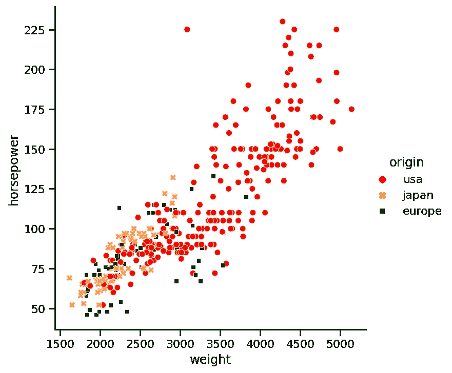

从图中，我们可以看到数据集中的大多数汽车来自美国。

## 散点图点透明度

让我们再次回到我们的第一个例子。让我们再画一次，但是给点增加一点透明度:

```
sns.relplot(x='weight', y='horsepower', 
            data=cars, alpha=0.6);
```

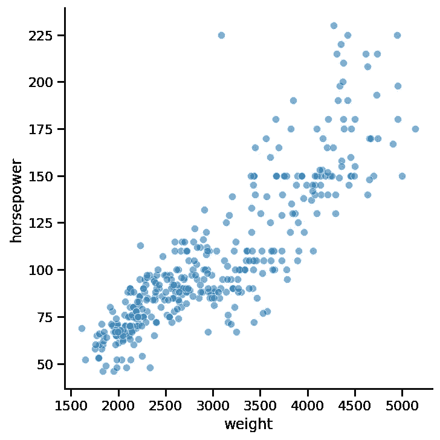

我们使用`alpha`参数来设置点的透明度。它接受 0 到 1 之间的值。0 表示完全透明，1 表示完全不透明。当您有一个大的数据集，并且您想要找出图中的聚类或组时，这是一个非常有用的功能。当你降低透明度时，有很多点的部分会变暗。

## 支线剧情中的散点图

在《海波恩》中也可以使用支线剧情网格。我之所以一直用`relplot()`而不是能做以上所有事情的`scatterplot()`，是因为它不能创建支线剧情网格。

由于`relplot`是一个图形级别的函数，它产生一个`FacetGrid`(许多情节的网格)对象，而`scatterplot()`绘制到一个`matplotlib.pyplot.Axes`(单个情节)对象上，该对象不能变成子情节:

```
fg = sns.relplot()
print(type(fg))
plot = sns.scatterplot()
print(type(plot))<class 'seaborn.axisgrid.FacetGrid'>
<class 'matplotlib.axes._subplots.AxesSubplot'>
```

让我们看一个我们想要使用支线剧情的例子。在上面的一个图中，我们将 4 个变量编码到一个图中(重量与马力，用位移和加速度编码)。现在，我们还想加入汽车的起源。为了使信息更容易理解，我们应该把它分成支线剧情:

```
sns.relplot(x='weight',
            y='horsepower',
            data=cars,
            kind='scatter',
            size='displacement',
            hue='acceleration',
            palette='crest',
            col='origin');
```

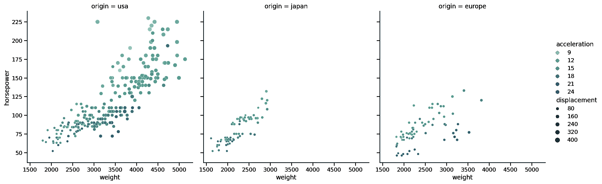

这一次在最后，我们添加了一个新的参数，`col`来指出我们想要在列中创建支线剧情。这些类型的支线剧情非常有用，因为现在很容易看到第五个变量的趋势。顺便说一下，传递给`col`的变量应该是明确的，这样才能工作。此外，SB 在一行中显示列。如果要绘制多个类别，我们不希望出现这种情况。让我们使用我们的数据来看一个用例，尽管它的类别较少:

```
sns.relplot(x='weight',
            y='horsepower',
            data=cars,
            kind='scatter',
            size='displacement',
            hue='acceleration',
            palette='crest',
            col='origin',
            col_wrap=2);
```

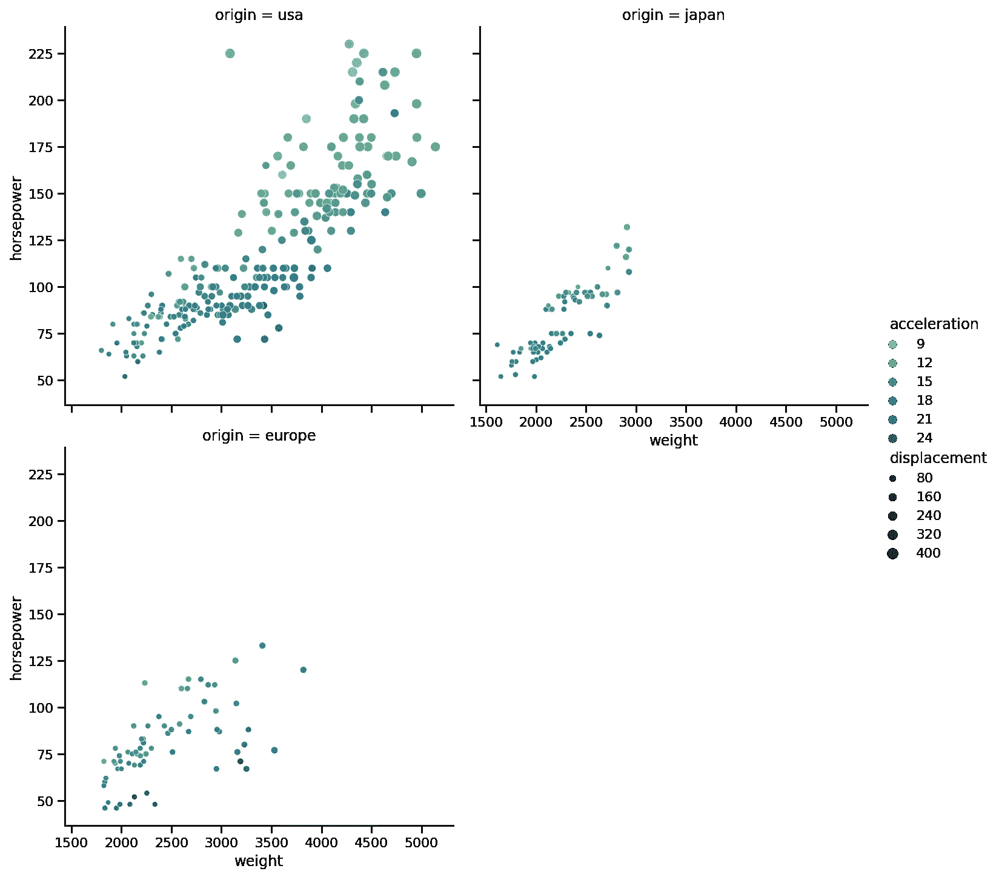

`col_wrap` argument 告诉某人我们想要一行中有多少列。

还可以指定列中类别的顺序:

```
sns.relplot(x='weight',
            y='horsepower',
            data=cars,
            kind='scatter',
            size='displacement',
            hue='acceleration',
            palette='crest',
            col='origin',
            col_order=['japan', 'europe', 'usa']);
```

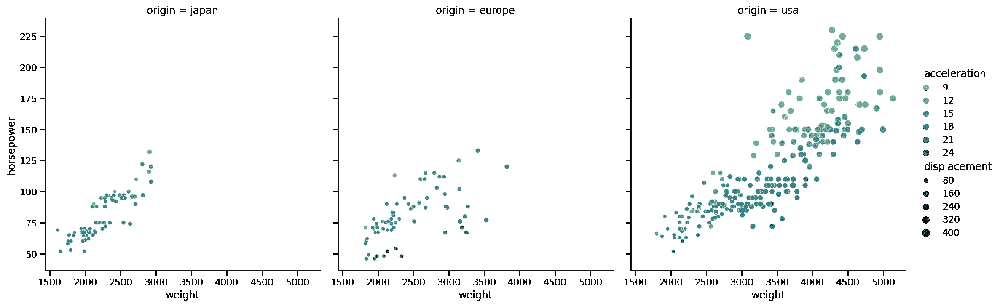

也可以按行显示相同的信息:

```
sns.relplot(x='weight',
            y='horsepower',
            data=cars,
            kind='scatter',
            size='displacement',
            hue='acceleration',
            palette='crest',
            row='origin');
```

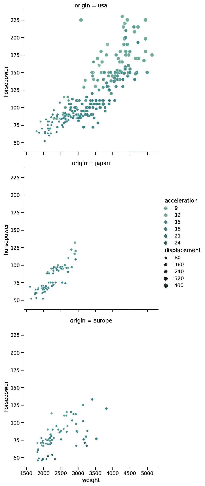

如果你有很多类别，使用行不是很有用，最好坚持使用列。您可以再次使用`row_order`来指定行的顺序。

## Seaborn 线图

另一种常见的关系图是线形图。在散点图中，每个点都是独立的观察值，而在线图中，我们将一个变量与一些连续变量一起绘制，通常是一段时间。我们的第二个样本数据集包含 2010 年至 2016 年跟踪的 501 家公司的纽约证券交易所数据。

为了便于说明，我们来观察给定时间段内所有公司的`close`价格。由于涉及到日期，折线图是此任务的最佳视觉类型:

> **Pro 提示**:如果你的数据集中有一个日期列，将其设置为 datetype，并使用`set_index()`函数将其设置为索引。或者用`pd.read_csv(parse_dates=['date_column'], index_col='date_column')`。它将允许您绘制线图，并使日期的子集设置更容易。

对于线图，我们再次使用`relplot()`并将`kind`设置为`line`。该图描绘了跟踪第二个连续变量(通常是时间)的单个变量。

```
sns.relplot(x=stocks.index, y='close', 
            data=stocks, kind='line');
```

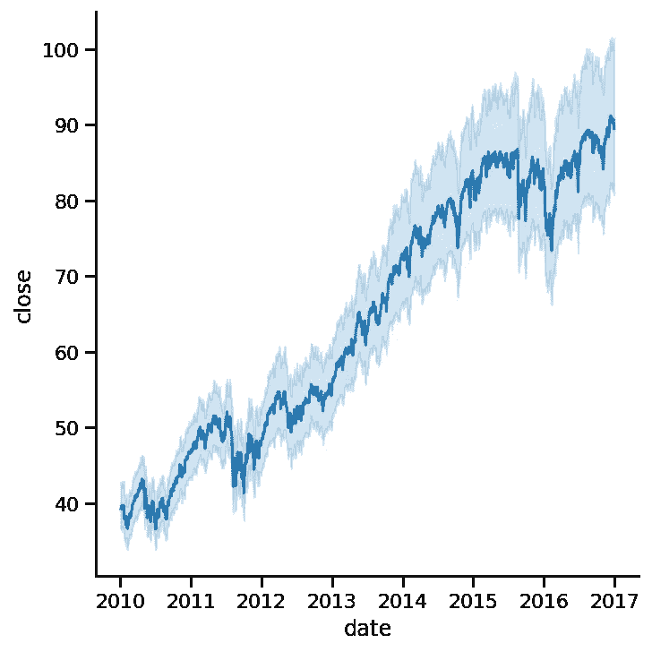

它花了相当长的时间来绘制，但我们可以看到明显的趋势。所有公司的股票在给定的时间内都保持增长。蓝色较暗的线代表 6 年来跟踪的所有公司收盘价的平均值。

SB 会自动添加一个置信区间，即线周围的阴影区域，如果一个点有多个观察值，稍后会详细介绍。现在，让我们将数据细分为 3 家公司:

```
am_ap_go = stocks[stocks['symbol'].isin(['AMZN', 'AAPL', 'GOOGL'])]
am_ap_go.shape(5286, 6)
```

## 线条绘制多条线

现在，让我们通过将数据分组到三个公司来重新创建上面的线图。这将在同一个图中创建不是一条而是三条线:

```
sns.relplot(x=am_ap_go.index,
            y='close',
            data=am_ap_go,
            kind='line',
            hue='symbol');
```

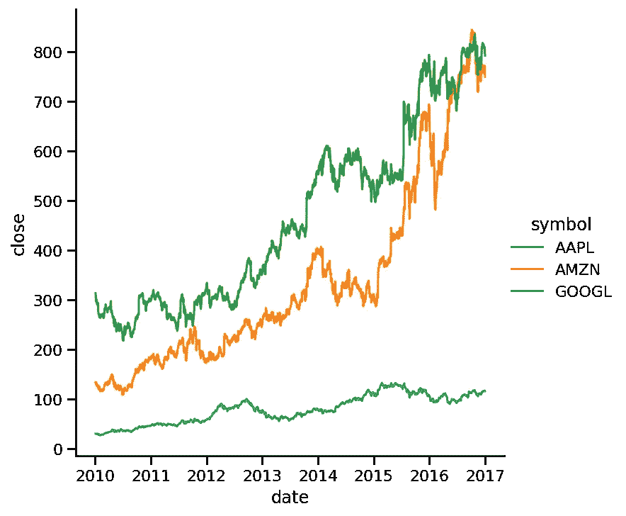

正如我们在散点图示例中所做的那样，我们使用`hue`参数在数据中创建子组。同样，您必须将一个分类变量传递给`hue`。在这个图中，我们可以看到，在 2016 年之后，亚马逊和谷歌的股票非常接近，而苹果在整个时期都处于底部。现在，让我们看看除了颜色之外，如何设计每条线的风格:

## 线地块线样式

我们使用`style`参数来指定我们想要不同的线条样式:

```
sns.relplot(x=am_ap_go.index,
            y='close',
            data=am_ap_go,
            kind='line',
            hue='symbol',
            style='symbol');
```

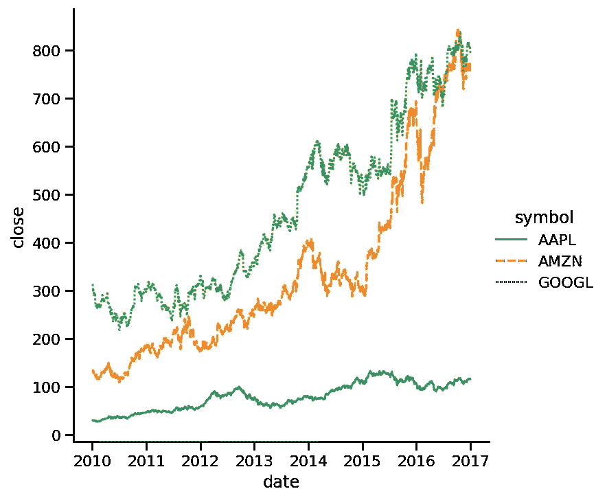

好吧，这可能不是不同线条样式的最佳示例，因为观察是针对每天的，并且非常紧凑。让我们仅针对 2015 年至 2016 年期间划分子集，并绘制相同的线图:

```
am_ap_go_subset = am_ap_go.loc['2015-01-01':'2015-12-31']sns.relplot(x=am_ap_go_subset.index,
            y='close',
            data=am_ap_go_subset,
            kind='line',
            hue='symbol',
            style='symbol');
```

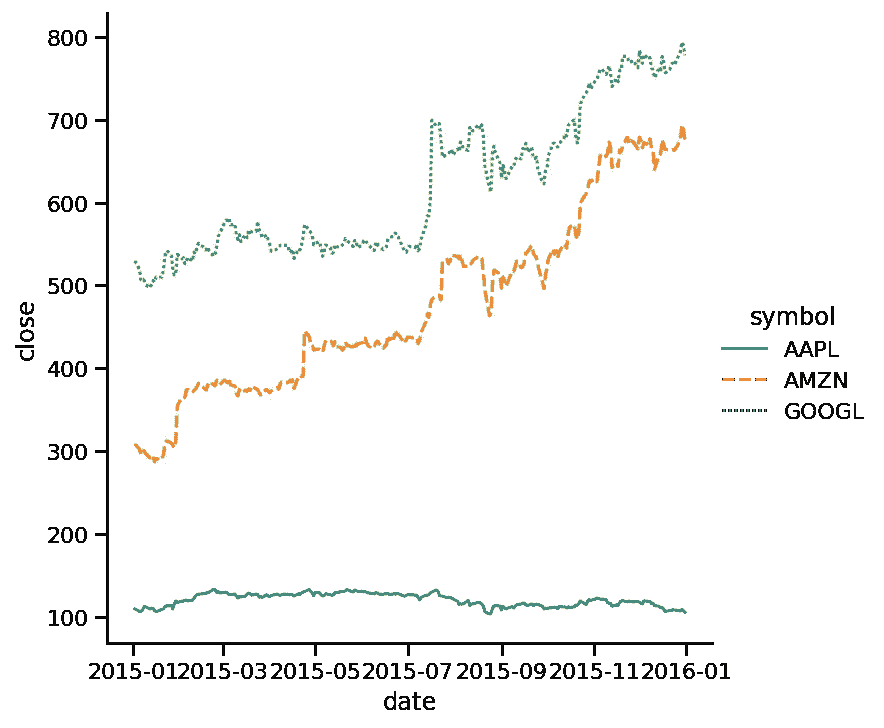

现在线条样式更清晰了。您可能会说，对这些行进行样式化并不会比前一个添加更多的信息。但是当你有一个情节，它的线条非常接近时，这将对解释有很大的帮助。

## 线形图点标记

当您有一个较小的数据集并且想要创建一个折线图时，用一个标记来标记每个数据点可能会很有用。对于我们较小的数据，股票价格的分布仍然非常紧密。因此，让我们选择一个更小的时间段，看看如何使用点标记:

```
smaller_subset = am_ap_go_subset.loc["2015-01-01":"2015-03-01"]

sns.relplot(x=smaller_subset.index,
            y='close',
            data=smaller_subset,
            kind='line',
            hue='symbol',
            style='symbol',
            markers=True)
plt.xticks(rotation=60);
```

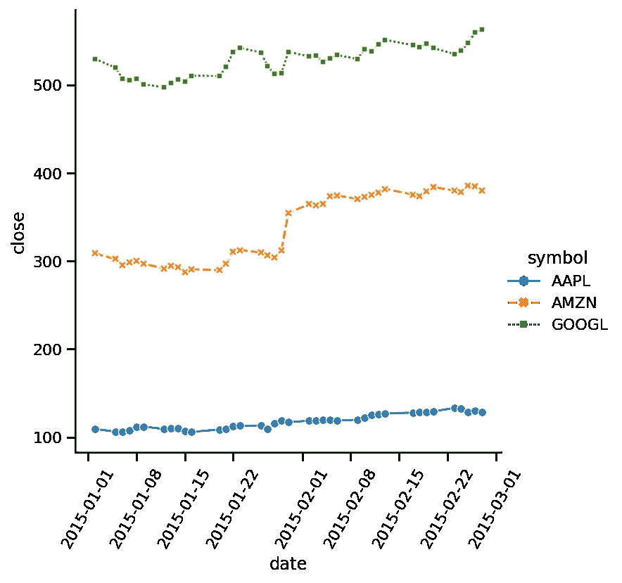

现在我们每条线都有不同的标记。我们将`markers`参数设置为`True`来激活该功能。

## 线图置信区间

接下来，我们将探讨在 SB 中为线图计算的置信区间。如果一个点有多个观察值，置信区间会自动添加。

在这三家公司的数据中，对于这一时期的每一天，我们都有三个观察值:一个是亚马逊，一个是谷歌，一个是苹果。当我们创建一个没有分组的线图时(没有`hue`参数)，SB 默认取这三个的平均值:

```
sns.relplot(x=am_ap_go.index, y='close', 
            data=am_ap_go, kind='line');
```

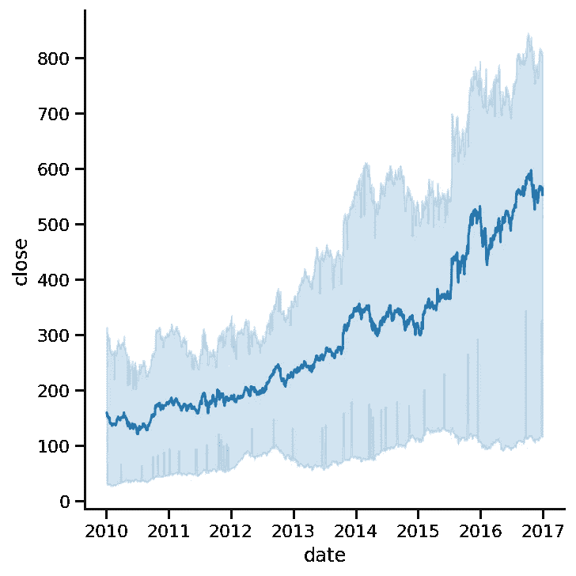

深色线表示三家公司股价的平均值。阴影区域是 95%的置信区间。这是非常巨大的，因为我们的样本数据只有三家公司。阴影区域表示有 95%的把握总体平均值在此区间内。它表明了我们数据中的不确定性。

例如，对于 2017 年，人口的平均值可以在 100 和 800 之间。置信区间的范围很大，因为我们只选择了三家公司。抱歉，我不得不添加统计术语，但这对理解置信区间很重要。您可以关闭置信区间，将`ci`参数设置为`None`:

```
sns.relplot(x=am_ap_go.index,  
            y='close', 
            data=am_ap_go,  
            kind='line', ci=None);
```

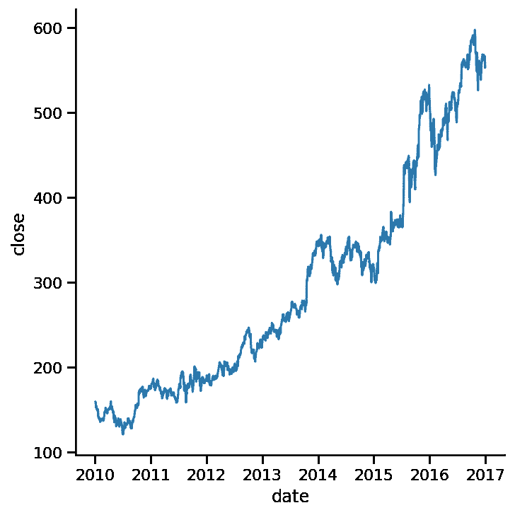

或者如果你愿意，你可以显示标准差而不是置信区间。将`ci`参数设置为`sd`:

```
sns.relplot(x=am_ap_go.index, 
            y='close', 
            data=am_ap_go, 
            kind='line', 
            ci='sd');
```

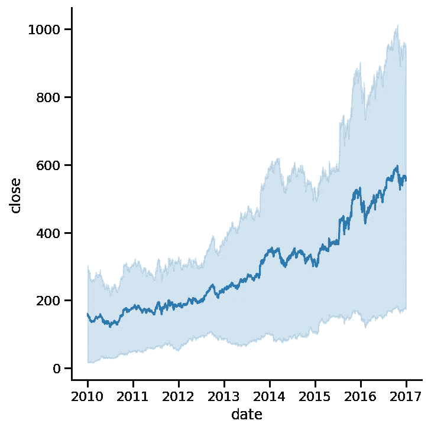

也许这些参数对我们的样本数据不是很有用，但当您处理大量真实数据时，它们将非常重要。

> 最后注意:如果你想为你的线图创建支线图，你可以使用相同的`col`和`row`参数。

## 结论

最后，我们完成了 Seaborn 的关系图。线图和散点图是在数据海洋中发现见解和趋势的非常重要的视觉辅助工具。因此，掌握它们是很重要的。并尽可能使用 Seaborn 来创建它们。你看到了使用图书馆是多么容易。

查看我关于数据可视化的其他文章:

[](/mastering-catplot-in-seaborn-categorical-data-visualization-guide-abab7b2067af) [## 掌握 Seaborn 中的 catplot():分类数据可视化指南。

### 如果你能在锡伯恩做到，那就在锡伯恩做吧，#2

towardsdatascience.com](/mastering-catplot-in-seaborn-categorical-data-visualization-guide-abab7b2067af) [](/clearing-the-confusion-once-and-for-all-fig-ax-plt-subplots-b122bb7783ca) [## 一劳永逸地澄清困惑:fig，ax = plt.subplots()

### 了解 Matplotlib 中的图形和轴对象

towardsdatascience.com](/clearing-the-confusion-once-and-for-all-fig-ax-plt-subplots-b122bb7783ca)