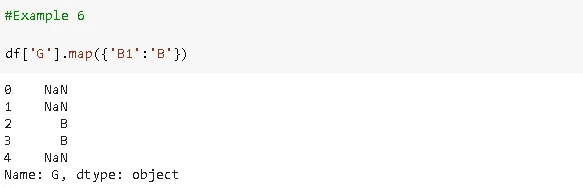

# 熊猫大师在 5 分钟内绘制、应用和应用地图

> 原文：<https://towardsdatascience.com/master-pandas-map-apply-and-applymap-in-5-minutes-d2bd1bba12a5?source=collection_archive---------35----------------------->

## 如何以及何时使用这些功能

熊猫图书馆有两种主要的数据结构:数据帧和序列。有许多内置函数可以创建、操作和分析这些结构。


由[杰斯·贝利](https://unsplash.com/@jessbaileydesigns?utm_source=unsplash&utm_medium=referral&utm_content=creditCopyText)在 [Unsplash](https://unsplash.com/s/photos/point?utm_source=unsplash&utm_medium=referral&utm_content=creditCopyText) 上拍摄

在这篇文章中，我们将掌握一组用于操作数据帧和序列的 Pandas 函数。这些功能是**映射**、**应用**和**应用映射**。

在某些情况下，熊猫提供了更好的选择来代替地图、应用和应用地图。我们还将尝试涵盖这些选项。

让我们从定义开始:

*   映射:映射(即更新、更改、修改)系列的值。
*   应用:沿数据帧的轴应用函数。
*   Applymap:对 DataFrame 元素应用函数。

需要注意的是，在某些情况下，这些函数会执行相同的操作并返回相同的输出。我们将看到这些案例以及有差异的案例。

一个主要的区别是这些函数作用于不同的对象。Applymap 处理数据帧，而 map 处理序列。两者都适用。

我将首先创建一个简单的数据框架来做例子。

```
import pandas as pd
import numpy as npdf = pd.DataFrame(np.random.randint(10, size=(5,5)), columns=list('ABCDE'))df
```


假设我们有一个计算给定值平均值的函数。如果我们使用“apply”将此函数应用于数据帧，它将返回行或列的平均值。

```
def calculate_average(row_col):
    return row_col.mean()
```


该功能沿轴(行或列)应用**。Pandas 提供了在数据帧上执行简单统计操作的功能。在这种情况下，这些功能优先于应用功能。**

例如，我们可以用`df.mean(axis=0)`计算每一列的平均值，用`df.mean(axis=1)`计算每一行的平均值。然而，了解一下 apply 函数也无妨。

Applymap 和 map 处理单个元素，而不是沿着轴。要了解 map 和 applymap 的区别，让我们做一个非常简单的数学运算。

Applymap 可应用于整个数据帧:


使用 map 函数可以将此函数应用于行或列。因此，映射功能不能应用于整个数据帧。


简单的数学运算可以作为矢量化运算来完成，它具有单纯形语法，比 map 或 applymap 更快。


地图功能也是如此:


除了函数之外，映射还采用字典或序列来映射值。

让我们向数据框架添加两个新列:

```
df['F'] = ['Abc','Dbc','Fcd','Afc','Kcd']
df['G'] = ['A',np.nan,'B1','B1','C']df
```


我们希望将 G 列中的值“B1”更改为“B”。



如您所见，其他值被映射为 NaN，这是标准的缺失值表示。我们还需要指定应该映射到哪些其他值。


在这种情况下，还必须指定其他值使得 map 函数不是最佳选择。熊猫的**替换**功能在这里是比较好的选择。


我们还可以使用 map 和 apply 返回基于现有值的列表:


每个项目都是一个列表，包含转换为小写字母的原始字符串和字符串的长度。

这些函数以迭代的方式工作，这使得它们相对较慢。在许多情况下，矢量化运算或[列表理解](/list-comprehensions-in-python-explained-294a464b5245)比使用 map 或 applymap 更受欢迎。

这是一个列表理解、for 循环、map 函数对 50000 个元素求平方的比较。


也有一些情况下，地图功能优于列表理解。列表理解将整个输出列表加载到内存中。这对于小型或中型的列表来说是可以接受的，甚至是可取的，因为它使操作更快。然而，当我们处理大型列表(例如 10 亿个元素)时，应该避免理解列表。这可能会导致您的计算机崩溃，由于内存需求的极端数额。映射功能也不会导致内存问题。

天下没有免费的午餐！map 函数不会导致内存问题，但是它们比 list comprehensions 要慢一些。同样，列表理解的速度来自于内存的过度使用。您可以根据您的应用决定使用哪一种。

感谢您的阅读。如果您有任何反馈，请告诉我。