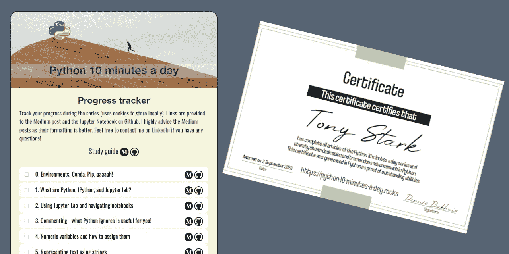
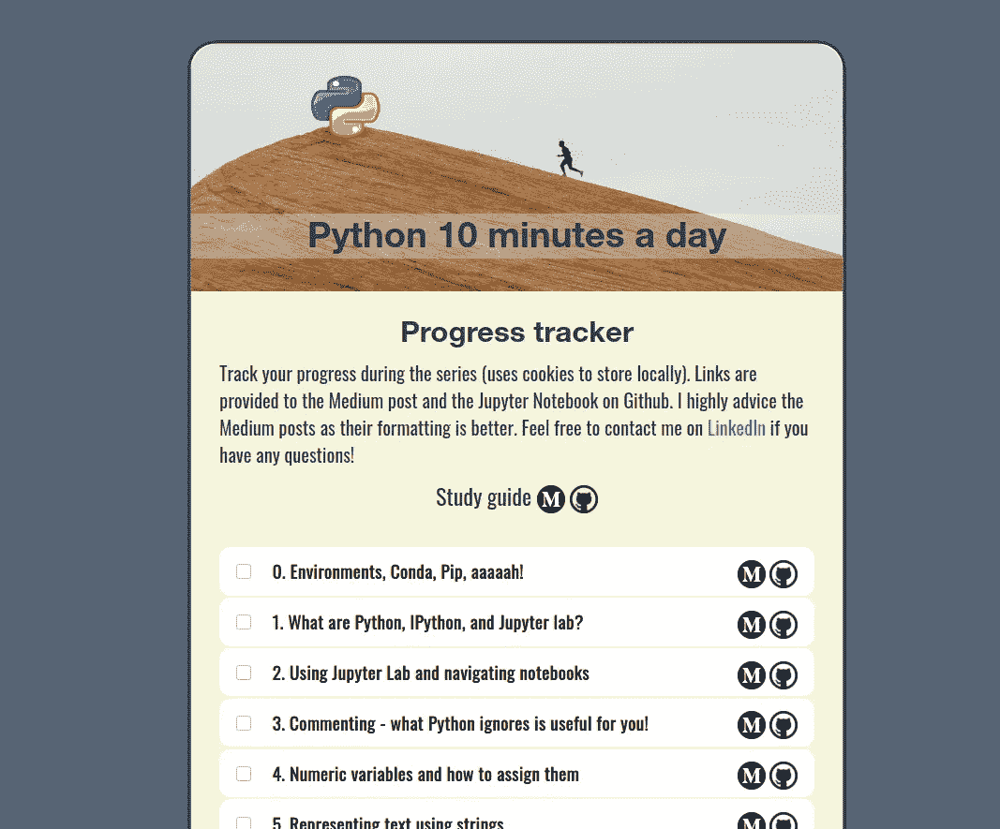
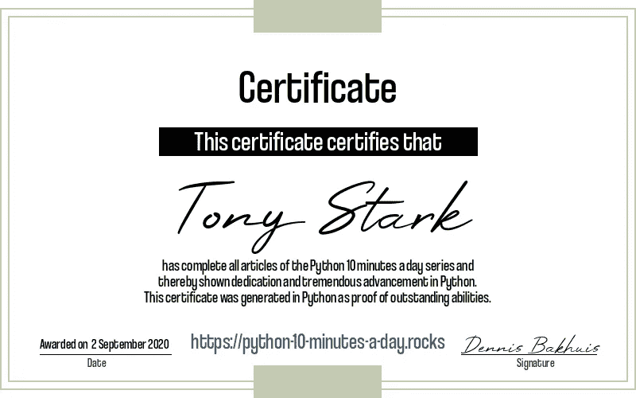

# 每天 10 分钟掌握 Python

> 原文：<https://towardsdatascience.com/master-python-in-10-minutes-a-day-ac32996b5ded?source=collection_archive---------42----------------------->

由作者创建的图像—使用上节课中代码的证书。

## 让您开始使用 Python 的完整课程

这是一个[系列](https://python-10-minutes-a-day.rocks)的 10 分钟 Python 短文，帮助你开始学习 Python。总共有 25 个讲座*，从最基础的开始，到更复杂的习语。如有疑问，请随时通过 [LinkedIn](https://www.linkedin.com/in/dennisbakhuis/) 联系我。*

*这是一种学习指南，旨在通过所有的讲座创建一个计划。讲座本身可以在 10 分钟内读完，但是做一些动手实践也很重要。根据讲座本身和你以前的经验，这些也需要一点时间。虽然在一天之内做很多讲座很有诱惑力，但我认为最好是每天都做。根据我的经验，这有助于更好地处理每个部分。我也认为每个人都应该有一个周末，所以一周只有五天。当然，没有人阻止你一天做不止一个。*

> *[https://python-10-minutes-a-day.rocks/](https://python-10-minutes-a-day.rocks/)*

**

*Python 每日 10 分钟进度跟踪器的屏幕截图-图片由作者提供。*

*为了让体验尽可能顺利，我创建了一个[在线进度跟踪器](http://python-10-minutes-a-day.rocks)。进度追踪器会显示你的进度和还剩多少课。它还包含所有中型职位的链接，并包括 Jupyter 笔记本版本的链接。虽然两个版本包含相同的信息，但使用中型文章的布局和体验更好。进度跟踪器的好处是，正如它的名字所揭示的，你可以跟踪你的进度。当你写完一篇文章时，点击复选框把已完成的讲稿划掉。进度存储在本地 cookie 中，下次您访问该网站时，会恢复当前进度。只要确保你保留了 cookie，也就是说，在你的浏览器中关闭该网站的 cookie 自动删除插件。虽然它主要是一个静态网站，但我仍然使用 Python 来创建它(为了好玩)。包括 Dockerfile 文件在内的完整网络应用发布在我的 Github 上。*

## *第一周*

*第一周，我们已经打破了每天一节课的规则，至少如果你还不知道如何组织虚拟环境的话。尽管如此，我认为有一个固定的方法来组织虚拟环境是非常重要的，因为它们可能会变得混乱。前五堂课解释了 Python 是什么以及如何使用它。我们谈论评论，并解释为什么它不无聊，但几乎至关重要。最后两节课讲的是数值变量和字符串。绝对是有趣的一周！*

***讲座:** 0。[环境，康达，匹普，啊啊啊！](/environments-conda-pip-aaaaah-d2503877884c)
1。[Python、IPython、Jupyter lab 是什么？](/learning-python-10-minutes-a-day-1-7fda6662276)2。[使用 Jupyter Lab 和导航笔记本](/learning-python-10-minutes-a-day-2-86a56e6f0568)
3。[注释 Python 忽略的对你有用！](/learning-python-10-minutes-a-day-3-af2967c34a36)4
4。[数值变量以及如何给它们赋值](/learning-python-10-minutes-a-day-4-df06c3c2e6e8)
5。[使用字符串表示文本](/learning-python-10-minutes-a-day-5-9e012c6920e0)*

## *第二周*

*在第一周，我们建立了一个基础，并尝试了一些变量。本周，我们将介绍条件句、循环和函数，并做一些真正的编程。您还将学习最通用的数据结构之一:列表。在本周末，你可以使用所有这些概念来编写你的第一个解决方案:快速排序算法。*

***讲座:**
6。[Python 中的条件句:if、elif、else 结构](/learning-python-10-minutes-a-day-6-4a61ddc8747d)
7。[Python 中最全能的数据类型:list](/learning-python-10-minutes-a-day-7-5390dd024178)
8。[在 Python 中循环:一会儿](/learning-python-10-minutes-a-day-8-5e835880f284)9。[定义函数并停止重复自己](/learning-python-10-minutes-a-day-9-60ecdf101cb5)和
10。测试你的新技能:编写一个快速排序算法*

## *第三周*

*在第三周，我们将从一些中间概念开始，比如 Try/Except，我们将学习三种新的数据结构:字典、元组和集合。一个非常常见的任务是处理文件和文件系统。本周，我们将看到解决这些问题的几种方法。*

***讲座:**
11。[用 Python 读写文件](/learning-python-10-minutes-a-day-11-d44d7df65dac)
12。[尝试，除了，最后，和上下文管理器](/learning-python-10-minutes-a-day-12-44806ea44852)
13。[字典—键值存储](/learning-python-10-minutes-a-day-13-4d8172df24b2)
14。[元组和集合](/learning-python-10-minutes-a-day-14-da2cc6a05c59)
15。[在 Python 中使用文件和路径](/learning-python-10-minutes-a-day-15-50523202db27)*

## *第四周*

*本周，我们将深入了解 Python 的导入系统是如何工作的，以及模块、包、库和框架之间的区别。我们还介绍了一些高级的酷东西，如列表理解和生成器。看了一些错误，还有一个排序算法赋值。大好玩！*

***讲座:**
16。[导入、模块、包、库和框架](/learning-python-10-minutes-a-day-16-c8b83919a13e)
17。列出理解和地图:一条神奇的捷径。关于生成器以及如何创建它们的更多信息。[读取 Python 中的错误和异常](/learning-python-10-minutes-a-day-19-4d688c4101ce)
20。[让我们把排序排序](/learning-python-10-minutes-a-day-20-13af35b86452)*

## *最后一周*

*这已经是最后一周了。这里我们讨论一些不太常见但绝对有用的概念:lambda 函数和 decorators。直到现在，我们只做函数式编程。面向对象编程是解决编码问题的另一种方式。有两个讲座是关于 Python 如何处理这种编程范式的。最后一堂课，我们将生成我们的证书。如果你喜欢这个课程，请在你的 LinkedIn 上分享，并给我贴上标签。有了这个，我就知道谁能坚持到最后了。当然，我会祝贺你的成就！*

***讲座:**
21。[无名函数又名λ函数](/learning-python-10-minutes-a-day-21-f1d8eec408d)22。在 Python 中，我们修饰函数以使它们更好。[全新的编程类](/learning-python-10-minutes-a-day-23-8fd7e119da8d)
24。[父母、子女和遗产](/learning-python-10-minutes-a-day-24-71adee92cb2d)
25。[实至名归的自创证书](/learning-python-10-minutes-a-day-25-a14ac87d16d2)*

**

*大家都想要的实至名归的自生超级正统证书！—产生于上节课。*

## *最后的想法*

*在上一讲中，我们讨论了数据科学职业生涯的下一步，当你掌握了 Python 之后，一定要阅读这一部分。我们已经讨论了所有引入的 Python 概念，我相信你能处理任何关于 Python 的问题(也许通过一些额外的搜索)。*

*本课程到此结束。如果你喜欢这门课程，如果你在 LinkedIn 上分享来之不易的自我生成的证书，并把我和它一起标记出来，我会非常高兴。这让我知道是谁真正上了这门课，当然，我会祝贺你取得的成就。*

*本课程到此结束。如果你喜欢这门课程，如果你在 LinkedIn 上分享来之不易的自我生成的证书，并把我和它一起标记出来，我会非常高兴。这让我知道是谁真正上了这门课，当然，我会祝贺你取得的成就。*

*一切顺利，一如既往，如果您有任何问题、评论或要求，请随时[在 LinkedIn 上联系我](https://www.linkedin.com/in/dennisbakhuis/)。*