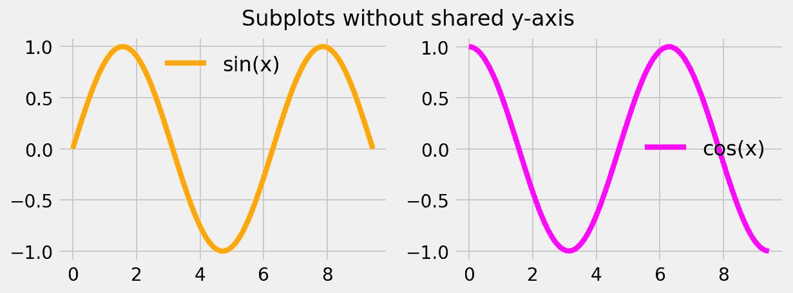
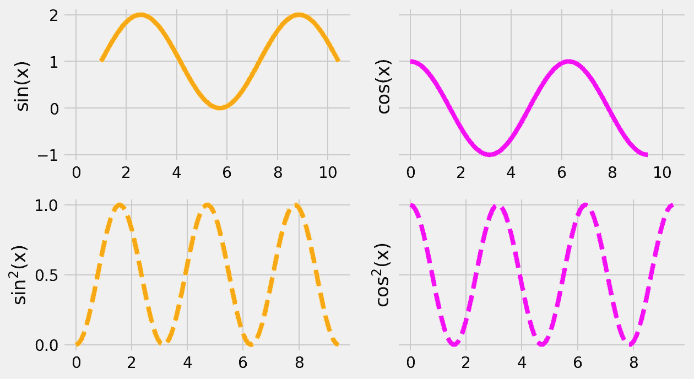
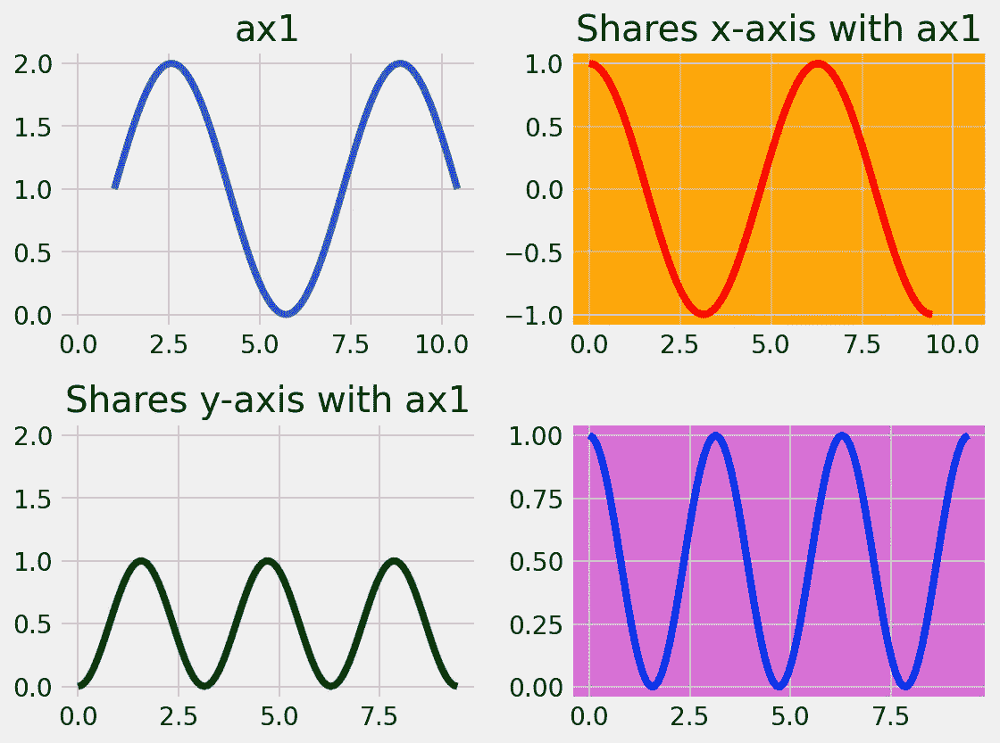
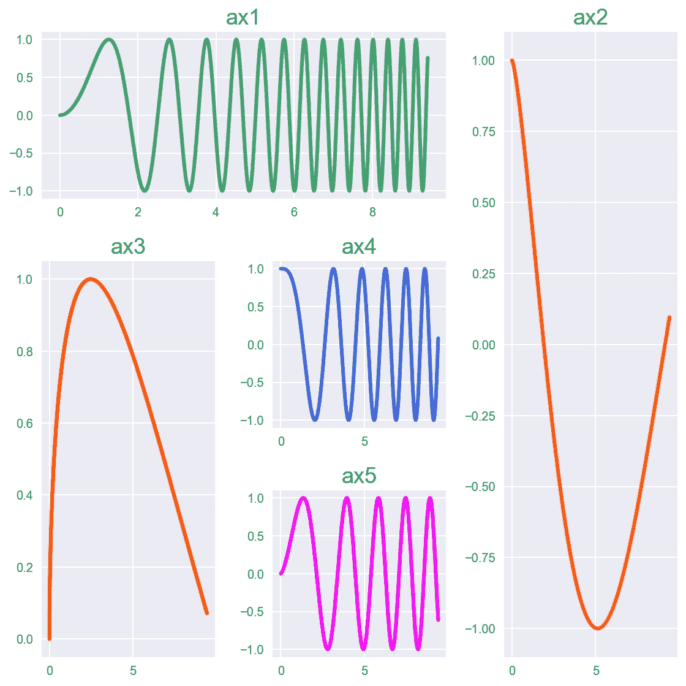
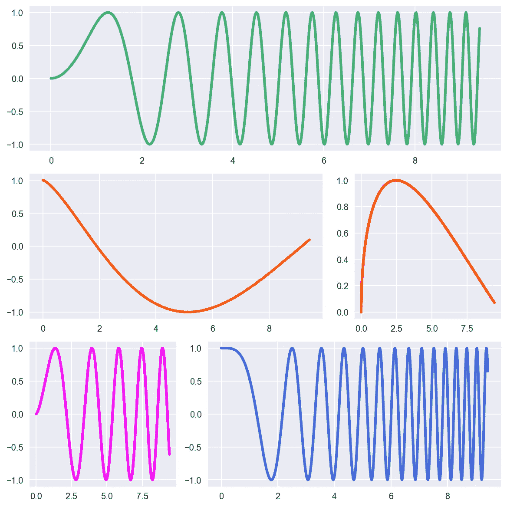
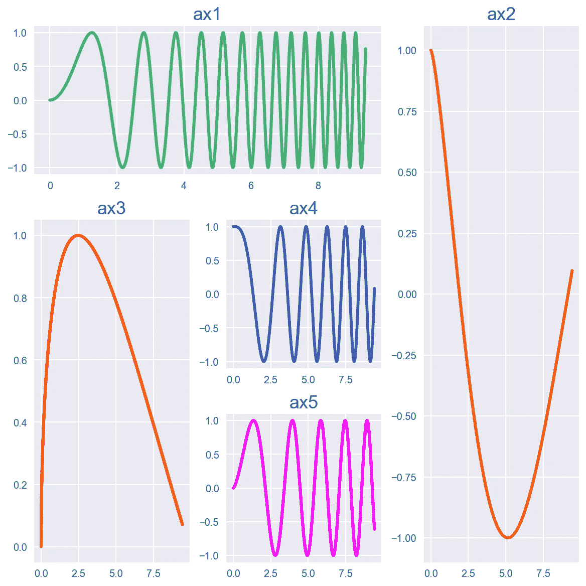
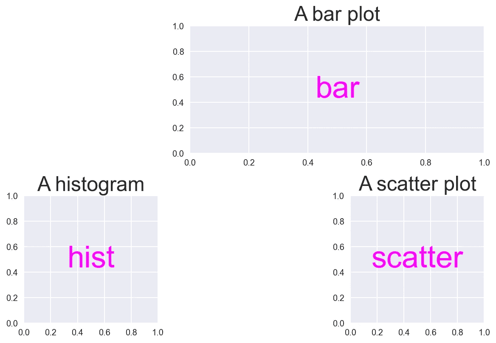

# 掌握 Python 中支线剧情的艺术

> 原文：<https://towardsdatascience.com/master-the-art-of-subplots-in-python-45f7884f3d2e?source=collection_archive---------12----------------------->


照片由 [Pietro Mattia](https://unsplash.com/@pietromattia?utm_source=medium&utm_medium=referral) 在 [Unsplash](https://unsplash.com?utm_source=medium&utm_medium=referral) 上拍摄

## 了解可视化大数据的六种独特方式

通常，在处理数据时，无论大小，有时您都希望并排比较事物，或者分别绘制不同的属性或特征。在这种情况下，一个数字是不够的。因此，你需要知道 ***处理支线剧情*** 的艺术。

本文将重点介绍**支线剧情**的概念。它会教你 ***使用 Matplotlib 在 Python 中创建**非常简单和非常复杂的网格**的六种独特方式*** 。

> “每一次失败都有另一种选择。你只需要找到它。遇到路障时，绕道而行”——***玫琳·凯·艾施***

# 方式一:使用支线剧情( )

## 绘制单行或单列

让我们首先导入一些基本模块，并使用一个[花哨的样式表](https://matplotlib.org/3.1.1/gallery/style_sheets/style_sheets_reference.html)来给我们的人物添加艺术感。

```
%matplotlib inline # To enable inline plotting in Jupyter Notebookimport numpy as np
import matplotlib.pyplot as plt
plt.style.use('fivethirtyeight') # For better style
```

让我们定义一些数据来绘图。我们用我们不朽的正弦和余弦曲线来描述 3𝜋).的𝑥∈(0

```
x = np.linspace(0., 3*np.pi, 100) # 0 to 3*Pi in 100 stepsy_1 = np.sin(x) 
y_2 = np.cos(x)
```

现在让我们用一行两列来创建我们最初的两个支线剧情。由于`axes`对象包含两个子情节，您可以使用索引[0]和[1]来访问它们，因为在 Python 中索引是从 0 开始的。

```
fig, axes = plt.subplots(nrows=1, ncols=2, figsize=(9, 3))axes[0].plot(x, y_1, '-', c='orange', label='sin(x)')
axes[1].plot(x, y_2, '-', c='magenta', label='cos(x)')axes[0].legend(fontsize=16, frameon=False)
axes[1].legend(fontsize=16, frameon=False)fig.suptitle('Subplots without shared y-axis')
```



使用“支线剧情()”模块创建的支线剧情

**注意:**如果你不喜欢指数符号，你也可以使用如下所示的轴名，然后直接使用它们绘图。下面的元组`(ax1, ax2)`表示各个支线剧情的轴句柄。由于以上两个支线剧情有相同的 *y* 轴限制，你可以使用关键字`sharey=True`从右侧支线剧情中移除多余的 *y* 轴值。

```
fig, (ax1, ax2) = plt.subplots(1, 2, figsize=(10, 3), sharey=True)ax1.plot(...)
ax2.plot(...)
```

**跨越多行的支线剧情:**上图中，支线剧情以柱状方式绘制。要将它们绘制成两行，可以使用`nrows=2, ncols=1`。现在你必须使用关键字`sharex`。

## 绘制多行和多列

当你有超过 1 行**和 1 列**时，你需要两个索引来访问单独的支线剧情，如下面的代码所示。索引从 0 开始。因此，对于 2 行 2 列，索引将是 0 和 1。切片符号[i，j]中的第一和第二索引分别对应于行(I)和列(j)的编号。

```
fig, axes = plt.subplots(nrows=2, ncols=2, figsize=(9, 5),
                         sharey='row', sharex='row')axes[0, 0].plot(x+1, y_1+1, '-', c='orange')
axes[0, 1].plot(x, y_2, '-', c='magenta')
axes[1, 0].plot(x, y_1**2, '--', c='orange')
axes[1, 1].plot(x, y_2**2, '--', c='magenta')axes[0, 0].set_ylabel(r'sin(x)')
axes[0, 1].set_ylabel(r'cos(x)')
axes[1, 0].set_ylabel(r'sin$^2$(x)')
axes[1, 1].set_ylabel(r'cos$^2$(x)')fig.tight_layout()
```



使用 subplots()模块绘制的包含 2 行 2 列的图形。

在上图中，您可以选择如何共享 *x* 和 *y* 轴。我选择了`sharex='col'`和`sharey='row'`，这意味着*x*-轴跨每列共享，而*y*-轴跨每行共享。请注意上图中不同的轴限制，以便理解这一点。

如前所述，您还可以使用元组来命名轴，避免使用索引符号。第一个元组`(ax1, ax2)`对应第一行支线剧情。同样，`(ax3, ax4)`对应于第二行。

```
fig, ((ax1, ax2), (ax3, ax4)) = plt.subplots(2, 2, figsize=(9, 5))
```

# 方式二:使用支线剧情( )

在这种方法中，首先创建人物对象，然后手动一个接一个地添加支线剧情。下面的示例创建一个 2 x 2 的网格。如果你想让多个支线剧情共享同一个 *x* 或 *y-* 轴，你可以在创建支线剧情时指定相应的轴，如下所示。

**注:**此处，**从 1** 开始编号。因此，对于一个 2×2 的网格，上面一行将使用数字`(2, 2, 1)`、`(2, 2, 2)`，第二行将分别使用数字`(2, 2, 3)`、`(2, 2, 4)`。前两个索引分别是总行数和总列数，而第三个数字指定子情节。

```
fig = plt.figure(figsize=(8, 6))ax1 = plt.subplot(2, 2, 1, frameon=True) 
ax1.plot(x+1, y_1+1)
ax1.set_title('ax1')ax2 = plt.subplot(2, 2, 2, sharex=ax1, facecolor='orange')
ax2.plot(x, y_2, '-r')
ax2.set_title('Shares x-axis with ax1')ax3 = plt.subplot(2, 2, 3, sharey=ax1)
ax3.plot(x, y_1**2, '-g')
ax3.set_title('Shares y-axis with ax1')ax4 = plt.subplot(2, 2, 4, facecolor='orchid')
ax4.plot(x, y_2**2, '-b')fig.tight_layout()
```



包含使用 subplot()模块创建的 2x2 子情节的图形。

# 方式 3:使用 subplot2grid()

这种方法对于生成复杂网格很有用，其中子情节跨越多行或多列。在这里，您可以在整个网格中的指定位置创建支线剧情。

您必须首先指定整体网格大小，如下面示例代码中的`(3, 3)`。然后，使用索引元组指定子情节的开始位置，索引元组的顺序为(行，列),其中索引从 0 开始。因此，对于一个 3 x 3 的网格，行和列的索引都是 0、1 和 2。如果您希望一个子情节跨越多行或多列，您可以使用关键字`rowspan`或`colspan`指定跨度的长度。

```
def add_title(axes):
    for i, ax in enumerate(axes):
        ax.set_title("ax%d" % (i+1), fontsize=18)fig = plt.figure(figsize=(8, 8))ax1 = plt.subplot2grid((3, 3), (0, 0), colspan=2)
ax2 = plt.subplot2grid((3, 3), (0, 2), rowspan=3)
ax3 = plt.subplot2grid((3, 3), (1, 0), rowspan=2)
ax4 = plt.subplot2grid((3, 3), (1, 1))
ax5 = plt.subplot2grid((3, 3), (2, 1))add_title(fig.axes)
```



使用 subplot2grid()模块生成的复杂的子情节网格。

# 方式 4:使用 gridspec。GridSpec()

这种方法对于生成复杂网格也很有用**。要使用这种方法，您需要对 NumPy 数组的切片和索引符号有一个基本的了解。**

例如，切片`[0, :]`表示第一行(索引 0)和所有列(:表示全部)，切片`[1, :-1]`表示第二行(索引 1)和除最后一列以外的所有列(:-1 表示除最后一列以外的所有列)。

```
import matplotlib.gridspec as gridspecfig = plt.figure(constrained_layout=True, figsize=(8, 8))
spec = gridspec.GridSpec(ncols=3, nrows=3, figure=fig)ax1 = fig.add_subplot(spec[0, :])
ax2 = fig.add_subplot(spec[1, :-1])
ax3 = fig.add_subplot(spec[1, -1])
ax4 = fig.add_subplot(spec[2, 1:])
ax5 = fig.add_subplot(spec[2, 0])# Now you can plot individually as ax1.plot(), ax2.plot() etc.
```



使用 gridspec 生成的复杂的子情节网格。Gridspec()模块。

# 方式 5:使用 add_gridspec( ) —仅限 Matplotlib 3+

该方法**与方式 3** 非常相似，并且使用与上述相同的索引符号。该功能仅在 Matplotlib 3+版本中可用。

```
fig = plt.figure(constrained_layout=True, figsize=(8, 8))spec = fig.add_gridspec(3, 3)ax1 = fig.add_subplot(spec[0, :-1])
ax1.set_title('ax1')ax2 = fig.add_subplot(spec[:, -1])
ax2.set_title('ax2')ax3 = fig.add_subplot(spec[1:, 0])
ax3.set_title('ax3')ax4 = fig.add_subplot(spec[1, 1])
ax4.set_title('ax4')ax5 = fig.add_subplot(spec[-1, 1])
ax5.set_title('ax5')
```



使用 add_gridspec()模块生成的复杂的子情节网格。

# 方式 6:使用 subplot_mosaic( ) —仅限 Matplotlib 3.3

## 这是仅在 Matplotlib 3.3 中可用的最新方法

最新版本的 Matplotlib 3.3 引入了一个新的、不太冗长的和一个 [**语义的方式**](https://matplotlib.org/3.3.0/tutorials/provisional/mosaic.html#sphx-glr-tutorials-provisional-mosaic-py) 来生成复杂的子情节网格。经由`subplot_mosaic()`。你也可以随意命名你的支线剧情。您也可以使用[简写 ASCII 符号](https://matplotlib.org/3.3.0/tutorials/provisional/mosaic.html#sphx-glr-tutorials-provisional-mosaic-py)重新创建下图。

***最酷的地方在于*** ，要生成下图所示的支线剧情网格，可以通过**以列表的形式布局**。缺失的支线剧情被标示为`'.'`。为了让一个支线剧情跨越两列，你可以重复名字，就像我对`'bar'`做的那样。要跨越多行(垂直)，请在第二个列表中垂直重复下面的名称。你也可以使用名字`'bar'`、`'hist'`和`'scatter'`使用字典来控制/修改相应支线剧情**的属性。**

```
axes = plt.figure(constrained_layout=True).subplot_mosaic(
                [['.', 'bar', 'bar'], # Note repitition of 'bar'
                 ['hist', '.', 'scatter']])for k, ax in axes.items():
    ax.text(0.5, 0.5, k, ha='center', va='center', 
            fontsize=36, color='magenta')# Using dictionary to change subplot properties
axes['bar'].set_title('A bar plot', fontsize=24)    
axes['hist'].set_title('A histogram', fontsize=24)    
axes['scatter'].set_title('A scatter plot', fontsize=24)
```



使用 subplot_mosaic()生成的支线剧情。请注意跨越两列的扩展“条”。

这就是我这篇文章的结尾。如果你有兴趣了解更多关于 Matplotlib 的**最新特性，可以参考我下面的文章。**

[](/latest-cool-features-of-matplotlib-c7a1e2c060c1) [## Matplotlib 的最新酷功能

### 立即将您的 Matplotlib 升级至最新版本 3.3

towardsdatascience.com](/latest-cool-features-of-matplotlib-c7a1e2c060c1) [](/whats-new-in-matplotlib-3-1b3b03f18ddc) [## Matplotlib 3 的新特性

### 第 3 代中最重要的更新概述

towardsdatascience.com](/whats-new-in-matplotlib-3-1b3b03f18ddc)