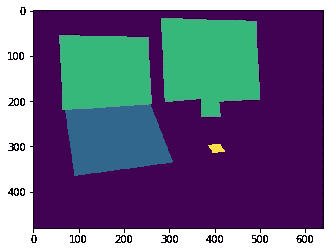

# 掌握用于语义图像分割的 COCO 数据集—第 1 部分，共 2 部分

> 原文：<https://towardsdatascience.com/master-the-coco-dataset-for-semantic-image-segmentation-part-1-of-2-732712631047?source=collection_archive---------1----------------------->

## 在这个由两部分组成的演练中，我们将使用 PyCoco 和 Tensorflow Keras 等库来探索和操作 COCO(上下文中的公共对象)图像数据集，以便在 Python 中进行语义图像分割。


你是说可可吗？(原图由来自[派克斯](https://www.pexels.com/photo/white-ceramic-mug-1693652/?utm_content=attributionCopyText&utm_medium=referral&utm_source=pexels)的[伊兰尼特·科彭斯](https://www.pexels.com/@nietjuh?utm_content=attributionCopyText&utm_medium=referral&utm_source=pexels)拍摄)

[COCO(上下文中的常见对象)](http://cocodataset.org/#home)，是最受欢迎的图像数据集之一，具有对象检测、分割和字幕等应用程序——令人惊讶的是，几乎没有全面而简单的端到端教程。当我第一次开始使用这个数据集时，我感到非常失落和害怕。我不得不费力地通过网上这么多分散的、不充分的资源、多个模糊的教程和一些实验，最终在这条隧道的尽头看到光明。当我完成后，我知道我必须记录下这段旅程，从开始到结束。于是我照做了。希望有一天，有人会发现这些有价值的东西，而不必经历我所面临的所有麻烦。

这是一个由两部分组成的系列教程，旨在帮助您探索、使用和掌握用于图像分割的 COCO 图像数据集。我会尽量保持简单，为每一步提供解释，并且只使用免费的、简单的库。*我在这里的工作是让你熟悉和熟悉这个话题，达到一个水平，在这个水平上* ***你可以占据中心位置，并根据你的需要操纵它！***

在第 1 部分中，我们将首先使用一个名为 [pycoco](https://pypi.org/project/pycoco/#description) 的 python 库来探索和操作用于图像分割的 COCO 数据集。这个库简化了 COCO 数据集的处理，否则自己编写代码会非常困难。

在[第 2 部分](/master-the-coco-dataset-for-semantic-image-segmentation-part-2-of-2-c0d1f593096a)中，我们将使用 T[sensor flow Keras](https://www.tensorflow.org/guide/keras)库来简化该数据集上的训练模型，并添加图像增强。

你可以在我的 [GitHub 库](https://github.com/virafpatrawala/COCO-Semantic-Segmentation)中找到本教程的完整代码。然而，请继续阅读这篇文章以获得更详细的解释。

# 1.COCO 数据集

> " COCO 是一个大规模的对象检测、分割和字幕数据集."


[COCO 数据集](http://cocodataset.org/#home)

上下文中的常见对象(COCO)字面上意味着数据集中的图像是从日常场景中捕获的日常对象。这为场景中捕捉的对象添加了一些“上下文”。[在这里探索这个数据集](http://cocodataset.org/#explore)。


数据集中的示例图像。

COCO 提供多对象标记、分割遮罩注释、图像字幕、关键点检测和全景分割注释，共有 81 个类别，使其成为一个非常通用和多用途的数据集。

在本演练中，我们将重点关注数据集的语义分段应用。

# 2.下载和安装

## 椰子树

您需要将 COCO 数据集下载到您的设备上(很明显)。您可以使用以下链接下载 2017 年数据集文件。这些文件非常大，所以请耐心等待，因为这可能需要一些时间。您需要的文件有:

(一) [2017 年列车图像](http://images.cocodataset.org/zips/train2017.zip)

(b) [2017 val 图像](http://images.cocodataset.org/zips/val2017.zip)

(c) [2017 Stuff Train/Val 注释](http://images.cocodataset.org/annotations/stuff_annotations_trainval2017.zip)

提取压缩文件。从(c)中，只需要 train 和 val 的*实例*文件，即*实例 _train2017.json* 和*实例 _val2017.json.*

按照下面给出的文件结构排列这些文件。需要对文件夹和文件进行一些简单的重新排列和重新命名。我这样做只是为了便于使用和可视化，如果你不想这样做，你需要做的就是相应地更改代码(主要是文件路径)。

```
Project Folder
└───the code notebook (.py / .ipynb)
│
└───COCOdataset2017   
    └───images
    │   └───train
    │   │    │   000000000009.jpg
    │   │    │   000000000025.jpg
    │   │    │   ...
    │   └───val   
    │        │   000000000139.jpg
    │        │   000000000285.jpg
    │        │   ...
    └───annotations
        │   instances_train.json
        │   instances_val.json
```

*#请注意，有一种方法可以访问图像及其 URL(从注释文件中)，只需要下载(c)。然而，在一个漫长的训练过程中，如果你不依赖互联网会更好，因此我建议你也下载(a)和(b)。*

## PyCoco

接下来，让我们安装我们的主要库， **pycoco** 。我特别说明了这个过程，因为如果你按照你的标准过程，你会在安装和导入过程中面临许多错误。

在 [Conda](https://docs.conda.io/en/latest/) 中，如果你按照下面的步骤操作，你应该可以相当流畅地安装、导入和使用这个库。

## 其他人

让我们导入我们将在本教程中使用的所有库。其他库的安装非常简单，所以我不会在这里提及细节。在 python 环境中安装所有的库。

# 3.使用 PyCoco 探索数据集

首先，让我们初始化 PyCoco 库。这个库接受 COCO 注释(。json)文件(我们在步骤 2 中下载的文件)作为输入。train 或 val 实例注释都可以，但对于本教程，我使用“instances_val.json ”,因为它加载速度更快(原因:val 数据集比 train 数据集小)。

输出(即类别)打印如下:

```
[{'supercategory': 'person', 'id': 1, 'name': 'person'},
 {'supercategory': 'vehicle', 'id': 2, 'name': 'bicycle'},
 {'supercategory': 'vehicle', 'id': 3, 'name': 'car'},
 {'supercategory': 'vehicle', 'id': 4, 'name': 'motorcycle'},
 {'supercategory': 'vehicle', 'id': 5, 'name': 'airplane'},
 {'supercategory': 'vehicle', 'id': 6, 'name': 'bus'},
 {'supercategory': 'vehicle', 'id': 7, 'name': 'train'},
 {'supercategory': 'vehicle', 'id': 8, 'name': 'truck'},
 {'supercategory': 'vehicle', 'id': 9, 'name': 'boat'},
 {'supercategory': 'outdoor', 'id': 10, 'name': 'traffic light'},
 {'supercategory': 'outdoor', 'id': 11, 'name': 'fire hydrant'},
 {'supercategory': 'outdoor', 'id': 13, 'name': 'stop sign'},
 {'supercategory': 'outdoor', 'id': 14, 'name': 'parking meter'},
 {'supercategory': 'outdoor', 'id': 15, 'name': 'bench'},
 {'supercategory': 'animal', 'id': 16, 'name': 'bird'},
 {'supercategory': 'animal', 'id': 17, 'name': 'cat'},
 {'supercategory': 'animal', 'id': 18, 'name': 'dog'},
 {'supercategory': 'animal', 'id': 19, 'name': 'horse'},
 {'supercategory': 'animal', 'id': 20, 'name': 'sheep'},
 {'supercategory': 'animal', 'id': 21, 'name': 'cow'},
 {'supercategory': 'animal', 'id': 22, 'name': 'elephant'},
 {'supercategory': 'animal', 'id': 23, 'name': 'bear'},
 {'supercategory': 'animal', 'id': 24, 'name': 'zebra'},
 {'supercategory': 'animal', 'id': 25, 'name': 'giraffe'},
 {'supercategory': 'accessory', 'id': 27, 'name': 'backpack'},
 {'supercategory': 'accessory', 'id': 28, 'name': 'umbrella'},
 {'supercategory': 'accessory', 'id': 31, 'name': 'handbag'},
 {'supercategory': 'accessory', 'id': 32, 'name': 'tie'},
 {'supercategory': 'accessory', 'id': 33, 'name': 'suitcase'},
 {'supercategory': 'sports', 'id': 34, 'name': 'frisbee'},
 {'supercategory': 'sports', 'id': 35, 'name': 'skis'},
 {'supercategory': 'sports', 'id': 36, 'name': 'snowboard'},
 {'supercategory': 'sports', 'id': 37, 'name': 'sports ball'},
 {'supercategory': 'sports', 'id': 38, 'name': 'kite'},
 {'supercategory': 'sports', 'id': 39, 'name': 'baseball bat'},
 {'supercategory': 'sports', 'id': 40, 'name': 'baseball glove'},
 {'supercategory': 'sports', 'id': 41, 'name': 'skateboard'},
 {'supercategory': 'sports', 'id': 42, 'name': 'surfboard'},
 {'supercategory': 'sports', 'id': 43, 'name': 'tennis racket'},
 {'supercategory': 'kitchen', 'id': 44, 'name': 'bottle'},
 {'supercategory': 'kitchen', 'id': 46, 'name': 'wine glass'},
 {'supercategory': 'kitchen', 'id': 47, 'name': 'cup'},
 {'supercategory': 'kitchen', 'id': 48, 'name': 'fork'},
 {'supercategory': 'kitchen', 'id': 49, 'name': 'knife'},
 {'supercategory': 'kitchen', 'id': 50, 'name': 'spoon'},
 {'supercategory': 'kitchen', 'id': 51, 'name': 'bowl'},
 {'supercategory': 'food', 'id': 52, 'name': 'banana'},
 {'supercategory': 'food', 'id': 53, 'name': 'apple'},
 {'supercategory': 'food', 'id': 54, 'name': 'sandwich'},
 {'supercategory': 'food', 'id': 55, 'name': 'orange'},
 {'supercategory': 'food', 'id': 56, 'name': 'broccoli'},
 {'supercategory': 'food', 'id': 57, 'name': 'carrot'},
 {'supercategory': 'food', 'id': 58, 'name': 'hot dog'},
 {'supercategory': 'food', 'id': 59, 'name': 'pizza'},
 {'supercategory': 'food', 'id': 60, 'name': 'donut'},
 {'supercategory': 'food', 'id': 61, 'name': 'cake'},
 {'supercategory': 'furniture', 'id': 62, 'name': 'chair'},
 {'supercategory': 'furniture', 'id': 63, 'name': 'couch'},
 {'supercategory': 'furniture', 'id': 64, 'name': 'potted plant'},
 {'supercategory': 'furniture', 'id': 65, 'name': 'bed'},
 {'supercategory': 'furniture', 'id': 67, 'name': 'dining table'},
 {'supercategory': 'furniture', 'id': 70, 'name': 'toilet'},
 {'supercategory': 'electronic', 'id': 72, 'name': 'tv'},
 {'supercategory': 'electronic', 'id': 73, 'name': 'laptop'},
 {'supercategory': 'electronic', 'id': 74, 'name': 'mouse'},
 {'supercategory': 'electronic', 'id': 75, 'name': 'remote'},
 {'supercategory': 'electronic', 'id': 76, 'name': 'keyboard'},
 {'supercategory': 'electronic', 'id': 77, 'name': 'cell phone'},
 {'supercategory': 'appliance', 'id': 78, 'name': 'microwave'},
 {'supercategory': 'appliance', 'id': 79, 'name': 'oven'},
 {'supercategory': 'appliance', 'id': 80, 'name': 'toaster'},
 {'supercategory': 'appliance', 'id': 81, 'name': 'sink'},
 {'supercategory': 'appliance', 'id': 82, 'name': 'refrigerator'},
 {'supercategory': 'indoor', 'id': 84, 'name': 'book'},
 {'supercategory': 'indoor', 'id': 85, 'name': 'clock'},
 {'supercategory': 'indoor', 'id': 86, 'name': 'vase'},
 {'supercategory': 'indoor', 'id': 87, 'name': 'scissors'},
 {'supercategory': 'indoor', 'id': 88, 'name': 'teddy bear'},
 {'supercategory': 'indoor', 'id': 89, 'name': 'hair drier'},
 {'supercategory': 'indoor', 'id': 90, 'name': 'toothbrush'}]
```

COCO 数据集有 81 个对象类别(*注意‘id’:0 是背景*)，正如我们上面打印出来的一样(这里还列出了)。然而，正如您所观察到的，这 81 个类的标签 id 范围从 0 到 90(中间有一些空的 id 号)。这是一个方便的函数，它可以获取给定 id 号的类名。

这将给出一个输出:

```
The class name is cell phone
```

## 类别过滤

假设我想要只包含“笔记本电脑”、“电视”和“手机”类的图像，而不需要任何其他对象类。要获取数据集的这个子集，请执行以下步骤:

现在， *imgIDs* 变量包含了包含所有 *filterClasses* 的所有图像。print 语句的输出是:

```
Number of images containing all the classes: 11
```

这意味着，在整个验证数据集中，有 11 个图像包含了我想要的全部 3 个类。显示的示例图像是:


包含过滤后的输出类的示例图像。

为了显示注释，我们应该遵循下面的代码。请注意，我们使用 pycoco 功能**"**[**loadAnns**](https://github.com/cocodataset/cocoapi/blob/master/PythonAPI/pycocotools/coco.py#L200)**"**加载 coco 格式的关于对象的注释，并使用**"**[**showAnns**](https://github.com/cocodataset/cocoapi/blob/master/PythonAPI/pycocotools/coco.py#L233)**在图像上绘制这些注释。这些函数极大地简化了注释遮罩的绘制。您可以查看链接的函数定义，了解它们在内部是如何工作的。**

****

**过滤后的类的注释简洁明了。**

## **所有可能的组合**

**当我们用类过滤数据集时，pycoco 工具返回的图像只包含所有需要的类，而不是一两个或任何其他组合。因此，这段代码将确保在结果数据集中获得给定的 *filterClass* 列表的所有可能组合。**

**print 语句的输出是:**

```
Number of images containing the filter classes: 503
```

**看上面，我们只收到了 11 张图片，但是现在有 503 张图片！我们也避免了图像的重复。**

# **4.图像分割掩模生成**

**对于任何语义分割训练任务，您都需要一个装满图像(train 和 val)和相应的输出真实遮罩的文件夹。本节将帮助创建相应的图像遮罩。**

## **屏蔽类型 1:正常语义分段屏蔽**

**每个像素根据其所属的类别都有一个标签。我没有使用官方的 COCO ids，而是按照数组' *filterClasses* '中类名的顺序分配像素值，即:
0:背景
1:笔记本电脑
2:电视
3:手机**

**输出是一个 2 通道语义分割蒙版，其尺寸等于原始图像，如下所示:**

****

**用于语义分割的普通双通道掩码。**

## **掩码类型 2:二元语义分段掩码**

**一般来说，对于 N 个输出类，你的输出遮罩将有 *N* 个可能的像素值。然而，二进制掩码意味着输出掩码将只有 2 个像素值，即 **1** (对象:可以是 N 个类中的任何一个)和 **0** (背景)。**

**输出是一个 2 通道二元语义分割蒙版，其尺寸等于原始图像，如下所示:**

****

**二元语义分割掩码。黄色代表像素值 1，紫色代表像素值 0。**

**N 例如，您可能希望标签 id 号与原始 COCO 数据集中的相同(0–90)。或者你可能想要一个*实例分割*用例的输出格式。另一个例子是，您可能希望您的遮罩是一个热编码，即通道数=输出对象类的数量，并且每个通道只有 0(背景)和 1(该对象)。**

**无论如何，相应地修改上面的代码，你就可以得到你想要的遮罩。如果将来我有时间，我也会尝试为这些额外的类型添加代码。**

*****接下来，我们接着看*** [***第二部分***](/master-the-coco-dataset-for-semantic-image-segmentation-part-2-of-2-c0d1f593096a) ***。*****

**[](/master-the-coco-dataset-for-semantic-image-segmentation-part-2-of-2-c0d1f593096a) [## 掌握用于语义图像分割的 COCO 数据集

### 创建一个数据生成器，并在 COCO 图像数据集上训练您的模型，以便使用 PyCoco 进行语义图像分割…

towardsdatascience.com](/master-the-coco-dataset-for-semantic-image-segmentation-part-2-of-2-c0d1f593096a) 

同样，本教程的代码在我的 [GitHub 库](https://github.com/virafpatrawala/COCO-Semantic-Segmentation)中。

我的朋友们，今天到此为止！如果您已经走了这么远，我希望您已经对 COCO 数据集有了一些信心。 ***但不要止步于此——走出去，尝试一下这个地狱，用你的新想法震撼图像分割的世界！***** 

**如果您喜欢这篇文章，那么下一篇文章将向您展示如何用最少的努力轻松地倍增您的图像数据集。一定要读一读！**

**[](/create-a-synthetic-image-dataset-the-what-the-why-and-the-how-f820e6b6f718) [## 创建一个合成图像数据集——“是什么”、“为什么”和“如何”

### 缺少图像来训练你的模型？以下是如何使用合成图像将数据集的大小增加数倍…

towardsdatascience.com](/create-a-synthetic-image-dataset-the-what-the-why-and-the-how-f820e6b6f718) 

或者想在股票中利用 ML 一夜暴富？这篇文章(不)适合你！

[](/how-not-to-predict-stock-prices-with-lstms-a51f564ccbca) [## 如何(不)用 LSTMs 预测股票价格

### 股票和机器学习——天作之合。但是事情真的像看起来那么简单吗？

towardsdatascience.com](/how-not-to-predict-stock-prices-with-lstms-a51f564ccbca) 

ML 模型真的能读懂股价图吗？

[](/can-an-ml-model-read-stock-charts-and-predict-prices-fb73c551c7a4) [## 机器学习模型可以阅读股票图表并预测价格吗？

### 股票和机器学习——天作之合。如果你的 ML 模型可以从字面上阅读价格图表…

towardsdatascience.com](/can-an-ml-model-read-stock-charts-and-predict-prices-fb73c551c7a4)**