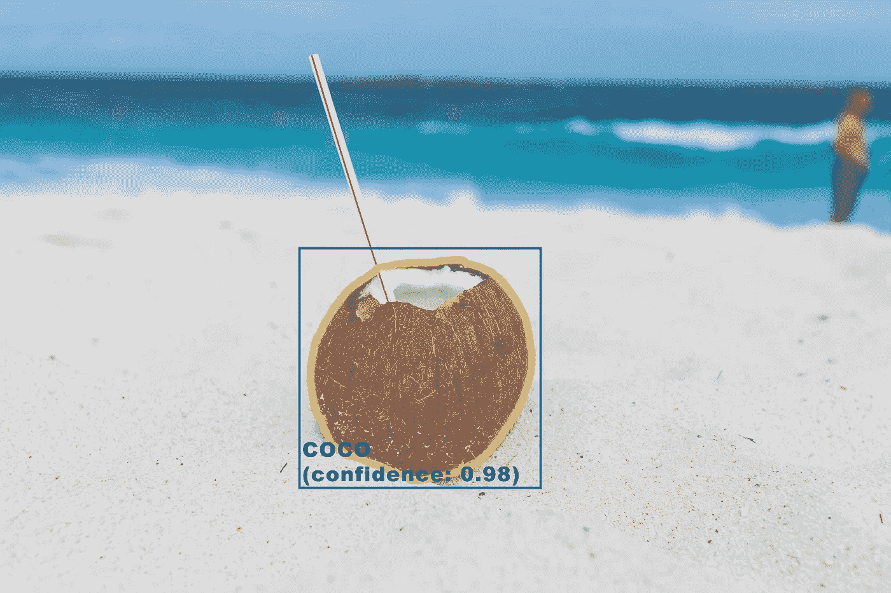

# 掌握用于语义图像分割的 COCO 数据集—第 2 部分，共 2 部分

> 原文：<https://towardsdatascience.com/master-the-coco-dataset-for-semantic-image-segmentation-part-2-of-2-c0d1f593096a?source=collection_archive---------8----------------------->

## 在这两部分演练的最后一部分，我们将使用 COCO(上下文中的公共对象)图像数据集创建一个带有图像增强的数据生成器，用于 Python 中的语义图像分割，库包括 PyCoco 和 Tensorflow Keras。



你去椰子了吗？！(原图由 [Craig Adderley](https://www.pexels.com/@thatguycraig000?utm_content=attributionCopyText&utm_medium=referral&utm_source=pexels) 发自 [Pexels](https://www.pexels.com/photo/brown-coconut-on-sand-1917838/?utm_content=attributionCopyText&utm_medium=referral&utm_source=pexels)

[](/master-the-coco-dataset-for-semantic-image-segmentation-part-1-of-2-732712631047) [## 掌握用于语义图像分割的 COCO 数据集

### 使用 PyCoco、Tensorflow Keras Python…探索和操作 COCO 图像数据集进行语义图像分割

towardsdatascience.com](/master-the-coco-dataset-for-semantic-image-segmentation-part-1-of-2-732712631047) 

*对于新读者，你可以在这里* *找到本系列* [*的第 1 部分。我强烈建议通读一下，以便更好地理解下面的文章。*](https://medium.com/@virafpatrawala/master-the-coco-dataset-for-semantic-image-segmentation-part-1-of-2-732712631047)

[COCO(上下文中的常见对象)](http://cocodataset.org/#home)，是最受欢迎的图像数据集之一，具有对象检测、分割和字幕等应用程序——令人惊讶的是，几乎没有全面而简单的端到端教程。当我第一次开始使用这个数据集时，我感到非常失落和害怕。我不得不费力地通过网上这么多分散的、不充分的资源、多个模糊的教程和一些实验，最终在这条隧道的尽头看到光明。当我完成后，我知道我必须记录下这段旅程，从开始到结束。于是我照做了。希望有一天，有人会发现这些有价值的东西，而不必经历我所面临的所有麻烦。

这是一个由两部分组成的系列教程，旨在帮助您探索、使用和掌握用于图像分割的 COCO 图像数据集。我会尽量保持简单，为每一步提供解释，并且只使用免费的、简单的库。*我在这里的工作是让你熟悉和熟悉这个话题，达到一个你可以占据中心位置并根据你的需要操纵它的水平。*

在[第 1 部分](https://medium.com/@virafpatrawala/master-the-coco-dataset-for-semantic-image-segmentation-part-1-of-2-732712631047)中，我们用一个叫做 [pycoco](https://pypi.org/project/pycoco/#description) 的 python 库探索了用于图像分割的 COCO 数据集。

在第 2 部分中，我们将使用 T [ensorflow Keras](https://www.tensorflow.org/guide/keras) 库来简化这个数据集上的训练模型，并添加图像增强。我们走吧！

你可以在我的 [GitHub 库](https://github.com/virafpatrawala/COCO-Semantic-Segmentation)中找到本教程的完整代码。然而，请继续阅读这篇文章以获得更详细的解释。

# 1.创建数据生成器

> 现在，我们将结合[第 1 部分](https://medium.com/@virafpatrawala/master-the-coco-dataset-for-semantic-image-segmentation-part-1-of-2-732712631047)中讨论的所有概念来创建一个数据生成器，您可以使用它来训练任何细分模型。下面的函数是独立函数，不需要第 1 部分中的任何变量。项目的文件夹结构如第 1 部分所示。为了更清楚地理解这些函数运行背后的概念，我推荐快速阅读[第 1 部分](https://medium.com/@virafpatrawala/master-the-coco-dataset-for-semantic-image-segmentation-part-1-of-2-732712631047)。

下面提到的导入与第 1 部分中的相同。

## (a)图像过滤

该函数接受 3 个输入—
(a) **文件夹**:包含 COCO 数据集
(b) **类**:无或包含所需输出类
(c) **模式**的列表对象:“train”或“val”

该函数首先加载并初始化 pycoco 对象[第 3–4 行]。然后，获取所有可能的“类别”组合[第 6-13 行]。如果没有给定过滤器类，它将加载整个数据集[第 15–18 行]。由于一些图像可能包含两个或更多的输出类，在我们的*图像*变量中可能会有重复的图像。因此[第 19–23 行]我们遍历它并过滤掉唯一的图像。最后，我们打乱唯一的图像列表，并将其与其他一些有用的数据一起返回。

现在我们的函数已经定义好了，让我们调用并初始化它。

***【注意*** *:对于本教程，我将使用****mode = ' val '****，但是当使用它来训练模型时，为' val '和' train '分别调用这些函数来创建两个生成器对象。*

*我已经提到了 3 种期望的输出类别(笔记本电脑、电视、手机)。该函数过滤 COCO 数据集以返回仅包含一个或多个这些输出类的图像。*

*该函数返回—
(a)**:包含所有过滤后的图像对象的列表(唯一)
(b) **dataset_size** :生成的过滤数据集的大小
(c) **coco** :初始化的 coco 对象***

***您可以打印出这些输出，以便更好地理解它们。***

## ***(b)生成图像和遮罩***

***我们已经准备好了过滤后的数据集，让我们创建一个生成器对象来批量生成图像和蒙版。***

******【注:*** *为了便于查看，这里我没有包括子功能的代码。完整代码可以查看我的* [*GitHub 库*](https://github.com/virafpatrawala/COCO-Semantic-Segmentation) *。****

****函数 *dataGeneratorCoco* 接受 8 个输入—
(a) **图像**:由 *filterDataset* 函数
(b) **类**返回的图像列表:过滤器类列表与 *filterDataset* 函数
(c) **Coco** 的输入相同:由 *filterDataset* 函数
返回的 coco 对象 **input_image_size** :你的模型的输入图像的大小，如(宽度，高度)
(f) **batch_size** :批处理大小
(g)**mode**:‘train’或‘val’与 *filterDataset* 函数
(h)**mask _ type**:‘binary’或‘normal’(类不能是 None)****

****该功能执行批量循环[第 20~行]并从文件夹中检索图像，加载带有过滤输出(二进制或正常分段屏蔽)的屏蔽，最后将它们集中起来形成图像批次和屏蔽批次。yield 语句[第 41 行]负责创建一个生成器类型的对象。****

****现在我们的函数已经定义好了，让我们调用并初始化它。****

****该函数创建一个数据生成器对象，生成批量图像和二进制掩码。既然我们的生成器终于准备好了，让我们定义一个函数来可视化它。****

```
****visualizeGenerator(val_gen)****
```

********

****mask_type='binary '的生成器生成的图像的可视化。****

********

****mask_type='normal '的生成器生成的图像的可视化。****

# ****2.添加扩充****

****如果您遵循前面的步骤，COCO 数据生成器已经准备好了！您可以使用它来按原样训练您的模型，但是如果您希望向影像中添加数据增强以增加潜在的数据集大小，请遵循最后一步！****

****这里我们将使用 Tensorflow Keras 的图像生成器添加图像增强。****

*****增强生成器*函数接受 3 个输入-
(a) **gen** :您希望添加增强的生成器对象
(b)**augmentorargs**:增强参数(参见前面的代码示例)
(c) **seed** :用于生成随机增强参数或不生成增强参数的种子****

****要定义增强的参数，请遵循以下格式。您可以为您的用例试验这些值。关于参数的更多细节，你可以查看关于这个主题的 [keras 文档](https://keras.io/preprocessing/image/#imagedatagenerator-class)。****

****该函数的输出是一个数据生成器对象，产生批量的增强图像和相应的增强二进制掩码。可视化增强的数据生成器，注意你现在可以看到旋转，亮度变化，反射等。****

```
****visualizeGenerator(aug_gen)****
```

********

****mask_type='binary '的增强生成器生成的图像的可视化。****

********

****mask_type='normal '的增强生成器生成的图像的可视化。****

# ****3.最后…训练一个模型****

****现在发电机准备好了，我们能用它做什么呢？以下代码是如何在培训中使用这些 COCO 数据集生成器的快速模板。****

****TIP:*你可以单独创建一个。py 文件(比如 cocoFunctions.py ),并复制 imports、filterDataset 函数和 dataGeneratorCoco +支持函数的代码。这将有助于使代码更加系统化。*****

*****然后，您可以使用:
from coco functions import filter dataset，dataGeneratorCoco* 将函数导入到任何代码中****

```
****-> Create filtered train dataset (using filterDataset()) 
-> Create filtered val dataset (using filterDataset())-> Create train generator (using dataGeneratorCoco()) 
-> Create train generator (using dataGeneratorCoco())# Set your parameters
n_epochs = <number of epochs of training>steps_per_epoch = dataset_size_train // batch_size
validation_steps = dataset_size_val // batch_sizem = <your model>
opt = <your optimizer>
lossFn = <your loss function># Compile your model first
m.compile(loss = lossFn, optimizer = opt, metrics=['accuracy'])# Start the training process
history = m.fit(x = train_gen_aug,
                validation_data = val_gen_aug,
                steps_per_epoch = steps_per_epoch,
                validation_steps = validation_steps,
                epochs = n_epochs,
                verbose = True)****
```

****这是解决问题的一种方法。你打算用这个新发现的技能做什么？****

****同样，本教程的完整代码可以在我的 [GitHub 库](https://github.com/virafpatrawala/COCO-Semantic-Segmentation)中找到。****

****好了，我们完成了！我希望您现在已经对 COCO 数据集有了一定的掌握和信心。但是不要止步于此——走出去，尝试一下，用你的新想法震撼图像分割的世界！****

****我的下一篇文章将教你如何轻松地倍增你的图像数据集。一定要读一读！****

****[](/create-a-synthetic-image-dataset-the-what-the-why-and-the-how-f820e6b6f718) [## 创建一个合成图像数据集——“什么”、“为什么”和“如何”

### 缺少图像来训练你的模型？以下是如何使用合成图像将数据集的大小增加数倍…

towardsdatascience.com](/create-a-synthetic-image-dataset-the-what-the-why-and-the-how-f820e6b6f718) 

或者想在股票中利用 ML 一夜暴富？这篇文章(不)适合你！

[](/how-not-to-predict-stock-prices-with-lstms-a51f564ccbca) [## 如何(不)用 LSTMs 预测股票价格

### 股票和机器学习——天作之合。但是事情真的像看起来那么简单吗？

towardsdatascience.com](/how-not-to-predict-stock-prices-with-lstms-a51f564ccbca) 

ML 模型真的能读懂股价图吗？

[](/can-an-ml-model-read-stock-charts-and-predict-prices-fb73c551c7a4) [## 机器学习模型可以阅读股票图表并预测价格吗？

### 股票和机器学习——天作之合。如果你的 ML 模型可以从字面上阅读价格图表…

towardsdatascience.com](/can-an-ml-model-read-stock-charts-and-predict-prices-fb73c551c7a4)****