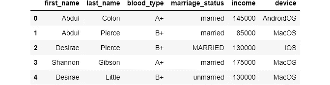
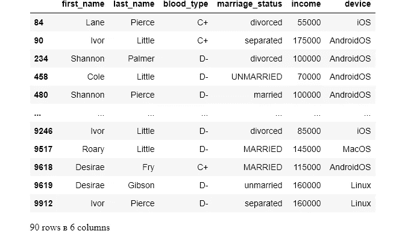
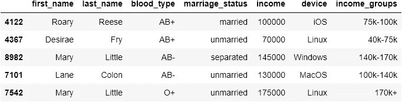
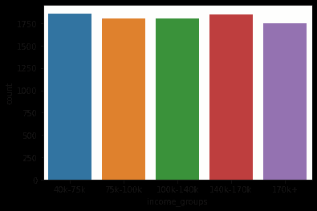

# 掌握 DS/ML 中最讨厌的任务

> 原文：<https://towardsdatascience.com/master-the-most-hated-task-in-ds-ml-3b9779276d7c?source=collection_archive---------16----------------------->

## 用熊猫清理数据

## 用熊猫清理分类数据

**照片由** [**Pixabay**](https://www.pexels.com/@pixabay?utm_content=attributionCopyText&utm_medium=referral&utm_source=pexels) **上** [**像素**](https://www.pexels.com/photo/brown-wooden-floor-48889/?utm_content=attributionCopyText&utm_medium=referral&utm_source=pexels)

## 介绍

直接来自[福布斯](https://www.forbes.com/sites/gilpress/2016/03/23/data-preparation-most-time-consuming-least-enjoyable-data-science-task-survey-says/#718bbc696f63):

> “数据科学家花 60%的时间清理和组织数据。收集数据集排在第二位，占他们时间的 19%，这意味着数据科学家花费大约 80%的时间来准备和管理用于分析的数据。57%的数据科学家认为清理和组织数据是他们工作中最不愉快的部分，19%的人认为收集数据集是如此。

数据清理充满了挫折，令人厌恶的惊喜需要几个小时来处理，总是有新数据集的新问题，你能想到的都有。这个过程从来都不是令人愉快的，并且总是被认为是数据科学肮脏的一面。

尽管它经常被讨厌，但它可能是任何数据项目之前最重要的一步。如果没有正确解决数据问题，您可能会危及数据科学工作流程中的所有其他阶段。

在我的数据清理系列的第二部分中没有太多介绍，让我们直奔主题。这篇文章是关于分类数据清理的。我将讨论处理一些中级分类数据问题的常见和不常见的方法。以下是总体概述:

## 可点击的目录(仅限网络)

∘ [简介](#5213)
∘ [设置](#5141)
∘ [分类数据，了解并举例](#7c0a)
∘ [处理分类数据问题](#c351)
∘ [成员约束](#ba2f)
∘ [值不一致](#5777)
∘ [将数据折叠成类别](#64a4)
∘ [减少类别数量](#4293)

> 你可以在[这个](https://github.com/BexTuychiev/medium_stories/tree/master/cleaning_categorical_data) GitHub repo 上获得本帖使用的笔记本和数据。

## 设置

## 分类数据——理解和示例

分类数据的正式定义是:

> 一组预定义的可能的类别或组。

您可以在几乎所有处理过的数据集中看到分类数据的例子。几乎任何类型的数据都可以转化为分类数据。例如:

*   调查反馈:
*   `Yes`或`No`
*   `male`或`female`
*   `employed`或`unemployed`
*   数字数据:
*   分组年收入:`0-40k`，`40-100k`，...
*   年龄:儿童，青少年，成人…

当我们使用`panads`库学习数据清理时，理解`pandas`永远不会将分类数据作为分类导入是很重要的。它通常以字符串或整数的形式导入:

您可以看到`cut`、`color`和`clarity`是作为字符串而不是类别导入的。我们可以像这样使用`read_csv`的`dtype`参数:

你可以通过这个[链接](https://www.kaggle.com/shivam2503/diamonds/download)从 Kaggle 下载这个版本的“钻石”数据集。

但是对于真实世界的数据集，您通常没有这种奢侈，因为您将要处理的数据可能会有许多分类变量，并且通常您一开始会对这些数据完全不熟悉。

在确定分类变量之后，在将列转换为分类变量之前，需要进行一些检查和清理。

## 处理分类数据问题

当您处理真实世界的数据时，它将充满清理问题。

正如我在本系列的第一部分中所写的，收集数据的人不会考虑数据的干净程度，尽可能以简单的方式记录必要的信息。

此外，由于收集过程中的自由文本会导致输入错误、相同值的多个表示等，因此会出现问题。也有可能是因为数据解析错误或糟糕的数据库设计而引入错误。

例如，考虑这种最坏的情况:您正在处理一个在美国进行的调查数据，数据集中的每个观察状态都有一个`state`列。美国有 50 个州，想象一下人们能想出的各种州名。如果数据收集者决定使用缩写，你的问题就更大了:

*   加利福尼亚，加利福尼亚，加利福尼亚，加利福尼亚，加利福尼亚，加利福尼亚，加利福尼亚，加利福尼亚，加利福尼亚…

这样的栏目总是充满了错别字、错误和不一致。永远不要想象你会有一个平滑的一对一的类别映射。

在继续分析之前，您必须建立所谓的成员约束，它清楚地定义了类别的数量以及它们如何以单一格式表示。

## 成员限制

有三种方法可以处理分类数据问题:

*   落下
*   重新映射类别
*   推断类别

首先，我们将集中于隔离不一致的观察值并丢弃它们。我创建了假数据来说明代码是如何实现的:

您可以看到我写的简短脚本，它从我在文章开头分享的 GitHub repo 中生成这个数据集

通常情况下，您会有一些关于您的数据的背景信息。例如，假设您想要检查上述数据框的`blood_type`列中的不一致。你事先发现`blood_type`只能有这几类:**【A+，A-，B+，B-，O+，O-，AB+，A B-】**。因此，您必须确保数据源中的列只包含这些值。

在我们的例子中，有 10k 行，视觉搜索不一致是不可行的，这也是许多其他真实数据的情况。以下是如何实现此类问题的最佳解决方案:

首先，您应该创建一个新的数据框来保存分类列的所有可能值:

> ***PRO 提示:*** 创建这样的数据框是一个很好的实践，它保存主数据中每个分类列的类别映射。

由于我们现在在一个单独的数据框中有了正确的类别，我们可以使用一个基本的集合操作，它给出了两列中唯一值的差异:

为了得到两个集合之间的差异，我们使用`.difference`函数。它基本上返回左集中不在右集中的所有值。这里有一个非常简单的例子:

细心的读者可能已经注意到，在`set`函数内部，我还在`blood_type`上调用了`.unique()`。从我从一个 StackOverflow 线程中读到的内容来看，如果对较大的数据集同时使用`set`和`unique`，获取唯一值所需的时间似乎会短得多。

现在，我们将筛选血型“C+”和“D-”的主要数据:

在`blood_type`上使用`isin`将返回一个布尔序列，我们可以用它来索引数据帧:

90 行 x 6 列。不知何故 x 变成了俄语в🤷‍♂️

所以，有 90 个人血型不正确。因为我们不知道这些错误是如何发生的(我做到了😁😁😁)，我们不得不放弃他们。有两种方法可以做到:

因为我们的列现在是干净的，所以可以安全地将其设置为分类变量:

> 一定要看看这个系列的第一部。在那里，我讨论了基本和常见的数据问题。您还将熟悉我将在这里使用的一些功能。

 [## 掌握 DS/ML 中最耗时的任务，#1

### 处理常见的数据问题

towardsdatascience.com](/data-type-constraints-data-range-constraints-duplicate-data-with-pandas-44897a350b1e) 

## 价值不一致

就像我们在第二节中谈到的，在数据集中可能有许多相同类别的表示。这些错误可能仅仅是因为简单的错别字、随意的大写字母，等等。继续清理我们的数据，轮到了`marriage_status`列:

对数据框列使用`value_counts`会返回该列中唯一值的计数。如果您查看结果，您可以立即看到问题。这些值应该是小写或大写。我更喜欢小写:

对数据框列使用`.str`使我们能够对列的每个值使用所有 Python 字符串函数。这里，我们使用`.lower()`将字符串转换成小写。

`value_counts`仍在返回 6 个唯一值，为什么？仔细观察后，您会发现其中一个类别有额外的前导空格。这就是为什么它被视为一个单独的类别。对于其中一个`unmarried`也是如此，它可能有尾随空格。我们可以使用 string `strip`函数来去除字符串中的尾随空格:

现在柱子干净了。剩下要做的就是将该列转换成 category 数据类型:

## 将数据分类

有时，您可能想要获取已经存在的数据，通常是数字数据，并从中生成类别。这在许多情况下是有用的。

在我们的`demographics`数据集中，我们有一个年收入列。将这一栏分成不同的收入组可能是有用的，因为这样做可能会对数据提供一些额外的见解。

`pandas`对此有一个完美的函数:`cut`。它使我们能够将数字范围(如数据框列)切割成箱，并给它们定制标签。让我们来看看它的实际应用:

现在，我们可以使用像`value_counts`这样的函数来获得更多的洞察力:

您也可以绘制计数图:

这是随机生成的数据，这就是为什么酒吧的高度几乎相同。

## 减少类别的数量

有时，可能会有不必要的类别。在这种情况下，您可以将较小的类别折叠成更大的类别，这样可能更适合您的需要。考虑我们数据的`device`栏:

把手机的操作系统和电脑的相比没有多大用处。更好的做法是将类别减少为`mobileOS`和`desktopOS`。为此，首先，我们需要创建一个字典，将每个类别映射到新的类别:

然后，我们使用`pandas`的`replace`函数，它动态地映射出新的类别:

# 如果你喜欢这篇文章，请分享并留下反馈。作为一名作家，你的支持对我来说意味着一切！

阅读更多与主题相关的文章:

 [## 认识熊猫最难的功能，第一部分

### 掌握 pivot_table()、stack()、unstack()的时机和方式

towardsdatascience.com](/meet-the-hardest-functions-of-pandas-part-i-7d1f74597e92)  [## 认识熊猫最难的功能，第二部分

### 掌握交叉表的时间和方式()

towardsdatascience.com](/meet-the-hardest-functions-of-pandas-part-ii-f8029a2b0c9b)  [## 认识熊猫最难的功能，第三部分

### 形状像果冻的桌子有熊猫旋转()和融化()

towardsdatascience.com](/shape-tables-like-jelly-with-pandas-melt-and-pivot-f2e13e666d6)  [## 我习惯如何将数据与熊猫绑定

### 您可能只使用了默认值

towardsdatascience.com](/how-i-customarily-bin-data-with-pandas-9303c9e4d946)  [## 掌握 DS/ML 中最耗时的任务，#1

### 处理常见的数据问题

towardsdatascience.com](/data-type-constraints-data-range-constraints-duplicate-data-with-pandas-44897a350b1e)  [## 来自 Kagglers:DS 和 ML 的最佳项目设置

### 来自顶级 Kagglers 的项目成功最佳实践的集合

towardsdatascience.com](/from-kagglers-best-project-setup-for-ds-and-ml-ffb253485f98)