# 在 Tableau 中掌握您的瀑布图

> 原文：<https://towardsdatascience.com/master-your-waterfall-chart-in-tableau-acea2121e98c?source=collection_archive---------22----------------------->

## 关于如何在 Tableau 上创建具有高级功能的精彩瀑布图的完整教程(带有商业分析中的示例)

戴夫·霍夫勒在 [Unsplash](https://unsplash.com?utm_source=medium&utm_medium=referral) 上拍摄的照片

瀑布图是商业演示中非常常用的一种图表类型(有时也称为累积图或缩减图)。在许多不同的情况下，它们被用来把一些分析变量分解成不同的成分。

以下是一些例子:

将净收入分成几个部分；

了解从 6 月到 12 月每个月的销售额。

然而，瀑布图并不是一件容易的事情，甚至 Office Suite 直到 2016 版都没有瀑布图(你必须使用一些变通方法或使用第三方插件，如[智库](https://www.think-cell.com/en/))。

甚至 Tableau 也没有对瀑布图的本地支持，您必须使用一些变通方法。

## 基本瀑布

对于第一个例子，我将使用我的 [Github](https://github.com/lmonno/tds_tutorial) 帐户上的文件[netbankiningincome . CSV](https://github.com/lmonno/tds_tutorial/blob/master/NetBankingIncome.csv)。

要构建一个基本的瀑布图，您需要遵循以下步骤:

1.  在视图中添加一个维度(列)和一个度量(行)。维度应包含您希望将测量拆分成的组件

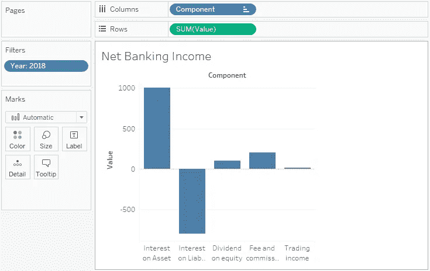

作者图片

2.单击测量，然后选择快速表格计算和累计

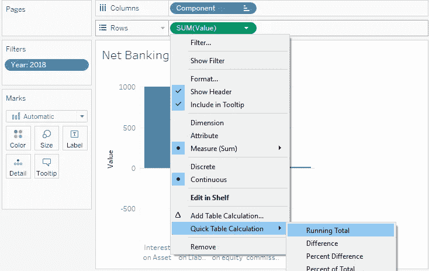

作者图片

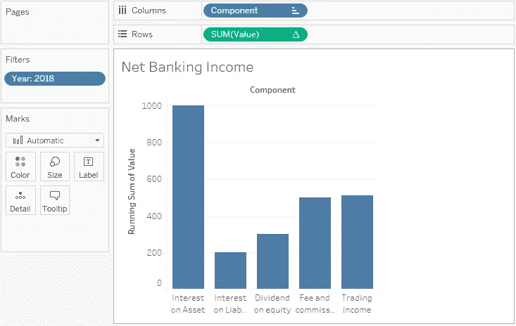

作者图片

3.诀窍来了。选择甘特条形图作为标记(您在 Tableau 中使用过甘特吗？真的吗？)和“甘特图大小”使用一个新的计算字段:相同的测量，但符号相反

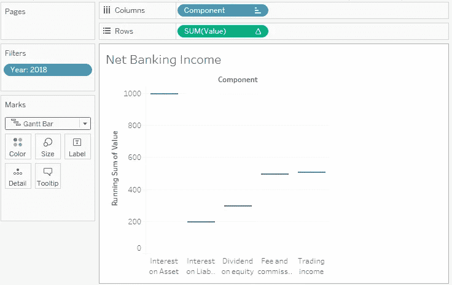

作者图片

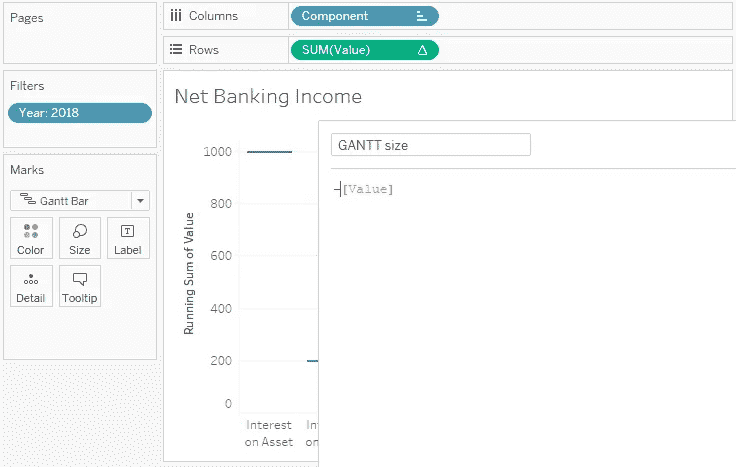

作者图片

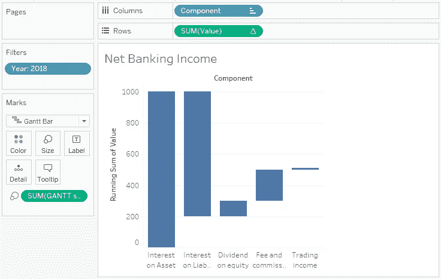

作者图片

4.将总计加到右边

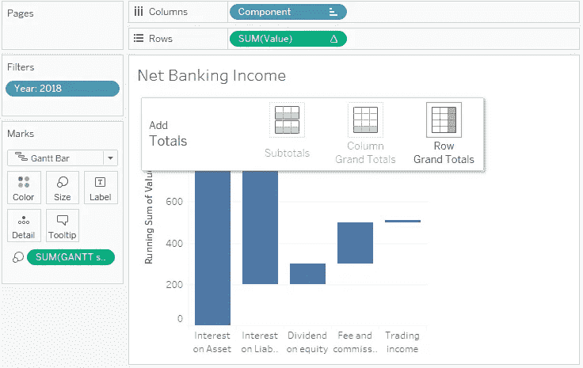

作者图片

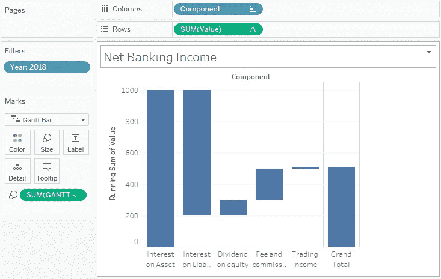

作者图片

## 分组组件

有时您需要将组件分组并显示小计。

按照本教程第一部分中的示例，我们有商业银行净银行收入的 5 个最重要的组成部分:

*   资产利息；
*   负债利息；
*   股权分红；
*   费用和准备金；
*   交易收入。

在银行部门损益表的常见重新分类中，前两者被归为一类，总影响被称为“净利息收入”，而其他三者通常被归为“非利息收入”。

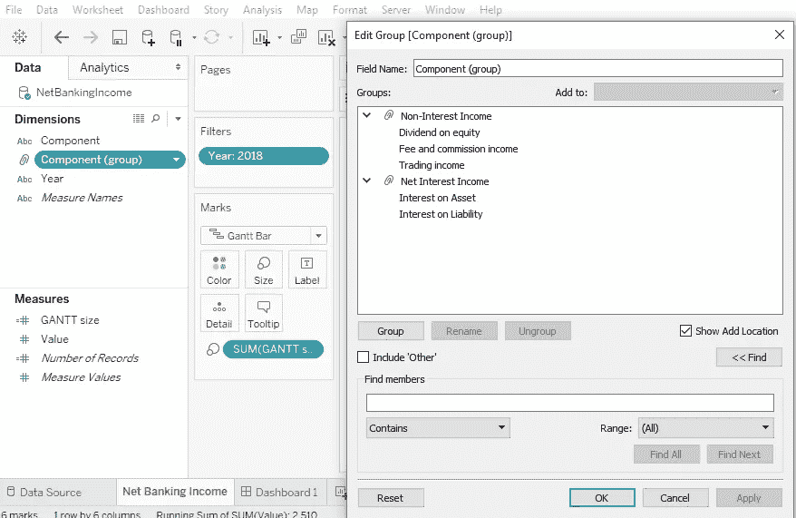

作者图片

在列中添加新的分组维度(在组件之前)。你甚至创造了一个等级制度。

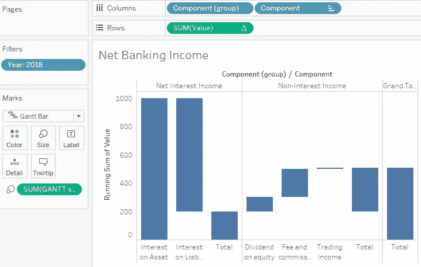

作者图片

您希望添加到图表中的另一个有用的东西是区分积极和消极影响的条件格式。这很简单。只需添加一个带有度量符号的计算字段，并将其添加到“颜色”中。

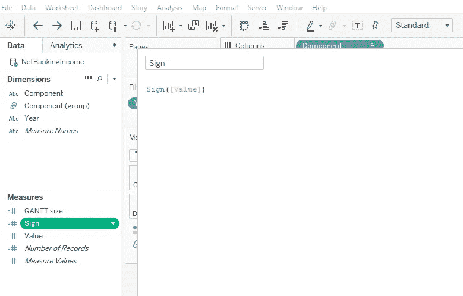

作者图片

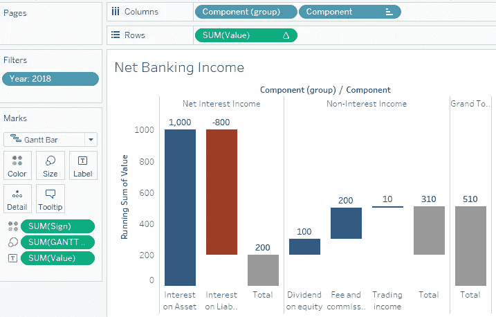

作者图片

## 按颜色拆分条形图

有时，您希望将组件拆分成两个维度:也许您希望用两种或更多种颜色划分每个条形，而不在 x 轴上创建另一个组件。

对于这张图表，我想使用另一个[数据集](https://github.com/lmonno/tds_tutorial/blob/master/CBC.csv)，它是关于银行业的另一个重要话题:*流动性*。

银行在经济体系中的角色是在谁拥有过剩的流动性并希望从中获得资金(投资者)和谁的业务需要流动性(借款者)之间充当中间人。银行本身需要流动性，需要优化流动性的规模(相对于更有利可图的投资，持有流动性可能是一种成本)。

流动性的一个典型来源是客户支票账户或发行债券。但银行也可以收回短期流动性贷款，即它们拥有的一些资产(通常是债券或贷款，但也包括股权)。这可以通过**市场对手方**(通过回购协议的其他银行)或**央行来完成。**

在这种情况下，跟踪您的资产(已经抵押或可用)的状态是有用的，以避免将同一资产出借两次，以及您的流动性的潜在来源(市场或中央银行)。因此，有两个维度和一个衡量标准(资产的流动性价值)。

让我们看看如何在这个数据库中实现它。你看，这种类型可以假定两个值:总资产或担保资产。因为可用资产可以计算为总资产和抵押资产之间的差额，所以让我们试着得到一个“逐步减少”的图表。

作者图片

第一步与前面的步骤相同(请记住，要将总资产排在担保资产之前)。

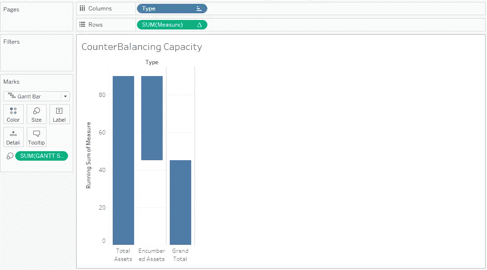

作者图片

然后尽量把出处用彩色。你会发现你得到的结果并不是你所期望的:总资产从 90 变成了 60。此外，可用资产比我们预期的要少。

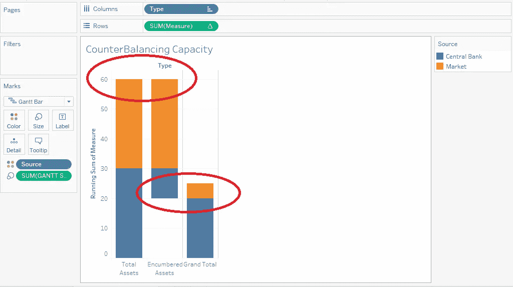

作者图片

这取决于这样一个事实，即运行总和是按类型分组获得的，现在您还使用了另一个级别的详细信息(源),您会看到市场和中央银行在同一个条形图中重叠。所以我们需要“编辑表格计算”，选择使用“特定维度”进行计算并添加来源。

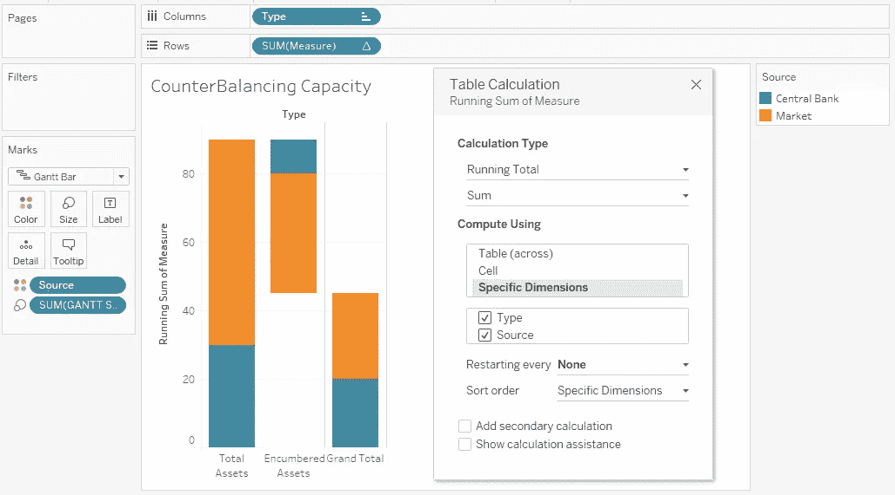

作者图片

另一个有用的细节是标签。在标签上加上尺寸，你会得到这样的东西。

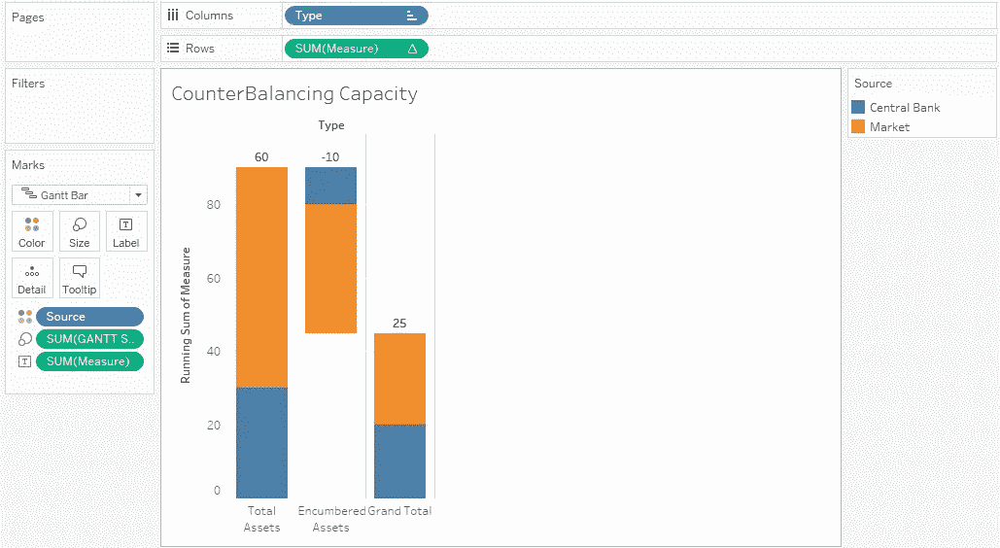

作者图片

它只显示顶部标签:默认情况下不显示重叠标签。您需要选择“始终显示”并垂直居中。

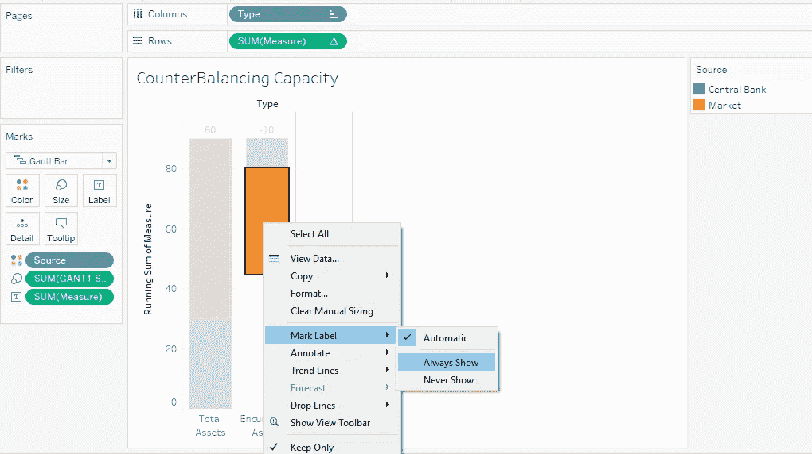

作者图片

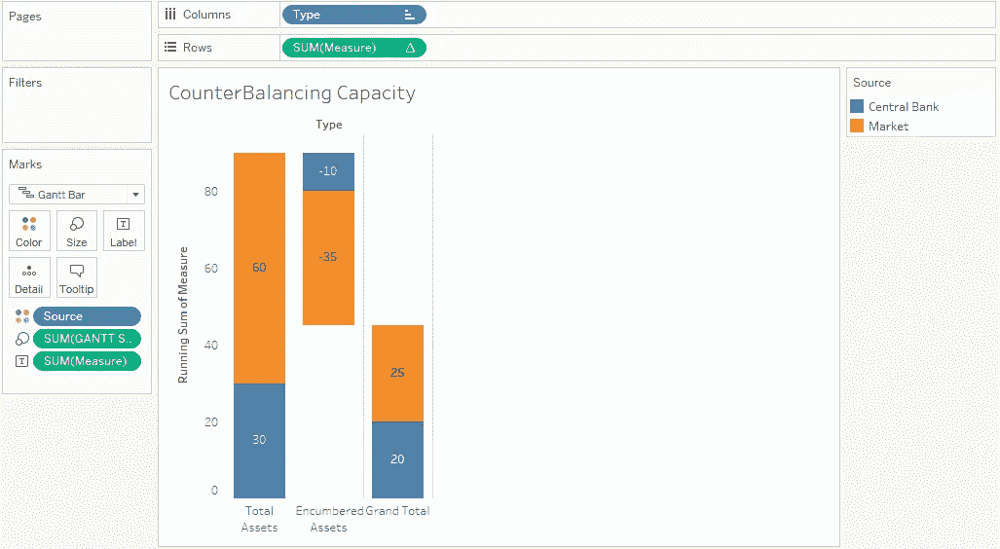

作者图片

# 总结

瀑布图是一种很好的方式来表示商业分析中常用的度量的组成部分。

使用 Tableau“GANTT ”,您只需点击几下就可以轻松获得一个完美的瀑布，利用您在本教程中学到的知识，您可以超越商业分析中最常用工具的通常功能。