# 掌握连接:Pandas merge()、concat()、append()

> 原文：<https://towardsdatascience.com/masteriadsf-246b4c16daaf?source=collection_archive---------16----------------------->

## 通过熊猫连接数据

## 从半连接/反连接到验证数据合并


图片来自 [Pixabay](https://pixabay.com/?utm_source=link-attribution&utm_medium=referral&utm_campaign=image&utm_content=4502863) 的[丹尼尔·克什](https://pixabay.com/users/danielkirsch-4218687/?utm_source=link-attribution&utm_medium=referral&utm_campaign=image&utm_content=4502863)

对于每个数据科学项目或数据集，您需要执行多项分析，并创建绘图以获得真知灼见。通常，原始数据不会出现在一个巨大的表中，而是出现在许多单独的表中。要回答您的问题，您应该掌握将多个表连接成一个表，然后对它们执行操作的技能。

您可以通过学习不同种类的合并操作来获得这些技能，例如内部连接、左右连接、自连接和反连接、索引合并等。

> 本文中使用的样本数据和笔记本可以在 [this](https://github.com/BexTuychiev/medium_stories/tree/master/merge_data_article) GitHub repo 中找到。

[](https://ibexorigin.medium.com/membership) [## 通过我的推荐链接加入 Medium-BEXGBoost

### 获得独家访问我的所有⚡premium⚡内容和所有媒体没有限制。支持我的工作，给我买一个…

ibexorigin.medium.com](https://ibexorigin.medium.com/membership) 

获得由强大的 AI-Alpha 信号选择和总结的最佳和最新的 ML 和 AI 论文:

[](https://alphasignal.ai/?referrer=Bex) [## 阿尔法信号|机器学习的极品。艾总结的。

### 留在循环中，不用花无数时间浏览下一个突破；我们的算法识别…

alphasignal.ai](https://alphasignal.ai/?referrer=Bex) 

## 设置

## 熊猫合并()

Pandas 提供了几种在数据帧上执行合并的方法。在所有其他方法中，`merge()`方法是最灵活的。它是一个 dataframe 方法，一般语法如下:

```
df1.merge(df2, on='common_column')
```

当组合表格时，有两个术语您应该熟悉:您首先使用的表格的名称称为**左表、**，而另一个称为**右表**。在上面的代码片段中，左边的表是`df1`，右边的表是`df2`。此外，动词 join、combine 和 merge 都可以互换使用。

现在让我们看看如何执行内部连接:

内部联接将只返回两个表中具有匹配值的行。在连接过程中，您必须知道两个表中的公共列名。

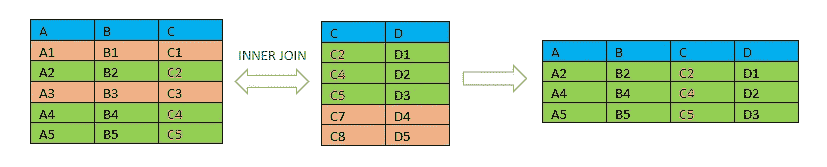

图片作者[作者](https://medium.com/@ibexorigin)

## 基础探索


假设我们有两张表:

```
>>> user_usage.head()
```

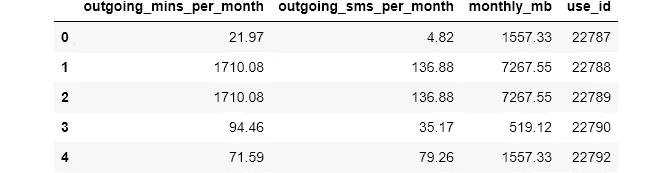

```
>>> user_devices.head()
```

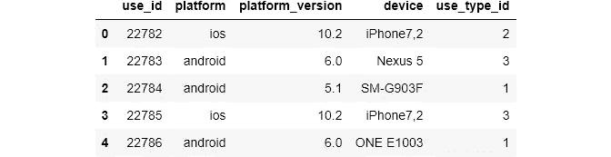

我从 [KillBiller](http://www.killbiller.com/) 应用程序下载了这些数据。KillBiller 是一项免费服务，可以比较英国和爱尔兰的所有移动资费。第一个`user_usage`表包含用户移动使用的月度统计数据。`user_devices`表提供了每个用户手机的详细信息，如操作系统和手机型号。

## 问题 1:

有多少用户使用 Android OS，又有多少用户使用 iOS？

要回答这个问题，我们需要两个表中的信息。两个表之间有一个链接属性:`use_id`。我们将在合并中使用此列:

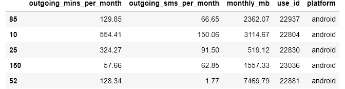

```
Number of users for each OS: android    157
                             ios          2
Name: platform, dtype: int64
```

在我们的数据集中，这两个操作系统之间存在巨大的差异。

在上面的合并中，我们使用了一个内部连接的例子。在`merge()`函数中，`how`参数默认设置为`inner`，所以我们没有必要把它写出来。当使用`merge()`函数合并两个表时，我们使用`on`参数来指定公共列。如果有多个，也可以将一列列表传递给参数，剩下的由`pandas`处理。

注意，作为右表，我对`user_devices`表进行了子集化，以排除与问题无关的列。

现在，随着我们进一步探索，我们会注意到两个数据集中给定用户的数量是不同的:

两个表中匹配的用户 id 的数量都是 159。这意味着有用户 id 在`user_devices`表中而不在`user_usage`表中，反之亦然。所以，我们想问的下一个问题是:

## 问题 2

有多少用户使用 Android OS 和 iOS，包括所有不在`user_usage`表中的用户？

我们可以用左连接**或右连接**来回答这个问题。首先，让我们看看单侧连接的一般情况:

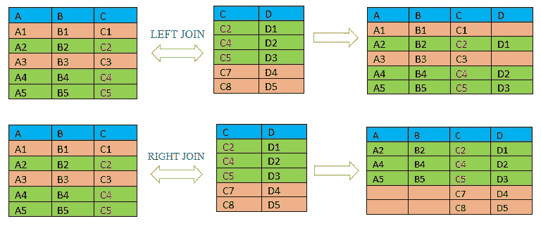

图片作者[作者](https://medium.com/@ibexorigin)

一个**左连接**将返回所有的左表行，包括右表中的匹配行。一个**右连接**将返回所有的右表行，包括来自左表的匹配行。注意，在这两种类型的连接中，`pandas`将把一个`NaN`值放入没有匹配的单元格中。

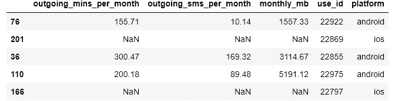

```
Number of users for each OS: android    184
                             ios         88
Name: platform, dtype: int64
```

使用左连接可以获得相同的结果。我们可以交换这些表，并将关键字`left`传递给参数`how`:

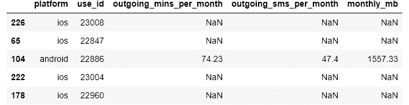

```
Number of users for each OS: android    184
                             ios         88
Name: platform, dtype: int64
```

我们使用外部连接返回交集和两个表中的所有其他行:

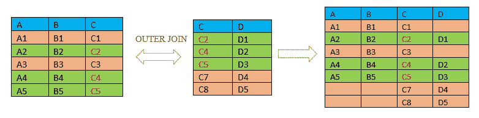

图片作者[作者](https://medium.com/@ibexorigin)

## 熊猫合并()，后缀

假设我们在两个表中都有相同名称的列。因为在我们的例子中，我们没有同名的列，所以我将把一列复制到另一列中:

现在我们在两个表中都有了`monthly_mb`列。让我们看看当我们加入他们时会发生什么:

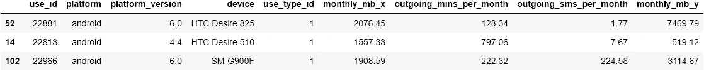

如果我们查看列名，两个同名的列通过添加`_x`和`_y`后缀进行了重命名。这里，`_x`为左表，`_y`为右表。这是我们不指定后缀时的默认行为。我们可以很容易地控制后缀:

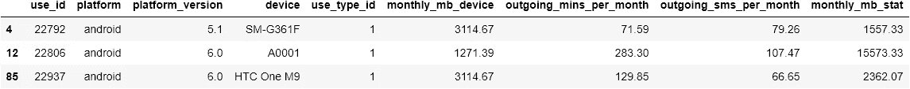

现在好多了。当它们具有相同的名称时，使用这样的后缀来指示列的来源表。注意，`suffixes`参数接受一个值的**元组**，而不是一个列表，并且顺序很重要！

## 熊猫合并()，左 _ 开，右 _ 开

还有一种情况是，您希望在一个公共列上进行联接，但是这些列有不同的名称。`pandas`为这样做提供了一个方便的参数，不需要改变列名。让我们重命名`use_id`列，这样我可以向您展示一个例子。

现在，让我们用一个`inner`连接来组合这些表:

我们使用 merge 函数的`left_on`和`right_on`参数来指定公共列的名称。您应该将左表中的列名传递给`left_on`，反之亦然。注意，当我们使用不同命名的公共列时，`pandas`会将两个列都作为副本，所以不要忘记删除其中一个:

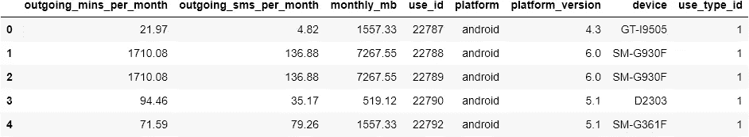

## 熊猫合并索引

也可以在一个公共索引上进行合并。任何使用索引的连接类型的语法都是相同的。`pandas`足够聪明，知道你指的是指数:

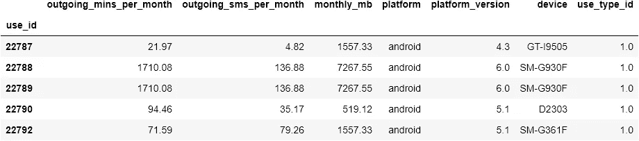

当我们有不同名称的索引时，事情会变得有点棘手。与列类似，我们将不得不使用`left_on`和`right_on`参数。此外，还有两个参数表明我们正在合并一个索引:

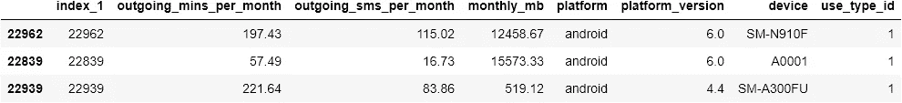

我们将`left_index`和`right_index`设置为`True`,以表示我们正在合并索引。这也给出了重复的值:一个作为索引，一个作为列。因此，在合并时不要忘记删除列！

如果您要合并的表有多级索引，那么您可以将一个索引名称列表传递给`on`或`left/right_on`参数，这样就完成了！

## 熊猫把桌子连在一起

在某些情况下，您可能希望将一个表连接到它自己。在下列情况下，将表与其自身联接会很有帮助:1。等级关系 2。顺序关系 3。图形数据

将表连接到自身的一般情况:

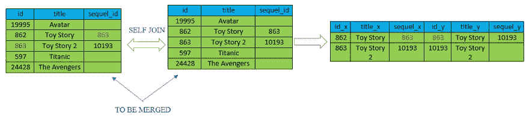

图片由[作者](https://medium.com/@ibexorigin)

如您所见，自合并有时非常有用。当使用自联接时，通常会联接同一个表的不同列。

到目前为止，我们完成的所有连接都从两个表中返回了数据。但是有时，您可能希望根据其他表上的值来筛选您的表。`pandas`不直接提供此功能。但是我们可以很快地设计步骤。

## 半加盟熊猫

当您希望根据其他表中的观察值对数据进行子集划分时，半连接非常有用。半连接:

1.返回两个表的交集，类似于内部联接。

2.只返回左**表**中的列，不返回右**表**中的列。

3.没有重复。

回到我们的小桌子上:

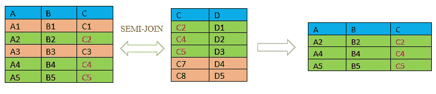

图片作者[作者](https://medium.com/@ibexorigin)

正如您所看到的，半连接非常类似于内部连接，但是它只包括左表中的结果。现在回到我们的示例数据，我们想知道两个表中所有用户的统计信息。但是我们不希望最终的表包含`user_devices`表的列。我们可以用三个步骤来解决这个问题:

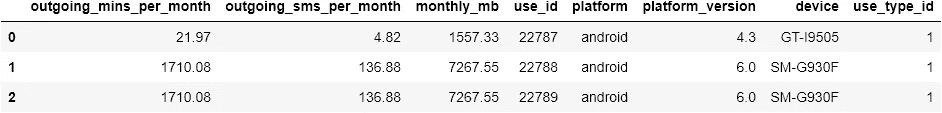

有了内部连接后，我们希望用最终表中的值对原始左表进行子集化:

变量`in_both`现在是一个`Boolean Series`，我们可以用它来子集化左边的表。


```
>>> users_in_both.shape
(159, 4)
```

结果如我们所料。如果您将这个连接与我们所做的第一个`inner`连接进行比较，它是同一个表，但是没有右边表中的列:

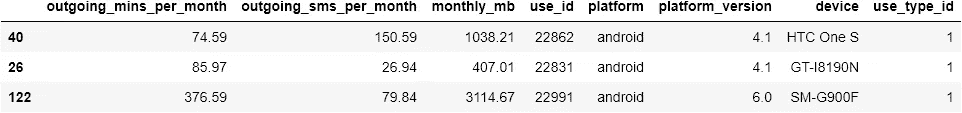

```
>>> inner.shape
(159, 8)
```

这是一个棘手的案子。请多重读和练习这一节，以便更好地理解它。

## 反对加入的熊猫

反连接与半连接完全相反。反联接:

1.返回左表，**不含**交叉点

2.仅返回左表中的列。

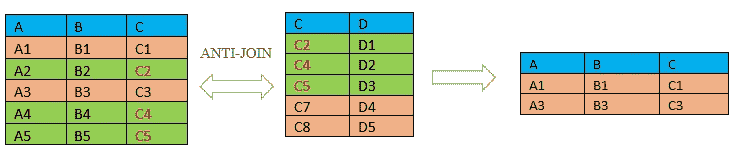

图片由[作者](https://medium.com/@ibexorigin)

作为一个例子，让我们在半连接中做与上一步完全相反的事情。让我们找出所有只在`user_usage`表中的用户。第一步:

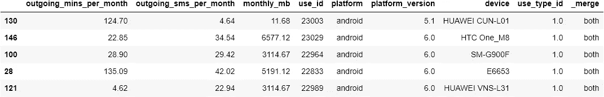

现在，我给你介绍另一个有用的参数:`indicator`。当设置为`True`时，合并的结果表将有一个额外的列`_merge`。它指示一行是两个表的结果还是一个表的结果。如您所见，在没有匹配的行中有一个`left_only`字符串。现在，我们想对这些行进行子集划分:

我使用了`.loc`子集来立即获取用户 id。现在我们可以使用这个 pandas `series`来子集化原来的左表:

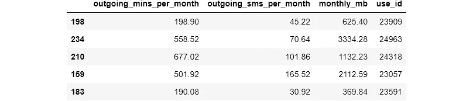

```
>>> left_only_users.shape(81, 4)
```

同样，这有点复杂，所以开始练习吧。

## 熊猫系列()

最后，我们介绍了大部分的`merge`函数。现在，`pd.concat()`用于沿特定轴连接/添加两个或多个表格。它还提供了一些操作轴的功能。该函数的一种常见用法是垂直添加表格。

## 数据帧的垂直连接

要垂直添加两个或更多表格，我们使用`concat()`方法，将`axis`参数设置为`index`。

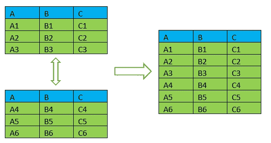

图片作者[作者](https://medium.com/@ibexorigin)

让我们分三部分加载其中一个示例表:

请注意我是如何使用`chunksize`参数的！了解这一点很有帮助，因为它在加载大型数据集时会非常有用。

当使用`concat()`函数时，我们总是传递要连接在一个列表中的表。为了指定连接轴，我们使用`axis`参数。我强烈建议您将字符串值传递给`axis`参数，如`index`和`columns`。传递 0 或 1 可能会让很多人感到困惑。因此，提高代码可读性是一个很好的实践。

`concat()`功能不关注轴标签。如果您的所有表中都有编号索引，那么当您进行连接时，它们将会混合在一起。因此，解决问题的一个有用参数是`ignore_index`:

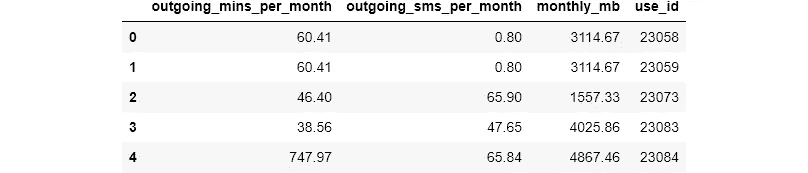

这将重置索引，它将从 0 计数到 n-1。

`concat()`的另一个用例是当你有相似的表但有不同的列名时。当连接具有不同列名的表时，使用带有合适字符串`value`的`join`参数。

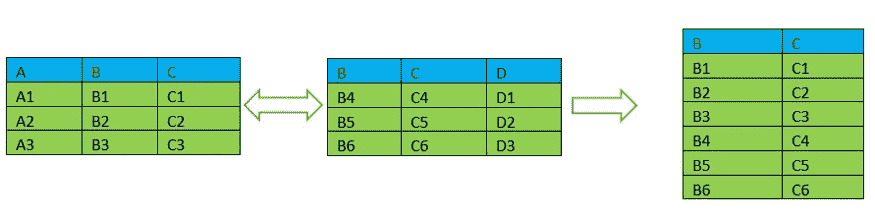

图片由[作者](https://medium.com/@ibexorigin)


使用带有`inner`值的`concat`会产生一个单列数据框架，因为它是表之间唯一的公共列。使用`left`、`right`或`outer`会得到预期的结果，但是值是垂直堆叠的。

## 熊猫追加()

`.append()`方法:

1.  `concat()`方法的简化版

2.支持:`ignore_index`

3.不支持:`join`等差异。

另一个区别是它是一个 DataFrame 方法。这意味着它是在数据帧上调用的，而不是像`pd.concat`那样显式调用。简单的例子:

## 数据映射的类型

我们在上面看到了几种类型的连接。我们明确地告诉这些方法我们希望在每个方法中使用的连接类型，并相信它会返回正确的结果。但是，有一些方法可以确保我们得到正确的结果。要用代码完成这项任务，您必须理解合并中的四种数据映射类型:

1.  一对一

2.一对多

3.多对一

4.多对多

我们来细说一下。当我们使用一对一映射时，我们希望我们的连接应该为左侧表中的每一行返回一个且只有一个匹配。如果我们用一对一映射连接一个有 200 行的表，结果也应该包含 200 行。

类似地，如果是一对多，我们允许左侧表中的一行有多个匹配。让我们看看如何用代码实现这个想法:

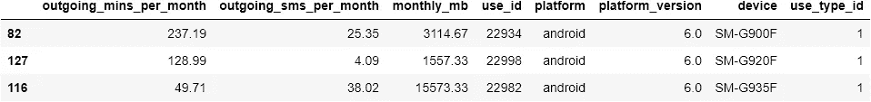

`merge()`方法为验证这类合并提供了一个有用的参数。它只接受四个值:

1.  `one_to_one`

2.`one_to_many`

3.`many_to_one`

4.`many_to_many`

此外，如果我们验证不正确的映射，`pandas`将引发`MergeError`:

[https://gist.github.com/64bb2102575ffc9edf587cebbcd59605](https://gist.github.com/64bb2102575ffc9edf587cebbcd59605)

如您所见，合并产生了一个错误。让我们将其设置为正确的映射:


## 验证串联

使用`.concat()`方法时，也可以在轴上验证。它有`verify_integrity`参数，默认设置为`False`。设置为 True 时，如果轴或列有重复名称，将引发 ValueError:

## 结论

最后，我想在这篇文章中涵盖的事情结束了。我们讨论了很多连接数据的不同方法。信不信由你，这个主题还有更多的内容，比如`merge_ordered()`和`merge_asof()`方法，但是它们可能是另一篇文章的主题。

这恰恰说明了`pandas`库的深度和广度，以及你可以用它做什么。我打算将本文作为学习组合数据的一站式平台，并希望您将在实践中使用它。