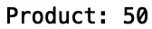
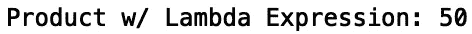
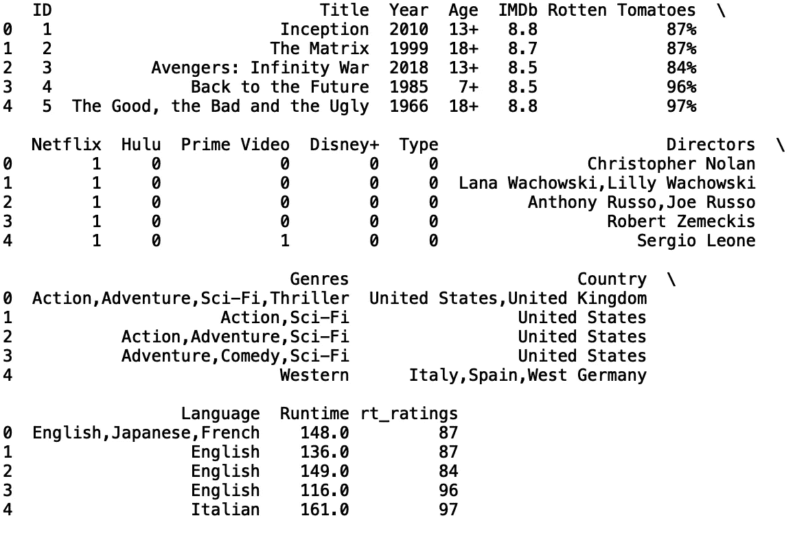
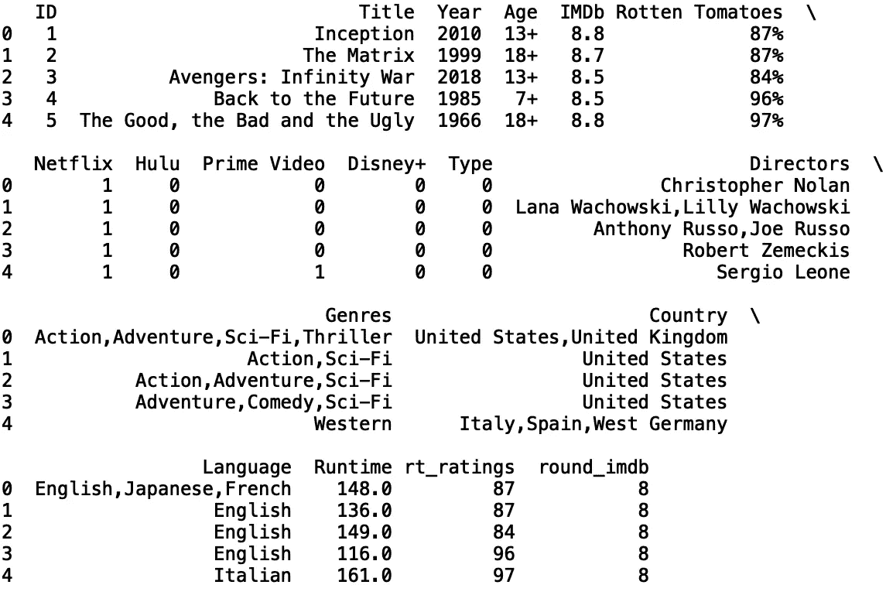

# 掌握 Python 中的匿名函数

> 原文：<https://towardsdatascience.com/mastering-anonymous-functions-in-python-75bcd4332dfa?source=collection_archive---------34----------------------->

## 理解 Python Lambda 表达式


照片由[像素](https://www.pexels.com/photo/apple-coffee-computer-cup-459653/)上的 [Pixabay](https://www.pexels.com/@pixabay) 拍摄

函数定义是软件编程的重要组成部分。在 python 中，lambda 表达式可以用来匿名定义简单的函数。例如，计算乘法的函数可以替换为 lambda 表达式。在这篇文章中，我们将讨论如何使用 lambda 表达式在 python 中定义匿名函数。

假设我们有一个单行函数，它返回两个输入整数值的乘积:

```
def product(x, y):
    return x*y
```

如果我们用整数 5 和 10 调用这个函数，并打印我们得到的返回值:

```
print("Product:",product(5, 10))
```



由于这是一个简单的函数，它只对单个表达式“x*y”求值，因此可以用 lambda 表达式替换它:

```
product_value = lambda x, y: x*y
```

lambda 表达式包含关键字“lambda”、输入 x 和 y、一个冒号以及我们想要计算的表达式。如果我们回头看看我们最初的函数定义:

```
def product(x, y):
    return x*y
```

我们看到这些表达看起来非常相似。最大的区别是在我们的 lambda 表达式中没有“def”关键字、“return”关键字和函数名。

让我们用 x = 5 和 y = 10 作为输入来打印这个函数:

```
print("Product w/ Lambda Expression:",product_value(5,10))
```



lambda 表达式的另一个有趣的应用是在熊猫的数据框中。对于这个例子，我们将使用网飞、Prime Video、Hulu 和 Disney Plus 数据集上的*电影，可以在这里找到[。](https://www.kaggle.com/ruchi798/movies-on-netflix-prime-video-hulu-and-disney)*

让我们将数据读入熊猫数据框:

```
import pandas as pd 
pd.set_option('display.max_columns', None)
pd.set_option('display.max_rows', None)
df = pd.read_csv("MoviesOnStreamingPlatforms_updated.csv")
```

接下来，我们将打印该数据中可用的列:

```
print(df.columns)
```


让我们删除“未修改:0”列，并打印前五行数据:

```
del df['Unnamed: 0’]
print(df.head())
```


我们可以使用“assign()”方法将 lambda 表达式应用于单个列。假设我们想创建一个新列，从“烂番茄”列的值中删除“%”符号。我们可以用 lambda 表达式来实现。我们将把我们的新专栏命名为“rt_ratings”:

```
df = df.assign(rt_ratings = lambda x: x['Rotten Tomatoes'].str.rstrip('%') )
print(df.head())
```



另一个例子是，如果我们想将“IMDb”评级四舍五入到最接近的整数。我们将我们的新列命名为“round_imdb”:

```
df = df.fillna(0)
df = df.assign(round_imdb = lambda x: x['IMDb'].astype(int))
print(df.head())
```



我就讲到这里，但是我鼓励你自己动手处理数据和编写代码。

## 结论

总之，在这篇文章中，我们讨论了如何在 python 中使用 lambda 表达式定义匿名函数。首先，我们展示了如何定义一个匿名函数来返回两个整数的乘积。接下来，我们讨论了如何将 lambda 表达式应用于 Pandas 的数据框，以删除列字符串值中的字符，以及如何将浮点值四舍五入为最接近的整数。如果你有兴趣学习更多关于熊猫的数据操作、机器学习甚至只是 python 编程的一些基础知识，请查看[*Python for Data Science and Machine Learning:Python 编程、熊猫和 Scikit-初学者学习教程*](https://www.amazon.com/dp/B08N38XW2Q/ref=sr_1_1?dchild=1&keywords=sadrach+python&qid=1604966500&s=books&sr=1-1) *。我希望你觉得这篇文章有用/有趣。这篇文章的代码可以在 [GitHub](https://github.com/spierre91/medium_code/blob/master/basic_python/mastering_anonymous_functions.py) 上找到。感谢您的阅读！*