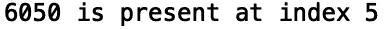
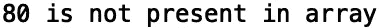

# 用 Python 掌握二分搜索法

> 原文：<https://towardsdatascience.com/mastering-binary-search-in-python-e96d7a44769b?source=collection_archive---------34----------------------->

## Python 中的高效搜索


Tobias Aeppli 在 [Pexels](https://www.pexels.com/photo/person-holding-compass-in-forest-1125272/) 拍摄的照片

二分搜索法是一种高效的搜索算法，用于在排序列表中查找项目。该算法通过重复分割可能包含被搜索值的子列表来工作。对于大型数组，二分搜索法比线性搜索效率高得多。具体来说，二分搜索法在最坏情况下运行在对数时间， *O* (log *n)* 而线性搜索在最坏情况下运行在线性时间*O*(*n)**。在这篇文章中，我们将讨论如何用 python 写一个二分搜索法函数。*

我们开始吧！

首先，让我们定义我们的函数。我们称之为‘我的二进制搜索函数’:

```
def my_binary_search_function():
```

我们的函数将采用一个名为“input_list”的数组，一个对应于最后一个索引的“high_value”，一个对应于第一个索引的“low_value”，以及一个我们将尝试查找的值“target_value”:

```
def my_binary_search_function(input_list, low_value, high_value,  target_value):
```

接下来，我们要确保我们的输入列表实际上是一个列表:

```
def my_binary_search_function(input_list, low_value, high_value,  target_value):
    if type(input_list)!=type([]):
        print('Not a list!')
```

如果我们试图用一个不属于' list '类型的值调用我们的函数，例如我们将传入一个字符串，我们的函数将打印' Not a list！'：

```
my_binary_search_function('this_is_a_string', 0, 10, 2)
```


我们需要做的下一件事是检查基本情况。具体来说，我们需要检查“高值”是否高于“低值”。然后，我们定义列表的中间索引，它将是“高值”加上“低值”的平均值的下限:

```
def my_binary_search_function(input_list, low_value, high_value,  target_value):
    ...
    else:
        if high_value >= low_value:
            middle **=** (high_value **+** low_value) **//** 2
```

如果索引“middle”处的值小于我们的函数的目标值，则递归调用“my_binary_search_function”，其中“low_value”等于“middle+1”:

```
def my_binary_search_function(input_list, low_value, high_value,  target_value):
    ...
            if input_list[middle] < target_value:
                return my_binary_search_function(input_list, middle +1, high_value, target_value)
```

如果索引' middle '处的值大于我们函数的目标值，则递归调用' my_binary_search_function '，使' high_value '等于' middle-1 ':

```
def my_binary_search_function(input_list, low_value, high_value,  target_value):
    ...
            elif input_list[middle] > target_value:
                return my_binary_search_function(input_list, low_value, middle-1, target_value)
```

否则，返回中间值作为我们要搜索的值的索引:

```
def my_binary_search_function(input_list, low_value, high_value,  target_value):
    ...
            else:
                return middle 
```

如果元素不在列表中，我们返回-1:

```
def my_binary_search_function(input_list, low_value, high_value,  target_value):
    ...
        else:
            return -1
```

完整的功能如下:

```
def my_binary_search_function(input_list, low_value, high_value,  target_value):
    if type(input_list)!=type([]):
        print('Not a list!')
    else:
        if high_value >= low_value:
            middle = (high_value + low_value) // 2
            if input_list[middle] < target_value:
                return my_binary_search_function(input_list, middle +1, high_value, target_value)
            elif input_list[middle] > target_value:
                return my_binary_search_function(input_list, low_value, middle-1, target_value)
            else:
                return middle
        else:
            return -1
```

现在让我们测试一下我们的功能。让我们定义一个整数的排序列表:

```
my_list = [100, 3000, 4500, 5000, 6000, 6050, 7020, 8400, 9100]
```

假设我们想要搜索数字 6050:

```
my_value = 6050
```

我们可以调用我们的函数，并将返回的索引存储在一个名为“my_result”的变量中。如果返回的索引不等于-1，我们打印值存储的位置。否则，我们打印该值不在列表中:

```
my_result = my_binary_search_function(my_list, 0, len(my_list)-1, my_value) 

if my_result != -1: 
    print("{} is present at index".format(my_value), str(my_result)) 
else: 
    print("{} is not present in array".format(my_value))
```



如果我们将“my_value”更改为列表中没有的数字，如 80，我们会得到以下结果:

```
my_value = 80
my_result = my_binary_search_function(my_list, 0, len(my_list)-1, my_value) 

if my_result != -1: 
    print("{} is present at index".format(my_value), str(my_result)) 
else: 
    print("{} is not present in array".format(my_value))
```



我就讲到这里，但是您可以自己随意摆弄代码。

## 结论

总之，在这篇文章中，我们讨论了如何用 python 写二分搜索法函数。如果你有兴趣学习其他重要算法，我推荐 [GeeksforGeeks](https://www.geeksforgeeks.org/) 。我希望你觉得这篇文章有趣/有用。这篇文章的代码可以在 [GitHub](https://github.com/spierre91/medium_code/blob/master/data_structures_and_algorithms/binary_search.py) 上找到。感谢您的阅读！