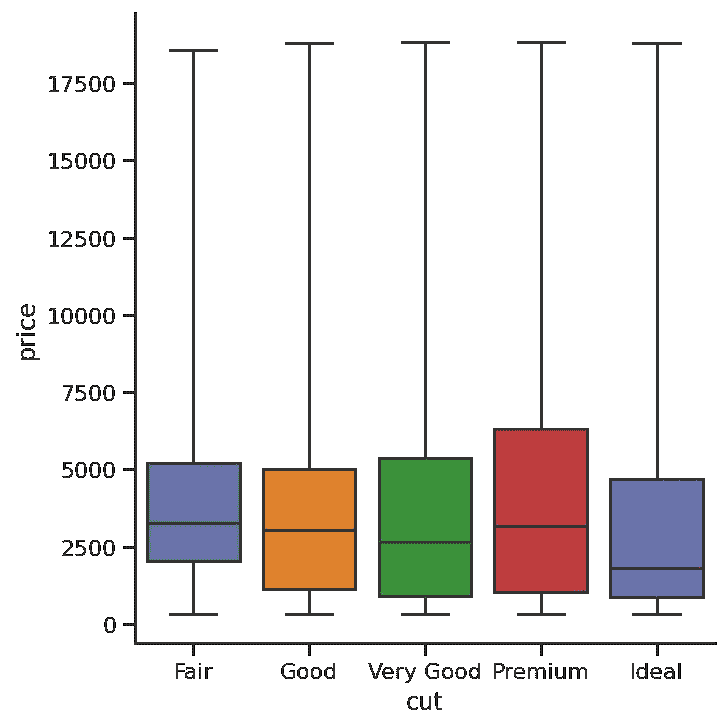

# 掌握 Seaborn 中的 catplot():分类数据可视化指南。

> 原文：<https://towardsdatascience.com/mastering-catplot-in-seaborn-categorical-data-visualization-guide-abab7b2067af?source=collection_archive---------4----------------------->

## 如果你能在锡伯恩做到，那就在锡伯恩做吧，#2


照片由来自 [Pexels](https://www.pexels.com/photo/calm-male-artist-painting-on-canvas-using-paintbrushes-3771118/?utm_content=attributionCopyText&utm_medium=referral&utm_source=pexels) 的[安德里亚·皮亚卡迪奥](https://www.pexels.com/@olly?utm_content=attributionCopyText&utm_medium=referral&utm_source=pexels)拍摄

## 介绍

> 本文的目标是使用 Seaborn 的`catplot()`函数向您介绍最常见的分类图。

在进行探索性或解释性数据分析时，您将不得不从广泛的绘图类型中进行选择。选择一个能准确描述数据中关系的方法可能会很棘手。

如果您处理的数据涉及任何分类变量，如调查响应，那么可视化和比较数据不同特征的最佳工具就是分类图。幸运的是，数据可视化库 Seaborn 将几种类型的分类图包含在一个函数中:`catplot()`。

与其他绘图库相比，Seaborn 库提供了许多优势:

```
1\. It is very easy to use and requires less code syntax

2\. Works really well with `pandas` data structures, which is just what you need as a data scientist.

3\. It is built on top of Matplotlib, another vast and deep data visualization library.
```

> 顺便说一句，我对数据可视化的黄金法则是“如果你能在 Seaborn 做，就在 Seabron 做”。

在 SB 的(以后我会简称为)[文档](https://seaborn.pydata.org/)中，陈述了`[catplot()](https://seaborn.pydata.org/generated/seaborn.catplot.html)`函数包括 8 种不同类型的分类图。但是在本指南中，我将介绍三种最常见的图:计数图、条形图和箱形图。

[](https://ibexorigin.medium.com/membership) [## 通过我的推荐链接加入 Medium-BEXGBoost

### 获得独家访问我的所有⚡premium⚡内容和所有媒体没有限制。支持我的工作，给我买一个…

ibexorigin.medium.com](https://ibexorigin.medium.com/membership) 

获得由强大的 AI-Alpha 信号选择和总结的最佳和最新的 ML 和 AI 论文:

[](https://alphasignal.ai/?referrer=Bex) [## 阿尔法信号|机器学习的极品。艾总结的。

### 留在循环中，不用花无数时间浏览下一个突破；我们的算法识别…

alphasignal.ai](https://alphasignal.ai/?referrer=Bex) 

## 概观

```
 I. Introduction II. SetupIII. Seaborn Count Plot
         1\. Changing the order of categories IV. Seaborn Bar Plot
         1\. Confidence intervals in a bar plot
         2\. Changing the orientation in bar plots V. Seaborn Box Plot
         1\. Overall understanding
         2\. Working with outliers
         3\. Working with whiskers VI. Conclusion
```

> 你可以在[这个](https://github.com/BexTuychiev/medium_stories/tree/master/mastering_most_common_categorical_plots) GitHub repo 上获得样本数据和文章的笔记本。

## 设置

如果您还没有安装 SB，您可以使用`pip`以及我们将使用的其他库来安装它:

```
pip install numpy pandas seaborn matplotlib
```

如果你想知道为什么我们不像正常人一样将 Seaborn 别名为`sb`，那是因为首字母`sns`是以电视剧《白宫风云》中的一个虚构人物塞缪尔·诺曼·Seaborn 命名的。你能说什么？*(耸耸肩)*。

对于数据集，我们将使用经典的`diamonds`数据集。它包含了 54000 颗钻石的价格和质量数据。这是一个很好的数据可视化数据集。数据的一个版本预装在 Seaborn 中。可以用`sns.get_dataset_names()`函数得到其他加载的数据集(有很多)。但是在本指南中，我们将使用我从 Kaggle 下载的完整版本。

```
# Load sample data
diamonds = pd.read_csv('data/diamonds.csv', index_col=0)
```

## 基础探索

```
diamonds.head()
diamonds.info()
diamonds.describe()
```


```
<class 'pandas.core.frame.DataFrame'>
Int64Index: 53940 entries, 1 to 53940
Data columns (total 10 columns):
 #   Column   Non-Null Count  Dtype  
---  ------   --------------  -----  
 0   carat    53940 non-null  float64
 1   cut      53940 non-null  object 
 2   color    53940 non-null  object 
 3   clarity  53940 non-null  object 
 4   depth    53940 non-null  float64
 5   table    53940 non-null  float64
 6   price    53940 non-null  int64  
 7   x        53940 non-null  float64
 8   y        53940 non-null  float64
 9   z        53940 non-null  float64
dtypes: float64(6), int64(1), object(3)
memory usage: 4.5+ MB
```


```
diamonds.shape(53940, 10)
```

## Seaborn 计数图

顾名思义，计数图显示每个变量类别中的观察值数量。在这篇文章中，我们将使用`catplot()`函数改变它的`kind`参数来创建不同的图。对于计数图，我们将`kind`参数设置为`count`，并使用`data`参数输入数据。让我们从探索钻石切工质量开始。

```
sns.catplot(x='cut', data=diamonds, kind='count');
```


我们从`catplot()`函数开始，使用`x`参数来指定我们想要显示类别的轴。您可以使用`y`使图表水平。计数图自动计算每个类别中数值的数量，并显示在`YAxis`上。

## 更改类别的顺序

在我们的图中，切割的质量从最好到最差。但是让我们颠倒一下顺序:

```
category_order = ['Fair', 'Good', 'Very Good', 'Premium', 'Ideal']

sns.catplot(x='cut', data=diamonds, kind='count', order=category_order);
```


最好按照您想要的顺序创建一个类别列表，然后将其传递给`order`。这提高了代码的可读性。

## Seaborn 条形图

绘制分类数据的另一个流行选择是条形图。在计数图示例中，我们的图只需要一个变量。在柱状图中，我们经常使用一个分类变量和一个定量变量。让我们看看不同钻石切割的价格如何相互比较。

为了创建条形图，我们分别输入`XAxis`、`YAxis`的值，并将`kind`参数设置为`bar`:

```
sns.catplot(x='cut',
            y='price',
            data=diamonds,
            kind='bar',
            order=category_order);
```


每个条形的高度代表每个类别中的平均值。在我们的图中，每个条形显示了每个类别中钻石的平均价格。我想你也很惊讶地看到，低质量的削减也有明显较高的价格。平均而言，质量最低的钻石甚至比理想的钻石还要贵。这一令人惊讶的趋势值得探究，但超出了本文的范围。

## 条形图中的置信区间

每个柱顶部的黑线代表平均值的 95%置信区间，可以认为是样本数据中的不确定性。简单地说，每条线的顶端是你期望的每个类别中所有钻石的真实平均价格的区间。如果你不懂统计学，最好跳过这一部分。您可以关闭置信区间，将`ci`参数设置为`None`:

```
sns.catplot(x='cut',
            y='price',
            data=diamonds,
            kind='bar',
            order=category_order,
            ci=None);
```


## 更改条形图中的方向

当你有很多类别/条，或者很长的类别名称时，改变方向是个好主意。只需交换 x 轴和 y 轴的值:

```
sns.catplot(x='price',
            y='cut',
            data=diamonds,
            kind='bar',
            order=category_order,
            ci=None);
```


## Seaborn 箱线图

箱线图是视觉效果，可能有点难以理解，但是非常漂亮地描绘了数据的分布。最好从一个箱线图的例子开始解释。我将使用 Seaborn 中常见的内置数据集之一:

```
tips = sns.load_dataset('tips')

sns.catplot(x='day', y='total_bill', data=tips, kind='box');
```


## 整体理解

该盒状图显示了一家样本餐厅每天的账单金额分布。让我们从解读周四的开始。


蓝框的边缘是所有钞票分布的第 25 和第 75 个百分位数。这意味着周四所有账单中有 75%低于 20 美元，而另外 75%(从底部到顶部)几乎高于 13 美元。方框中的水平线表示分布的中值。

胡须上方的点称为异常值。异常值分三步计算:

1.  从第 75 个百分点值中减去第 25 个百分点值，得出四分位数范围(IQR):***75%—25%***
2.  25 号减去 IQR 的 1.5 倍计算出异常值下限: ***25% — 1.5*IQR***
3.  在第 75 位加上 IQR 的 1.5 倍计算出异常值上限: ***75% + 1.5*IQR***

高于和低于异常值限值的任何值都将成为方框图中的点。

现在您对盒状图有了更好的理解，让我们回到闪亮的钻石:

```
sns.catplot(x='cut',
            y='price',
            data=diamonds,
            kind='box',
            order=category_order);
```


我们以与任何其他图相同的方式创建一个盒图。关键的区别在于我们将`kind`参数设置为`box`。这个方框图显示了不同质量切割钻石的价格分布。如您所见，每个类别都有许多异常值。而且分布是高度倾斜的。

箱形图非常有用，因为它们:

1.  在单个图中显示异常值、偏斜度、分布和分布
2.  非常适合比较不同的群体

## 箱线图中的异常值

也可以通过将`sym`参数设置为`empty string`来关闭箱线图中的异常值:

```
sns.catplot(x='cut',
            y='price',
            data=diamonds,
            kind='box',
            order=category_order,
            sym='');
```


默认情况下，箱线图中的异常值是使用我前面介绍的方法计算的。但是，您可以通过为`whis`参数传递不同的值来更改它:

```
sns.catplot(x='cut',
            y='price',
            data=diamonds,
            kind='box',
            order=category_order,
            whis=2);   # Using 2 times of IQR to calculate outliers
```


## 使用胡须

使用不同的百分位数:

```
sns.catplot(x='cut',
            y='price',
            data=diamonds,
            kind='box',
            order=category_order,
            whis=[5, 95]); # Whiskers show 5th and 95th percentiles
```


或者使胡须显示最小值和最大值:

```
sns.catplot(x='cut',
            y='price',
            data=diamonds,
            kind='box',
            order=category_order,
            whis=[0, 100]);   # Min and max values in distribution
```



## 包扎

我们已经讨论了三种最常见的分类图。我没有包括如何使用`catplot()`功能创建支线剧情，尽管这是`catplot()`的灵活性的优势之一。我最近为一个类似的用于绘制关系变量的函数`relplot()`写了另一篇文章。我已经在那里详细讨论了如何创建支线剧情，同样的技巧也可以应用在这里。

[](/master-a-third-of-seaborn-statistical-plotting-with-relplot-df8642718f0f) [## 掌握 Seaborn 的三分之一:用 relplot()统计绘图

### 如果你能在锡伯恩做到，就在锡伯恩做吧

towardsdatascience.com](/master-a-third-of-seaborn-statistical-plotting-with-relplot-df8642718f0f) 

看看这个关于 Matplotlib `fig`和`ax`对象的故事:

[](/clearing-the-confusion-once-and-for-all-fig-ax-plt-subplots-b122bb7783ca) [## 一劳永逸地澄清困惑:fig，ax = plt.subplots()

### 了解 Matplotlib 中的图形和轴对象

towardsdatascience.com](/clearing-the-confusion-once-and-for-all-fig-ax-plt-subplots-b122bb7783ca)