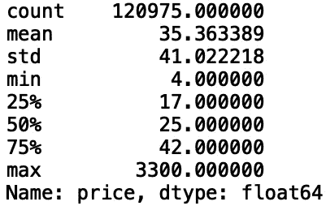
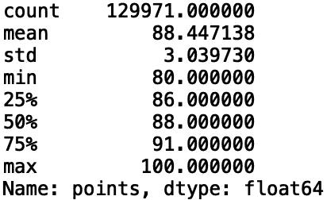

# 用熊猫掌握数据聚合

> 原文：<https://towardsdatascience.com/mastering-data-aggregation-with-pandas-36d485fb613c?source=collection_archive---------35----------------------->

## 用熊猫聚合数据


[来源](https://www.pexels.com/photo/depth-of-field-photography-of-file-arrangement-1181772/)

数据汇总是收集数据并以汇总形式表达的过程。这通常对应于数据集中数值和分类变量的汇总统计。在本帖中，我们将讨论如何使用 pandas 聚合数据并生成有洞察力的汇总统计数据。

我们开始吧！

出于我们的目的，我们将使用葡萄酒评论数据集，这个数据集可以在[这里](https://www.kaggle.com/zynicide/wine-reviews)找到。

首先，让我们将数据读入熊猫数据框:

```
import pandas as pd
df = pd.read_csv("winemag-data-130k-v2.csv")
```

接下来，让我们打印前五行数据:

```
print(df.head())
```


## 使用 DESCRIBE()方法

“describe()”方法是一个基本方法，它允许我们为数据中的列提取汇总统计信息。让我们用“describe()”方法来计算葡萄酒的价格:

```
print(df['price'].describe())
```



我们看到葡萄酒价格的“计数”，即非空值的数量是 120，975。葡萄酒的平均价格是 35 美元，标准差是 41 美元。葡萄酒价格的最小值为 4 美元，最大值为 3300 美元。“describe()”方法也提供了百分位数。在这里，25%的葡萄酒价格低于 17 美元，50%低于 25 美元，75%低于 42 美元。

让我们使用“points”列上的“describe()”来查看汇总统计数据:

```
print(df['points'].describe())
```



我们看到点的非空值个数是 129971，恰好是数据帧的长度。平均点数为 88，标准偏差为 3。葡萄酒积分的最小值为 80，最大值为 100。对于百分位数，25%的葡萄酒得分低于 86，50%低于 88，75%低于 91。

## 使用 GROUPBY()方法

您还可以使用“groupby()”来聚合数据。例如，如果我们想要查看每种葡萄酒的平均价格，我们可以执行以下操作:

```
print(df['price'].groupby(df['variety']).mean().head())
```


我们看到“Abouriou”葡萄酒的平均价格为 35 美元，“Agiorgitiko”的平均价格为 23 美元，以此类推。我们还可以显示排序后的值:

```
print(df['price'].groupby(df['variety']).mean().sort_values(ascending = False).head())
```


让我们来看看每个“省份”的平均价格:

```
print(df['price'].groupby(df['province']).mean().sort_values(ascending = False).head())
```


我们还可以查看多个列。让我们看看各省的平均价格和积分:

```
print(df[['price', 'points']].groupby(df.province).mean().head())
```


我就讲到这里，但是我鼓励你自己动手处理数据和编写代码。

## 结论

总之，在这篇文章中，我们讨论了如何使用 pandas 来聚集数据。首先，我们讨论了如何使用“describe()”方法来生成汇总统计数据，例如数据列的平均值、标准偏差、最小值、最大值和百分位数。然后，我们讨论了如何使用“groupby()”方法来生成特定分类变量的统计数据，例如每个省的平均价格和每个品种的平均价格。我希望你觉得这篇文章有用/有趣。这篇文章的代码可以在 GitHub 上找到。感谢您的阅读！