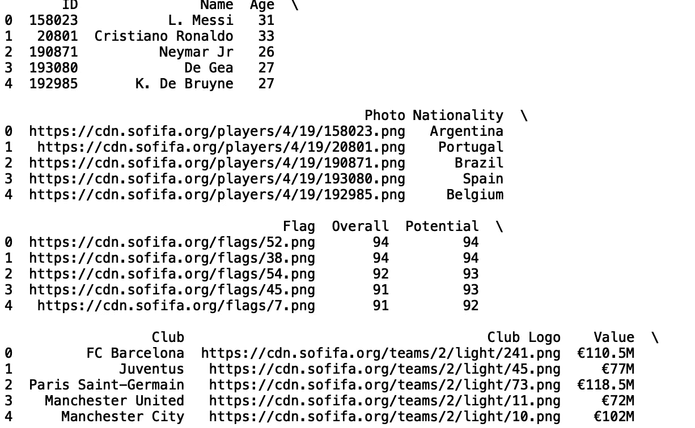
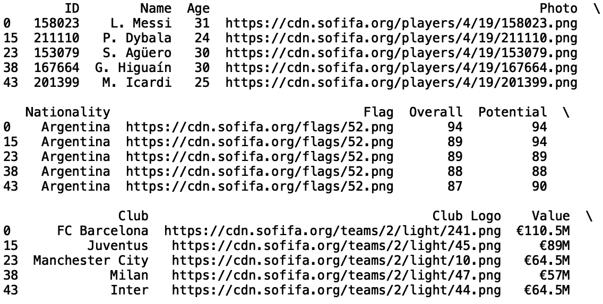
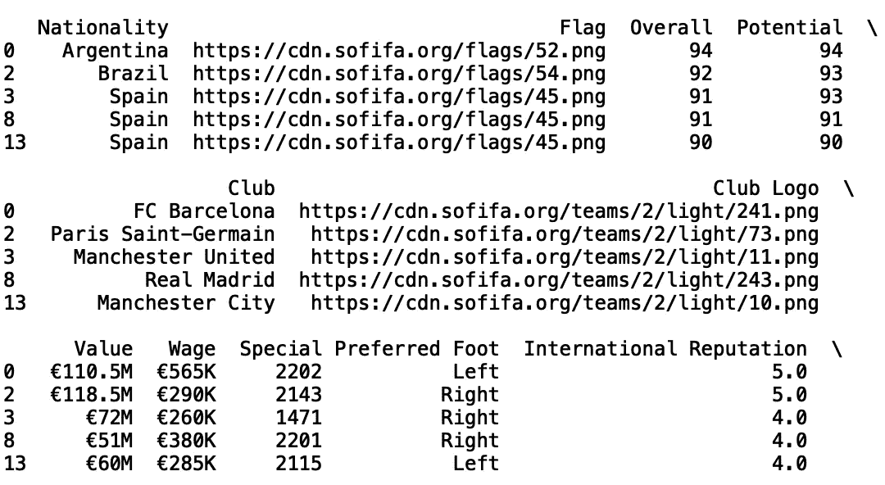
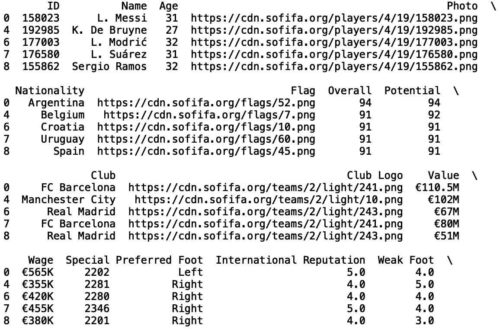
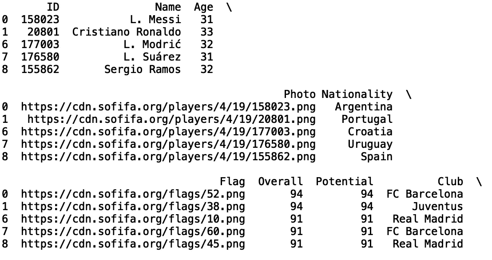
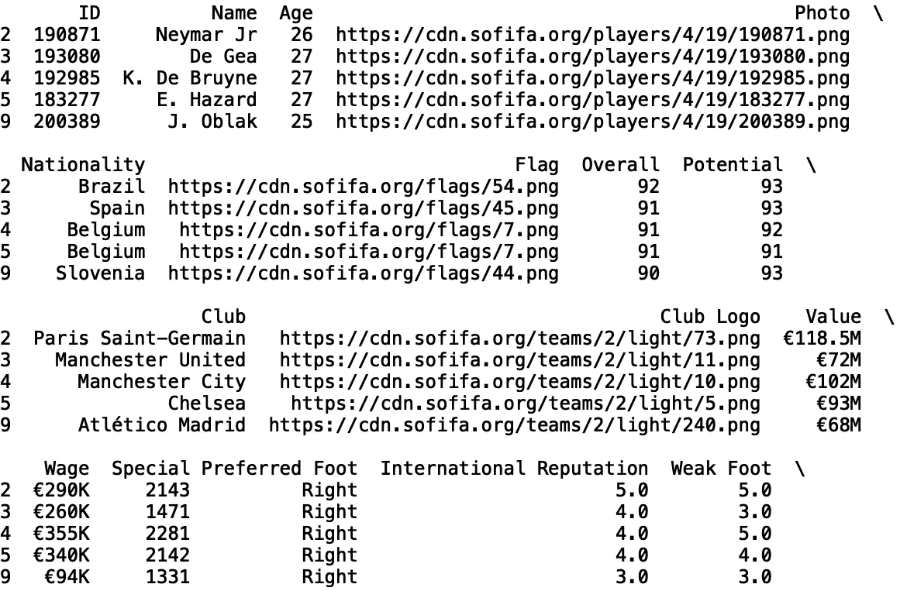
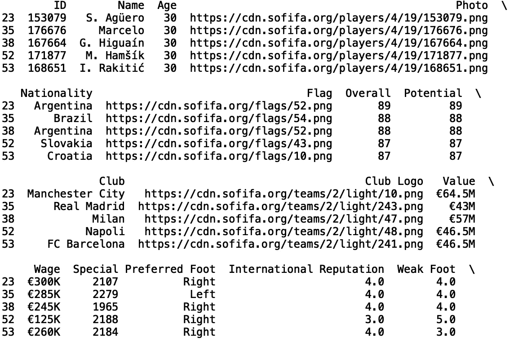
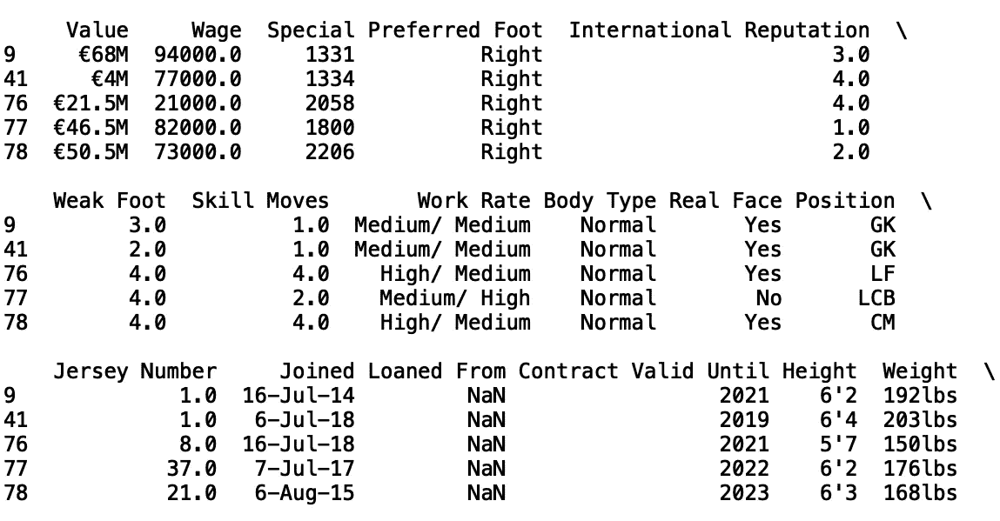

# 用熊猫掌握数据过滤

> 原文：<https://towardsdatascience.com/mastering-data-filtering-with-pandas-449eb91f8890?source=collection_archive---------21----------------------->

## 熊猫的三个有用的数据过滤功能


由[肯·富田](https://www.pexels.com/@ken-tomita-127057)在[像素](https://www.pexels.com/photo/architecture-business-clean-computer-389818/)上拍摄的照片

Pandas 是一个 python 库，用于生成统计数据、争论数据、分析数据等等。在这篇文章中，我将讨论三个有用的函数，它们可以让我们使用 Pandas 轻松过滤数据。

我们开始吧！

出于我们的目的，我们将使用 *FIFA 19* 数据集，可以在这里[找到](https://www.kaggle.com/karangadiya/fifa19)。

首先，让我们导入熊猫包:

```
import pandas as pd 
```

接下来，让我们将显示列和行的最大数量设置为“None”:

```
pd.set_option('display.max_columns', None)
pd.set_option('display.max_rows', None)
```

现在，让我们读入数据:

```
df = pd.read_csv('fifa_data.csv')
```

接下来，我们将打印前五行数据，以了解列类型及其值(列结果被截断):

```
print(df.head())
```



我们可以考虑的第一个功能是按类别过滤。让我们定义我们的函数‘filter _ category’。我们的函数将接受一个类别和类别值:

```
def filter_category(category, category_value):
```

我们可以使用“loc”操作符来选择类别值是我们选择的值的行:

```
def filter_category(category, category_value):
    df_filter = df.loc[df[category] == category_value]
    return df_filter
```

让我们过滤阿根廷国籍:

```
df_filter = filter_category('Nationality', 'Argentina')
print(df_filter.head())
```



我们看到“国籍”的所有值都是“阿根廷”。另一种有用的函数是按值列表过滤的函数:

```
def filter_category_with_list(category, category_value_list):
    df_filter = df.loc[df[category].isin(category_value_list)]
    return df_filter
```

我们可以筛选“国籍”为“巴西”、“西班牙”或“阿根廷”的行:

```
df_filter = filter_category_with_list('Nationality', ['Brazil', 'Spain', 'Argentina'])
print(df_filter.head())
```



我们也可以通过分类栏“俱乐部”进行过滤。让我们过滤“曼城”、“皇家马德里”和“巴塞罗那足球俱乐部”:

```
df_filter = filter_category_with_list('Club', [‘Manchester City’, ‘Real Madrid’, ‘FC Barcelona’])
print(df_filter.head())
```



我们还可以定义一个根据数值过滤的函数。该函数将能够根据输入值以及行是大于、小于还是等于输入值来筛选行:

```
def filter_numerical(numerical, numerical_value, relationship):
    if relationship == 'greater':
        df_filter = df.loc[df[numerical] > numerical_value]
    elif relationship == 'less':
        df_filter = df.loc[df[numerical] < numerical_value]     
    else: 
        df_filter = df.loc[df[numerical] == numerical_value]  
    return df_filter
```

我们可以筛选足球运动员的“年龄”大于 30 的行:

```
df_filter = filter_numerical('Age', 30, 'greater')
print(df_filter.head())
```



不到 30:

```
df_filter = filter_numerical('Age', 30, 'less')
print(df_filter.head())
```



或者等于 30:

```
df_filter = filter_numerical('Age', 30, 'equal')
print(df_filter.head())
```



我们也可以按工资过滤。首先，让我们将工资转换成浮动工资:

```
f['Wage'] = df['Wage'].str.lstrip('€')
df['Wage'] = df['Wage'].str.rstrip('K')
df['Wage'] = df['Wage'].astype(float)*1000.0print(df['Wage'].head())
```

现在让我们过滤工资低于 100000 欧元的情况:

```
df_filter = filter_numerical('Wage', 100000, 'less')
print(df_filter.head())
```



我就讲到这里，但是我鼓励你自己动手处理数据和编写代码。可以考虑编写一个有趣的函数，它根据数值和分类列值进行过滤。

## 结论

总之，在这篇文章中，我们讨论了如何定义三个函数来轻松过滤数据行。首先，我们讨论了如何通过单个分类值过滤数据行。然后我们讨论如何使用分类值列表过滤行。最后，我们展示了如何通过数字列值过滤数据行。如果你有兴趣学习更多关于熊猫的数据操作、机器学习甚至只是 python 编程的一些基础知识，请查看[*Python for Data Science and Machine Learning:Python 编程、熊猫和 Scikit-初学者学习教程*](https://www.amazon.com/dp/B08N38XW2Q/ref=sr_1_1?dchild=1&keywords=sadrach+python&qid=1604966500&s=books&sr=1-1) 。我希望你觉得这篇文章有用有趣。这篇文章的代码可以在 [GitHub](https://github.com/spierre91/medium_code/blob/master/pandas_tutorials/pandas_data_filtering.py) 上找到。感谢您的阅读！