# 用熊猫掌握数据选择

> 原文：<https://towardsdatascience.com/mastering-data-selection-with-pandas-e8768104a39?source=collection_archive---------49----------------------->

## 用熊猫选择数据


[来源](https://www.pexels.com/photo/paper-boats-on-solid-surface-194094/)

Pandas 是一个 python 库，为统计分析、特征工程、数据选择、数据过滤等提供了一些有用的工具。数据选择和数据过滤对于探索性数据分析、特征工程和预测模型构建非常有用。在本帖中，我们将讨论 Pandas 中一些有用的数据选择和过滤方法。

我们开始吧！

出于我们的目的，我们将使用 [*视频游戏销售数据集*](https://www.kaggle.com/gregorut/videogamesales) 。

首先，让我们导入 Pandas 库并将数据读入 Pandas 数据框:

```
import pandas as pd 
df = pd.read_csv("vgsales.csv")
```

让我们也放宽对显示列数的限制:

```
pd.set_option('display.max_columns', None)
```

接下来，让我们打印数据中的列:

```
print(list(df.columns))
```

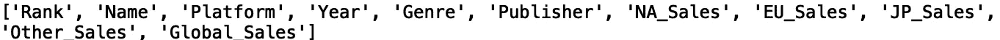

让我们也打印一些关于数据的基本信息:

```
print(df.info())
```

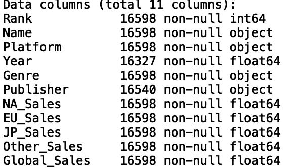

现在，让我们使用“head()”方法打印前五行数据:

```
print(df.head())
```

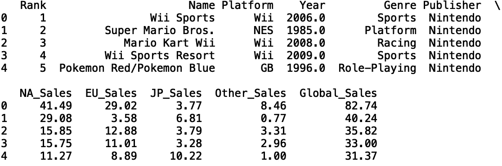

好了，现在我们对数据中的列名和类型有了大致的了解，我们可以执行一些基本的数据选择操作了。首先，我们可以使用。loc[]'方法来根据列值选择我们的数据子集。让我们选择“体育”类别的视频游戏:

```
df_sports = df.loc[df.Genre == 'Sports']
```

让我们打印新数据框的前五行:

```
print(df_sports.head())
```

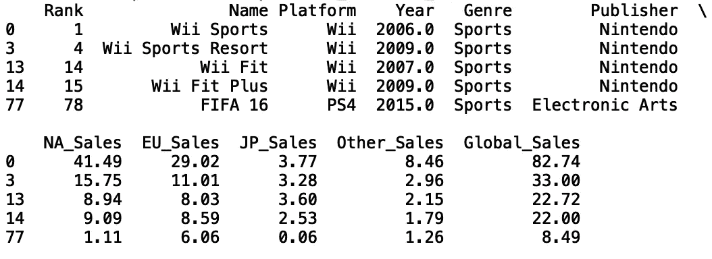

让我们看看另一个专栏。让我们为 Wii 平台选择对应于视频游戏的数据子集:

```
df_wii = df.loc[df.Platform == 'Wii']
```

让我们打印前五行数据:

```
print(df_wii.head())
```

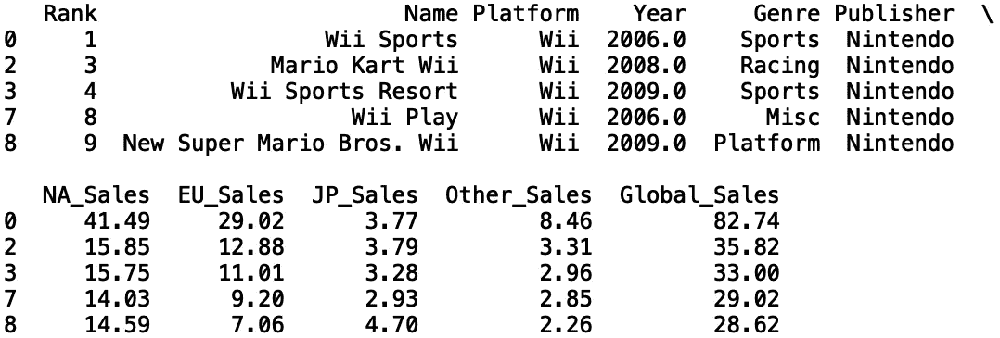

我们也可以选择子集的子集。例如，我们选择在“Wii”上玩的“赛车”游戏:

```
df_wii_racing = df_wii.loc[df.Genre == 'Racing']
```

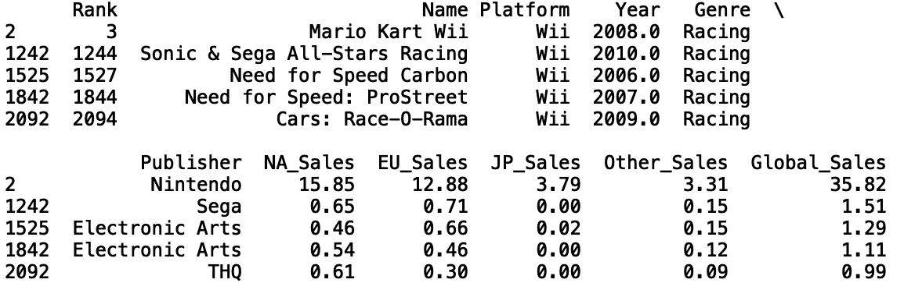

我们也可以用一行代码使用一个联合条件来执行这个操作:

```
df_wii_racing = df.loc[(df.Platform == 'Wii') & (df.Genre == 'Racing')]
print(df_wii_racing.head())
```


我们可以添加任意多的条件。让我们选择全球销量超过 100 万台的 Wii 赛车游戏:

```
df_gt_1mil = df.loc[(df.Platform == 'Wii') & (df.Genre == 'Racing') & (df.Global_Sales >= 1.0)]
print(df_gt_1mil.head())
```

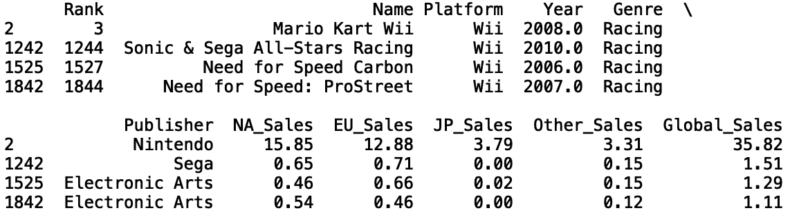

我们也可以使用'按行选择数据。iloc[]'方法。让我们选择原始数据的前 1000 行:

```
df_filter_rows = df.iloc[:1000]
print("Length of original: ", len(df))
print("Length of filtered: ", len(df_filter_rows))
```

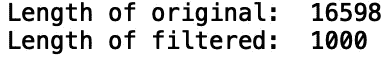

我们还可以使用“sample()”方法选择数据的随机样本:

```
df_random_sample = df.sample(n=5000)
print("Length of sample: ", len(df_random_sample))
```

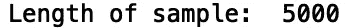

如果我们打印前五行:

```
print(df_random_sample.head())
```

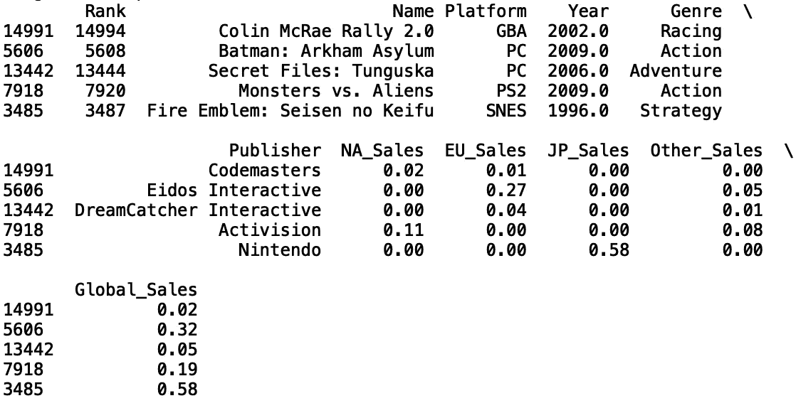

并在另一次运行中打印前五行:

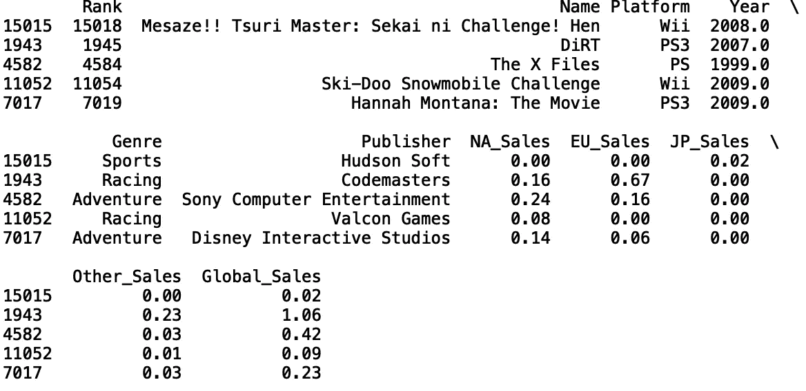

我们看到我们得到不同的结果。如果我们希望始终获得相同的结果，我们可以在示例方法中设置“random_state”参数:

```
df_random_sample = df.sample(n=5000, random_state = 42)
print("Length of sample: ", len(df_random_sample))
```

这将在每次运行时给我们相同的结果。我将在这里停下来，但是我鼓励您自己尝试代码和数据。

# 结论

总之，在这篇文章中，我们讨论了如何使用 Python Pandas 库选择和过滤数据。我们讨论了如何使用。“loc[]”方法根据列值选择数据子集。我们还展示了如何使用'按行过滤数据帧。iloc[]'方法。最后，我们讨论了如何使用“sample()”方法从数据帧中选择随机数据样本。我希望你觉得这篇文章有趣/有用。这篇文章中的代码可以在 [GitHub](https://github.com/spierre91/medium_code/blob/master/pandas_tutorials/selecting_data.py) 上找到。感谢您的阅读！