# 使用 Python 和 Pandas 掌握日期和时间操作

> 原文：<https://towardsdatascience.com/mastering-date-and-time-manipulations-with-python-and-pandas-e1cb2db8177a?source=collection_archive---------41----------------------->

## 你不知道你不知道什么。

有一句老话是这样说的:*不管开发人员是初级还是高级，在处理日期时，他总是会参考文档。我同意，我的工作也是如此。有很多事情我可以不用引用的**文档来实现，但是我最不擅长的是日期和时间操作，或者设法记住格式化代码。***

由 [Aron Visuals](https://unsplash.com/@aronvisuals?utm_source=medium&utm_medium=referral) 在 [Unsplash](https://unsplash.com?utm_source=medium&utm_medium=referral) 上拍摄的照片

这就是我决定写一篇关于这个话题的文章的原因——我不觉得我在这种情况下是孤独的。

处理日期和时间并不难，但是肯定有很多事情需要记住。今天我们将讨论其中的大部分内容，以便您为下一个分析挑战做好准备。我们所做的一切要么在 Python 处理日期和时间的默认库中实现——方便地称为`datetime`——要么在 **Pandas** 中实现。

以下是进口货:

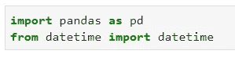

事不宜迟，让我们直接开始吧。

# 日期时间基础

使用`datetime`库，我们可以很容易地创建日期时间对象——如果您不关心小时、分钟和秒的信息，这里有一个如何创建日期时间对象的例子:

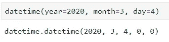

或者，如果您确实关心这些，您可以很容易地指定值:

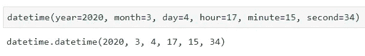

也许你想知道现在的时间，精确到毫秒——你可以使用方便的`.now()`功能:

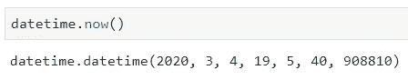

# 时间增量

让我们现在做一些不同的事情。我要声明一个变量，并将它的值设置为当前时间:

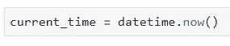

稍后，我将声明另一个变量，并将其值设置为当前时间减去`current_time`变量的值:

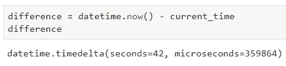

您可以看到我们是如何返回这个 **timedelta** 对象的，这表明在声明这两个变量之间经过了多长时间。您可以轻松访问这些信息:

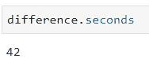

如果要计算数据集中两个日期列之间的差异，这可能会很有用，例如，如果一列指示某个过程开始的时间，而另一列指示该过程结束的时间。

# 字符串到时间，反之亦然

`datetime`库有两种更方便的方法将字符串记录转换成日期时间对象，或将日期时间对象转换成字符串。

让我们探索第一个选项。您有一个字符串表示的时间信息，并希望将它转换成 datetime 对象，以便以后更快地操作(在这种情况下，实际上不能比较字符串)。在这种情况下，您将需要使用`strptime()`功能:

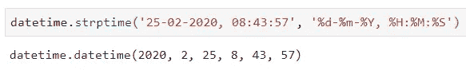

如果你对格式感到困惑，看看这个网站，你会在那里找到所有的代码。

这个过程可以反过来。假设您有日期信息，表示为 datetime，并且您需要以某种方式将值呈现给用户，比如说通过某种前端。`strftime()`方法可以解决问题:

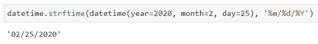

现在，当我们有了这些工具，让我们探索一下 **Pandas** 库提供了什么。

# 熊猫的日期范围

在处理日期的大部分时间里，我都在使用 Python 的`datetime`库。唯一的例外情况是:

*   日期范围
*   时间重采样

第二个问题需要一整篇文章来深入探讨，所以我将重点讨论第一个问题。

我使用 Pandas 来创建日期范围，只是因为我想避免标准库的循环。如果你不确定我所说的“日期范围”是什么意思，这里有一个简短的例子。想法是从 2020 年 1 月 1 日开始创建一个 30 天的时间段:

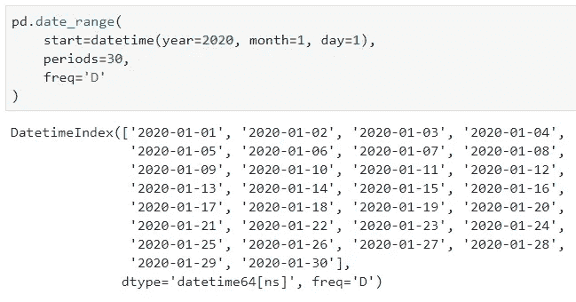

你看到那有多容易了吗？

请记住，您不需要坚持某种特定的格式，因为 Pandas 很聪明，可以推断出这一点:

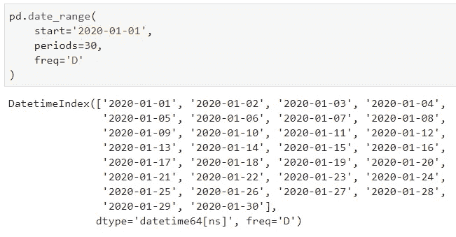

这个也很好:

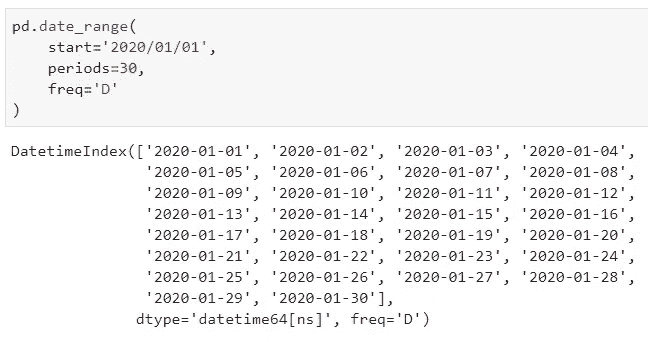

即使是一些疯狂的组合也不成问题:

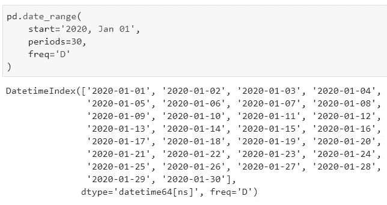

# 在你走之前

Python 中的日期和时间声明和操作已经足够了。你可以做更高级的事情，但我发现这对大多数任务来说已经足够了。

如果你喜欢这篇文章，请继续关注，过几天我会发表一篇关于**日期重采样**和基于时间条件的高级数据过滤的文章。

感谢阅读。

*喜欢这篇文章吗？成为* [*中等会员*](https://medium.com/@radecicdario/membership) *继续无限制的学习。如果你使用下面的链接，我会收到你的一部分会员费，不需要你额外付费。*

 [## 通过我的推荐链接加入 Medium-Dario rade ci

### 作为一个媒体会员，你的会员费的一部分会给你阅读的作家，你可以完全接触到每一个故事…

medium.com](https://medium.com/@radecicdario/membership)